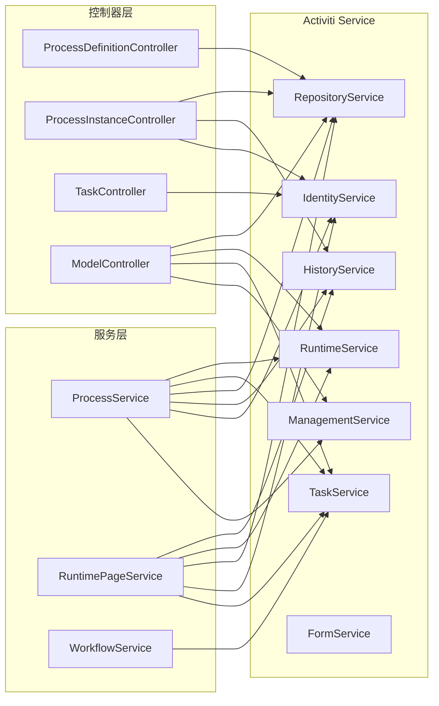

# Activiti 引擎配置

> 本文档详细说明 PMS-activiti 模块的 ProcessEngineConfiguration 配置、七大 Service 接口、数据库策略与事务管理机制。
> 配置文件：`src/main/resources/spring-activiti.xml`、`src/main/resources/engine.properties`、`src/main/resources/db.properties`

---

## 1. ProcessEngineConfiguration 配置

### 1.1 配置类

PMS-activiti 使用 Spring 集成版的流程引擎配置类 `org.activiti.spring.SpringProcessEngineConfiguration`，该类继承自 `ProcessEngineConfigurationImpl`，与 Spring 容器无缝集成，支持将流程引擎的事务交由 Spring 事务管理器统一管理。

### 1.2 核心配置（spring-activiti.xml）

```xml
<bean id="processEngineConfiguration" 
      class="org.activiti.spring.SpringProcessEngineConfiguration">
    <!-- 数据源：使用 Spring 容器中的 dataSource -->
    <property name="dataSource" ref="dataSource"/>
    <!-- 事务管理器：与 Spring 共享事务 -->
    <property name="transactionManager" ref="transactionManager"/>
    <!-- 数据库 Schema：固定为 ACT -->
    <property name="databaseSchema" value="ACT"/>
    <!-- 启动时自动更新表结构 -->
    <property name="databaseSchemaUpdate" value="true"/>
    <!-- 启用作业执行器（定时任务/异步任务） -->
    <property name="jobExecutorActivate" value="true"/>
    <!-- 启用数据库事件日志 -->
    <property name="enableDatabaseEventLogging" value="true"/>
    <!-- 自定义表单类型 -->
    <property name="customFormTypes">
        <list>
            <bean class="org.activiti.explorer.form.UserFormType"/>
            <bean class="org.activiti.explorer.form.ProcessDefinitionFormType"/>
            <bean class="org.activiti.explorer.form.MonthFormType"/>
        </list>
    </property>
    <!-- 流程图字体配置（解决中文乱码） -->
    <property name="activityFontName" value="${diagram.activityFontName}"/>
    <property name="labelFontName" value="${diagram.labelFontName}"/>
    <property name="annotationFontName" value="${diagram.annotationFontName}"/>
    <!-- 自定义流程图生成器 -->
    <property name="processDiagramGenerator" ref="customerProcessDiagramGenerator"/>
</bean>
```

### 1.3 配置项详解

| 配置项 | 值 | 说明 |
|--------|-----|------|
| `dataSource` | `dataSource` | 引用 Spring 容器中的数据源 Bean |
| `transactionManager` | `transactionManager` | 引用 Spring 事务管理器，实现事务统一管理 |
| `databaseSchema` | `ACT` | 数据库 Schema 名称，所有 Activiti 表以 `ACT_` 前缀 |
| `databaseSchemaUpdate` | `true` | 启动时自动创建/更新表结构 |
| `jobExecutorActivate` | `true` | 启用作业执行器，处理定时任务和异步任务 |
| `enableDatabaseEventLogging` | `true` | 启用数据库事件日志记录 |
| `activityFontName` | 宋体 | 流程图活动节点字体（解决中文乱码） |
| `labelFontName` | 宋体 | 流程图标签字体 |
| `annotationFontName` | 宋体 | 流程图注解字体 |

### 1.4 databaseSchemaUpdate 策略

| 值 | 行为 | 适用场景 |
|----|------|----------|
| `false` | 不自动更新 | 生产环境（手动维护表结构） |
| `true` | 启动时检查并自动更新 | 开发/测试环境（PMS-activiti 默认） |
| `create-drop` | 启动时创建，关闭时删除 | 单元测试 |
| `create` | 启动时创建（不删除已有） | 初始化环境 |

> **注意**：PMS-activiti 默认使用 `true`，生产环境建议改为 `false` 并通过 SQL 脚本手动维护表结构。

---

## 2. 七大 Service 接口

Activiti 引擎通过 `ProcessEngine` 暴露 7 个核心 Service，每个 Service 负责一类业务能力。PMS-activiti 通过 `ProcessEngineFactoryBean` 创建流程引擎，再通过工厂方法暴露各 Service。

### 2.1 Service 工厂 Bean 配置

```xml
<!-- 流程引擎工厂 -->
<bean id="processEngine" class="org.activiti.spring.ProcessEngineFactoryBean">
    <property name="processEngineConfiguration" ref="processEngineConfiguration"/>
</bean>

<!-- 七大 Service 通过工厂方法暴露 -->
<bean id="repositoryService" factory-bean="processEngine" factory-method="getRepositoryService"/>
<bean id="runtimeService" factory-bean="processEngine" factory-method="getRuntimeService"/>
<bean id="taskService" factory-bean="processEngine" factory-method="getTaskService"/>
<bean id="historyService" factory-bean="processEngine" factory-method="getHistoryService"/>
<bean id="managementService" factory-bean="processEngine" factory-method="getManagementService"/>
<bean id="identityService" factory-bean="processEngine" factory-method="getIdentityService"/>
<bean id="formService" factory-bean="processEngine" factory-method="getFormService"/>
```

### 2.2 Service 职责说明

| Service | 工厂方法 | 职责 | 主要操作表 | PMS-activiti 使用情况 |
|---------|----------|------|------------|----------------------|
| **RepositoryService** | `getRepositoryService` | 流程定义与部署管理 | `ACT_RE_*`、`ACT_GE_BYTEARRAY` | 流程部署、查询、删除、模型管理 |
| **RuntimeService** | `getRuntimeService` | 运行时流程实例与变量管理 | `ACT_RU_EXECUTION`、`ACT_RU_VARIABLE` | 启动流程、查询实例、设置变量 |
| **TaskService** | `getTaskService` | 任务管理（签收、完成、委派） | `ACT_RU_TASK`、`ACT_RU_IDENTITYLINK` | 待办查询、签收、完成、转办、委派 |
| **HistoryService** | `getHistoryService` | 历史数据查询 | `ACT_HI_*` | 历史流程/任务/活动查询 |
| **ManagementService** | `getManagementService` | 引擎管理与命令执行 | `ACT_GE_PROPERTY`、`ACT_RU_JOB` | 执行自定义 Command、表名查询 |
| **IdentityService** | `getIdentityService` | 用户与用户组管理 | `ACT_ID_*` | 设置认证用户、查询用户/组 |
| **FormService** | `getFormService` | 表单服务 | `ACT_RE_PROCDEF` | 获取启动表单/任务表单（较少使用） |

### 2.3 Service 在 PMS-activiti 中的使用分布



---

## 3. 数据库策略

### 3.1 数据源配置

PMS-activiti 使用独立的 Activiti 数据库（与业务库 `dppms_d365` 分离），数据源配置在 `db.properties`：

```properties
# db.properties
db=mysql
jdbc.url=jdbc:mysql://10.102.0.106:3306/activiti?useUnicode=true&characterEncoding=UTF-8&useSSL=true&serverTimezone=GMT%2B8
jdbc.driver=com.mysql.jdbc.Driver
jdbc.username=root
jdbc.password=!Q@W3e4r
databaseSchemaUpdate=true
```

### 3.2 数据源 Bean 配置

```xml
<!-- activiti-custom-context.xml -->
<bean id="dataSource" class="org.apache.commons.dbcp.BasicDataSource">
    <property name="driverClassName" value="${jdbc.driver}"/>
    <property name="url" value="${jdbc.url}"/>
    <property name="username" value="${jdbc.username}"/>
    <property name="password" value="${jdbc.password}"/>
    <property name="defaultAutoCommit" value="false"/>
</bean>
```

### 3.3 数据库表分类

Activiti 表按功能分为 5 类，所有表以 `ACT_` 前缀：

| 前缀 | 含义 | 说明 | 表数量 |
|------|------|------|--------|
| `ACT_RE_*` | Repository | 存储库表，存储流程定义和部署信息（静态数据） | 3 |
| `ACT_RU_*` | Runtime | 运行时表，存储流程实例、任务、变量等运行时数据 | 6 |
| `ACT_HI_*` | History | 历史表，存储已完成的流程实例、任务、活动等历史数据 | 8 |
| `ACT_ID_*` | Identity | 身份表，存储用户、用户组信息 | 4 |
| `ACT_GE_*` | General | 通用表，存储字节数组、属性等通用数据 | 2 |

### 3.4 历史数据级别

通过 `engine.history.level` 配置（engine.properties 中为 `full`）：

| 级别 | 值 | 记录内容 | 适用场景 |
|------|----|----------|----------|
| `NONE` | 0 | 不记录历史 | 性能优先，无需审计 |
| `ACTIVITY` | 1 | 记录流程实例和活动实例 | 一般审计 |
| `AUDIT` | 2 | 记录所有任务和活动（默认） | 标准审计 |
| `FULL` | 3 | 记录所有详细信息（含变量变更） | 完整审计（PMS-activiti 使用） |

> **注意**：`FULL` 级别会记录所有变量变更详情，数据量大，生产环境需定期清理历史数据。

---

## 4. 事务管理

### 4.1 事务管理器配置

PMS-activiti 使用 `DataSourceTransactionManager`，与流程引擎共享同一事务管理器，确保业务操作和流程操作在同一事务中：

```xml
<bean id="transactionManager" 
      class="org.springframework.jdbc.datasource.DataSourceTransactionManager">
    <property name="dataSource" ref="dataSource"/>
</bean>
```

### 4.2 事务传播行为

PMS-activiti 的 Service 层通过 `@Transactional` 注解管理事务：

| 方法前缀 | 事务类型 | 传播行为 | 说明 |
|----------|----------|----------|------|
| `start*` | 事务 | `PROPAGATION_REQUIRED` | 启动流程 |
| `complete*` | 事务 | `PROPAGATION_REQUIRED` | 完成任务 |
| `withdraw*` | 事务 | `PROPAGATION_REQUIRED` | 撤回任务 |
| `revoke*` | 事务 | `PROPAGATION_REQUIRED` | 撤销任务 |
| `delete*` | 事务 | `PROPAGATION_REQUIRED` | 删除流程/任务 |
| `transfer*` | 事务 | `PROPAGATION_REQUIRED` | 转办任务 |
| `moveTo` | 事务 | `PROPAGATION_REQUIRED` | 任务跳转 |
| `terminate*` | 事务 | `PROPAGATION_REQUIRED` | 终止流程 |
| `get*`/`find*`/`list*` | 无事务 | - | 查询操作 |

### 4.3 事务边界示例

```java
// ProcessService.complete 方法的事务边界
@Transactional
public void complete(String taskId, String content, String userId, 
                     Map<String, Object> variables) throws Exception {
    // 1. 查询任务（无事务）
    Task task = this.taskService.createTaskQuery()
        .taskCandidateOrAssigned(userId).taskId(taskId).singleResult();
    if (task == null) {
        throw new ActivitiObjectNotFoundException("任务不存在！");
    }
    // 2. 添加审批意见（同一事务）
    this.identityService.setAuthenticatedUserId(userId);
    if (content != null) {
        this.taskService.addComment(taskId, pi.getId(), content);
    }
    // 3. 设置流程变量（同一事务）
    taskService.setVariablesLocal(task.getId(), variables);
    // 4. 完成任务（同一事务，任一步骤失败全部回滚）
    taskService.setAssignee(taskId, userId);
    this.taskService.complete(taskId, variables);
}
```

### 4.4 Command 模式与事务

Activiti 的自定义 Command（如 `RevokeTaskCmd`、`WithdrawTaskCmd`）通过 `ManagementService.executeCommand()` 执行，命令在引擎事务上下文中运行：

```java
// 命令执行入口
Integer revokeFlag = this.processEngine.getManagementService()
    .executeCommand(cmd);
// 命令内部通过 Context.getCommandContext() 获取事务上下文
```

---

## 5. 引擎属性配置（engine.properties）

```properties
# 演示数据
create.demo.users=true
create.demo.definitions=true
create.demo.models=true
create.demo.reports=true

# 引擎属性
engine.schema.update=true              # Schema 自动更新
engine.activate.jobexecutor=false      # 作业执行器（旧版）
engine.asyncexecutor.enabled=true      # 异步执行器启用
engine.asyncexecutor.activate=true     # 异步执行器激活
engine.history.level=full              # 历史级别：完整

# 流程图字体（解决中文乱码）
diagram.labelFontName=宋体
diagram.activityFontName=宋体
diagram.annotationFontName=宋体
export.diagram.path=/upload/diagram    # 流程图导出路径
```

---

## 6. 自定义流程图生成器

PMS-activiti 使用自定义流程图生成器 `CustomProcessDiagramGenerator` 替代默认生成器，主要解决中文乱码问题：

```xml
<bean id="customerProcessDiagramGenerator" 
      class="com.dp.plat.activiti.service.activiti.CustomProcessDiagramGenerator"/>
```

该生成器在 `ProcessService.getDiagram()` 中被调用，生成带流程跟踪高亮的 PNG 图片：

```java
ProcessDiagramGenerator diagramGenerator = processEngineConfiguration.getProcessDiagramGenerator();
InputStream imageStream = diagramGenerator.generateDiagram(
    bpmnModel, "png", 
    highLightedActivities, highLightedFlows,
    activityFontName, labelFontName, annotationFontName,
    this.getClass().getClassLoader(), 1.0);
```

---

## 7. 相关文档

- [Spring 集成](spring-integration.md) — Spring 与 Activiti 集成细节
- [数据库配置](database-configuration.md) — 数据库独立配置说明
- [BPMN 流程设计器](bpmn-designer.md) — 流程设计器配置
- [../03-database/complete-data-dictionary.md](../03-database/complete-data-dictionary.md) — Activiti 表完整字段字典
