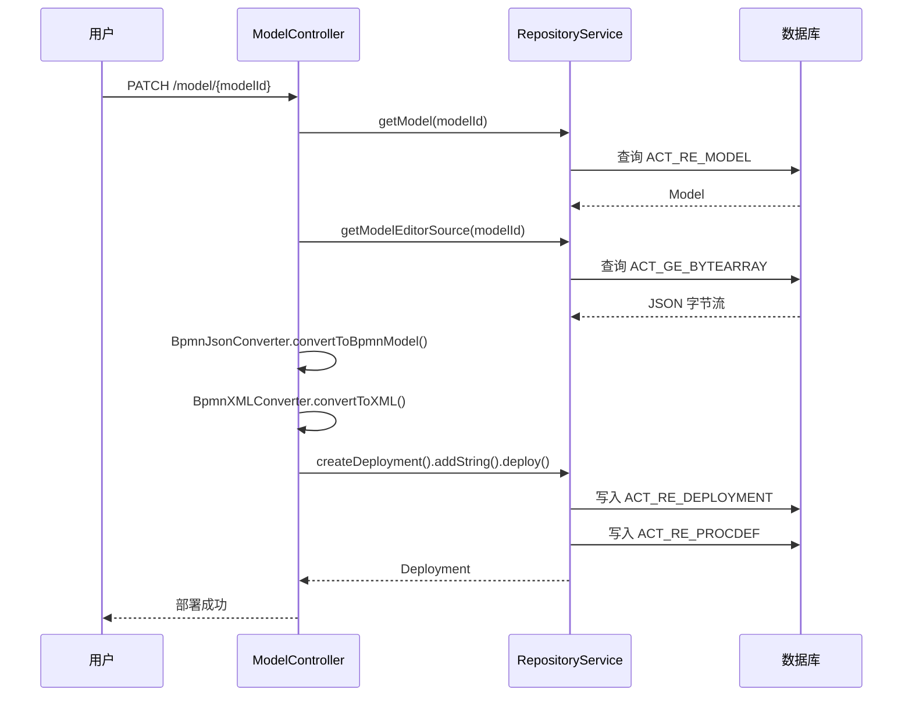

# BPMN 流程设计器

> 本文档说明 PMS-activiti 模块内置的 Activiti BPMN 流程设计器（Modeler）的架构、配置与使用方式。
> 设计器基于 Activiti Explorer 的前端组件，支持在线设计 BPMN 流程并部署到引擎。

---

## 1. 设计器概述

PMS-activiti 集成了 Activiti 官方的 Web 版 BPMN 流程设计器，提供可视化流程设计能力，主要特点：

- **基于 AngularJS 1.2.13**：前端采用 AngularJS + jQuery + Bootstrap 3.1.1
- **Oryx 编辑器**：使用 Activiti 改造的 Oryx 流程图编辑器
- **Stencil Set**：通过 `stencilset.json` 定义 BPMN 2.0 节点形状库
- **多语言支持**：支持中文（`zh-CN.json`）、英文（`en.json`）
- **REST 后端**：通过 `org.activiti.rest.editor` 提供后端服务

---

## 2. 目录结构

设计器前端资源位于 `src/main/webapp/`：

```
webapp/
├── editor-app/                    # 流程设计器主目录
│   ├── editor.html                # 设计器主页面
│   ├── app.js                     # AngularJS 主应用
│   ├── app-cfg.js                 # 应用配置
│   ├── editor-config.js           # 编辑器配置
│   ├── editor-controller.js       # 编辑器控制器
│   ├── editor-utils.js            # 编辑器工具
│   ├── eventbus.js                # 事件总线
│   ├── header-controller.js       # 头部控制器
│   ├── select-shape-controller.js # 选择形状控制器
│   ├── stencil-controller.js      # 形状库控制器
│   ├── toolbar-controller.js      # 工具栏控制器
│   ├── configuration/             # 配置目录
│   │   ├── properties/            # 属性配置
│   │   ├── properties.js
│   │   ├── toolbar.js
│   │   ├── toolbar-default-actions.js
│   │   └── toolbar-custom-actions.js
│   ├── css/                       # 样式文件
│   ├── editor/                    # Oryx 编辑器
│   │   ├── css/editor.css
│   │   ├── i18n/                  # 编辑器国际化
│   │   ├── oryx.js                # Oryx 主脚本
│   │   └── oryx.debug.js          # Oryx 调试脚本
│   ├── fonts/                     # 字体文件
│   ├── i18n/                      # 国际化
│   │   ├── en.json
│   │   └── zh-CN.json
│   ├── images/                    # 图片资源
│   ├── libs/                      # 第三方库
│   │   ├── angular_1.2.13/
│   │   ├── bootstrap_3.1.1/
│   │   ├── jquery_1.11.0/
│   │   └── ...
│   ├── partials/                  # 模板片段
│   ├── popups/                    # 弹窗
│   │   ├── save-model.html
│   │   ├── select-shape.html
│   │   └── unsaved-changes.html
│   └── stencilsets/               # 形状库
│       └── bpmn2.0/
├── diagram-viewer/                # 流程图查看器
│   ├── index.html
│   ├── style.css
│   ├── js/
│   │   ├── ActivitiRest.js
│   │   ├── ActivityImpl.js
│   │   ├── ProcessDiagramCanvas.js
│   │   ├── ProcessDiagramGenerator.js
│   │   ├── Polyline.js
│   │   └── raphael.2.1.1.js
│   └── images/
│       └── deployer/              # 节点图标
└── modeler.html                   # 模型设计器入口页面
```

---

## 3. 入口与路由

### 3.1 设计器入口

设计器入口页面为 `modeler.html`，通过 URL 参数 `modelId` 指定要编辑的模型：

```
http://host:port/PMS-activiti/modeler.html?modelId=12345
```

### 3.2 控制器跳转

`ModelController` 负责模型管理，跳转到设计器：

```java
@RequestMapping("/{modelId}")
public String findOne(@PathVariable("modelId") String modelId, 
                      org.springframework.ui.Model model) {
    model.addAttribute("modelId", modelId);
    return "redirect:/modeler.html";
}
```

---

## 4. Stencil Set（形状库）

### 4.1 Stencil Set 文件

PMS-activiti 提供三个 Stencil Set 文件：

| 文件 | 说明 |
|------|------|
| `stencilset.json` | 默认形状库（英文） |
| `stencilset_cn.json` | 中文形状库 |
| `stencilset_en.json` | 英文形状库 |

### 4.2 Stencil Set 结构

```json
{
  "title": "BPMN 2.0 标准形状库",
  "namespace": "http://b3mn.org/stencilset/bpmn2.0#",
  "description": "BPMN 2.0 标准形状库",
  "stencils": [
    {
      "id": "StartEvent",
      "title": "开始事件",
      "groups": ["开始事件"],
      "description": "开始事件节点",
      "view": "...",
      "icon": "..."
    },
    {
      "id": "UserTask",
      "title": "用户任务",
      "groups": ["活动"],
      "description": "用户任务节点",
      "propertyPackages": ["usertaskproperties", ...]
    }
  ],
  "stencilset": {
    "url": "stencilset.json",
    "namespace": "http://b3mn.org/stencilset/bpmn2.0#"
  }
}
```

### 4.3 支持的 BPMN 节点

| 节点类型 | Stencil ID | 说明 |
|----------|------------|------|
| 开始事件 | `StartEvent` | 流程开始 |
| 结束事件 | `EndEvent` | 流程结束 |
| 终止结束事件 | `EndTerminateEvent` | 终止流程 |
| 用户任务 | `UserTask` | 人工任务 |
| 服务任务 | `ServiceTask` | 自动任务 |
| 脚本任务 | `ScriptTask` | 脚本任务 |
| 排他网关 | `ExclusiveGateway` | 排他网关（条件分支） |
| 并行网关 | `ParallelGateway` | 并行网关 |
| 包含网关 | `InclusiveGateway` | 包含网关 |
| 调用活动 | `CallActivity` | 调用子流程 |
| 子流程 | `SubProcess` | 嵌入式子流程 |

---

## 5. 后端 REST 服务

### 5.1 REST 组件扫描

```xml
<!-- spring-activiti-mvc.xml -->
<context:component-scan base-package="org.activiti.rest.editor"/>
<context:component-scan base-package="org.activiti.rest.diagram"/>
```

### 5.2 主要 REST 端点

| 端点 | 方法 | 说明 |
|------|------|------|
| `/activiti-explorer-app/service/editor/stencilsets` | GET | 获取形状库 |
| `/activiti-explorer-app/service/model/{modelId}/json` | GET | 获取模型 JSON |
| `/activiti-explorer-app/service/model/{modelId}/save` | POST | 保存模型 |
| `/activiti-explorer-app/service/process-definition/{processDefinitionId}/diagram` | GET | 获取流程图 |

### 5.3 模型存储

模型以 JSON 格式存储在 `ACT_RE_MODEL` 表中，编辑器源数据存储在 `ACT_GE_BYTEARRAY` 表：

```java
// ModelController.create 方法
ObjectNode editorNode = objectMapper.createObjectNode();
editorNode.put("id", "canvas");
editorNode.put("resourceId", "canvas");
ObjectNode stencilSetNode = objectMapper.createObjectNode();
stencilSetNode.put("namespace", "http://b3mn.org/stencilset/bpmn2.0#");
editorNode.put("stencilset", stencilSetNode);

Model modelData = repositoryService.newModel();
modelData.setMetaInfo(modelObjectNode.toString());
modelData.setName(name);
modelData.setKey(StringUtils.defaultString(key));
repositoryService.saveModel(modelData);
repositoryService.addModelEditorSource(modelData.getId(), 
    editorNode.toString().getBytes("utf-8"));
```

---

## 6. 模型部署

### 6.1 部署流程

设计器中的模型可通过 `ModelController.deploy()` 部署为流程定义：



### 6.2 部署代码

```java
@RequestMapping(value = "{modelId}", method = RequestMethod.PATCH)
public String deploy(@PathVariable("modelId") String modelId, 
                     org.springframework.ui.Model modelUi) {
    Model modelData = repositoryService.getModel(modelId);
    ObjectNode modelNode = (ObjectNode) new ObjectMapper()
        .readTree(repositoryService.getModelEditorSource(modelData.getId()));
    
    // 使用自定义 BpmnJsonConverter 转换
    BpmnModel model = new com.dp.plat.activiti.converter.BpmnJsonConverter()
        .convertToBpmnModel(modelNode);
    byte[] bpmnBytes = new BpmnXMLConverter().convertToXML(model);
    
    String processName = modelData.getName() + ".bpmn20.xml";
    Deployment deployment = repositoryService.createDeployment()
        .name(modelData.getName())
        .addString(processName, new String(bpmnBytes))
        .deploy();
}
```

---

## 7. 自定义 BpmnJsonConverter

PMS-activiti 提供自定义的 `BpmnJsonConverter`（`com.dp.plat.activiti.converter.BpmnJsonConverter`），**重写了**官方转换器（`implements EditorJsonConstants, StencilConstants, ActivityProcessor`，非 extends 官方类），主要增强：

- 支持 `CallActivity`（调用活动）的转换
- 修复官方转换器的部分兼容性问题

---

## 8. 流程图查看器（Diagram Viewer）

### 8.1 查看器概述

`diagram-viewer` 是只读的流程图查看器，用于展示已部署的流程定义或运行中的流程实例（带高亮）：

```
webapp/diagram-viewer/
├── index.html
├── style.css
├── js/
│   ├── ActivitiRest.js          # REST 调用封装
│   ├── ActivityImpl.js          # 活动节点
│   ├── ProcessDiagramCanvas.js  # 画布
│   ├── ProcessDiagramGenerator.js # 流程图生成
│   ├── Polyline.js              # 连线
│   └── raphael.2.1.1.js         # SVG 绘图库
└── images/
    └── deployer/                # 节点图标
```

### 8.2 流程图生成方式

PMS-activiti 提供两种流程图生成方式：

| 方式 | 方法 | 说明 |
|------|------|------|
| 带流程跟踪 | `ProcessService.getDiagram()` | 高亮当前活动节点和已走过的连线 |
| 不带流程跟踪 | `ProcessService.getDiagramByProInstanceId_noTrace()` | 直接读取部署的 PNG 图片 |

---

## 9. 国际化

### 9.1 设计器国际化

设计器界面国际化文件位于 `editor-app/i18n/`：

| 文件 | 语言 |
|------|------|
| `en.json` | 英文 |
| `zh-CN.json` | 简体中文 |

### 9.2 形状库国际化

形状库支持多语言，通过 `stencilset_cn.json`、`stencilset_en.json` 提供。

---

## 10. 相关文档

- [Activiti 引擎配置](activiti-engine-configuration.md) — 引擎配置详解
- [Spring 集成](spring-integration.md) — Spring 配置
- [../02-modules/process-definition-management.md](../02-modules/process-definition-management.md) — 流程定义管理
- [../06-reference/code-examples.md](../06-reference/code-examples.md) — 代码示例
