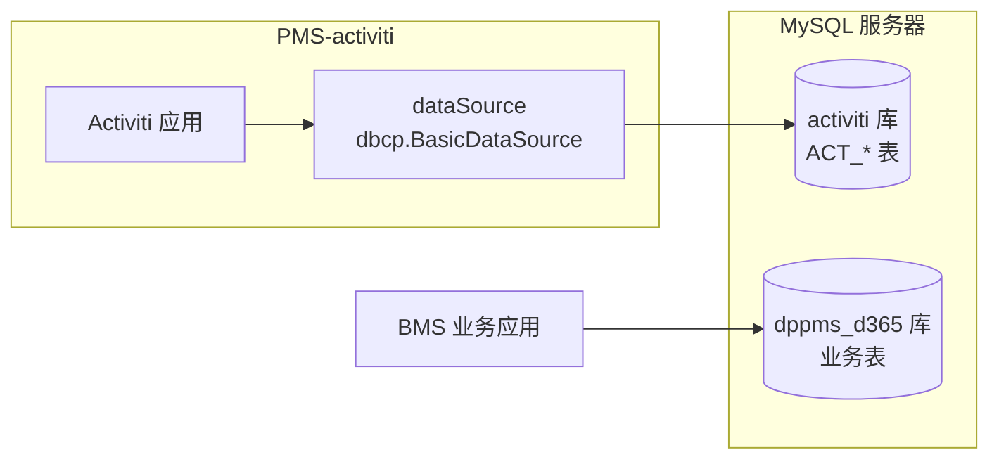
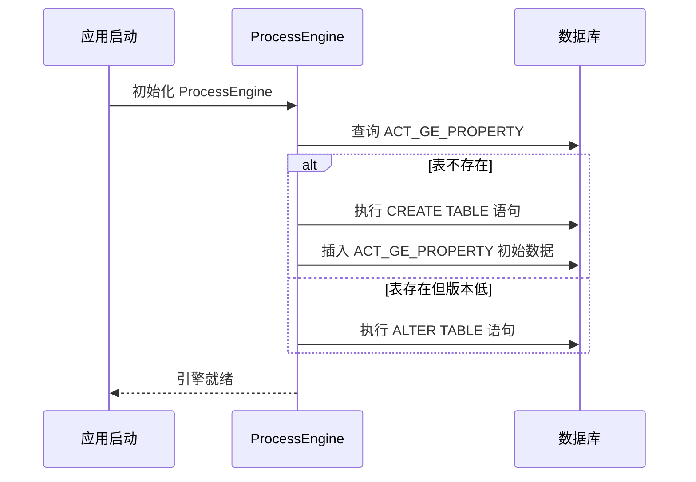
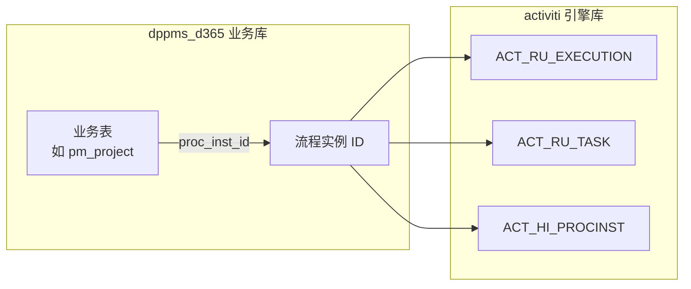

# 数据库配置

> 本文档说明 PMS-activiti 模块的数据库配置，包括独立 Activiti 库、数据源配置、连接池参数与属性文件。

---

## 1. 数据库架构

### 1.1 独立 Activiti 库

PMS-activiti 使用独立的 Activiti 数据库（`activiti`），与 PMS 业务库（`dppms_d365`）分离：



### 1.2 数据库分离的优势

| 优势 | 说明 |
|------|------|
| 隔离性 | 流程引擎数据与业务数据物理隔离，互不影响 |
| 性能 | 流程查询不影响业务库性能 |
| 维护 | 可独立备份/清理 Activiti 历史数据 |
| 扩展 | 可将 Activiti 库迁移到独立服务器 |

### 1.3 数据库连接信息

| 项 | 值 |
|----|----|
| 数据库类型 | MySQL 8.0.16 |
| 数据库名 | `activiti` |
| 主机 | `10.102.0.106` |
| 端口 | `3306` |
| 用户名 | `root` |
| 字符集 | UTF-8（`useUnicode=true&characterEncoding=UTF-8`） |
| 时区 | `GMT+8`（`serverTimezone=GMT%2B8`） |
| SSL | 启用（`useSSL=true`） |

---

## 2. 配置文件

### 2.1 db.properties

```properties
# 数据库类型
db=mysql

# JDBC 连接
jdbc.url=jdbc:mysql://10.102.0.106:3306/activiti?useUnicode=true&characterEncoding=UTF-8&useSSL=true&serverTimezone=GMT%2B8
jdbc.driver=com.mysql.jdbc.Driver
jdbc.username=root
jdbc.password=!Q@W3e4r

# Schema 自动更新
databaseSchemaUpdate=true
```

### 2.2 engine.properties

```properties
# 引擎属性
engine.schema.update=true              # Schema 自动更新
engine.activate.jobexecutor=false      # 旧版作业执行器（关闭）
engine.asyncexecutor.enabled=true      # 新版异步执行器（启用）
engine.asyncexecutor.activate=true     # 异步执行器激活
engine.history.level=full              # 历史级别：完整

# 流程图字体
diagram.labelFontName=宋体
diagram.activityFontName=宋体
diagram.annotationFontName=宋体
export.diagram.path=/upload/diagram

# 演示数据
create.demo.users=true
create.demo.definitions=true
create.demo.models=true
create.demo.reports=true
```

### 2.3 config.properties（备用配置）

```properties
# 备用 JDBC 配置（本地）
jdbc.url=jdbc:mysql:///activiti?useUnicode=true&characterEncoding=UTF-8&useSSL=true&serverTimezone=GMT%2B8
jdbc.driver=com.mysql.cj.jdbc.Driver
jdbc.username=root
jdbc.password=!Q@W3e4r

# Hibernate 配置（请假/绩效模块）
hibernate.dialect=org.hibernate.dialect.MySQL5Dialect
hibernate.format_sql=true
hibernate.show_sql=true
hibernate.hbm2ddl.auto=create
hibernate.cache.use_second_level_cache=true
hibernate.cache.use_query_cache=true
hibernate.cache.region.factory_class=org.hibernate.cache.ehcache.EhCacheRegionFactory
hibernate.cache.provider_configuration_file_resource_path=ehcache.xml

# 流程图字体
diagram.labelFontName=宋体
diagram.activityFontName=宋体
```

---

## 3. 数据源 Bean 配置

### 3.1 主数据源（activiti-custom-context.xml）

```xml
<bean id="dbProperties" 
      class="org.springframework.beans.factory.config.PropertyPlaceholderConfigurer">
    <property name="location" value="classpath:db.properties"/>
    <property name="ignoreUnresolvablePlaceholders" value="true"/>
</bean>

<bean id="dataSource" class="org.apache.commons.dbcp.BasicDataSource">
    <property name="driverClassName" value="${jdbc.driver}"/>
    <property name="url" value="${jdbc.url}"/>
    <property name="username" value="${jdbc.username}"/>
    <property name="password" value="${jdbc.password}"/>
    <property name="defaultAutoCommit" value="false"/>
</bean>
```

### 3.2 连接池参数

使用 `commons-dbcp` 的 `BasicDataSource`，关键参数：

| 参数 | 值 | 说明 |
|------|-----|------|
| `driverClassName` | `com.mysql.jdbc.Driver` | MySQL 驱动（旧版） |
| `url` | `jdbc:mysql://10.102.0.106:3306/activiti` | 连接 URL |
| `username` | `root` | 用户名 |
| `password` | `!Q@W3e4r` | 密码 |
| `defaultAutoCommit` | `false` | 关闭自动提交，由事务管理器控制 |

### 3.3 事务管理器

```xml
<bean id="transactionManager" 
      class="org.springframework.jdbc.datasource.DataSourceTransactionManager">
    <property name="dataSource" ref="dataSource"/>
</bean>
```

---

## 4. Schema 管理

### 4.1 自动建表

`databaseSchemaUpdate=true` 时，引擎启动时自动检查并创建/更新表结构：



### 4.2 Schema 版本管理

Activiti 通过 `ACT_GE_PROPERTY` 表的 `schema.version` 属性管理版本：

```sql
SELECT * FROM ACT_GE_PROPERTY WHERE NAME_ = 'schema.version';
-- 返回值如：5.23.0
```

### 4.3 手动建表

生产环境建议关闭自动建表，使用官方 SQL 脚本手动执行：

```
activiti-engine-5.23.0.jar!/org/activiti/db/create/activiti.mysql.create.engine.sql
activiti-engine-5.23.0.jar!/org/activiti/db/create/activiti.mysql.create.history.sql
activiti-engine-5.23.0.jar!/org/activiti/db/create/activiti.mysql.create.identity.sql
```

---

## 5. 历史数据管理

### 5.1 历史级别

PMS-activiti 使用 `full` 级别（`engine.history.level=full`），记录所有详细信息：

| 级别 | 数值 | 记录内容 | 表 |
|------|------|----------|-----|
| `NONE` | 0 | 不记录 | 无 |
| `ACTIVITY` | 1 | 流程实例和活动实例 | `ACT_HI_PROCINST`、`ACT_HI_ACTINST` |
| `AUDIT` | 2 | 所有任务和活动 | 上述 + `ACT_HI_TASKINST`、`ACT_HI_IDENTITYLINK` |
| `FULL` | 3 | 所有详细信息（含变量变更） | 上述 + `ACT_HI_DETAIL`、`ACT_HI_COMMENT`、`ACT_HI_VARINST` |

### 5.2 历史数据清理

`FULL` 级别数据量大，建议定期清理：

```sql
-- 清理 6 个月前已完成流程的历史数据
DELETE FROM ACT_HI_DETAIL 
WHERE TIME_ < DATE_SUB(NOW(), INTERVAL 6 MONTH);

DELETE FROM ACT_HI_VARINST 
WHERE CREATE_TIME_ < DATE_SUB(NOW(), INTERVAL 6 MONTH)
AND PROC_INST_ID_ IN (
    SELECT ID_ FROM ACT_HI_PROCINST 
    WHERE END_TIME_ < DATE_SUB(NOW(), INTERVAL 6 MONTH)
);

DELETE FROM ACT_HI_COMMENT 
WHERE TIME_ < DATE_SUB(NOW(), INTERVAL 6 MONTH);

DELETE FROM ACT_HI_ACTINST 
WHERE END_TIME_ < DATE_SUB(NOW(), INTERVAL 6 MONTH);

DELETE FROM ACT_HI_TASKINST 
WHERE END_TIME_ < DATE_SUB(NOW(), INTERVAL 6 MONTH);

DELETE FROM ACT_HI_PROCINST 
WHERE END_TIME_ < DATE_SUB(NOW(), INTERVAL 6 MONTH);
```

---

## 6. 与 PMS 业务库的关系

### 6.1 数据库分布

| 数据库 | 用途 | 使用方 |
|--------|------|--------|
| `activiti` | Activiti 引擎表（`ACT_*`） | PMS-activiti |
| `dppms_d365` | PMS 业务表 | PMS-struts、PMS-springmvc |

### 6.2 业务表与流程表的关联

PMS 业务表通过流程实例 ID（`proc_inst_id`）与 Activiti 流程表关联：



### 6.3 跨库查询

PMS-activiti 的 `RevokeTaskCmd` 中存在跨库查询，通过 `RoutingDataSource` 动态切换数据源：

```java
// RevokeTaskCmd.getHistoricActivityInstanceEntity 方法
RoutingDataSource dataSource = (RoutingDataSource) SpringContext.getBean("dataSource");
JdbcTemplate jdbcTemplate = new JdbcTemplate(dataSource);
String historicActivityInstanceId = jdbcTemplate
    .queryForObject("select id_ from ACT_HI_ACTINST where task_id_=?", 
                    String.class, historyTaskId);
```

---

## 7. 缓存配置

### 7.1 EhCache 配置

PMS-activiti 使用 EhCache 作为二级缓存（Hibernate 模块）：

```xml
<!-- config.properties -->
hibernate.cache.use_second_level_cache=true
hibernate.cache.use_query_cache=true
hibernate.cache.region.factory_class=org.hibernate.cache.ehcache.EhCacheRegionFactory
hibernate.cache.provider_configuration_file_resource_path=ehcache.xml
```

### 7.2 ehcache.xml

位于 `src/main/resources/ehcahce.xml`（注意文件名拼写）。

---

## 8. 日志配置

### 8.1 Log4j 配置

PMS-activiti 使用 Log4j（`src/main/resources/log4j.properties`）：

```properties
# 示例配置
log4j.rootLogger=INFO, stdout, file
log4j.logger.org.activiti=DEBUG
log4j.logger.com.dp.plat.activiti=DEBUG
```

---

## 9. 相关文档

- [Activiti 引擎配置](activiti-engine-configuration.md) — ProcessEngineConfiguration 详解
- [Spring 集成](spring-integration.md) — Spring 配置
- [../03-database/complete-data-dictionary.md](../03-database/complete-data-dictionary.md) — 完整数据字典
- [../03-database/database-overview.md](../03-database/database-overview.md) — 数据库概览
- [../05-standards/performance-optimization.md](../05-standards/performance-optimization.md) — 历史数据清理优化
