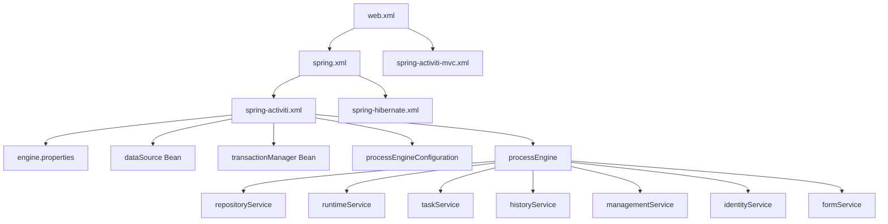
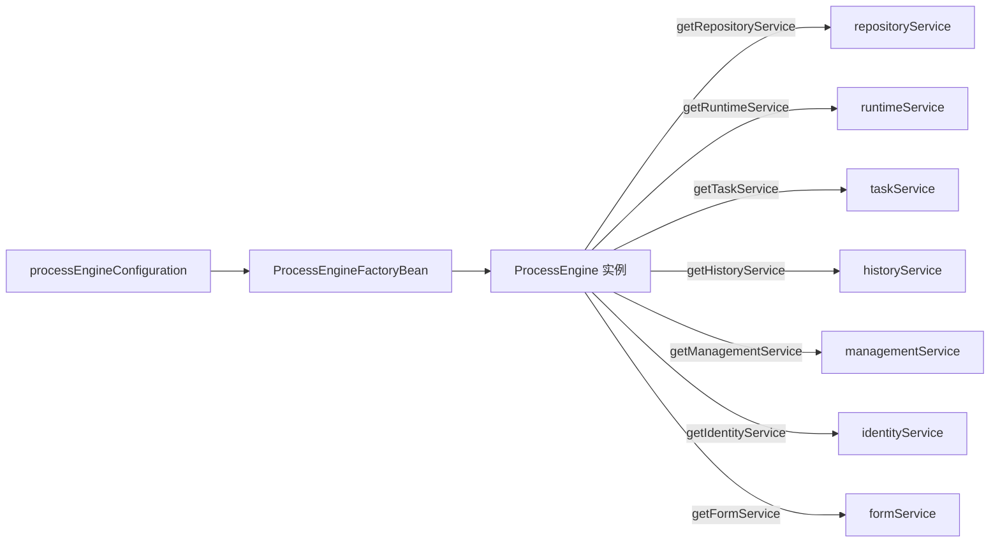

# Spring 集成

> 本文档说明 PMS-activiti 模块与 Spring 框架的集成方式，包括 Spring 配置文件结构、组件扫描、Service 工厂 Bean、事务管理与 MVC 配置。

---

## 1. Spring 配置文件结构

PMS-activiti 使用多个 Spring 配置文件分层管理：

| 配置文件 | 位置 | 职责 |
|----------|------|------|
| `spring-activiti.xml` | `src/main/resources/` | Activiti 引擎核心配置、Service Bean 定义 |
| `spring-activiti-mvc.xml` | `src/main/resources/` | Spring MVC 配置、控制器扫描、视图解析 |
| `activiti-custom-context.xml` | `src/main/resources/` | 数据源、事务管理器、备用引擎配置 |
| `spring.xml` | `src/main/resources/` | Spring 主配置（引入其他配置） |
| `spring-hibernate.xml` | `src/main/resources/` | Hibernate 配置（请假/绩效模块） |

### 1.1 配置文件加载关系



---

## 2. spring-activiti.xml 详解

### 2.1 命名空间

```xml
<beans xmlns="http://www.springframework.org/schema/beans"
    xmlns:xsi="http://www.w3.org/2001/XMLSchema-instance" 
    xmlns:util="http://www.springframework.org/schema/util"
    xmlns:context="http://www.springframework.org/schema/context"
    xsi:schemaLocation="...">
```

使用 `beans`、`util`、`context` 三个命名空间，分别用于 Bean 定义、工具集合、上下文配置。

### 2.2 核心配置

```xml
<!-- 1. 流程引擎配置 -->
<bean id="processEngineConfiguration" 
      class="org.activiti.spring.SpringProcessEngineConfiguration">
    <property name="dataSource" ref="dataSource"/>
    <property name="transactionManager" ref="transactionManager"/>
    <property name="databaseSchema" value="ACT"/>
    <property name="databaseSchemaUpdate" value="true"/>
    <property name="jobExecutorActivate" value="true"/>
    <property name="enableDatabaseEventLogging" value="true"/>
    <property name="customFormTypes">
        <list>
            <bean class="org.activiti.explorer.form.UserFormType"/>
            <bean class="org.activiti.explorer.form.ProcessDefinitionFormType"/>
            <bean class="org.activiti.explorer.form.MonthFormType"/>
        </list>
    </property>
    <property name="activityFontName" value="${diagram.activityFontName}"/>
    <property name="labelFontName" value="${diagram.labelFontName}"/>
    <property name="annotationFontName" value="${diagram.annotationFontName}"/>
    <property name="processDiagramGenerator" ref="customerProcessDiagramGenerator"/>
</bean>

<!-- 2. Jackson ObjectMapper -->
<bean id="objectMapper" class="com.fasterxml.jackson.databind.ObjectMapper"/>

<!-- 3. 流程引擎工厂 Bean -->
<bean id="processEngine" class="org.activiti.spring.ProcessEngineFactoryBean">
    <property name="processEngineConfiguration" ref="processEngineConfiguration"/>
</bean>

<!-- 4. 自定义流程图生成器 -->
<bean id="customerProcessDiagramGenerator" 
      class="com.dp.plat.activiti.service.activiti.CustomProcessDiagramGenerator"/>

<!-- 5. 七大 Service 工厂 Bean -->
<bean id="repositoryService" factory-bean="processEngine" factory-method="getRepositoryService"/>
<bean id="runtimeService" factory-bean="processEngine" factory-method="getRuntimeService"/>
<bean id="taskService" factory-bean="processEngine" factory-method="getTaskService"/>
<bean id="historyService" factory-bean="processEngine" factory-method="getHistoryService"/>
<bean id="managementService" factory-bean="processEngine" factory-method="getManagementService"/>
<bean id="identityService" factory-bean="processEngine" factory-method="getIdentityService"/>
<bean id="formService" factory-bean="processEngine" factory-method="getFormService"/>

<!-- 6. 事务管理器 -->
<bean id="transactionManager" 
      class="org.springframework.jdbc.datasource.DataSourceTransactionManager">
    <property name="dataSource" ref="dataSource"/>
</bean>

<!-- 7. 属性文件加载 -->
<context:property-placeholder ignore-unresolvable="true" 
    local-override="true" location="classpath:engine.properties"/>
<util:properties id="APP_PROPERTIES" location="classpath:engine.properties" 
    local-override="true"/>
```

---

## 3. spring-activiti-mvc.xml 详解

### 3.1 组件扫描

```xml
<!-- 扫描 PMS-activiti 控制器 -->
<context:component-scan base-package="com.dp.plat.activiti.controller"/>
<!-- 扫描 Activiti Editor REST 服务 -->
<context:component-scan base-package="org.activiti.rest.editor"/>
<!-- 扫描 Activiti Diagram REST 服务 -->
<context:component-scan base-package="org.activiti.rest.diagram"/>
```

### 3.2 静态资源映射

```xml
<mvc:resources mapping="/static/images/**" location="/static/images/"/>
<mvc:resources mapping="/static/js/**" location="/static/js/"/>
<mvc:resources mapping="/static/css/**" location="/static/css/"/>
```

### 3.3 视图解析器

```xml
<bean class="org.springframework.web.servlet.view.InternalResourceViewResolver">
    <property name="viewClass" value="org.springframework.web.servlet.view.JstlView"/>
    <property name="prefix" value="/WEB-INF/"/>
    <property name="suffix" value=".jsp"/>
</bean>
```

视图路径规则：`/WEB-INF/{viewName}.jsp`，控制器返回的视图名直接拼接前后缀。

### 3.4 MVC 注解驱动

```xml
<mvc:annotation-driven/>
<bean id="defaultJsonView" 
      class="org.springframework.web.servlet.view.json.MappingJackson2JsonView"/>
```

---

## 4. Service 工厂 Bean 原理

### 4.1 工厂 Bean 模式

Activiti 的 Service 通过 `ProcessEngineFactoryBean` 创建的 `ProcessEngine` 实例暴露，每个 Service 通过工厂方法获取：



### 4.2 Service 注入方式

在 Service/Controller 中通过 `@Autowired` 注入：

```java
@Service("processService")
public class ProcessService implements IProcessService {
    @Autowired
    protected RuntimeService runtimeService;
    @Autowired
    protected IdentityService identityService;
    @Autowired
    protected TaskService taskService;
    @Autowired
    protected RepositoryService repositoryService;
    @Autowired
    protected HistoryService historyService;
    @Autowired
    private ManagementService managementService;
    @Autowired
    ProcessEngineFactoryBean processEngineFactory;
    @Autowired
    ProcessEngineConfiguration processEngineConfiguration;
    @Autowired
    private ProcessEngine processEngine;
}
```

---

## 5. 事务管理

### 5.1 事务管理器

PMS-activiti 使用 `DataSourceTransactionManager`（非 JPA/JTA），与流程引擎共享数据源和事务：

```xml
<bean id="transactionManager" 
      class="org.springframework.jdbc.datasource.DataSourceTransactionManager">
    <property name="dataSource" ref="dataSource"/>
</bean>
```

### 5.2 事务属性

- **隔离级别**：默认（数据库默认隔离级别，MySQL 为 `REPEATABLE_READ`）
- **传播行为**：`PROPAGATION_REQUIRED`（支持当前事务，不存在则新建）
- **回滚规则**：遇到 `RuntimeException` 或 `Error` 回滚

### 5.3 声明式事务

通过 `@Transactional` 注解实现声明式事务：

```java
@Transactional
public void complete(String taskId, String content, String userId, 
                     Map<String, Object> variables) throws Exception {
    // 所有操作在同一事务中
    taskService.addComment(taskId, pi.getId(), content);
    taskService.setVariablesLocal(task.getId(), variables);
    taskService.setAssignee(taskId, userId);
    taskService.complete(taskId, variables);
}
```

### 5.4 事务与 Command

Activiti 自定义 Command 通过 `ManagementService.executeCommand()` 执行，命令在引擎事务上下文中运行，与外部 `@Transactional` 共享事务：

```java
// 外部事务
@Transactional
public Integer revoke(String historyTaskId, String processInstanceId) throws Exception {
    Command<Integer> cmd = new RevokeTaskCmd(historyTaskId, processInstanceId, 
        this.runtimeService, this.workflowService, this.historyService);
    // 命令在同一事务中执行
    Integer revokeFlag = this.processEngine.getManagementService().executeCommand(cmd);
    return revokeFlag;
}
```

---

## 6. 数据源配置

### 6.1 主数据源（spring-activiti.xml 引用）

PMS-activiti 使用独立的 Activiti 数据库，数据源在 `activiti-custom-context.xml` 中定义：

```xml
<bean id="dbProperties" 
      class="org.springframework.beans.factory.config.PropertyPlaceholderConfigurer">
    <property name="location" value="classpath:db.properties"/>
    <property name="ignoreUnresolvablePlaceholders" value="true"/>
</bean>

<bean id="dataSource" class="org.apache.commons.dbcp.BasicDataSource">
    <property name="driverClassName" value="${jdbc.driver}"/>
    <property name="url" value="${jdbc.url}"/>
    <property name="username" value="${jdbc.username}"/>
    <property name="password" value="${jdbc.password}"/>
    <property name="defaultAutoCommit" value="false"/>
</bean>
```

### 6.2 连接池

使用 `commons-dbcp` 的 `BasicDataSource`，关键参数：

| 参数 | 值 | 说明 |
|------|-----|------|
| `defaultAutoCommit` | `false` | 关闭自动提交，由事务管理器控制 |
| `driverClassName` | `com.mysql.jdbc.Driver` | MySQL 驱动（旧版） |
| `url` | `jdbc:mysql://10.102.0.106:3306/activiti` | Activiti 独立库 |

---

## 7. 组件扫描与 Bean 注册

### 7.1 注解驱动的组件

PMS-activiti 通过注解注册 Bean：

| 注解 | 包路径 | 示例 |
|------|--------|------|
| `@Controller` | `com.dp.plat.activiti.controller` | `TaskController`、`ModelController` |
| `@Service` | `com.dp.plat.activiti.service.impl` | `ProcessService`、`WorkflowService` |
| `@Component` | `com.dp.plat.activiti.process.cmd`、`com.dp.plat.activiti.process.listener` | `RevokeTaskCmd`、`UserTaskListener` |

### 7.2 Bean 命名规则

- `@Controller`：默认使用类名首字母小写（如 `taskController`）
- `@Service("processService")`：显式指定 Bean 名称
- `@Component("userTaskListener")`：显式指定，便于在 BPMN 中通过 `delegateExpression` 引用

---

## 8. 相关文档

- [Activiti 引擎配置](activiti-engine-configuration.md) — ProcessEngineConfiguration 详解
- [数据库配置](database-configuration.md) — 数据源与独立库配置
- [BPMN 流程设计器](bpmn-designer.md) — 流程设计器配置
- [../02-modules/controller-methods-reference.md](../02-modules/controller-methods-reference.md) — Controller 方法参考
