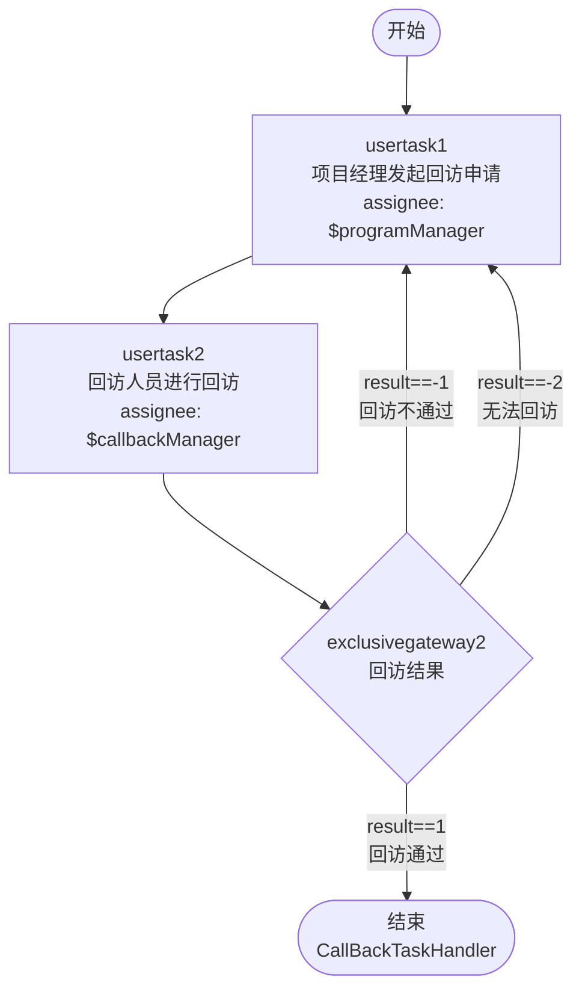
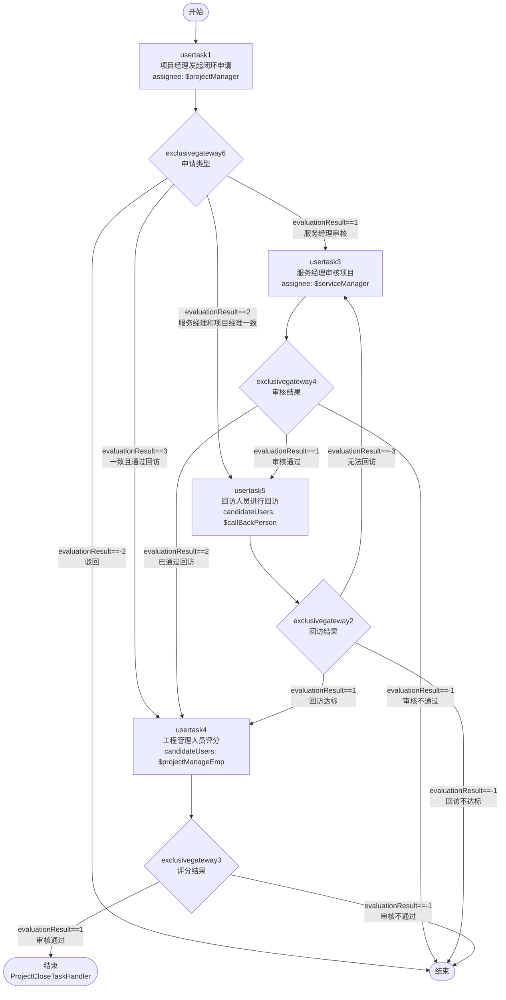
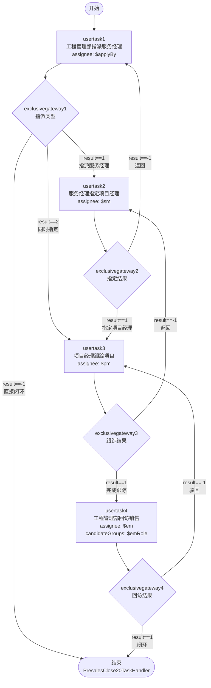
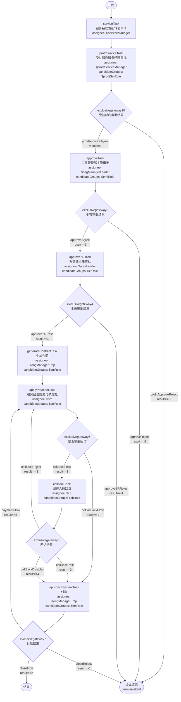
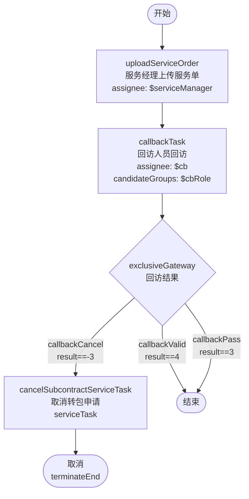

# BPMN 流程定义详解

> 本文档详细说明 PMS 系统中各业务流程的 BPMN 节点定义、流转条件与变量。
> BPMN 文件位置：`PMS-struts/bpmn/`

---

## 1. 流程清单

PMS 系统包含以下业务流程：

| 流程 Key | 流程名称 | BPMN 文件 | 业务说明 |
|----------|----------|-----------|----------|
| `CallBack` | 回访流程 | `CallBack.bpmn` | 项目回访审批 |
| `PmClosedLoop` | 项目闭环流程 | `PmClosedLoop.bpmn` | 项目闭环审批 |
| `Presales` | 售前测试流程 | `Presales.bpmn` | 售前测试审批 |
| `Subcontract` | 项目转包流程 | `Subcontract.bpmn` | 项目转包审批 |
| `SubcontractCallBack` | 项目转包回访流程 | `SubcontractCallBack.bpmn` | 转包回访审批 |
| `activitiReview` | Review And Approve Activiti Process | `testprocess.bpmn` | 测试流程（演示用） |

> 说明：`Subcontract2.bpmn` 与 `Subcontract.bpmn` 内容相同；`SubcontractCallBack2.bpmn` 与 `SubcontractCallBack.bpmn` 类似，但 `uploadServiceOrder` 为 manualTask（无 assignee），属于流程演进过程中的历史版本。

---

## 2. CallBack — 回访流程

### 2.1 流程图

### 2.2 节点定义

| 节点 ID | 节点名称 | 类型 | 办理人 | 说明 |
|---------|----------|------|--------|------|
| `startevent1` | Start | startEvent | - | 流程开始 |
| `usertask1` | 项目经理发起回访申请 | userTask | `${programManager}` | 项目经理发起 |
| `usertask2` | 回访人员进行回访 | userTask | `${callbackManager}` | 回访人员办理 |
| `exclusivegateway2` | Exclusive Gateway | exclusiveGateway | - | 回访结果判断 |
| `endevent2` | End | endEvent | - | 流程结束 |

### 2.3 流转条件

| 连线 | 源节点 → 目标节点 | 条件 | 说明 |
|------|------------------|------|------|
| `flow6` | gateway2 → endevent2 | `${result==1}` | 回访通过，流程结束 |
| `flow7` | gateway2 → usertask1 | `${result==-1}` | 回访不通过，退回项目经理 |
| `flow9` | gateway2 → usertask1 | `${result==-2}` | 无法回访，退回项目经理 |

### 2.4 流程变量

| 变量名 | 类型 | 说明 |
|--------|------|------|
| `programManager` | String | 项目经理用户 ID |
| `callbackManager` | String | 回访人员用户 ID |
| `result` | Integer | 回访结果（1=通过, -1=不通过, -2=无法回访） |

### 2.5 监听器

| 节点 | 事件 | 监听器 | 说明 |
|------|------|--------|------|
| `endevent2` | End | `com.dp.plat.taskHandler.CallBackTaskHandler` | 流程结束时回调 |
| `flow6` | start | `com.dp.plat.taskHandler.CallBackTaskHandler` | 回访通过时回调 |

---

## 3. PmClosedLoop — 项目闭环流程

### 3.1 流程图

### 3.2 节点定义

| 节点 ID | 节点名称 | 类型 | 办理人 | 说明 |
|---------|----------|------|--------|------|
| `startevent1` | Start | startEvent | - | 流程开始 |
| `usertask1` | 项目经理发起闭环申请 | userTask | `${projectManager}` | 项目经理发起 |
| `usertask3` | 服务经理审核项目 | userTask | `${serviceManager}` | 服务经理审核 |
| `usertask4` | 工程管理人员评分 | userTask | `${projectManageEmp}`（候选人） | 工程人员评分 |
| `usertask5` | 回访人员进行回访 | userTask | `${callBackPerson}`（候选人） | 回访人员办理 |
| `endevent1` | End | endEvent | - | 正常结束 |
| `endevent2` | End | endEvent | - | 异常结束 |

### 3.3 流转条件

| 连线 | 源节点 → 目标节点 | 条件 | 说明 |
|------|------------------|------|------|
| `flow23` | gateway6 → usertask3 | `${evaluationResult == 1}` | 需服务经理审核 |
| `flow26` | gateway6 → usertask5 | `${evaluationResult == 2}` | 服务经理与项目经理一致，直接回访 |
| `flow27` | gateway6 → usertask4 | `${evaluationResult == 3}` | 一致且已通过回访，直接评分 |
| `flow28` | gateway6 → endevent2 | `${evaluationResult == -2}` | 驳回，流程结束 |
| `flow18` | gateway4 → usertask5 | `${evaluationResult == 1}` | 审核通过，进入回访 |
| `flow19` | gateway4 → endevent2 | `${evaluationResult == -1}` | 审核不通过 |
| `flow20` | gateway4 → usertask4 | `${evaluationResult == 2}` | 已通过回访，直接评分 |
| `flow9` | gateway2 → usertask4 | `${evaluationResult == 1}` | 回访达标，进入评分 |
| `flow11` | gateway2 → endevent2 | `${evaluationResult == -1}` | 回访不达标 |
| `flow29` | gateway2 → usertask3 | `${evaluationResult == -3}` | 无法回访，退回服务经理 |
| `flow13` | gateway3 → endevent1 | `${evaluationResult == 1}` | 评分通过，流程结束 |
| `flow14` | gateway3 → endevent2 | `${evaluationResult == -1}` | 评分不通过 |

### 3.4 流程变量

| 变量名 | 类型 | 说明 |
|--------|------|------|
| `projectManager` | String | 项目经理用户 ID |
| `serviceManager` | String | 服务经理用户 ID |
| `projectManageEmp` | String | 工程管理人员用户 ID（候选人） |
| `callBackPerson` | String | 回访人员用户 ID（候选人） |
| `evaluationResult` | Integer | 评估结果（多种含义，按节点区分） |

### 3.5 监听器

| 节点 | 事件 | 监听器 | 说明 |
|------|------|--------|------|
| `endevent1` | end | `com.dp.plat.taskHandler.ProjectCloseTaskHandler` | 闭环结束时回调 |

---

## 4. Presales — 售前测试流程

### 4.1 流程图

### 4.2 节点定义

| 节点 ID | 节点名称 | 类型 | 办理人 | 说明 |
|---------|----------|------|--------|------|
| `startevent1` | Start | startEvent | - | 流程开始 |
| `usertask1` | 工程管理部指派服务经理 | userTask | `${applyBy}` | 工程管理部指派 |
| `usertask2` | 服务经理指定项目经理 | userTask | `${sm}` | 服务经理指定 |
| `usertask3` | 项目经理跟踪项目 | userTask | `${pm}` | 项目经理跟踪 |
| `usertask4` | 工程管理部回访销售 | userTask | `${em}`（候选组：`${emRole}`） | 工程管理部回访 |
| `endevent1` | End | endEvent | - | 流程结束 |

### 4.3 流转条件

| 连线 | 源节点 → 目标节点 | 条件 | 说明 |
|------|------------------|------|------|
| `flow3` | gateway1 → usertask2 | `${result==1}` | 指派服务经理 |
| `flow19` | gateway1 → usertask3 | `${result==2}` | 同时指定服务和项目经理 |
| 无名 | gateway1 → endevent1 | `${result==-1}` | 直接闭环 |
| `flow5` | gateway2 → usertask3 | `${result==1}` | 指定项目经理 |
| `flow6` | gateway2 → usertask1 | `${result==-1}` | 返回工程管理部 |
| `flow8` | gateway3 → usertask4 | `${result==1}` | 完成跟踪，进入回访 |
| `flow12` | gateway3 → usertask2 | `${result==-1}` | 返回服务经理 |
| `flow17` | gateway4 → endevent1 | `${result==1}` | 闭环 |
| `flow11` | gateway4 → usertask3 | `${result==-1}` | 驳回项目经理 |

### 4.4 流程变量

| 变量名 | 类型 | 说明 |
|--------|------|------|
| `applyBy` | String | 申请人用户 ID |
| `sm` | String | 服务经理用户 ID |
| `pm` | String | 项目经理用户 ID |
| `em` | String | 工程管理人员用户 ID |
| `emRole` | String | 工程管理部角色 ID（候选组） |
| `result` | Integer | 操作结果 |

### 4.5 监听器

| 节点/连线 | 事件 | 监听器 | 说明 |
|-----------|------|--------|------|
| `endevent1` | take | `com.dp.plat.taskHandler.PresalesClosedTaskHandler` | 闭环时回调 |
| `flow17` | take | `com.dp.plat.taskHandler.PresalesClosedTaskHandler` | 闭环时回调 |
| 无名连线 | take | `com.dp.plat.taskHandler.PresalesClose20TaskHandler` | 直接闭环时回调 |

---

## 5. Subcontract — 项目转包流程

### 5.1 流程图

### 5.2 节点定义

| 节点 ID | 节点名称 | 类型 | 办理人 | 说明 |
|---------|----------|------|--------|------|
| `start` | 开始 | startEvent | - | 流程开始 |
| `serviceTask` | 服务经理发起转包申请 | userTask | `${serviceManager}` | 服务经理发起 |
| `profitServiceTask` | 受益部门服务经理审批 | userTask | `${profitServiceManager}`（候选组：`${profitSmRole}`） | 受益部门服务经理审批 |
| `approveTask` | 工程管理部主管审批 | userTask | `${engManagerLeader}`（候选组：`${emlRole}`） | 主管审批 |
| `approveZRTask` | 办事处主任审批 | userTask | `${areaLeader}`（候选组：`${zrRole}`） | 主任审批 |
| `generateContractTask` | 生成合同 | userTask | `${engManagerEmp}`（候选组：`${emRole}`） | 生成合同 |
| `applyPaymentTask` | 服务经理提交付款信息 | userTask | `${sm}`（候选组：`${smRole}`） | 提交付款 |
| `callbackTask` | 回访人员回访 | userTask | `${cb}`（候选组：`${cbRole}`） | 回访 |
| `approvePaymentTask` | 付款 | userTask | `${engManagerEmp}`（候选组：`${emRole}`） | 付款 |
| `terminateEnd` | 结束 | endEvent（terminate） | - | 终止结束 |
| `end` | 结束 | endEvent | - | 正常结束 |

### 5.3 流转条件

| 连线 | 源节点 → 目标节点 | 条件 | 说明 |
|------|------------------|------|------|
| `flow1` | start → serviceTask | - | 无条件 |
| `flow2` | serviceTask → profitServiceTask | - | 无条件 |
| `flow17` | profitServiceTask → exclusivegateway10 | - | 无条件 |
| `profitApproveAgree` | gateway10 → approveTask | `${result == 1}` | 受益部门审批通过 |
| `profitApproveReject` | gateway10 → terminateEnd | `${result == -1}` | 受益部门审批驳回 |
| `flow3` | approveTask → exclusivegateway3 | - | 无条件 |
| `approveAgree` | gateway3 → approveZRTask | `${result == 1}` | 主管审批通过 |
| `approveReject` | gateway3 → terminateEnd | `${result == -1}` | 主管审批驳回 |
| `flow5` | approveZRTask → exclusivegateway4 | - | 无条件 |
| `approveZRPass` | gateway4 → generateContractTask | `${result == 1}` | 主任审批通过 |
| `approveZRReject` | gateway4 → terminateEnd | `${result == -1}` | 主任审批驳回 |
| `flow6` | generateContractTask → applyPaymentTask | - | 无条件 |
| `flow7` | applyPaymentTask → exclusivegateway6 | - | 无条件 |
| `callBackFlow` | gateway6 → callbackTask | `${result==1}` | 需要回访 |
| `noCallBackFlow` | gateway6 → approvePaymentTask | `${result==-1}` | 无需回访 |
| `flow16` | callbackTask → exclusivegateway8 | - | 无条件 |
| `callBackPass` | gateway8 → approvePaymentTask | `${result==3}` | 回访通过 |
| `callBackDisabled` | gateway8 → approvePaymentTask | `${result==4}` | 无法回访 |
| `callbackReject` | gateway8 → applyPaymentTask | `${result==-3}` | 回访不通过 |
| `flow10` | approvePaymentTask → exclusivegateway7 | - | 无条件 |
| `closeFlow` | gateway7 → end | `${result == 2}` | 闭环 |
| `closeReject` | gateway7 → terminateEnd | `${result == -1}` | 驳回 |
| `paymentFlow` | gateway7 → applyPaymentTask | `${result == 5}` | 余款未支付 |

### 5.4 流程变量

| 变量名 | 类型 | 说明 |
|--------|------|------|
| `serviceManager` | String | 服务经理用户 ID（发起转包） |
| `profitServiceManager` | String | 受益部门服务经理用户 ID |
| `profitSmRole` | String | 受益部门服务经理角色 ID（候选组） |
| `engManagerLeader` | String | 工程管理部主管用户 ID |
| `emlRole` | String | 主管角色 ID（候选组） |
| `areaLeader` | String | 办事处主任用户 ID |
| `zrRole` | String | 主任角色 ID（候选组） |
| `engManagerEmp` | String | 工程管理人员用户 ID |
| `emRole` | String | 工程管理部角色 ID（候选组） |
| `sm` | String | 服务经理用户 ID（提交付款） |
| `smRole` | String | 服务经理角色 ID（候选组） |
| `cb` | String | 回访人员用户 ID |
| `cbRole` | String | 回访人员角色 ID（候选组） |
| `result` | Integer | 操作结果（按节点区分含义） |

### 5.5 网关清单

| 网关 ID | 说明 | 分支数 |
|---------|------|--------|
| `exclusivegateway10` | 受益部门服务经理审批结果 | 2（通过 / 驳回） |
| `exclusivegateway3` | 工程管理部主管审批结果 | 2（通过 / 驳回） |
| `exclusivegateway4` | 办事处主任审批结果 | 2（通过 / 驳回） |
| `exclusivegateway6` | 是否需要回访 | 2（回访 / 无需回访） |
| `exclusivegateway8` | 回访结果 | 3（通过 / 无法回访 / 不通过） |
| `exclusivegateway7` | 付款结果 | 3（闭环 / 驳回 / 余款未支付） |

### 5.6 特殊节点

- **`terminateEnd`**：终止结束事件（`terminateEventDefinition`），到达此节点时流程立即终止，所有活动任务被删除
- **`profitServiceTask`**：受益部门服务经理审批节点（userTask，非自动服务任务），由受益部门服务经理进行审批

---

## 6. SubcontractCallBack — 项目转包回访流程

### 6.1 流程图

### 6.2 节点定义

| 节点 ID | 节点名称 | 类型 | 办理人 | 说明 |
|---------|----------|------|--------|------|
| `sid-69E01AA5-A8EE-434A-9CCB-C38606E2E4E4` | Start | startEvent | - | 流程开始 |
| `uploadServiceOrder` | 服务经理上传服务单 | userTask | `${serviceManager}` | 服务经理上传服务单 |
| `callbackTask` | 回访人员回访 | userTask | `${cb}`（候选组：`${cbRole}`） | 回访人员办理 |
| `sid-6471289E-F372-401B-A586-E9498151909C` | Exclusive Gateway | exclusiveGateway | - | 回访结果判断 |
| `cancelSubcontractServiceTask` | 取消转包申请 | serviceTask | - | 自动执行取消转包（`com.dp.plat.subcontract.listener.CancelSubcontractFlowListener`） |
| `end` | 结束 | endEvent | - | 正常结束 |
| `terminateEnd` | 取消 | endEvent（terminate） | - | 终止结束 |

### 6.3 流转条件

| 连线 | 源节点 → 目标节点 | 条件 | 说明 |
|------|------------------|------|------|
| `flow4` | start → uploadServiceOrder | - | 无条件 |
| `flow5` | uploadServiceOrder → callbackTask | - | 无条件 |
| `flow3` | callbackTask → exclusiveGateway | - | 无条件 |
| `callbackCancel` | gateway → cancelSubcontractServiceTask | `${result==-3}` | 回访不通过，取消转包 |
| `sid-352AE2AF...` | cancelSubcontractServiceTask → terminateEnd | - | 无条件 |
| `callbackValid` | gateway → end | `${result==4}` | 无法回访，流程结束 |
| `callbackPass` | gateway → end | `${result==3}` | 回访通过，流程结束 |

### 6.4 流程变量

| 变量名 | 类型 | 说明 |
|--------|------|------|
| `serviceManager` | String | 服务经理用户 ID（上传服务单） |
| `cb` | String | 回访人员用户 ID |
| `cbRole` | String | 回访人员角色 ID（候选组） |
| `result` | Integer | 回访结果（3=通过, 4=无法回访, -3=不通过） |

### 6.5 监听器

| 节点 | 类型 | 监听器 | 说明 |
|------|------|--------|------|
| `cancelSubcontractServiceTask` | serviceTask（class） | `com.dp.plat.subcontract.listener.CancelSubcontractFlowListener` | 取消转包申请时自动触发 |

### 6.6 特殊节点

- **`cancelSubcontractServiceTask`**：服务任务（serviceTask），通过 `class` 属性指定 `CancelSubcontractFlowListener`，在回访不通过时自动执行取消转包逻辑
- **`terminateEnd`**：终止结束事件（`terminateEventDefinition`），取消转包后流程终止
- **`uploadServiceOrder`**：在 `SubcontractCallBack2.bpmn` 中为 manualTask（无 assignee），属于历史版本差异

---

## 7. 通用流程变量约定

PMS 系统的流程变量遵循以下约定（见 `Constants.java`）：

### 7.1 审批结果变量

| 变量名 | 常量 | 说明 |
|--------|------|------|
| `approved` | `Constants.APPROVE_RESULT` | 审批结果 |
| `suggestion` | `Constants.APPROVE_SUGGESTION` | 审批意见 |

### 7.2 审批结果值

| 值 | 常量 | 说明 |
|----|------|------|
| `1` | `Constants.APPROVED_PASSED` | 通过 |
| `0` | `Constants.APPROVED_REJECT` | 拒绝 |
| `terminate` | `Constants.STATE_TERMINATE` | 终止 |

### 7.3 业务变量

| 变量名 | 常量 | 说明 |
|--------|------|------|
| `local_form_url` | `Constants.VAR_FORM_URL` | 业务表单 URL |
| `applyUserName` | `Constants.VAR_APPLYUSER_NAME` | 申请人名称 |
| `applyUserId` | `Constants.VAR_APPLYUSER_ID` | 申请人 ID |
| `businessKey` | `Constants.VAR_BUSINESS_KEY` | 业务 ID |
| `entity` | - | 业务实体（BaseVO 序列化） |

### 7.4 流程状态值

| 值 | 常量 | 说明 |
|----|------|------|
| `0` | `Constants.FLOW_STATE_SAVE` | 临时保存 |
| `1` | `Constants.FLOW_STATE_DOING` | 审批中 |
| `2` | `Constants.FLOW_STATE_DONE` | 审批通过 |
| `3` | `Constants.FLOW_STATE_CLOSE` | 强制结束 |

---

## 8. 流程监听器

PMS 系统的流程结束监听器位于 `com.dp.plat.taskHandler` 包（PMS-struts 模块）：

| 监听器类 | 触发节点 | 事件 | 说明 |
|----------|----------|------|------|
| `CallBackTaskHandler` | CallBack.endevent2 | End | 回访流程结束回调 |
| `ProjectCloseTaskHandler` | PmClosedLoop.endevent1 | end | 闭环流程结束回调 |
| `PresalesClosedTaskHandler` | Presales.endevent1 | take | 售前闭环回调 |
| `PresalesClose20TaskHandler` | Presales.直接闭环连线 | take | 售前直接闭环回调 |
| `CancelSubcontractFlowListener` | SubcontractCallBack.cancelSubcontractServiceTask | serviceTask（class） | 转包回访不通过时取消转包 |

> 注：`CancelSubcontractFlowListener` 位于 `com.dp.plat.subcontract.listener` 包（PMS-struts 模块），通过 serviceTask 的 `class` 属性配置，在回访不通过时自动执行取消转包逻辑。

---

## 9. 相关文档

- [流程定义管理](process-definition-management.md) — 流程定义与部署
- [流程实例管理](process-instance-management.md) — 流程实例管理
- [监听器](listeners.md) — 任务监听器与执行监听器
- [../01-architecture/bpmn-designer.md](../01-architecture/bpmn-designer.md) — 流程设计器
- [../06-reference/code-examples.md](../06-reference/code-examples.md) — 代码示例
