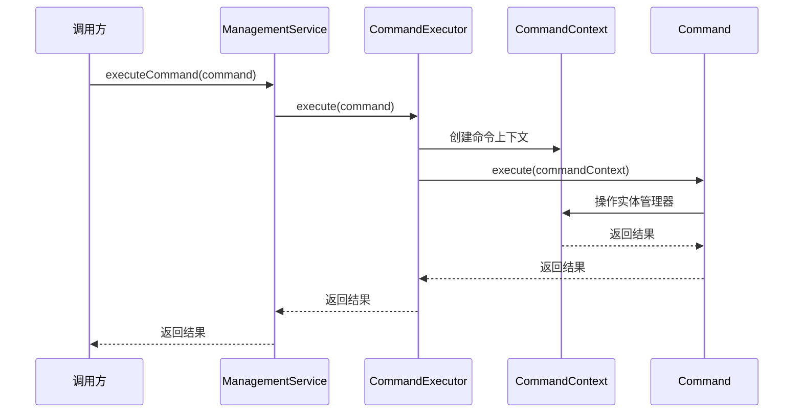
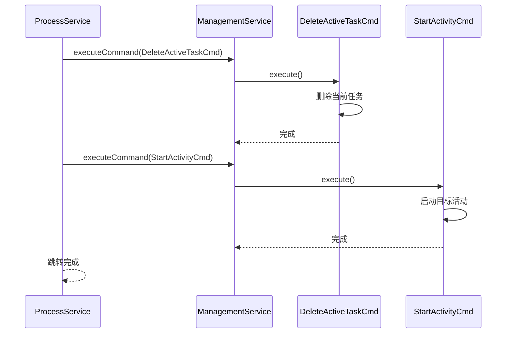
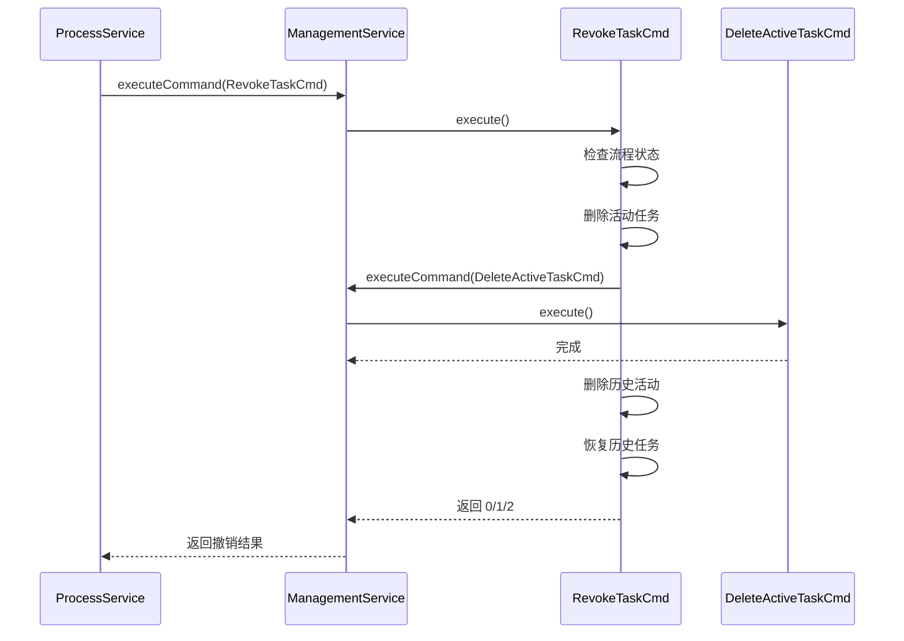

# 自定义命令

> 本文档详细说明 PMS-activiti 模块的自定义 Command 实现原理与使用方式。
> 命令类位于 `com.dp.plat.activiti.process.cmd` 包

---

## 1. 命令模式概述

Activiti 引擎基于命令模式（Command Pattern）实现所有操作，每个操作封装为一个 `Command` 对象，通过 `ManagementService.executeCommand()` 或 `CommandExecutor.execute()` 执行。

### 1.1 命令接口

```java
public interface Command<T> {
    T execute(CommandContext commandContext);
}
```

### 1.2 命令执行流程



---

## 2. 命令清单

PMS-activiti 提供以下自定义命令：

| 命令类 | 职责 | 使用场景 |
|--------|------|----------|
| `RevokeTaskCmd` | 撤销任务（回退到上一节点） | 审批人撤销已提交的任务 |
| `WithdrawTaskCmd` | 撤回任务（多实例支持） | 下一节点未办理时撤回 |
| `JumpTaskCmdService` | 任务跳转（任意节点） | 任务回退/前进/终止 |
| `DeleteActiveTaskCmd` | 删除活动任务 | 跳转时删除当前任务 |
| `StartActivityCmd` | 启动活动节点 | 跳转时启动目标节点 |

---

## 3. RevokeTaskCmd — 任务撤销

### 3.1 类信息

- **类名**：`com.dp.plat.activiti.process.cmd.RevokeTaskCmd`
- **注解**：`@Component`
- **实现接口**：`Command<Integer>`
- **返回值**：`0`=成功，`1`=流程已结束，`2`=下一节点已通过

### 3.2 构造方法

```java
public RevokeTaskCmd(String historyTaskId, String processInstanceId, 
                     RuntimeService runtimeService,
                     IWorkflowService workflowService, 
                     HistoryService historyService) {
    this.historyTaskId = historyTaskId;
    this.processInstanceId = processInstanceId;
    this.runtimeService = runtimeService;
    this.workflowService = workflowService;
    this.historyService = historyService;
}
```

### 3.3 执行逻辑

```java
@Override
public Integer execute(CommandContext commandContext) {
    // 1. 获取历史任务实体
    HistoricTaskInstanceEntity historicTaskInstanceEntity = Context.getCommandContext()
        .getHistoricTaskInstanceEntityManager()
        .findHistoricTaskInstanceById(historyTaskId);
    
    // 2. 获取历史活动实体
    HistoricActivityInstanceEntity historicActivityInstanceEntity = 
        getHistoricActivityInstanceEntity(historyTaskId);
    
    // 3. 获取当前流程实例和任务
    ProcessInstance processInstance = runtimeService.createProcessInstanceQuery()
        .processInstanceId(processInstanceId).singleResult();
    if (processInstance == null) {
        return 1;  // 流程已结束
    }
    
    // 4. 检查下一节点是否已通过
    List<Task> currentTasks = workflowService.getCurrentTaskInfo(processInstance);
    for (Task currentTask : currentTasks) {
        HistoricTaskInstance hti = historyService.createHistoricTaskInstanceQuery()
            .taskId(currentTask.getId()).singleResult();
        if (hti != null && "completed".equals(hti.getDeleteReason())) {
            return 2;  // 下一节点已通过
        }
    }
    
    // 5. 执行撤销
    for (Task currentTask : currentTasks) {
        // 删除所有活动任务
        deleteActiveTasks(processInstance.getProcessInstanceId());
        // 删除当前任务
        Command<Void> cmd = new DeleteActiveTaskCmd((TaskEntity) currentTask, "revoke", true);
        Context.getProcessEngineConfiguration().getManagementService().executeCommand(cmd);
        // 删除历史活动
        deleteHistoryActivities(historyTaskId, processInstanceId);
        // 恢复历史任务
        processHistoryTask(historicTaskInstanceEntity, historicActivityInstanceEntity);
    }
    return 0;  // 撤销成功
}
```

### 3.4 恢复任务逻辑

`processHistoryTask()` 方法恢复被撤销的任务：

```java
public void processHistoryTask(HistoricTaskInstanceEntity historicTaskInstanceEntity,
                                HistoricActivityInstanceEntity historicActivityInstanceEntity) {
    // 1. 清除历史任务的结束时间和持续时间
    historicTaskInstanceEntity.setEndTime(null);
    historicTaskInstanceEntity.setDurationInMillis(null);
    historicActivityInstanceEntity.setEndTime(null);
    historicActivityInstanceEntity.setDurationInMillis(null);
    
    // 2. 创建新的任务实体（使用原任务 ID）
    TaskEntity task = TaskEntity.create(new Date());
    task.setProcessDefinitionId(historicTaskInstanceEntity.getProcessDefinitionId());
    task.setId(historicTaskInstanceEntity.getId());
    task.setAssigneeWithoutCascade(historicTaskInstanceEntity.getAssignee());
    task.setNameWithoutCascade(historicTaskInstanceEntity.getName());
    task.setTaskDefinitionKey(historicTaskInstanceEntity.getTaskDefinitionKey());
    task.setExecutionId(historicTaskInstanceEntity.getExecutionId());
    // ... 其他属性
    
    // 3. 插入任务
    Context.getCommandContext().getTaskEntityManager().insert(task);
    
    // 4. 将流程指向任务对应的节点
    ExecutionEntity executionEntity = Context.getCommandContext()
        .getExecutionEntityManager()
        .findExecutionById(historicTaskInstanceEntity.getExecutionId());
    ActivityImpl activity = getActivity(historicActivityInstanceEntity);
    executionEntity.setActivity(activity);
    executionEntity.executeActivity(activity);
}
```

### 3.5 使用方式

```java
// 在 ProcessService.revoke() 中
@Transactional
public Integer revoke(String historyTaskId, String processInstanceId) throws Exception {
    Command<Integer> cmd = new RevokeTaskCmd(historyTaskId, processInstanceId, 
        this.runtimeService, this.workflowService, this.historyService);
    Integer revokeFlag = this.processEngine.getManagementService().executeCommand(cmd);
    return revokeFlag;
}
```

---

## 4. WithdrawTaskCmd — 任务撤回

### 4.1 类信息

- **类名**：`com.dp.plat.activiti.process.cmd.WithdrawTaskCmd`
- **注解**：`@Component`
- **实现接口**：`Command<Integer>`
- **特点**：支持多实例节点的撤回

### 4.2 构造方法

```java
public WithdrawTaskCmd(String targetTaskDefinitionKey, TaskEntity currentTaskEntity) {
    this.targetTaskDefinitionKey = targetTaskDefinitionKey;
    this.currentTaskEntity = currentTaskEntity;
}
```

### 4.3 执行逻辑

```java
@Override
public Integer execute(CommandContext commandContext) {
    // 1. 获取流程定义和目标活动
    ProcessDefinitionEntity processDefinition = (ProcessDefinitionEntity) 
        repositoryService.getProcessDefinition(currentTaskEntity.getProcessDefinitionId());
    ActivityImpl activity = processDefinition.findActivity(targetTaskDefinitionKey);
    ActivityImpl currentActivity = processDefinition.findActivity(currentTaskEntity.getTaskDefinitionKey());
    
    // 2. 获取执行实例
    ExecutionEntity execution = (ExecutionEntity) runtimeService.createExecutionQuery()
        .executionId(currentTaskEntity.getExecutionId()).singleResult();
    
    // 3. 删除当前任务
    currentTaskEntity.setExecutionId(null);
    taskService.saveTask(currentTaskEntity);
    taskService.deleteTask(currentTaskEntity.getId(), true);
    
    // 4. 根据目标节点类型处理
    if (StringUtils.isNotBlank(execution.getParentId()) 
        && activity.getActivityBehavior() instanceof UserTaskActivityBehavior) {
        // 多实例节点撤回至单个用户节点
        ExecutionEntityManager executionEntityManager = commandContext.getExecutionEntityManager();
        execution.destroy();
        execution.deleteCascade(UserContext.getCurrentUser().getUserName() + "撤回");
        ExecutionEntity executionParent = executionEntityManager.findExecutionById(execution.getParentId());
        executionParent.setActive(true);
        executionParent.executeActivity(activity);
    } else if (activity.getId().equals(currentActivity.getId())) {
        // 多实例节点内部撤回
        Object loopCounter = execution.getVariable(collectionElementIndexVariable);
        // ... 删除原分支，创建新分支
        multiInstanceWithdraw(activity, execution, (Integer) loopCounter - 1);
    } else if (activity.getActivityBehavior() instanceof MultiInstanceActivityBehavior) {
        // 单个用户节点回退至多实例节点
        execution.setActivity(activity);
        ExecutionEntity childExecution = execution.createExecution();
        multiInstanceWithdraw(activity, childExecution);
    } else {
        // 普通节点撤回
        execution.executeActivity(activity);
    }
    return null;
}
```

### 4.4 多实例撤回

`multiInstanceWithdraw()` 方法处理多实例节点的撤回：

```java
protected void multiInstanceWithdraw(ActivityImpl activity, ActivityExecution execution, 
                                      int loopCounter) throws Exception {
    MultiInstanceActivityBehavior behavior = (MultiInstanceActivityBehavior) activity.getActivityBehavior();
    if (behavior instanceof SequentialMultiInstanceBehavior) {
        // 顺序多实例：创建指定数量的实例
        com.dp.plat.activiti.process.behavior.SequentialMultiInstanceBehavior seqBehavior = 
            new com.dp.plat.activiti.process.behavior.SequentialMultiInstanceBehavior(
                activity, behavior.getInnerActivityBehavior());
        BeanUtils.copyProperties(behavior, seqBehavior);
        seqBehavior.createInstances(execution, loopCounter);
    } else if (behavior instanceof ParallelMultiInstanceBehavior) {
        // TODO 并行多实例节点的回退（未实现）
    }
}
```

### 4.5 使用方式

```java
// 在 ProcessService.jumpTask() 中
public void jumpTask(final TaskEntity currentTaskEntity, 
                     String targetTaskDefinitionKey) throws Exception {
    ((RuntimeServiceImpl) runtimeService).getCommandExecutor()
        .execute(new WithdrawTaskCmd(targetTaskDefinitionKey, currentTaskEntity));
}
```

---

## 5. JumpTaskCmdService — 任务跳转

### 5.1 类信息

- **类名**：`com.dp.plat.activiti.process.cmd.JumpTaskCmdService`
- **实现接口**：`Command<Comment>`

### 5.2 构造方法

```java
// 基本构造
public JumpTaskCmdService(String executionId, String activityId, String reason) {
    this.executionId = executionId;
    this.activityId = activityId;
    this.reason = reason;
}

// 带类型的构造（用于终止）
public JumpTaskCmdService(String executionId, String activityId, String type, String reason) {
    this.executionId = executionId;
    this.activityId = activityId;
    this.type = type;
    this.reason = reason;
}
```

### 5.3 执行逻辑

```java
@Override
public Comment execute(CommandContext commandContext) {
    TaskEntityManager taskEntityManager = commandContext.getTaskEntityManager();
    
    // 1. 查询当前执行实例的所有任务
    List<TaskEntity> list = taskEntityManager.findTasksByExecutionId(executionId);
    
    // 2. 删除任务并添加评论
    for (TaskEntity taskEntity : list) {
        // 添加跳转原因评论
        new AddCommentCmd(taskEntity.getId(), taskEntity.getProcessInstanceId(), reason)
            .execute(commandContext);
        // 设置局部变量
        taskEntity.createVariablesLocal(variables);
        // 删除任务（type 作为删除原因）
        taskEntityManager.deleteTask(taskEntity, type, false);
    }
    
    // 3. 跳转到目标活动
    ExecutionEntity executionEntity = Context.getCommandContext()
        .getExecutionEntityManager().findExecutionById(executionId);
    ProcessDefinitionImpl processDefinition = executionEntity.getProcessDefinition();
    ActivityImpl activity = processDefinition.findActivity(activityId);
    executionEntity.executeActivity(activity);
    
    return null;
}
```

### 5.4 使用方式

```java
// 终止流程
public void terminateProcess(String processInstanceId, String terminateReason) {
    Task task = taskService.createTaskQuery().processInstanceId(processInstanceId).singleResult();
    if (null != task) {
        // 查找结束节点
        List<ActivityImpl> activityImpls = getAllActivities(task.getProcessDefinitionId());
        String eventActivityId = null;
        for (ActivityImpl activity : activityImpls) {
            if ("endEvent".equals(activity.getProperty("type").toString())) {
                eventActivityId = activity.getId();
                break;
            }
        }
        // 跳转到结束节点
        JumpTaskCmdService jumpTaskCmd = new JumpTaskCmdService(
            task.getExecutionId(), eventActivityId, 
            Constants.STATE_TERMINATE, terminateReason);
        Map<String, Object> variables = new HashMap<>();
        variables.put(Constants.APPROVE_RESULT, Constants.STATE_TERMINATE);
        jumpTaskCmd.setVariables(variables);
        taskServiceImpl.getCommandExecutor().execute(jumpTaskCmd);
    }
}
```

---

## 6. DeleteActiveTaskCmd — 删除活动任务

### 6.1 类信息

- **类名**：`com.dp.plat.activiti.process.cmd.DeleteActiveTaskCmd`
- **实现接口**：`Command<Void>`

### 6.2 执行逻辑

```java
@Override
public Void execute(CommandContext commandContext) {
    Context.getCommandContext().getTaskEntityManager()
        .deleteTask(this.currentTaskEntity, this.deleteReason, this.cascade);
    return null;
}
```

### 6.3 使用方式

```java
// 在 ProcessService.moveTo() 中
Command<Void> deleteCmd = new DeleteActiveTaskCmd(currentTaskEntity, "jump", true);
this.processEngine.getManagementService().executeCommand(deleteCmd);
```

---

## 7. StartActivityCmd — 启动活动节点

### 7.1 类信息

- **类名**：`com.dp.plat.activiti.process.cmd.StartActivityCmd`
- **实现接口**：`Command<Void>`

### 7.2 执行逻辑

```java
@Override
public Void execute(CommandContext commandContext) {
    // 1. 获取执行实例
    ExecutionEntity execution = commandContext.getExecutionEntityManager()
        .findExecutionById(this.executionId);
    // 2. 设置当前活动
    execution.setActivity(this.activity);
    // 3. 执行 ACTIVITY_START 操作
    execution.performOperation(AtomicOperation.ACTIVITY_START);
    return null;
}
```

### 7.3 使用方式

```java
// 在 ProcessService.moveTo() 中
Command<Void> StartCmd = new StartActivityCmd(currentTaskEntity.getExecutionId(), activity);
this.processEngine.getManagementService().executeCommand(StartCmd);
```

---

## 8. 命令组合使用

### 8.1 任务跳转（moveTo）

`ProcessService.moveTo()` 组合使用 `DeleteActiveTaskCmd` 和 `StartActivityCmd`：



### 8.2 任务撤销（revoke）

`ProcessService.revoke()` 使用 `RevokeTaskCmd`，内部组合使用 `DeleteActiveTaskCmd`：



---

## 9. 相关文档

- [任务管理](task-management.md) — 任务撤销/撤回/跳转的使用
- [流程实例管理](process-instance-management.md) — 流程终止
- [监听器](listeners.md) — 任务监听器
- [../05-standards/coding-standards.md](../05-standards/coding-standards.md) — 命令模式规范
- [../06-reference/code-examples.md](../06-reference/code-examples.md) — 自定义命令示例
