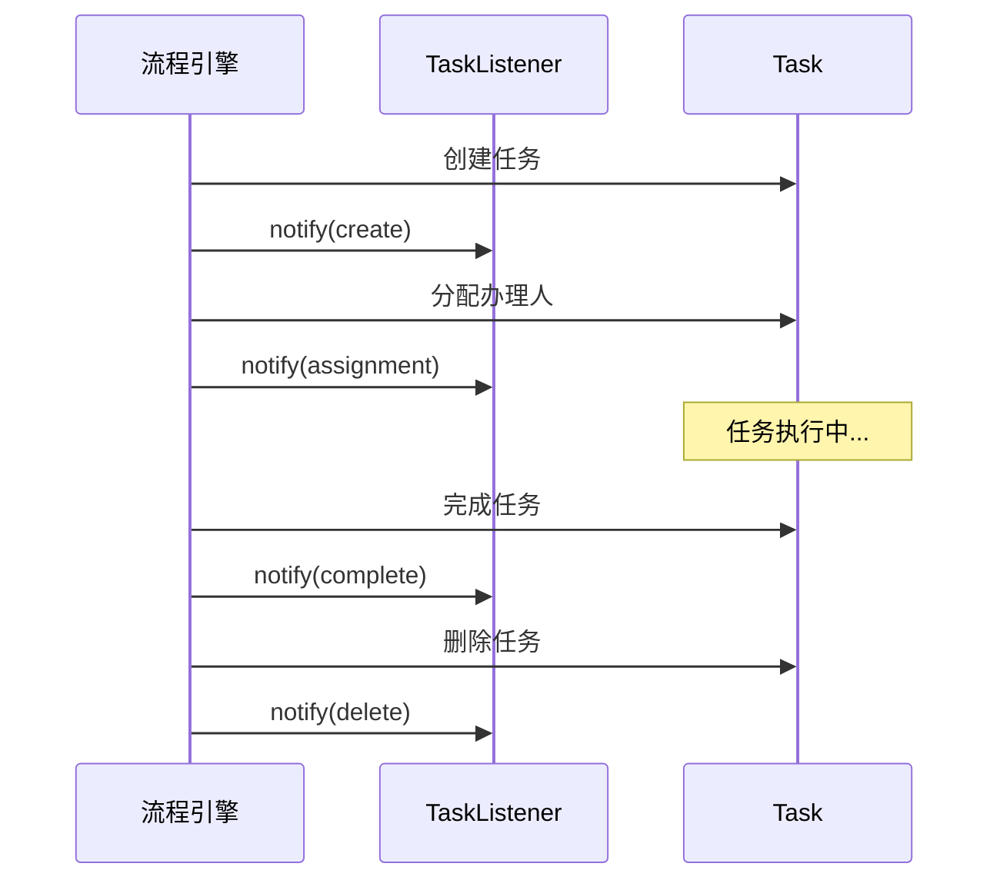
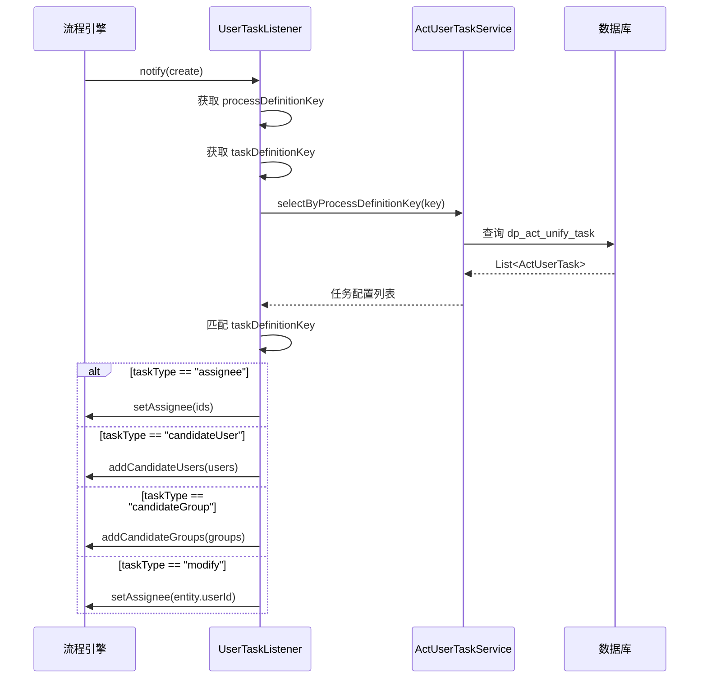

# 监听器

> 本文档说明 PMS-activiti 模块的监听器机制，包括任务监听器（TaskListener）和执行监听器（ExecutionListener）的实现与触发机制。
> 监听器位于 `com.dp.plat.activiti.process.listener` 包

---

## 1. 监听器概述

Activiti 提供两类监听器，用于在流程执行的关键节点触发自定义逻辑：

| 监听器类型 | 接口 | 触发对象 | 用途 |
|------------|------|----------|------|
| 任务监听器 | `TaskListener` | 用户任务 | 任务创建/完成/签收时触发 |
| 执行监听器 | `ExecutionListener` | 活动节点/连线 | 节点开始/结束、连线流转时触发 |

---

## 2. 任务监听器事件

### 2.1 事件类型

`TaskListener` 接口定义了以下事件常量：

| 事件常量 | 值 | 触发时机 |
|----------|----|----------|
| `EVENTNAME_CREATE` | `create` | 任务创建时 |
| `EVENTNAME_ASSIGNMENT` | `assignment` | 任务分配办理人时 |
| `EVENTNAME_COMPLETE` | `complete` | 任务完成时 |
| `EVENTNAME_DELETE` | `delete` | 任务删除时 |

### 2.2 事件触发顺序



---

## 3. UserTaskListener — 用户任务监听器

### 3.1 类信息

- **类名**：`com.dp.plat.activiti.process.listener.UserTaskListener`
- **注解**：`@Component("userTaskListener")`
- **实现接口**：`TaskListener`
- **职责**：动态用户任务分配

### 3.2 触发机制

`UserTaskListener` 在任务创建时被触发，根据 `dp_act_unify_task` 表的配置动态分配办理人：



### 3.3 实现代码

```java
@Component("userTaskListener")
public class UserTaskListener implements TaskListener {
    private static final long serialVersionUID = 2190559253653576032L;
    private static final Logger logger = Logger.getLogger(UserTaskListener.class);
    
    @Autowired
    protected RepositoryService repositoryService;
    
    @Autowired
    private IActUserTaskService actUserTaskService;
    
    @Override
    public void notify(DelegateTask delegateTask) {
        String processDefinitionId = delegateTask.getProcessDefinitionId();
        ProcessDefinition processDefinition = repositoryService.createProcessDefinitionQuery()
            .processDefinitionId(processDefinitionId).singleResult();
        String processDefinitionKey = processDefinition.getKey();
        String taskDefinitionKey = delegateTask.getTaskDefinitionKey();
        
        try {
            List<ActUserTask> taskList = actUserTaskService
                .selectByProcessDefinitionKey(processDefinitionKey);
            for (ActUserTask userTask : taskList) {
                String taskKey = userTask.getTaskDefKey();
                String taskType = userTask.getTaskType();
                String ids = userTask.getCandidateIds();
                
                if (taskDefinitionKey.equals(taskKey)) {
                    switch (taskType) {
                        case "assignee":
                            delegateTask.setAssignee(ids);
                            break;
                        case "candidateUser":
                            String[] userIds = ids.split(",");
                            List<String> users = new ArrayList<>();
                            for (String user : userIds) {
                                if (StringUtils.isNoneBlank(user)) {
                                    users.add(user);
                                }
                            }
                            if (users.size() == 1) {
                                delegateTask.setAssignee(users.get(0));
                            } else {
                                delegateTask.addCandidateUsers(users);
                            }
                            break;
                        case "candidateGroup":
                            String[] groupIds = ids.split(",");
                            List<String> groups = new ArrayList<>();
                            for (int i = 0; i < groupIds.length; i++) {
                                groups.add(groupIds[i]);
                            }
                            delegateTask.addCandidateGroups(groups);
                            break;
                        case "modify":
                            BaseVO entity = delegateTask.getVariable("entity", BaseVO.class);
                            String userId = entity.getUserId().toString();
                            delegateTask.setAssignee(userId);
                            break;
                    }
                }
            }
        } catch (Exception e) {
            e.printStackTrace();
        }
    }
}
```

### 3.4 分配类型说明

| taskType | 分配方式 | 说明 |
|----------|----------|------|
| `assignee` | 指定办理人 | `candidateIds` 字段为用户 ID |
| `candidateUser` | 候选人 | `candidateIds` 字段为逗号分隔的用户 ID 列表 |
| `candidateGroup` | 候选组 | `candidateIds` 字段为逗号分隔的组 ID 列表 |
| `modify` | 申请人修改 | 从流程变量 `entity` 获取 `userId` 作为办理人 |

### 3.5 候选人特殊处理

当 `candidateUser` 类型只有一个用户时，直接设为 `assignee`（办理人），而非候选人：

```java
if (users.size() == 1) {
    delegateTask.setAssignee(users.get(0));  // 直接设为办理人
} else {
    delegateTask.addCandidateUsers(users);   // 设为候选人
}
```

### 3.6 在 BPMN 中的配置

`UserTaskListener` 通过 `delegateExpression` 在 BPMN 中引用：

```xml
<userTask id="usertask1" name="用户任务1">
    <extensionElements>
        <activiti:taskListener event="create" 
            delegateExpression="${userTaskListener}"/>
    </extensionElements>
</userTask>
```

### 3.7 动态流程中的配置

在 `ProcessService.addProcessByDynamic()` 创建动态流程时，也配置了该监听器：

```java
protected static UserTask createUserTask(String id, String name) {
    List<ActivitiListener> taskListeners = new ArrayList<>();
    ActivitiListener listener = new ActivitiListener();
    listener.setEvent("create");
    listener.setImplementationType("delegateExpression");
    listener.setImplementation("${userTaskListener}");
    taskListeners.add(listener);
    
    UserTask userTask = new UserTask();
    userTask.setId(id);
    userTask.setName(name);
    userTask.setTaskListeners(taskListeners);
    return userTask;
}
```

---

## 4. AfterModifyApplyProcessor — 修改申请后处理器

### 4.1 类信息

- **类名**：`com.dp.plat.activiti.process.listener.AfterModifyApplyProcessor`
- **注解**：`@Component("afterModifyApplyProcessor")`
- **实现接口**：`TaskListener`
- **职责**：薪资调整申请修改后的处理（当前代码已注释）

### 4.2 实现代码

```java
@Component("afterModifyApplyProcessor")
public class AfterModifyApplyProcessor implements TaskListener {
    private static final long serialVersionUID = 5975676580192909075L;
    private static final Logger logger = Logger.getLogger(AfterModifyApplyProcessor.class);
    
    private Expression businessKey;
    
    public void setBusinessKey(Expression businessKey) {
        this.businessKey = businessKey;
    }
    
    @Override
    public void notify(DelegateTask delegateTask) {
        // 当前实现已注释，原逻辑为：
        // 1. 获取 businessKey（薪资 ID）
        // 2. 查询薪资记录
        // 3. 更新薪资信息
        // 4. 记录日志
    }
}
```

### 4.3 设计意图

该监听器设计用于薪资调整流程，在申请人修改申请后触发，将修改内容同步到业务表。当前代码已注释，保留作为示例。

---

## 5. 执行监听器（业务模块）

### 5.1 流程结束监听器

PMS 系统的流程结束监听器位于 `com.dp.plat.taskHandler` 包（PMS-struts 模块），通过 `class` 属性配置在 BPMN 中：

| 监听器类 | 触发节点 | 事件 | 说明 |
|----------|----------|------|------|
| `CallBackTaskHandler` | CallBack.endevent2 | End | 回访流程结束回调 |
| `ProjectCloseTaskHandler` | PmClosedLoop.endevent1 | end | 闭环流程结束回调 |
| `PresalesClosedTaskHandler` | Presales.endevent1 | take | 售前闭环回调 |
| `PresalesClose20TaskHandler` | Presales.直接闭环连线 | take | 售前直接闭环回调 |

### 5.2 BPMN 配置示例

```xml
<!-- 结束节点监听器 -->
<endEvent id="endevent2" name="End">
    <extensionElements>
        <activiti:executionListener event="End" 
            class="com.dp.plat.taskHandler.CallBackTaskHandler"/>
    </extensionElements>
</endEvent>

<!-- 连线监听器 -->
<sequenceFlow id="flow6" name="回访通过" 
    sourceRef="exclusivegateway2" targetRef="endevent2">
    <extensionElements>
        <activiti:executionListener event="start" 
            class="com.dp.plat.taskHandler.CallBackTaskHandler"/>
    </extensionElements>
    <conditionExpression xsi:type="tFormalExpression">
        <![CDATA[${result==1}]]>
    </conditionExpression>
</sequenceFlow>
```

### 5.3 监听器事件

| 事件 | 触发时机 | 适用对象 |
|------|----------|----------|
| `start` | 节点/连线开始时 | 活动节点、连线 |
| `end` | 节点结束时 | 活动节点 |
| `take` | 连线流转时 | 连线 |

---

## 6. 监听器配置方式

### 6.1 三种配置方式

| 方式 | 属性 | 示例 | 说明 |
|------|------|------|------|
| `class` | `implementationType` | `class="com.dp.plat.taskHandler.CallBackTaskHandler"` | 直接指定类，每次创建新实例 |
| `expression` | `implementationType` | `expression="${myBean.method()}"` | 调用 Bean 方法 |
| `delegateExpression` | `implementationType` | `delegateExpression="${userTaskListener}"` | 从 Spring 容器获取 Bean |

### 6.2 PMS-activiti 的选择

- **`UserTaskListener`**：使用 `delegateExpression`，从 Spring 容器获取，支持 `@Autowired` 注入
- **业务监听器**：使用 `class`，每次创建新实例，无法注入依赖

---

## 7. ActUserTask 配置表

### 7.1 表结构

`UserTaskListener` 通过 `ActUserTaskMapper` 访问统一任务表。⚠️ **表名差异**：源码 SQL 使用 `t_act_user_task`，数据库实际表名为 `dp_act_unify_task`（详见 [unify-task-table.md](../03-database/unify-task-table.md)）：

| 字段 | 类型 | 说明 |
|------|------|------|
| `id` | Integer | 主键 |
| `proc_def_key` | String | 流程定义 Key |
| `proc_def_name` | String | 流程定义名称 |
| `task_def_key` | String | 任务定义 Key |
| `task_name` | String | 任务名称 |
| `task_type` | String | 分配类型（assignee/candidateUser/candidateGroup/modify） |
| `candidate_name` | String | 候选人名称（显示用） |
| `candidate_ids` | String | 候选人 ID 列表（逗号分隔） |

### 7.2 配置示例

| proc_def_key | task_def_key | task_type | candidate_ids | 说明 |
|--------------|--------------|-----------|---------------|------|
| CallBack | usertask1 | assignee | 1001 | 项目经理（ID=1001） |
| CallBack | usertask2 | candidateUser | 1002,1003 | 回访人员候选人 |
| PmClosedLoop | usertask4 | candidateGroup | em_role | 工程管理组 |
| Presales | usertask1 | modify | - | 申请人修改 |

---

## 8. 相关文档

- [任务管理](task-management.md) — 任务分配与办理
- [BPMN 流程定义详解](bpmn-processes.md) — 各流程的监听器配置
- [自定义命令](custom-commands.md) — 命令模式
- [../03-database/unify-task-table.md](../03-database/unify-task-table.md) — 统一任务表设计
- [../05-standards/coding-standards.md](../05-standards/coding-standards.md) — 监听器规范
