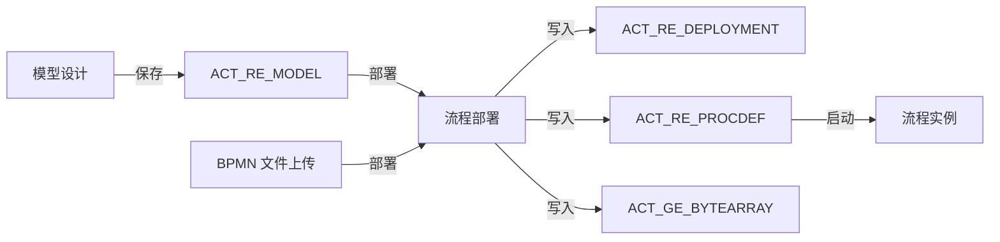
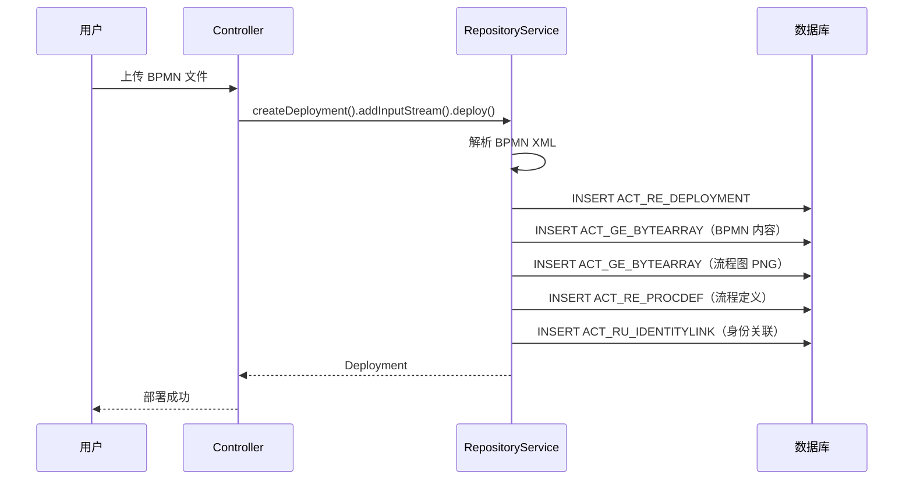

# 流程定义管理

> 本文档说明 PMS-activiti 模块的流程定义管理功能，包括模型管理（ModelController）、流程定义管理（ProcessDefinitionController）与流程部署机制。

---

## 1. 功能概述

流程定义管理是工作流引擎的核心功能，负责管理从模型设计到流程部署的完整生命周期：



---

## 2. ModelController — 模型管理

### 2.1 类信息

- **类名**：`com.dp.plat.activiti.controller.ModelController`
- **注解**：`@Controller`、`@RequestMapping(Consts.URLPath.WORKFLOW_MANAGER + "model")`
- **依赖**：`RepositoryService`、`RuntimeService`、`TaskService`、`ManagementService`

### 2.2 方法列表

| 方法 | URL | HTTP 方法 | 功能 | 返回值 |
|------|-----|-----------|------|--------|
| `toListModel()` | `/model` | GET | 跳转模型列表页 | `workflow/model_list` |
| `findAll()` | `/model/list` | GET | 查询模型列表（分页） | `workflow/model_list` |
| `findOne()` | `/{modelId}` | GET | 跳转模型编辑器 | `redirect:/modeler.html` |
| `toCreateModel()` | `/create` | GET | 跳转创建模型页面 | `workflow/add_model` |
| `create()` | `/create` | POST | 创建模型 | 重定向到编辑器 |
| `deploy()` | `/{modelId}` | PATCH | 部署模型为流程定义 | `workflow/model_list` |
| `delete()` | `/{modelId}` | DELETE | 删除模型 | `workflow/model_list` |

### 2.3 创建模型

创建模型时初始化一个空的画布 JSON，并保存到 `ACT_RE_MODEL` 和 `ACT_GE_BYTEARRAY`：

```java
@RequestMapping(value = "create", method = RequestMethod.POST)
public void create(@RequestParam("name") String name, 
                   @RequestParam("key") String key,
                   @RequestParam("description") String description, 
                   HttpServletRequest request, HttpServletResponse response) {
    // 1. 创建画布 JSON
    ObjectNode editorNode = objectMapper.createObjectNode();
    editorNode.put("id", "canvas");
    editorNode.put("resourceId", "canvas");
    ObjectNode stencilSetNode = objectMapper.createObjectNode();
    stencilSetNode.put("namespace", "http://b3mn.org/stencilset/bpmn2.0#");
    editorNode.put("stencilset", stencilSetNode);
    
    // 2. 创建模型元数据
    Model modelData = repositoryService.newModel();
    ObjectNode modelObjectNode = objectMapper.createObjectNode();
    modelObjectNode.put(ModelDataJsonConstants.MODEL_NAME, name);
    modelObjectNode.put(ModelDataJsonConstants.MODEL_REVISION, 1);
    modelObjectNode.put(ModelDataJsonConstants.MODEL_DESCRIPTION, description);
    modelData.setMetaInfo(modelObjectNode.toString());
    modelData.setName(name);
    modelData.setKey(StringUtils.defaultString(key));
    
    // 3. 保存模型和编辑器源数据
    repositoryService.saveModel(modelData);
    repositoryService.addModelEditorSource(modelData.getId(), 
        editorNode.toString().getBytes("utf-8"));
    
    // 4. 重定向到流程设计器
    response.sendRedirect(request.getContextPath() + 
        "/modeler.html?modelId=" + modelData.getId());
}
```

### 2.4 部署模型

将模型 JSON 转换为 BPMN XML 并部署：

```java
@RequestMapping(value = "{modelId}", method = RequestMethod.PATCH)
public String deploy(@PathVariable("modelId") String modelId, 
                     org.springframework.ui.Model modelUi) {
    Model modelData = repositoryService.getModel(modelId);
    ObjectNode modelNode = (ObjectNode) new ObjectMapper()
        .readTree(repositoryService.getModelEditorSource(modelData.getId()));
    
    // 使用自定义 BpmnJsonConverter 转换为 BpmnModel
    BpmnModel model = new com.dp.plat.activiti.converter.BpmnJsonConverter()
        .convertToBpmnModel(modelNode);
    // 转换为 XML
    byte[] bpmnBytes = new BpmnXMLConverter().convertToXML(model);
    
    // 部署
    String processName = modelData.getName() + ".bpmn20.xml";
    Deployment deployment = repositoryService.createDeployment()
        .name(modelData.getName())
        .addString(processName, new String(bpmnBytes))
        .deploy();
}
```

---

## 3. ProcessDefinitionController — 流程定义管理

### 3.1 类信息

- **类名**：`com.dp.plat.activiti.controller.ProcessDefinitionController`
- **注解**：`@Controller`、`@RequestMapping(Consts.URLPath.WORKFLOW_MANAGER + "definition")`
- **依赖**：`RepositoryService`、`IProcessService`

### 3.2 方法列表

| 方法 | URL | HTTP 方法 | 功能 | 返回值 |
|------|-----|-----------|------|--------|
| `list()` | `/definition` | GET | 跳转流程定义列表页 | `workflow/process_list` |
| `listProcess()` | `/definition/list` | GET | 查询流程定义列表（分页） | `workflow/process_list` |
| `deploy()` | `/definition/deploy` | POST | 上传 BPMN/ZIP 文件部署 | void（JSON） |
| `delete()` | `/definition/{deploymentId}` | DELETE | 删除部署（级联） | void（JSON） |
| `convertToModel()` | `/definition/model/{processDefinitionId}` | GET | 流程定义转换为模型 | void（JSON） |
| `loadByDeployment()` | `/definition/{resourceType}/{processDefinitionId}` | GET | 加载流程图/XML | void（流） |
| `updateProcessStatusByProDefinitionId()` | `/definition/{status}/{processDefinitionId}` | POST | 激活/挂起流程定义 | void（JSON） |

### 3.3 部署流程定义

支持上传 BPMN 文件或 ZIP 压缩包部署：

```java
@RequestMapping(value = "/deploy")
public void deploy(@RequestParam(value = "deployFile", required = false) 
                   MultipartFile file, HttpServletRequest httpRequest, Model model) {
    String fileName = file.getOriginalFilename();
    InputStream fileInputStream = file.getInputStream();
    Deployment deployment = null;
    
    String extension = FilenameUtils.getExtension(fileName);
    if (extension.equals("zip") || extension.equals("bar")) {
        // ZIP 压缩包部署
        ZipInputStream zip = new ZipInputStream(fileInputStream);
        deployment = repositoryService.createDeployment()
            .name(fileName).addZipInputStream(zip).deploy();
    } else {
        // BPMN 文件部署
        deployment = repositoryService.createDeployment()
            .addInputStream(fileName, fileInputStream).deploy();
    }
}
```

### 3.4 删除部署

级联删除部署及其关联的流程实例：

```java
@RequestMapping(value = "/{deploymentId}", method = RequestMethod.DELETE)
public void delete(@PathVariable("deploymentId") String deploymentId, Model model) {
    // 第二个参数 true 表示级联删除流程实例
    this.repositoryService.deleteDeployment(deploymentId, true);
}
```

**级联删除范围**：

| 数据 | 是否删除（cascade=true） | 是否删除（cascade=false） |
|------|------------------------|-------------------------|
| 流程定义（`ACT_RE_PROCDEF`） | ✓ | ✓ |
| 部署信息（`ACT_RE_DEPLOYMENT`） | ✓ | ✓ |
| 流程资源（`ACT_GE_BYTEARRAY`） | ✓ | ✓ |
| 身份关联（`ACT_RU_IDENTITYLINK`） | ✓ | ✓ |
| 运行时流程实例（`ACT_RU_EXECUTION`） | ✓ | ✗（有实例时删除失败） |
| 运行时任务（`ACT_RU_TASK`） | ✓ | ✗ |
| 历史数据（`ACT_HI_*`） | ✓ | ✗ |

### 3.5 流程定义转换为模型

将已部署的流程定义反向转换为可编辑的模型：

```java
@RequestMapping(value = "/model/{processDefinitionId}")
public void convertToModel(@PathVariable("processDefinitionId") String processDefinitionId, 
                           Model model) {
    // 1. 获取流程定义
    ProcessDefinition processDefinition = repositoryService.createProcessDefinitionQuery()
        .processDefinitionId(processDefinitionId).singleResult();
    
    // 2. 读取 BPMN XML 并转换为 BpmnModel
    InputStream bpmnStream = repositoryService.getResourceAsStream(
        processDefinition.getDeploymentId(), processDefinition.getResourceName());
    XMLStreamReader xtr = XMLInputFactory.newInstance().createXMLStreamReader(in);
    BpmnModel bpmnModel = new BpmnXMLConverter().convertToBpmnModel(xtr);
    
    // 3. 转换为 JSON
    BpmnJsonConverter converter = new BpmnJsonConverter();
    ObjectNode modelNode = converter.convertToJson(bpmnModel);
    
    // 4. 保存为模型
    Model modelData = repositoryService.newModel();
    modelData.setKey(processDefinition.getKey());
    modelData.setName(processDefinition.getName());
    repositoryService.saveModel(modelData);
    repositoryService.addModelEditorSource(modelData.getId(), 
        modelNode.toString().getBytes("utf-8"));
}
```

### 3.6 激活/挂起流程定义

```java
@RequestMapping(value = "/{status}/{processDefinitionId}", method = RequestMethod.POST)
public void updateProcessStatusByProDefinitionId(
    @PathVariable("status") String status,
    @PathVariable("processDefinitionId") String processDefinitionId, Model model) {
    if (status.equals("active")) {
        repositoryService.activateProcessDefinitionById(processDefinitionId, true, null);
    } else if (status.equals("suspend")) {
        repositoryService.suspendProcessDefinitionById(processDefinitionId, true, null);
    }
}
```

**挂起状态影响**：
- 挂起后无法启动新的流程实例
- 挂起后已运行的流程实例也会被挂起（`cascade=true`）
- 挂起的流程实例无法完成任务

---

## 4. 流程部署机制

### 4.1 部署流程



### 4.2 流程定义版本管理

每次部署相同 Key 的流程定义，版本号自动递增：

```sql
-- 查询流程定义及其版本
SELECT KEY_, NAME_, VERSION_, DEPLOYMENT_ID_ 
FROM ACT_RE_PROCDEF 
WHERE KEY_ = 'CallBack' 
ORDER BY VERSION_ DESC;
```

| KEY_ | NAME_ | VERSION_ | DEPLOYMENT_ID_ |
|------|-------|----------|----------------|
| CallBack | 回访流程 | 3 | 5007 |
| CallBack | 回访流程 | 2 | 5005 |
| CallBack | 回访流程 | 1 | 5003 |

### 4.3 流程定义 ID 格式

流程定义 ID 格式为 `{key}:{version}:{deploymentId}`，例如：
- `CallBack:1:5003`
- `CallBack:2:5005`
- `CallBack:3:5007`

---

## 5. 流程定义查询

### 5.1 查询所有流程定义

```java
ProcessDefinitionQuery query = repositoryService.createProcessDefinitionQuery()
    .orderByDeploymentId().desc();
List<ProcessDefinition> list = query.listPage(start, pageSize);
```

### 5.2 查询最新版本流程定义

```java
ProcessDefinition definition = repositoryService.createProcessDefinitionQuery()
    .processDefinitionKey("CallBack")
    .latestVersion()
    .singleResult();
```

### 5.3 按部署 ID 查询

```java
List<ProcessDefinition> list = repositoryService.createProcessDefinitionQuery()
    .deploymentId(deploymentId)
    .list();
```

---

## 6. 流程资源管理

### 6.1 资源类型

每次部署会生成两类资源：

| 资源类型 | 文件 | 说明 |
|----------|------|------|
| BPMN XML | `{name}.bpmn20.xml` | 流程定义 XML |
| 流程图 | `{name}.{name}.png` | 流程图图片 |

### 6.2 读取资源

```java
// 读取 BPMN XML
InputStream xmlStream = repositoryService.getResourceAsStream(
    deploymentId, processDefinition.getResourceName());

// 读取流程图 PNG
InputStream pngStream = repositoryService.getResourceAsStream(
    deploymentId, processDefinition.getDiagramResourceName());
```

---

## 7. 相关文档

- [任务管理](task-management.md) — 任务查询与审批
- [流程实例管理](process-instance-management.md) — 流程实例启动与终止
- [BPMN 流程定义详解](bpmn-processes.md) — 各业务流程节点说明
- [../01-architecture/bpmn-designer.md](../01-architecture/bpmn-designer.md) — 流程设计器
- [controller-methods-reference.md](controller-methods-reference.md) — Controller 方法参考
