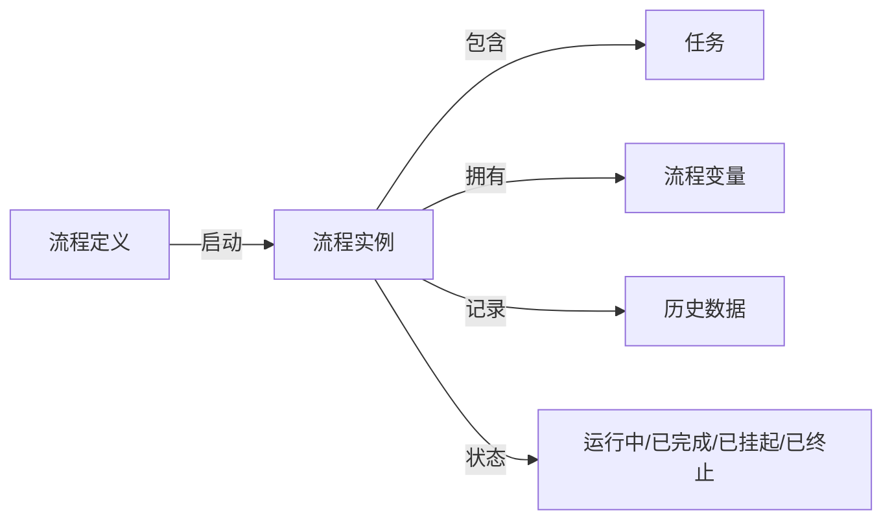
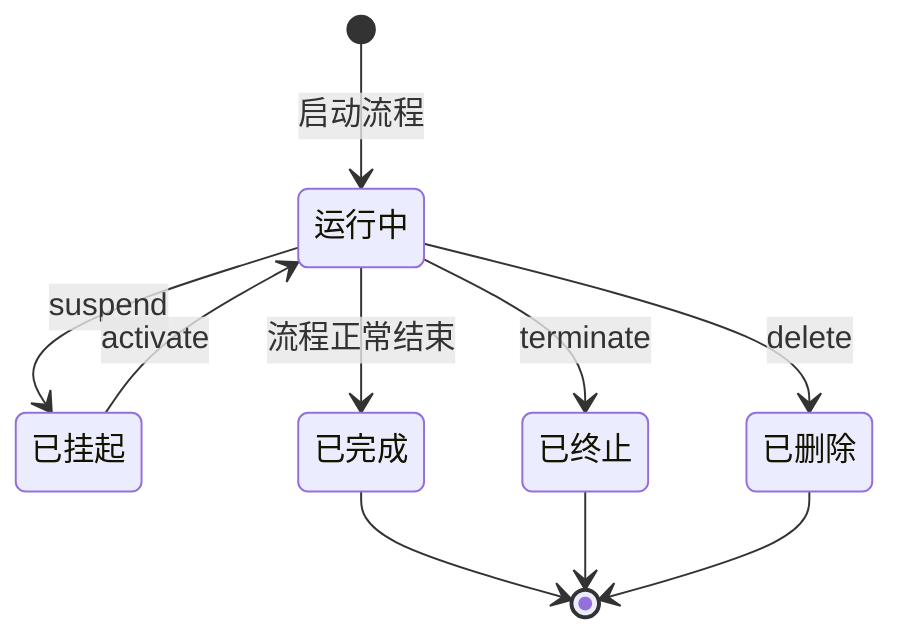

# 流程实例管理

> 本文档说明 PMS-activiti 模块的流程实例管理功能，包括流程实例查询、激活/挂起、删除、终止与流程图展示。
> 核心类：`ProcessInstanceController`、`ProcessService`

---

## 1. 功能概述

流程实例是流程定义的运行实例，每个流程实例对应一次具体的业务审批过程：



---

## 2. ProcessInstanceController — 流程实例控制器

### 2.1 类信息

- **类名**：`com.dp.plat.activiti.controller.ProcessInstanceController`
- **注解**：`@Controller`、`@RequestMapping(Consts.URLPath.WORKFLOW_MANAGER + "instance")`
- **依赖**：`IUserService`、`IProcessService`、`RepositoryService`、`HistoryService`、`IdentityService`、`IRuntimePageService`

### 2.2 方法列表

| 方法 | URL | HTTP 方法 | 功能 | 返回值 |
|------|-----|-----------|------|--------|
| `list()` | `/instance` | GET | 跳转运行中流程列表页 | `workflow/running_process_list` |
| `showDiagram()` | `/instance/diagram/{processInstanceId}` | GET | 显示流程图（带跟踪） | void（图片流） |
| `loadByProcessInstance()` | `/instance/{resourceType}/{processInstanceId}` | GET | 加载流程图/XML（不带跟踪） | void（流） |
| `showInfo()` | `/instance/info/{processInstanceId}/list` | POST | 显示流程明细 | void（JSON） |
| `toListProcessRunning()` | `/instance/toListProcessManager` | GET | 跳转流程管理页面 | `workflow/list_process_manager` |
| `listRuningProcess()` | `/instance/runningProcess` | GET | 查询运行中流程 | `workflow/running_process_list` |
| `findFinishedProcessInstances()` | `/instance/finishedProcess` | GET | 查询已结束流程 | `workflow/process/finishedProcess` |
| `updateProcessStatusByProInstanceId()` | `/instance/{status}/{processInstanceId}` | POST | 激活/挂起流程实例 | void（JSON） |
| `deleteProcessByProInstanceId()` | `/instance/delete/{processInstanceId}` | POST | 删除流程实例 | void（JSON） |
| `toListApply()` | `/instance/toListApply` | GET | 跳转申请列表 | `apply/list_apply` |

---

## 3. 运行中流程查询

### 3.1 查询逻辑

`listRuningProcess()` 使用原生 SQL 查询运行中的流程实例：

```java
@RequestMapping(value = "/runningProcess")
public String listRuningProcess(PageParam<ProcessInstanceEntity> pageParam, Model model) throws Exception {
    List<ProcessInstance> list = this.processService.listRuningProcess(pageParam);
    // ... 组装 ProcessInstanceEntity
}
```

### 3.2 原生 SQL 查询

`ProcessService.listRuningProcess()` 使用原生 SQL 关联查询：

```sql
SELECT DISTINCT 
    CASE WHEN RES.`ACT_ID_` IS NULL THEN RES2.`ACT_ID_` ELSE RES.`ACT_ID_` END AS ACT_ID_,
    RES.*, 
    P.KEY_ AS ProcessDefinitionKey, 
    P.ID_ AS ProcessDefinitionId, 
    P.NAME_ AS ProcessDefinitionName,
    P.VERSION_ AS ProcessDefinitionVersion, 
    P.DEPLOYMENT_ID_ AS DeploymentId 
FROM ACT_RU_EXECUTION RES 
INNER JOIN ACT_RE_PROCDEF P ON RES.PROC_DEF_ID_ = P.ID_ 
LEFT JOIN `act_ru_execution` RES2 
    ON res.`PROC_INST_ID_` = res2.`PROC_INST_ID_` 
    AND res.`ID_` = res2.`PARENT_ID_` 
WHERE RES.PARENT_ID_ IS NULL 
ORDER BY RES.ID_ DESC
```

**SQL 说明**：
- `ACT_RU_EXECUTION`：运行时执行表，`PARENT_ID_ IS NULL` 表示流程实例（根执行）
- `ACT_RE_PROCDEF`：流程定义表，关联获取流程定义信息
- `LEFT JOIN act_ru_execution RES2`：处理子流程的活动节点

### 3.3 返回数据结构

| 字段 | 说明 |
|------|------|
| `id` | 执行 ID |
| `processInstanceId` | 流程实例 ID |
| `processInstanceName` | 流程实例名称 |
| `processDefinitionId` | 流程定义 ID |
| `processDefinitionName` | 流程定义名称 |
| `activityId` | 当前活动节点 ID |
| `taskName` | 当前任务名称 |
| `deploymentId` | 部署 ID |
| `suspended` | 是否挂起 |
| `startUserName` | 启动人名称 |

---

## 4. 流程图展示

### 4.1 带流程跟踪的流程图

`showDiagram()` 方法生成带高亮的流程图：

```java
@RequestMapping(value = "/diagram/{processInstanceId}", method = RequestMethod.GET)
public void showDiagram(@PathVariable("processInstanceId") String processInstanceId, 
                        HttpServletResponse response) throws Exception {
    String[] processInstanceIds = StringUtils.split(processInstanceId, ",");
    for (String procInstId : processInstanceIds) {
        InputStream imageStream = this.processService.getDiagram(procInstId);
        byte[] b = new byte[1024];
        int len;
        while ((len = imageStream.read(b, 0, 1024)) != -1) {
            response.getOutputStream().write(b, 0, len);
        }
    }
}
```

### 4.2 流程图生成逻辑

`ProcessService.getDiagram()` 的生成逻辑：

```java
public InputStream getDiagram(String processInstanceId) {
    // 1. 查询流程实例
    ProcessInstance processInstance = runtimeService.createProcessInstanceQuery()
        .processInstanceId(processInstanceId).singleResult();
    
    // 2. 获取流程定义 ID
    String procDefId = processInstance != null ? 
        processInstance.getProcessDefinitionId() : "";
    if (StringUtils.isBlank(procDefId)) {
        // 流程已结束，从历史表获取
        HistoricProcessInstance hpi = historyService.createHistoricProcessInstanceQuery()
            .processInstanceId(processInstanceId).singleResult();
        procDefId = hpi.getProcessDefinitionId();
    }
    
    // 3. 获取 BpmnModel 和流程定义
    BpmnModel bpmnModel = repositoryService.getBpmnModel(procDefId);
    ProcessDefinitionEntity processDefinition = (ProcessDefinitionEntity) 
        repositoryService.getProcessDefinition(procDefId);
    
    // 4. 获取高亮节点和连线
    List<String> highLightedActivities = runtimeService.getActiveActivityIds(processInstanceId);
    List<String> highLightedFlows = getHighLightedFlows(processInstanceId, processDefinition);
    
    // 5. 生成流程图
    ProcessDiagramGenerator diagramGenerator = processEngineConfiguration.getProcessDiagramGenerator();
    InputStream imageStream = diagramGenerator.generateDiagram(
        bpmnModel, "png", highLightedActivities, highLightedFlows,
        activityFontName, labelFontName, annotationFontName,
        this.getClass().getClassLoader(), 1.0);
    
    return imageStream;
}
```

### 4.3 高亮连线计算

`getHighLightedFlows()` 方法计算已走过的连线：

```java
private List<String> getHighLightedFlows(String processInstanceId, 
                                         ProcessDefinitionEntity processDefinition) {
    List<String> highLightedFlows = new ArrayList<>();
    // 查询历史活动（按开始时间升序）
    List<HistoricActivityInstance> historicActivityInstances = historyService
        .createHistoricActivityInstanceQuery()
        .processInstanceId(processInstanceId)
        .orderByHistoricActivityInstanceStartTime().asc().list();
    
    // 构建活动 ID 列表
    List<String> activityList = new ArrayList<>();
    for (HistoricActivityInstance hai : historicActivityInstances) {
        activityList.add(hai.getActivityId());
    }
    // 加上当前活动
    activityList.addAll(runtimeService.getActiveActivityIds(processInstanceId));
    
    // 找出已走过的连线
    for (ActivityImpl activity : processDefinition.getActivities()) {
        int index = activityList.indexOf(activity.getId());
        if (index >= 0 && index + 1 < activityList.size()) {
            for (PvmTransition transition : activity.getOutgoingTransitions()) {
                if (transition.getDestination().getId().equals(activityList.get(index + 1))) {
                    highLightedFlows.add(transition.getId());
                }
            }
        }
    }
    return highLightedFlows;
}
```

### 4.4 不带跟踪的流程图

```java
public InputStream getDiagramByProInstanceId_noTrace(String resourceType, String processInstanceId) {
    ProcessInstance processInstance = runtimeService.createProcessInstanceQuery()
        .processInstanceId(processInstanceId).singleResult();
    ProcessDefinition processDefinition = repositoryService.createProcessDefinitionQuery()
        .processDefinitionId(processInstance.getProcessDefinitionId()).singleResult();
    
    String resourceName = "image".equals(resourceType) ? 
        processDefinition.getDiagramResourceName() : 
        processDefinition.getResourceName();
    
    return repositoryService.getResourceAsStream(
        processDefinition.getDeploymentId(), resourceName);
}
```

---

## 5. 流程明细

### 5.1 查询流程明细

`showInfo()` 方法查询流程的审批明细：

```java
@RequestMapping(value = "/info/{processInstanceId}/list", method = RequestMethod.POST)
public void showInfo(@PathVariable("processInstanceId") String processInstanceId, Model model) {
    String[] processInstanceIds = StringUtils.split(processInstanceId, ",");
    List<ActivityVo> list;
    if (processInstanceIds.length > 1) {
        list = runtimePageService.getActivityList(new HashSet<>(Arrays.asList(processInstanceIds)));
    } else {
        list = runtimePageService.getActivityList(processInstanceId);
    }
    model.addAttribute("data", list);
}
```

### 5.2 ActivityVo 数据结构

`ActivityVo` 包含每个节点的审批信息：

| 字段 | 说明 |
|------|------|
| `id` | 活动 ID |
| `activityId` | 活动节点 ID |
| `activityName` | 活动名称 |
| `activityType` | 活动类型（userTask/startEvent） |
| `assignee` | 办理人 ID |
| `assigneeName` | 办理人名称 |
| `startTime` | 开始时间 |
| `endTime` | 结束时间 |
| `duration` | 持续时间 |
| `activityState` | 节点状态（0=已执行/1=执行中/2=未执行/terminate=终止） |
| `approved` | 审批结果 |
| `suggestion` | 审批意见 |

---

## 6. 流程实例状态管理

### 6.1 激活/挂起

```java
@RequestMapping(value = "/{status}/{processInstanceId}", method = RequestMethod.POST)
public void updateProcessStatusByProInstanceId(
    @PathVariable("status") String status,
    @PathVariable("processInstanceId") String processInstanceId, Model model) {
    if (status.equals("active")) {
        this.processService.activateProcessInstance(processInstanceId);
    } else if (status.equals("suspend")) {
        this.processService.suspendProcessInstance(processInstanceId);
    }
}
```

### 6.2 挂起的影响

| 操作 | 挂起状态 | 是否允许 |
|------|----------|----------|
| 完成任务 | 挂起 | ✗ |
| 签收任务 | 挂起 | ✗ |
| 启动新实例 | 流程定义挂起 | ✗ |
| 查询任务 | 挂起 | ✓ |
| 查看流程图 | 挂起 | ✓ |

### 6.3 删除流程实例

```java
@RequestMapping(value = "/delete/{processInstanceId}", method = RequestMethod.POST)
public void deleteProcessByProInstanceId(@PathVariable("processInstanceId") String processInstanceId, 
                                         String deleteReason, Model model) {
    this.processService.deleteProcess(processInstanceId, deleteReason);
}
```

删除流程实例会：
- 删除运行时数据（`ACT_RU_*`）
- 更新历史数据（`ACT_HI_PROCINST.DELETE_REASON_`）
- 不会删除历史数据

---

## 7. 流程实例终止

### 7.1 终止机制

`ProcessService.terminateProcess()` 通过跳转到结束节点实现终止：

```java
public void terminateProcess(String processInstanceId, String terminateReason) {
    Task task = taskService.createTaskQuery().processInstanceId(processInstanceId).singleResult();
    if (null != task) {
        TaskServiceImpl taskServiceImpl = (TaskServiceImpl) taskService;
        // 查找结束节点
        List<ActivityImpl> activityImpls = getAllActivities(task.getProcessDefinitionId());
        String eventActivityId = null;
        for (ActivityImpl activity : activityImpls) {
            if ("endEvent".equals(activity.getProperty("type").toString())) {
                eventActivityId = activity.getId();
                break;
            }
        }
        // 跳转到结束节点
        JumpTaskCmdService jumpTaskCmd = new JumpTaskCmdService(
            task.getExecutionId(), eventActivityId, 
            Constants.STATE_TERMINATE, terminateReason);
        Map<String, Object> variables = new HashMap<>();
        variables.put(Constants.APPROVE_RESULT, Constants.STATE_TERMINATE);
        jumpTaskCmd.setVariables(variables);
        taskServiceImpl.getCommandExecutor().execute(jumpTaskCmd);
    }
}
```

### 7.2 终止与删除的区别

| 特性 | 终止（terminate） | 删除（delete） |
|------|------------------|----------------|
| 流程状态 | 正常结束（走到结束节点） | 异常删除 |
| 历史记录 | 保留完整历史 | 保留历史（标记删除原因） |
| 监听器触发 | 触发结束事件监听器 | 不触发 |
| 业务回调 | 触发 | 不触发 |

---

## 8. 流程实例状态流转



---

## 9. 相关文档

- [流程定义管理](process-definition-management.md) — 流程定义与部署
- [任务管理](task-management.md) — 任务查询与审批
- [运行时页面](runtime-page.md) — 流程图展示与明细
- [自定义命令](custom-commands.md) — JumpTaskCmdService 终止命令
- [controller-methods-reference.md](controller-methods-reference.md) — Controller 方法参考
