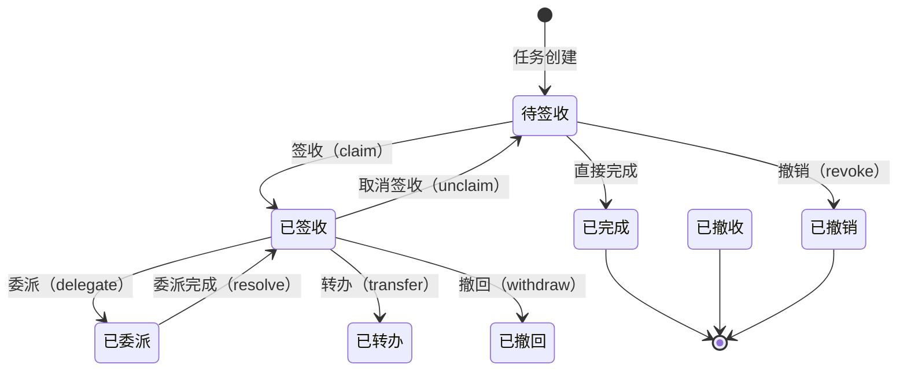

# 任务管理

> 本文档说明 PMS-activiti 模块的任务管理功能，包括任务查询、签收、完成、委派、转办、撤销、撤回与跳转。
> 核心类：`TaskController`、`ProcessService`

---

## 1. 功能概述

任务管理是工作流系统的核心交互功能，覆盖任务从产生到完成的完整生命周期：



---

## 2. TaskController — 任务控制器

### 2.1 类信息

- **类名**：`com.dp.plat.activiti.controller.TaskController`
- **注解**：`@Controller`、`@RequestMapping(URLPath.WORKFLOW_MANAGER + "task")`
- **依赖**：`IUserService`、`IProcessService`、`IdentityService`

### 2.2 方法列表

| 方法 | URL | HTTP 方法 | 功能 | 返回值 |
|------|-----|-----------|------|--------|
| `list()` | `/task` | GET | 跳转任务列表页 | `workflow/task_list` |
| `todoTask()` | `/task/todoTask` | GET | 查询待办任务 | `workflow/todoTask` |
| `findFinishedTaskInstances()` | `/task/endTask` | GET | 查询已完成任务 | `workflow/endTask` |
| `claim()` | `/task/claim/{taskId}` | GET/POST | 签收任务 | void（JSON） |
| `unclaim()` | `/task/unclaim/{taskId}` | GET/POST | 取消签收 | void（JSON） |
| `delegateTask()` | `/task/delegate/{taskId}` | POST | 委派任务 | void（JSON） |
| `transferTask()` | `/task/transfer/{taskId}` | POST | 转办任务 | void（JSON） |
| `revoke()` | `/task/revoke/{processInstanceId}/{taskId}` | GET/POST | 撤销任务 | void（JSON） |
| `jumpTargetTask()` | `/task/jump` | POST | 任务跳转 | void（JSON） |
| `withdrawTask()` | `/task/withdraw/{instanceId}/{userId}` | POST | 撤回任务 | void（JSON） |

---

## 3. 待办任务查询

### 3.1 查询逻辑

`todoTask()` 方法查询当前用户的待办任务：

```java
@RequestMapping(value = "/todoTask")
public String todoTask(PageParam<BaseVO> pageParam, Model model) throws Exception {
    Integer userId = UserContext.getCurrentPrincipal().getUserId();
    User user = new User(userId);
    List<BaseVO> taskList = this.processService.findTodoTask(user, pageParam);
    // ... 组装 JSON 数据
    return Consts.URLPath.WORKFLOW_MANAGER + "todoTask";
}
```

### 3.2 查询规则

`ProcessService.findTodoTask()` 的查询规则：

```java
TaskQuery taskQuery = this.taskService.createTaskQuery().active();
if (UserContext.hasRole(RoleConstant.ROLE_ADMIN)) {
    // 管理员：查询所有活动任务，支持模糊搜索
    if (StringUtils.isNotBlank(page.getFuzzy())) {
        taskQuery = taskQuery.or()
            .taskDescriptionLike("%" + page.getFuzzy() + "%")
            .taskNameLike("%" + page.getFuzzy() + "%")
            .endOr();
    }
} else {
    // 普通用户：查询自己作为候选人或已签收的任务
    taskQuery = taskQuery.taskCandidateOrAssigned(user.getUserId().toString());
}
List<Task> tasks = taskQuery.orderByTaskCreateTime().desc()
    .listPage(page.getStart(), (int) page.getPageSize());
```

### 3.3 查询条件说明

| 角色 | 查询条件 | 说明 |
|------|----------|------|
| 管理员 | `active()` + 模糊搜索 | 查看所有活动任务 |
| 普通用户 | `taskCandidateOrAssigned(userId)` | 查看候选人和已签收任务 |

### 3.4 返回数据结构

每个任务返回以下字段：

| 字段 | 说明 |
|------|------|
| `businessKey` | 业务键 |
| `businessType` | 业务类型 |
| `userName` | 申请人名称 |
| `taskId` | 任务 ID |
| `taskName` | 任务名称 |
| `createTime` | 任务创建时间 |
| `assign` | 办理人 |
| `owner` | 拥有者 |
| `taskDefinitionKey` | 任务定义 Key（用于跳转） |
| `processInstanceId` | 流程实例 ID |
| `processInstanceName` | 流程实例名称 |
| `processDefinitionId` | 流程定义 ID |
| `processDefinitionKey` | 流程定义 Key |
| `suspended` | 是否挂起 |
| `version` | 流程版本 |
| `formUrl` | 表单 URL |

---

## 4. 任务签收与取消签收

### 4.1 签收（claim）

签收任务将候选人任务转为指定办理人任务：

```java
@RequestMapping("/claim/{taskId}")
public void claim(@PathVariable("taskId") String taskId, Model model) {
    User user = UserContext.getCurrentUser();
    this.processService.claim(user, taskId);
}
```

`ProcessService.claim()` 实现：

```java
public void claim(User user, String taskId) {
    // 设置认证用户（用于记录操作人）
    this.identityService.setAuthenticatedUserId(user.getUserId().toString());
    // 签收任务
    this.taskService.claim(taskId, user.getUserId().toString());
}
```

### 4.2 签收异常处理

| 异常类型 | 触发条件 | 提示信息 |
|----------|----------|----------|
| `ActivitiObjectNotFoundException` | 任务不存在 | 此任务不存在！任务签收失败！ |
| `ActivitiTaskAlreadyClaimedException` | 任务已被他人签收 | 此任务已被其他组成员签收！请刷新页面重新查看！ |
| `Exception` | 其他异常 | 任务签收失败！请联系管理员！ |

### 4.3 取消签收（unclaim）

```java
public void unclaim(String taskId) {
    this.identityService.setAuthenticatedUserId(null);
    this.taskService.unclaim(taskId);
}
```

---

## 5. 任务完成

### 5.1 完成任务逻辑

`ProcessService.complete()` 方法完成任务：

```java
@Transactional
public void complete(String taskId, String content, String userId, 
                     Map<String, Object> variables) throws Exception {
    // 1. 查询任务（验证办理人）
    Task task = this.taskService.createTaskQuery()
        .taskCandidateOrAssigned(userId).taskId(taskId).singleResult();
    if (task == null) {
        throw new ActivitiObjectNotFoundException("任务不存在！");
    }
    
    // 2. 设置认证用户（审批人）
    this.identityService.setAuthenticatedUserId(userId);
    
    // 3. 添加审批意见
    if (content != null) {
        this.taskService.addComment(taskId, pi.getId(), content);
    }
    
    // 4. 设置流程变量
    taskService.setVariablesLocal(task.getId(), variables);
    
    // 5. 处理委派任务
    if (DelegationState.PENDING == task.getDelegationState()) {
        this.taskService.resolveTask(taskId, variables);
    }
    
    // 6. 完成任务
    taskService.setAssignee(taskId, userId);
    this.taskService.complete(taskId, variables);
}
```

### 5.2 完成任务的数据变化

| 操作 | 数据表变化 |
|------|------------|
| 添加审批意见 | `ACT_HI_COMMENT` 插入记录 |
| 设置流程变量 | `ACT_RU_VARIABLE` 插入/更新 |
| 完成任务 | `ACT_RU_TASK` 删除当前任务 |
| 创建下一任务 | `ACT_RU_TASK` 插入下一节点任务 |
| 记录历史 | `ACT_HI_TASKINST` 更新当前任务结束时间 |
| 记录活动 | `ACT_HI_ACTINST` 更新当前活动，插入下一活动 |

---

## 6. 任务委派与转办

### 6.1 委派（delegate）

委派是将任务临时交给他人办理，办理完成后任务回归原办理人：

```java
public void delegateTask(String userId, String taskId) throws Exception {
    this.taskService.delegateTask(taskId, userId);
}
```

**委派机制**：
- `OWNER_` 字段记录原办理人
- `ASSIGNEE_` 字段记录被委派人
- `DELEGATION_` 字段设为 `pending`
- 被委派人完成任务后，任务回归原办理人（`DELEGATION_` 变为 `resolved`）

### 6.2 转办（transfer）

转办是将任务永久转交给他人，办理完成后流程继续：

```java
@Transactional
public void transferTask(String userId, String taskId) throws Exception {
    Task task = this.taskService.createTaskQuery().taskId(taskId).singleResult();
    if (task != null) {
        String assign = task.getAssignee();
        if (!userId.equals(assign)) {
            // 设置新办理人
            this.taskService.setAssignee(taskId, userId);
            // 设置原办理人为拥有者
            this.taskService.setOwner(taskId, assign);
            // 添加转办记录评论
            taskService.addComment(taskId, null, 
                "【" + ownerUser.getLastName() + "-" + ownerUser.getFirstName() + 
                "】转办任务给【" + assignUser.getLastName() + "-" + assignUser.getFirstName() + "】");
        } else {
            throw new ActivitiIllegalArgumentException("转办后的办理人相同！");
        }
    }
}
```

### 6.3 委派与转办对比

| 特性 | 委派（delegate） | 转办（transfer） |
|------|------------------|------------------|
| 任务归属 | 临时转交，完成后回归 | 永久转交 |
| `OWNER_` | 自动设为原办理人 | 手动设为原办理人 |
| `DELEGATION_` | `pending` → `resolved` | 不变 |
| 流程流转 | 不流转，原办理人需再次完成 | 流程随新办理人继续 |
| 审批记录 | 不记录 | 记录转办评论 |

---

## 7. 任务撤销（revoke）

### 7.1 撤销机制

撤销是将已完成的任务回退到当前审批人之前的节点，适用于审批人提交后发现错误的场景：

```java
@RequestMapping("/revoke/{processInstanceId}/{taskId}")
public void revoke(@PathVariable("taskId") String taskId,
                   @PathVariable("processInstanceId") String processInstanceId, 
                   Model model) throws Exception {
    Integer revokeFlag = this.processService.revoke(taskId, processInstanceId);
    if (revokeFlag == 0) {
        model.addAttribute("message", "撤销任务成功！");
    } else if (revokeFlag == 1) {
        model.addAttribute("message", "撤销任务失败 - [ 此审批流程已结束! ]");
    } else if (revokeFlag == 2) {
        model.addAttribute("message", "撤销任务失败 - [ 下一结点已经通过,不能撤销! ]");
    }
}
```

### 7.2 撤销返回码

| 返回码 | 说明 |
|--------|------|
| `0` | 撤销成功 |
| `1` | 流程已结束，无法撤销 |
| `2` | 下一节点已经通过，不能撤销 |

### 7.3 撤销实现

撤销通过 `RevokeTaskCmd` 命令实现，详见 [custom-commands.md](custom-commands.md)。

---

## 8. 任务撤回（withdraw）

### 8.1 撤回机制

撤回是当前任务办理人将任务退回给上一节点办理人，适用于下一节点尚未办理的场景：

```java
@RequestMapping(value = "withdraw/{instanceId}/{userId}", method = RequestMethod.POST)
public void withdrawTask(@PathVariable("instanceId") String instanceId, 
                         @PathVariable("userId") String userId, Model model) {
    Result result = (Result) processService.withdrawTask(instanceId, userId);
    Map properties = new BeanMap(result);
    model.mergeAttributes(properties);
}
```

### 8.2 撤回条件判断

`ProcessService.canWithdraw()` 判断是否可以撤回：

```java
public Result canWithdraw(HistoricProcessInstance processInstance, String userId) {
    List<HistoricTaskInstance> taskInstances = historyService
        .createHistoricTaskInstanceQuery()
        .processUnfinished()
        .processInstanceId(processInstance.getId())
        .orderByTaskCreateTime().desc().orderByTaskId().desc().list();
    
    if (taskInstances.isEmpty() || taskInstances.size() < 2) {
        return new Result(false, null, "已办理，不可撤回");
    }
    
    HistoricTaskInstance taskInstance = taskInstances.get(1);  // 上一任务
    HistoricTaskInstance taskCurrent = taskInstances.get(0);   // 当前任务
    
    // 当前任务未签收
    if (StringUtils.isEmpty(taskCurrent.getAssignee())) {
        if (taskInstance.getAssignee() != null && 
            taskInstance.getAssignee().equals(userId)) {
            return new Result(true, taskInstance, "可以撤回");
        }
    }
    // 当前任务已签收但办理人是指定的（非候选人签收）
    else if (getTaskState(taskCurrent.getId())) {
        if (taskInstance.getAssignee() != null && 
            taskInstance.getAssignee().equals(userId)) {
            return new Result(true, taskInstance, "可以撤回");
        }
    }
    return new Result(false, null, "任务被签收或办理，不可撤回");
}
```

### 8.3 撤回条件总结

| 条件 | 是否可撤回 |
|------|------------|
| 历史任务数 < 2 | ✗ |
| 当前任务已被签收（候选人签收） | ✗ |
| 当前任务已被办理 | ✗ |
| 当前任务未签收 + 上一任务办理人是当前用户 | ✓ |
| 当前任务办理人是指定（非签收） + 上一任务办理人是当前用户 | ✓ |

---

## 9. 任务跳转（jump）

### 9.1 跳转机制

任务跳转允许将当前任务跳转到任意节点（前进或回退）：

```java
@RequestMapping(value = "/jump")
public void jumpTargetTask(@RequestParam("taskId") String currentTaskId,
                           @RequestParam("taskDefinitionKey") String targetTaskDefinitionKey, 
                           Model model) throws Exception {
    this.processService.moveTo(currentTaskId, targetTaskDefinitionKey);
}
```

### 9.2 跳转实现

`ProcessService.moveTo()` 通过 `DeleteActiveTaskCmd` 和 `StartActivityCmd` 实现：

```java
@Transactional
private void moveTo(TaskEntity currentTaskEntity, ActivityImpl activity) {
    // 1. 删除当前任务
    Command<Void> deleteCmd = new DeleteActiveTaskCmd(currentTaskEntity, "jump", true);
    // 2. 启动目标活动
    Command<Void> StartCmd = new StartActivityCmd(currentTaskEntity.getExecutionId(), activity);
    this.processEngine.getManagementService().executeCommand(deleteCmd);
    this.processEngine.getManagementService().executeCommand(StartCmd);
}
```

### 9.3 便捷跳转方法

| 方法 | 说明 |
|------|------|
| `moveTo(taskId, targetKey)` | 跳转到指定节点 |
| `moveTo(taskEntity, targetKey)` | 跳转到指定节点 |
| `moveForward(taskId)` | 前进到下一节点 |
| `moveBack(taskId)` | 回退到上一节点 |

---

## 10. 已完成任务查询

### 10.1 查询逻辑

```java
@RequestMapping(value = "/endTask")
public String findFinishedTaskInstances(PageParam<BaseVO> pageParam, Model model) throws Exception {
    User user = UserContext.getCurrentUser();
    Boolean isAdmin = SecurityUtils.getSecurityManager().hasRole(
        SecurityUtils.getSubject().getPrincipals(), "admin");
    
    List<BaseVO> taskList;
    if (isAdmin) {
        taskList = this.processService.findFinishedTaskInstances(null, pageParam);
    } else {
        taskList = this.processService.findFinishedTaskInstances(user, pageParam);
    }
    // ... 组装数据
}
```

### 10.2 查询规则

| 角色 | 查询条件 |
|------|----------|
| 管理员 | 查询所有已完成任务 |
| 普通用户 | 查询自己办理的已完成任务 |

---

## 11. 相关文档

- [流程定义管理](process-definition-management.md) — 流程定义与部署
- [流程实例管理](process-instance-management.md) — 流程实例管理
- [自定义命令](custom-commands.md) — RevokeTaskCmd、WithdrawTaskCmd 详解
- [监听器](listeners.md) — UserTaskListener 任务分配
- [controller-methods-reference.md](controller-methods-reference.md) — Controller 方法参考
