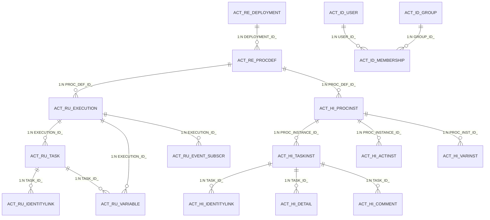

# PMS-activiti 完整数据字典

> 数据库：Activiti 引擎表 (MySQL)
> 本文档包含 PMS-activiti 模块涉及的所有 Activiti 数据库表的完整字段定义、索引信息和业务规则。
> 数据来源：Activiti 5.23.0 官方 Schema、PMS-activiti 源码。

---

## 表清单

| 序号 | 表名 | 说明 | 字段数 | 分类 |
|------|------|------|--------|------|
| 1 | ACT_RE_DEPLOYMENT | 部署信息表 | 7 | 存储库 |
| 2 | ACT_RE_PROCDEF | 流程定义表 | 13 | 存储库 |
| 3 | ACT_RE_MODEL | 模型信息表 | 10 | 存储库 |
| 4 | ACT_GE_BYTEARRAY | 通用字节数组表 | 7 | 通用 |
| 5 | ACT_GE_PROPERTY | 通用属性表 | 4 | 通用 |
| 6 | ACT_RU_EXECUTION | 运行时执行表 | 15 | 运行时 |
| 7 | ACT_RU_TASK | 运行时任务表 | 17 | 运行时 |
| 8 | ACT_RU_VARIABLE | 运行时变量表 | 12 | 运行时 |
| 9 | ACT_RU_IDENTITYLINK | 运行时身份关联表 | 9 | 运行时 |
| 10 | ACT_RU_JOB | 运行时作业表 | 18 | 运行时 |
| 11 | ACT_RU_EVENT_SUBSCR | 运行时事件订阅表 | 10 | 运行时 |
| 12 | ACT_HI_PROCINST | 历史流程实例表 | 18 | 历史 |
| 13 | ACT_HI_TASKINST | 历史任务实例表 | 19 | 历史 |
| 14 | ACT_HI_ACTINST | 历史活动实例表 | 14 | 历史 |
| 15 | ACT_HI_VARINST | 历史变量实例表 | 14 | 历史 |
| 16 | ACT_HI_IDENTITYLINK | 历史身份关联表 | 10 | 历史 |
| 17 | ACT_HI_DETAIL | 历史详情表 | 11 | 历史 |
| 18 | ACT_HI_COMMENT | 历史评论表 | 7 | 历史 |
| 19 | ACT_ID_USER | 用户信息表 | 8 | 身份 |
| 20 | ACT_ID_GROUP | 用户组信息表 | 7 | 身份 |
| 21 | ACT_ID_MEMBERSHIP | 用户组成员关联表 | 2 | 身份 |
| 22 | dp_act_unify_task | 自定义统一任务表 | 8 | 自定义 |

---

## 1. ACT_RE_DEPLOYMENT（部署信息表）

> 说明：存储流程部署信息，每次部署流程定义时创建记录。

| 字段名 | 类型 | 约束 | 默认值 | 业务含义 |
|--------|------|------|--------|----------|
| `ID_` | varchar(64) | PK | - | 部署ID |
| `NAME_` | varchar(255) | - | NULL | 部署名称 |
| `CATEGORY_` | varchar(255) | - | NULL | 分类 |
| `KEY_` | varchar(255) | - | NULL | 部署键 |
| `TENANT_ID_` | varchar(255) | - | '' | 租户ID |
| `DEPLOY_TIME_` | datetime | - | NULL | 部署时间 |
| `ENGINE_VERSION_` | varchar(255) | - | NULL | 引擎版本 |

**索引**：
| 索引名 | 字段 | 类型 | 说明 |
|--------|------|------|------|
| PRIMARY | ID_ | 主键 | 主键 |

---

## 2. ACT_RE_PROCDEF（流程定义表）

> 说明：存储流程定义信息，每次部署流程时自动创建。

| 字段名 | 类型 | 约束 | 默认值 | 业务含义 |
|--------|------|------|--------|----------|
| `ID_` | varchar(64) | PK | - | 流程定义ID（格式：key:version:deploymentId） |
| `REV_` | int(11) | - | - | 版本号 |
| `CATEGORY_` | varchar(255) | - | NULL | 分类 |
| `NAME_` | varchar(255) | - | NULL | 流程名称 |
| `KEY_` | varchar(255) | NOT NULL | - | 流程键（流程定义唯一标识） |
| `VERSION_` | int(11) | NOT NULL | - | 版本号 |
| `DEPLOYMENT_ID_` | varchar(64) | - | NULL | 部署ID |
| `RESOURCE_` | varchar(4000) | - | NULL | 资源文件路径 |
| `DGRM_RESOURCE_` | varchar(4000) | - | NULL | 图片资源路径 |
| `DESCRIPTION_` | varchar(4000) | - | NULL | 描述 |
| `HAS_START_FORM_KEY_` | tinyint(1) | - | 0 | 是否有启动表单键 |
| `SUSPENSION_STATE_` | int(11) | - | 1 | 挂起状态：1=激活, 2=挂起 |
| `TENANT_ID_` | varchar(255) | - | '' | 租户ID |

**索引**：
| 索引名 | 字段 | 类型 | 说明 |
|--------|------|------|------|
| PRIMARY | ID_ | 主键 | 主键 |
| ACT_UNIQ_PROCDEF | KEY_, VERSION_, TENANT_ID_ | 唯一索引 | 流程定义唯一 |

---

## 3. ACT_RE_MODEL（模型信息表）

> 说明：存储流程模型信息，用于流程设计器。

| 字段名 | 类型 | 约束 | 默认值 | 业务含义 |
|--------|------|------|--------|----------|
| `ID_` | varchar(64) | PK | - | 模型ID |
| `REV_` | int(11) | - | - | 版本号 |
| `NAME_` | varchar(255) | - | NULL | 模型名称 |
| `KEY_` | varchar(255) | - | NULL | 模型键 |
| `CATEGORY_` | varchar(255) | - | NULL | 分类 |
| `CREATE_TIME_` | datetime | - | NULL | 创建时间 |
| `LAST_UPDATE_TIME_` | datetime | - | NULL | 最后更新时间 |
| `VERSION_` | int(11) | - | - | 版本号 |
| `META_INFO_` | varchar(4000) | - | NULL | 元数据信息（JSON） |
| `TENANT_ID_` | varchar(255) | - | '' | 租户ID |

**索引**：
| 索引名 | 字段 | 类型 | 说明 |
|--------|------|------|------|
| PRIMARY | ID_ | 主键 | 主键 |

---

## 4. ACT_GE_BYTEARRAY（通用字节数组表）

> 说明：存储流程定义、模型等二进制资源。

| 字段名 | 类型 | 约束 | 默认值 | 业务含义 |
|--------|------|------|--------|----------|
| `ID_` | varchar(64) | PK | - | 记录ID |
| `REV_` | int(11) | - | - | 版本号 |
| `NAME_` | varchar(255) | - | NULL | 资源名称 |
| `DEPLOYMENT_ID_` | varchar(64) | - | NULL | 部署ID |
| `BYTES_` | longblob | - | NULL | 二进制数据 |
| `GENERATED_` | tinyint(1) | - | - | 是否自动生成 |
| `TENANT_ID_` | varchar(255) | - | '' | 租户ID |

**索引**：
| 索引名 | 字段 | 类型 | 说明 |
|--------|------|------|------|
| PRIMARY | ID_ | 主键 | 主键 |
| ACT_FK_BYTEARR_DEPL | DEPLOYMENT_ID_ | 外键 | 关联部署 |

---

## 5. ACT_GE_PROPERTY（通用属性表）

> 说明：存储引擎全局属性配置。

| 字段名 | 类型 | 约束 | 默认值 | 业务含义 |
|--------|------|------|--------|----------|
| `NAME_` | varchar(64) | PK | - | 属性名 |
| `VALUE_` | varchar(300) | - | NULL | 属性值 |
| `REV_` | int(11) | - | - | 版本号 |

**索引**：
| 索引名 | 字段 | 类型 | 说明 |
|--------|------|------|------|
| PRIMARY | NAME_ | 主键 | 主键 |

---

## 6. ACT_RU_EXECUTION（运行时执行表）

> 说明：存储正在运行的流程实例和执行实例信息。

| 字段名 | 类型 | 约束 | 默认值 | 业务含义 |
|--------|------|------|--------|----------|
| `ID_` | varchar(64) | PK | - | 执行ID |
| `REV_` | int(11) | - | - | 版本号 |
| `PROC_INSTANCE_ID_` | varchar(64) | - | NULL | 流程实例ID |
| `BUSINESS_KEY_` | varchar(255) | - | NULL | 业务键 |
| `PARENT_ID_` | varchar(64) | - | NULL | 父执行ID |
| `PROC_DEF_ID_` | varchar(64) | - | NULL | 流程定义ID |
| `SUPER_EXEC_` | varchar(64) | - | NULL | 父执行实例 |
| `ACT_ID_` | varchar(255) | - | NULL | 活动ID（当前节点） |
| `IS_ACTIVE_` | tinyint(1) | - | 1 | 是否激活 |
| `IS_SCOPE_` | tinyint(1) | - | 1 | 是否作用域 |
| `IS_EVENT_SCOPE_` | tinyint(1) | - | 0 | 是否事件作用域 |
| `SUSPENSION_STATE_` | int(11) | - | 1 | 挂起状态：1=激活, 2=挂起 |
| `CACHED_ENT_STATE_` | int(11) | - | - | 缓存实体状态 |
| `TENANT_ID_` | varchar(255) | - | '' | 租户ID |
| `NAME_` | varchar(255) | - | NULL | 名称 |

**索引**：
| 索引名 | 字段 | 类型 | 说明 |
|--------|------|------|------|
| PRIMARY | ID_ | 主键 | 主键 |
| ACT_UNIQ_EXEC_BUSINESS | BUSINESS_KEY_, TENANT_ID_ | 唯一索引 | 业务键唯一 |
| ACT_FK_EXEC_PROCDEF | PROC_DEF_ID_ | 外键 | 关联流程定义 |
| ACT_FK_EXEC_PARENT | PARENT_ID_ | 外键 | 关联父执行 |
| ACT_FK_EXEC_SUPER | SUPER_EXEC_ | 外键 | 关联父执行实例 |

---

## 7. ACT_RU_TASK（运行时任务表）

> 说明：存储正在运行的人工任务信息。

| 字段名 | 类型 | 约束 | 默认值 | 业务含义 |
|--------|------|------|--------|----------|
| `ID_` | varchar(64) | PK | - | 任务ID |
| `REV_` | int(11) | - | - | 版本号 |
| `EXECUTION_ID_` | varchar(64) | - | NULL | 执行实例ID |
| `PROC_INSTANCE_ID_` | varchar(64) | - | NULL | 流程实例ID |
| `PROC_DEF_ID_` | varchar(64) | - | NULL | 流程定义ID |
| `NAME_` | varchar(255) | - | NULL | 任务名称 |
| `PARENT_TASK_ID_` | varchar(64) | - | NULL | 父任务ID |
| `DESCRIPTION_` | varchar(4000) | - | NULL | 任务描述 |
| `OWNER_` | varchar(255) | - | NULL | 任务拥有者 |
| `ASSIGNEE_` | varchar(255) | - | NULL | 任务 assignee（办理人） |
| `DELEGATION_` | varchar(64) | - | NULL | 委托状态 |
| `PRIORITY_` | int(11) | - | 0 | 优先级 |
| `CREATE_TIME_` | datetime | - | NULL | 创建时间 |
| `DUE_DATE_` | datetime | - | NULL | 截止时间 |
| `CATEGORY_` | varchar(255) | - | NULL | 分类 |
| `TENANT_ID_` | varchar(255) | - | '' | 租户ID |
| `FORM_KEY_` | varchar(255) | - | NULL | 表单键 |

**索引**：
| 索引名 | 字段 | 类型 | 说明 |
|--------|------|------|------|
| PRIMARY | ID_ | 主键 | 主键 |
| ACT_IDX_TASK_CREATE | CREATE_TIME_ | 普通索引 | 按创建时间查询 |
| ACT_IDX_TASK_EXEC | EXECUTION_ID_ | 外键 | 关联执行实例 |
| ACT_IDX_TASK_PROCINST | PROC_INSTANCE_ID_ | 外键 | 关联流程实例 |
| ACT_IDX_TASK_PROCDEF | PROC_DEF_ID_ | 外键 | 关联流程定义 |
| ACT_IDX_TASK_ASSIGNEE | ASSIGNEE_ | 普通索引 | 按办理人查询 |

---

## 8. ACT_RU_VARIABLE（运行时变量表）

> 说明：存储正在运行的流程变量信息。

| 字段名 | 类型 | 约束 | 默认值 | 业务含义 |
|--------|------|------|--------|----------|
| `ID_` | varchar(64) | PK | - | 变量ID |
| `REV_` | int(11) | - | - | 版本号 |
| `TYPE_` | varchar(255) | - | - | 变量类型（string/integer/long/double/date/json） |
| `NAME_` | varchar(255) | NOT NULL | - | 变量名 |
| `EXECUTION_ID_` | varchar(64) | - | NULL | 执行实例ID |
| `PROC_INSTANCE_ID_` | varchar(64) | - | NULL | 流程实例ID |
| `TASK_ID_` | varchar(64) | - | NULL | 任务ID |
| `BYTEARRAY_ID_` | varchar(64) | - | NULL | 字节数组ID |
| `DOUBLE_` | double | - | NULL | 双精度值 |
| `LONG_` | bigint(20) | - | NULL | 长整型值 |
| `TEXT_` | varchar(4000) | - | NULL | 文本值 |
| `TEXT2_` | varchar(4000) | - | NULL | 文本值2 |

**索引**：
| 索引名 | 字段 | 类型 | 说明 |
|--------|------|------|------|
| PRIMARY | ID_ | 主键 | 主键 |
| ACT_IDX_VARIABLE_TASK | TASK_ID_ | 外键 | 关联任务 |
| ACT_IDX_VARIABLE_EXEC | EXECUTION_ID_ | 外键 | 关联执行实例 |
| ACT_IDX_VARIABLE_PROCINST | PROC_INSTANCE_ID_ | 外键 | 关联流程实例 |
| ACT_IDX_VAR_BYTEARRAY | BYTEARRAY_ID_ | 外键 | 关联字节数组 |

---

## 9. ACT_RU_IDENTITYLINK（运行时身份关联表）

> 说明：存储运行时用户/组与任务的关联关系。

| 字段名 | 类型 | 约束 | 默认值 | 业务含义 |
|--------|------|------|--------|----------|
| `ID_` | varchar(64) | PK | - | 关联ID |
| `REV_` | int(11) | - | - | 版本号 |
| `GROUP_ID_` | varchar(255) | - | NULL | 组ID |
| `TYPE_` | varchar(255) | - | - | 类型（candidate/assignee/owner） |
| `USER_ID_` | varchar(255) | - | NULL | 用户ID |
| `TASK_ID_` | varchar(64) | - | NULL | 任务ID |
| `PROC_INST_ID_` | varchar(64) | - | NULL | 流程实例ID |
| `PROC_DEF_ID_` | varchar(64) | - | NULL | 流程定义ID |
| `TENANT_ID_` | varchar(255) | - | '' | 租户ID |

**身份关联类型**：
| TYPE_ 值 | 说明 |
|----------|------|
| candidate | 候选人 |
| assignee | 办理人 |
| owner | 拥有者 |

---

## 10. ACT_RU_JOB（运行时作业表）

> 说明：存储定时作业和异步作业信息。

| 字段名 | 类型 | 约束 | 默认值 | 业务含义 |
|--------|------|------|--------|----------|
| `ID_` | varchar(64) | PK | - | 作业ID |
| `REV_` | int(11) | - | - | 版本号 |
| `TYPE_` | varchar(4) | NOT NULL | - | 作业类型 |
| `LOCK_EXP_TIME_` | datetime | - | NULL | 锁定过期时间 |
| `LOCK_OWNER_` | varchar(255) | - | NULL | 锁定拥有者 |
| `EXCLUSIVE_` | tinyint(1) | - | - | 是否独占 |
| `EXECUTION_ID_` | varchar(64) | - | NULL | 执行实例ID |
| `PROCESS_INSTANCE_ID_` | varchar(64) | - | NULL | 流程实例ID |
| `PROC_DEF_ID_` | varchar(64) | - | NULL | 流程定义ID |
| `RETRIES_` | int(11) | - | - | 重试次数 |
| `EXCEPTION_STACK_ID_` | varchar(64) | - | NULL | 异常堆栈ID |
| `EXCEPTION_MSG_` | varchar(4000) | - | NULL | 异常消息 |
| `DUEDATE_` | datetime | - | NULL | 到期时间 |
| `REPEAT_` | varchar(125) | - | NULL | 重复间隔 |
| `REPEAT_UNTIL_` | bigint(20) | - | NULL | 重复结束时间 |
| `PRIORITY_` | bigint(20) | - | - | 优先级 |
| `TENANT_ID_` | varchar(255) | - | '' | 租户ID |

---

## 11. ACT_RU_EVENT_SUBSCR（运行时事件订阅表）

> 说明：存储运行时事件订阅信息。

| 字段名 | 类型 | 约束 | 默认值 | 业务含义 |
|--------|------|------|--------|----------|
| `ID_` | varchar(64) | PK | - | 订阅ID |
| `REV_` | int(11) | - | - | 版本号 |
| `EVENT_TYPE_` | varchar(255) | NOT NULL | - | 事件类型 |
| `EVENT_NAME_` | varchar(255) | - | NULL | 事件名称 |
| `EXECUTION_ID_` | varchar(64) | - | NULL | 执行实例ID |
| `PROC_INST_ID_` | varchar(64) | - | NULL | 流程实例ID |
| `ACTIVITY_ID_` | varchar(255) | - | NULL | 活动ID |
| `CONFIGURATION_` | varchar(255) | - | NULL | 配置 |
| `CREATED_` | timestamp | - | NULL | 创建时间 |
| `TENANT_ID_` | varchar(255) | - | '' | 租户ID |

---

## 12. ACT_HI_PROCINST（历史流程实例表）

> 说明：存储已完成的流程实例历史信息。

| 字段名 | 类型 | 约束 | 默认值 | 业务含义 |
|--------|------|------|--------|----------|
| `ID_` | varchar(64) | PK | - | 流程实例ID |
| `PROC_DEF_ID_` | varchar(64) | NOT NULL | - | 流程定义ID |
| `BUSINESS_KEY_` | varchar(255) | - | NULL | 业务键 |
| `PARENT_ID_` | varchar(64) | - | NULL | 父流程实例ID |
| `PROC_INST_ID_` | varchar(64) | - | NULL | 流程实例ID |
| `SUPER_EXEC_` | varchar(64) | - | NULL | 父执行实例 |
| `ACT_ID_` | varchar(255) | - | NULL | 活动ID |
| `IS_ACTIVE_` | tinyint(1) | - | 1 | 是否激活 |
| `IS_SCOPE_` | tinyint(1) | - | 1 | 是否作用域 |
| `IS_EVENT_SCOPE_` | tinyint(1) | - | 0 | 是否事件作用域 |
| `SUSPENSION_STATE_` | int(11) | - | 1 | 挂起状态 |
| `CACHED_ENT_STATE_` | int(11) | - | - | 缓存实体状态 |
| `TENANT_ID_` | varchar(255) | - | '' | 租户ID |
| `START_USER_ID_` | varchar(255) | - | NULL | 启动用户ID |
| `START_TIME_` | datetime | NOT NULL | - | 开始时间 |
| `END_TIME_` | datetime | - | NULL | 结束时间 |
| `DURATION_` | bigint(20) | - | NULL | 持续时间（毫秒） |
| `START_ACT_ID_` | varchar(255) | - | NULL | 开始活动ID |
| `END_ACT_ID_` | varchar(255) | - | NULL | 结束活动ID |
| `DELETE_REASON_` | varchar(4000) | - | NULL | 删除原因 |

**索引**：
| 索引名 | 字段 | 类型 | 说明 |
|--------|------|------|------|
| PRIMARY | ID_ | 主键 | 主键 |
| ACT_IDX_HI_PRO_INST_START | START_TIME_ | 普通索引 | 按开始时间查询 |
| ACT_IDX_HI_PRO_INST_END | END_TIME_ | 普通索引 | 按结束时间查询 |
| ACT_IDX_HI_PRO_INST_BUSKEY | BUSINESS_KEY_ | 普通索引 | 按业务键查询 |

---

## 13. ACT_HI_TASKINST（历史任务实例表）

> 说明：存储已完成的任务历史信息。

| 字段名 | 类型 | 约束 | 默认值 | 业务含义 |
|--------|------|------|--------|----------|
| `ID_` | varchar(64) | PK | - | 任务ID |
| `PROC_DEF_ID_` | varchar(64) | - | NULL | 流程定义ID |
| `TASK_DEF_KEY_` | varchar(255) | - | NULL | 任务定义键 |
| `PROC_INSTANCE_ID_` | varchar(64) | - | NULL | 流程实例ID |
| `EXECUTION_ID_` | varchar(64) | - | NULL | 执行实例ID |
| `PARENT_TASK_ID_` | varchar(64) | - | NULL | 父任务ID |
| `NAME_` | varchar(255) | - | NULL | 任务名称 |
| `DESCRIPTION_` | varchar(4000) | - | NULL | 任务描述 |
| `OWNER_` | varchar(255) | - | NULL | 任务拥有者 |
| `ASSIGNEE_` | varchar(255) | - | NULL | 任务 assignee |
| `START_TIME_` | datetime | NOT NULL | - | 开始时间 |
| `END_TIME_` | datetime | - | NULL | 结束时间 |
| `DURATION_` | bigint(20) | - | NULL | 持续时间（毫秒） |
| `DELETE_REASON_` | varchar(4000) | - | NULL | 删除原因 |
| `PRIORITY_` | int(11) | - | 0 | 优先级 |
| `DUE_DATE_` | datetime | - | NULL | 截止时间 |
| `FORM_KEY_` | varchar(255) | - | NULL | 表单键 |
| `CATEGORY_` | varchar(255) | - | NULL | 分类 |
| `TENANT_ID_` | varchar(255) | - | '' | 租户ID |

**索引**：
| 索引名 | 字段 | 类型 | 说明 |
|--------|------|------|------|
| PRIMARY | ID_ | 主键 | 主键 |
| ACT_IDX_HI_TASK_INST_PROCINST | PROC_INSTANCE_ID_ | 普通索引 | 按流程实例查询 |
| ACT_IDX_HI_TASK_INST_ASSIGNEE | ASSIGNEE_ | 普通索引 | 按办理人查询 |
| ACT_IDX_HI_TASK_INST_START | START_TIME_ | 普通索引 | 按开始时间查询 |
| ACT_IDX_HI_TASK_INST_END | END_TIME_ | 普通索引 | 按结束时间查询 |

---

## 14. ACT_HI_ACTINST（历史活动实例表）

> 说明：存储已完成的活动（节点）历史信息。

| 字段名 | 类型 | 约束 | 默认值 | 业务含义 |
|--------|------|------|--------|----------|
| `ID_` | varchar(64) | PK | - | 活动实例ID |
| `PROC_DEF_ID_` | varchar(64) | NOT NULL | - | 流程定义ID |
| `PROC_INST_ID_` | varchar(64) | NOT NULL | - | 流程实例ID |
| `EXECUTION_ID_` | varchar(64) | NOT NULL | - | 执行实例ID |
| `ACT_ID_` | varchar(255) | NOT NULL | - | 活动ID（节点标识） |
| `TASK_ID_` | varchar(64) | - | NULL | 任务ID |
| `PROC_DEF_ID` | varchar(64) | - | NULL | 流程定义ID（冗余） |
| `NAME_` | varchar(255) | - | NULL | 活动名称 |
| `ACT_TYPE_` | varchar(255) | NOT NULL | - | 活动类型（startEvent/endEvent/serviceTask/userTask等） |
| `ASSIGNEE_` | varchar(255) | - | NULL | 办理人 |
| `START_TIME_` | datetime | NOT NULL | - | 开始时间 |
| `END_TIME_` | datetime | - | NULL | 结束时间 |
| `DURATION_` | bigint(20) | - | NULL | 持续时间（毫秒） |
| `TENANT_ID_` | varchar(255) | - | '' | 租户ID |

**活动类型（ACT_TYPE_）**：
| 值 | 说明 |
|----|------|
| startEvent | 开始事件 |
| endEvent | 结束事件 |
| userTask | 用户任务 |
| serviceTask | 服务任务 |
| scriptTask | 脚本任务 |
| businessRuleTask | 业务规则任务 |
| sendTask | 发送任务 |
| receiveTask | 接收任务 |
| parallelGateway | 并行网关 |
| inclusiveGateway | 包含网关 |
| exclusiveGateway | 排他网关 |
| eventBasedGateway | 事件网关 |
| callActivity | 调用活动 |
| subProcess | 子流程 |

---

## 15. ACT_HI_VARINST（历史变量实例表）

> 说明：存储已完成的变量历史信息。

| 字段名 | 类型 | 约束 | 默认值 | 业务含义 |
|--------|------|------|--------|----------|
| `ID_` | varchar(64) | PK | - | 变量实例ID |
| `PROC_INST_ID_` | varchar(64) | - | NULL | 流程实例ID |
| `EXECUTION_ID_` | varchar(64) | - | NULL | 执行实例ID |
| `TASK_ID_` | varchar(64) | - | NULL | 任务ID |
| `NAME_` | varchar(255) | NOT NULL | - | 变量名 |
| `VAR_TYPE_` | varchar(255) | - | NULL | 变量类型 |
| `BYTEARRAY_ID_` | varchar(64) | - | NULL | 字节数组ID |
| `DOUBLE_` | double | - | NULL | 双精度值 |
| `LONG_` | bigint(20) | - | NULL | 长整型值 |
| `TEXT_` | varchar(4000) | - | NULL | 文本值 |
| `TEXT2_` | varchar(4000) | - | NULL | 文本值2 |
| `VAR_SCOPE_` | varchar(255) | - | NULL | 变量作用域 |
| `CREATE_TIME_` | datetime | - | NULL | 创建时间 |
| `LAST_UPDATED_TIME_` | datetime | - | NULL | 最后更新时间 |

---

## 16. ACT_HI_IDENTITYLINK（历史身份关联表）

> 说明：存储历史用户/组与任务的关联关系。

| 字段名 | 类型 | 约束 | 默认值 | 业务含义 |
|--------|------|------|--------|----------|
| `ID_` | varchar(64) | PK | - | 关联ID |
| `GROUP_ID_` | varchar(255) | - | NULL | 组ID |
| `TYPE_` | varchar(255) | - | NULL | 类型 |
| `USER_ID_` | varchar(255) | - | NULL | 用户ID |
| `TASK_ID_` | varchar(64) | - | NULL | 任务ID |
| `PROC_INST_ID_` | varchar(64) | - | NULL | 流程实例ID |
| `PROC_DEF_ID_` | varchar(64) | - | NULL | 流程定义ID |
| `TIME_` | datetime | - | NULL | 时间 |
| `ACTION_` | varchar(255) | - | NULL | 操作 |
| `TENANT_ID_` | varchar(255) | - | '' | 租户ID |

---

## 17. ACT_HI_DETAIL（历史详情表）

> 说明：存储变量更新和表单属性更新的历史详情。

| 字段名 | 类型 | 约束 | 默认值 | 业务含义 |
|--------|------|------|--------|----------|
| `ID_` | varchar(64) | PK | - | 详情ID |
| `TYPE_` | varchar(255) | NOT NULL | - | 类型（VariableUpdate/FormProperty） |
| `PROC_INST_ID_` | varchar(64) | - | NULL | 流程实例ID |
| `EXECUTION_ID_` | varchar(64) | - | NULL | 执行实例ID |
| `TASK_ID_` | varchar(64) | - | NULL | 任务ID |
| `ACT_INST_ID_` | varchar(64) | - | NULL | 活动实例ID |
| `NAME_` | varchar(255) | NOT NULL | - | 名称 |
| `VAR_TYPE_` | varchar(255) | - | NULL | 变量类型 |
| `BYTEARRAY_ID_` | varchar(64) | - | NULL | 字节数组ID |
| `DOUBLE_` | double | - | NULL | 双精度值 |
| `LONG_` | bigint(20) | - | NULL | 长整型值 |
| `TEXT_` | varchar(4000) | - | NULL | 文本值 |
| `TEXT2_` | varchar(4000) | - | NULL | 文本值2 |
| `TIME_` | datetime | - | NULL | 时间 |

---

## 18. ACT_HI_COMMENT（历史评论表）

> 说明：存储任务评论和流程评论历史信息。

| 字段名 | 类型 | 约束 | 默认值 | 业务含义 |
|--------|------|------|--------|----------|
| `ID_` | varchar(64) | PK | - | 评论ID |
| `TYPE_` | varchar(255) | - | NULL | 类型（comment/event） |
| `TIME_` | datetime | NOT NULL | - | 时间 |
| `USER_ID_` | varchar(255) | - | NULL | 用户ID |
| `TASK_ID_` | varchar(64) | - | NULL | 任务ID |
| `PROC_INST_ID_` | varchar(64) | - | NULL | 流程实例ID |
| `ACTION_` | varchar(255) | - | NULL | 操作 |
| `MESSAGE_` | varchar(4000) | - | NULL | 消息内容 |

---

## 19. ACT_ID_USER（用户信息表）

> 说明：存储 Activiti 用户信息。

| 字段名 | 类型 | 约束 | 默认值 | 业务含义 |
|--------|------|------|--------|----------|
| `ID_` | varchar(64) | PK | - | 用户ID |
| `REV_` | int(11) | - | - | 版本号 |
| `FIRST_` | varchar(255) | - | NULL | 名 |
| `LAST_` | varchar(255) | - | NULL | 姓 |
| `EMAIL_` | varchar(255) | - | NULL | 邮箱 |
| `PWD_` | varchar(255) | - | NULL | 密码 |
| `PICTURE_ID_` | varchar(64) | - | NULL | 头像ID |
| `TENANT_ID_` | varchar(255) | - | '' | 租户ID |

---

## 20. ACT_ID_GROUP（用户组信息表）

> 说明：存储 Activiti 用户组信息。

| 字段名 | 类型 | 约束 | 默认值 | 业务含义 |
|--------|------|------|--------|----------|
| `ID_` | varchar(64) | PK | - | 组ID |
| `REV_` | int(11) | - | - | 版本号 |
| `NAME_` | varchar(255) | - | NULL | 组名称 |
| `TYPE_` | varchar(255) | - | NULL | 组类型 |
| `TENANT_ID_` | varchar(255) | - | '' | 租户ID |

---

## 21. ACT_ID_MEMBERSHIP（用户组成员关联表）

> 说明：存储用户与用户组的关联关系。

| 字段名 | 类型 | 约束 | 默认值 | 业务含义 |
|--------|------|------|--------|----------|
| `USER_ID_` | varchar(64) | PK | - | 用户ID |
| `GROUP_ID_` | varchar(64) | PK | - | 组ID |

---

## 22. dp_act_unify_task（自定义统一任务表）

> 说明：PMS-activiti 自定义的业务表，存储流程定义各节点的动态任务分配配置（办理人/候选人/候选组）。
> 该表由 `UserTaskListener` 在任务创建时通过 `selectByProcessDefinitionKey` 查询，用于动态解析节点办理人。
> 注意：本表为业务自定义表，不使用 Activiti 引擎的 `ID_` 结尾命名规范，字段名无下划线后缀。
> 数据来源：`ActUserTaskMapper.xml`、`ActUserTask.java` 实体类；源码仅有 CRUD SQL，无 DDL 脚本。

| 字段名 | 类型 | 约束 | 默认值 | 业务含义 |
|--------|------|------|--------|----------|
| `ID` | int(11) | PK, AUTO_INCREMENT | - | 主键ID |
| `PROC_DEF_KEY` | varchar(255) | NOT NULL | - | 流程定义键（如 CallBack、PmClosedLoop） |
| `PROC_DEF_NAME` | varchar(255) | - | NULL | 流程定义名称 |
| `TASK_DEF_KEY` | varchar(255) | NOT NULL | - | 任务定义键（BPMN 节点 ID） |
| `TASK_NAME` | varchar(255) | - | NULL | 任务名称 |
| `TASK_TYPE` | varchar(50) | NOT NULL | - | 任务类型（assignee/candidateUser/candidateGroup/modify） |
| `CANDIDATE_NAME` | varchar(500) | - | NULL | 候选人/候选组显示名称 |
| `CANDIDATE_IDS` | varchar(500) | - | NULL | 候选人/候选组 ID 列表 |

**索引**：

| 索引名 | 字段 | 类型 | 说明 |
|--------|------|------|------|
| PRIMARY | ID | 主键 | 主键 |

> **索引现状**：当前表除主键外无业务字段索引。建议为 `PROC_DEF_KEY` 添加索引（详见 [index-analysis.md](index-analysis.md) 第 3.5 节、第 4.1.3 节）。
>
> ```sql
> -- 建议索引
> CREATE INDEX idx_dp_act_unify_task_proc_def_key ON dp_act_unify_task(PROC_DEF_KEY);
> ```

**任务类型（TASK_TYPE）取值**：

| 值 | 说明 |
|----|------|
| assignee | 指定办理人 |
| candidateUser | 候选用户 |
| candidateGroup | 候选组 |
| modify | 修改（动态调整） |

**业务规则**：
- `UserTaskListener.notify()` 在任务创建事件触发时，通过 `PROC_DEF_KEY` 查询该流程定义下所有节点的任务分配配置
- 根据匹配的 `TASK_DEF_KEY` 找到当前节点配置，按 `TASK_TYPE` 动态设置 assignee / candidateUser / candidateGroup
- 若查询无匹配记录或抛出异常，监听器会 `e.printStackTrace()` 并跳过动态分配（不阻断流程）

---

## ER 关系图



---

## 状态编码定义

### 挂起状态（SUSPENSION_STATE_）

| 值 | 说明 |
|----|------|
| 1 | 激活（Active） |
| 2 | 挂起（Suspended） |

### 任务委托状态（DELEGATION_）

| 值 | 说明 |
|----|------|
| pending | 待委托 |
| resolved | 已解决 |

### 身份关联类型（TYPE_）

| 值 | 说明 |
|----|------|
| candidate | 候选人 |
| assignee | 办理人 |
| owner | 拥有者 |

### 作业类型（TYPE_）

| 值 | 说明 |
|----|------|
| message | 消息作业 |
| timer | 定时作业 |

### 事件类型（EVENT_TYPE_）

| 值 | 说明 |
|----|------|
| message | 消息事件 |
| signal | 信号事件 |
| error | 错误事件 |
| compensation | 补偿事件 |
| timer | 定时器事件 |
