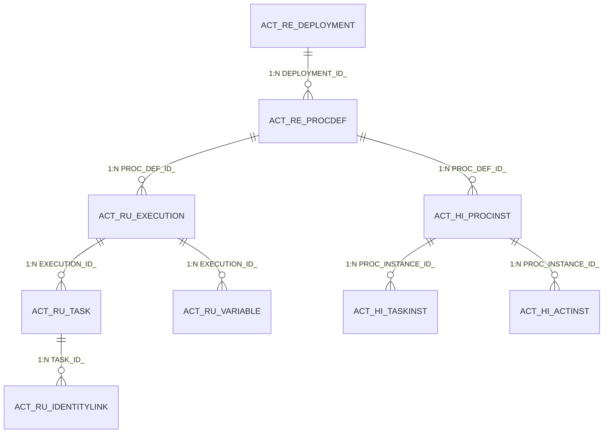

# PMS-activiti 数据库文档

## 1. 数据库表概览

PMS-activiti 模块使用 Activiti 引擎自带的数据库表：

| 表名 | 说明 |
|------|------|
| `ACT_RE_DEPLOYMENT` | 部署信息 |
| `ACT_RE_PROCDEF` | 流程定义 |
| `ACT_RU_EXECUTION` | 运行时执行 |
| `ACT_RU_TASK` | 运行时任务 |
| `ACT_RU_VARIABLE` | 运行时变量 |
| `ACT_RU_IDENTITYLINK` | 运行时身份关联 |
| `ACT_HI_PROCINST` | 历史流程实例 |
| `ACT_HI_TASKINST` | 历史任务实例 |
| `ACT_HI_ACTINST` | 历史活动实例 |
| `ACT_HI_VARINST` | 历史变量实例 |
| `ACT_GE_BYTEARRAY` | 通用字节数组 |
| `ACT_GE_PROPERTY` | 通用属性 |

---

## 2. 核心表详细字段

### 2.1 ACT_RE_DEPLOYMENT（部署信息表）

| 字段名 | 数据类型 | 约束 | 业务含义 |
|--------|----------|------|----------|
| `ID_` | VARCHAR(64) | PK | 部署ID |
| `NAME_` | VARCHAR(255) | - | 部署名称 |
| `CATEGORY_` | VARCHAR(255) | - | 分类 |
| `KEY_` | VARCHAR(255) | - | 部署键 |
| `TENANT_ID_` | VARCHAR(255) | - | 租户ID |
| `DEPLOY_TIME_` | TIMESTAMP | - | 部署时间 |
| `ENGINE_VERSION_` | VARCHAR(255) | - | 引擎版本 |

### 2.2 ACT_RE_PROCDEF（流程定义表）

| 字段名 | 数据类型 | 约束 | 业务含义 |
|--------|----------|------|----------|
| `ID_` | VARCHAR(64) | PK | 流程定义ID |
| `REV_` | INT | - | 版本号 |
| `CATEGORY_` | VARCHAR(255) | - | 分类 |
| `NAME_` | VARCHAR(255) | - | 流程名称 |
| `KEY_` | VARCHAR(255) | NOT NULL | 流程键 |
| `VERSION_` | INT | NOT NULL | 版本号 |
| `DEPLOYMENT_ID_` | VARCHAR(64) | - | 部署ID |
| `RESOURCE_` | VARCHAR(4000) | - | 资源文件 |
| `DGRM_RESOURCE_` | VARCHAR(4000) | - | 图片资源 |
| `DESCRIPTION_` | VARCHAR(4000) | - | 描述 |
| `HAS_START_FORM_KEY_` | TINYINT | - | 是否有启动表单键 |
| `SUSPENSION_STATE_` | INT | - | 挂起状态：1-激活, 2-挂起 |
| `TENANT_ID_` | VARCHAR(255) | - | 租户ID |

### 2.3 ACT_RU_TASK（运行时任务表）

| 字段名 | 数据类型 | 约束 | 业务含义 |
|--------|----------|------|----------|
| `ID_` | VARCHAR(64) | PK | 任务ID |
| `REV_` | INT | - | 版本号 |
| `EXECUTION_ID_` | VARCHAR(64) | - | 执行实例ID |
| `PROC_INSTANCE_ID_` | VARCHAR(64) | - | 流程实例ID |
| `PROC_DEF_ID_` | VARCHAR(64) | - | 流程定义ID |
| `NAME_` | VARCHAR(255) | - | 任务名称 |
| `PARENT_TASK_ID_` | VARCHAR(64) | - | 父任务ID |
| `DESCRIPTION_` | VARCHAR(4000) | - | 任务描述 |
| `OWNER_` | VARCHAR(255) | - | 任务拥有者 |
| `ASSIGNEE_` | VARCHAR(255) | - | 任务 assignee |
| `DELEGATION_` | VARCHAR(64) | - | 委托状态 |
| `PRIORITY_` | INT | - | 优先级 |
| `CREATE_TIME_` | TIMESTAMP | - | 创建时间 |
| `DUE_DATE_` | TIMESTAMP | - | 截止时间 |
| `CATEGORY_` | VARCHAR(255) | - | 分类 |
| `TENANT_ID_` | VARCHAR(255) | - | 租户ID |
| `FORM_KEY_` | VARCHAR(255) | - | 表单键 |

### 2.4 ACT_HI_TASKINST（历史任务实例表）

| 字段名 | 数据类型 | 约束 | 业务含义 |
|--------|----------|------|----------|
| `ID_` | VARCHAR(64) | PK | 任务ID |
| `PROC_DEF_ID_` | VARCHAR(64) | - | 流程定义ID |
| `TASK_DEF_KEY_` | VARCHAR(255) | - | 任务定义键 |
| `PROC_INSTANCE_ID_` | VARCHAR(64) | - | 流程实例ID |
| `EXECUTION_ID_` | VARCHAR(64) | - | 执行实例ID |
| `PARENT_TASK_ID_` | VARCHAR(64) | - | 父任务ID |
| `NAME_` | VARCHAR(255) | - | 任务名称 |
| `DESCRIPTION_` | VARCHAR(4000) | - | 任务描述 |
| `OWNER_` | VARCHAR(255) | - | 任务拥有者 |
| `ASSIGNEE_` | VARCHAR(255) | - | 任务 assignee |
| `START_TIME_` | TIMESTAMP | - | 开始时间 |
| `END_TIME_` | TIMESTAMP | - | 结束时间 |
| `DURATION_` | BIGINT | - | 持续时间 |
| `DELETE_REASON_` | VARCHAR(4000) | - | 删除原因 |

---

## 3. ER 关系图



---

## 4. 索引分析

### 4.1 Activiti 自动创建的索引

| 表名 | 索引名 | 索引类型 | 字段 |
|------|--------|----------|------|
| `ACT_RE_PROCDEF` | ACT_UNIQ_PROCDEF | 唯一 | KEY_, VERSION_, TENANT_ID_ |
| `ACT_RU_EXECUTION` | ACT_UNIQ_EXEC_BUSINESS | 唯一 | BUSINESS_KEY_, TENANT_ID_ |
| `ACT_RU_TASK` | ACT_IDX_TASK_CREATE | 普通 | CREATE_TIME_ |
| `ACT_HI_TASKINST` | ACT_IDX_TASKINST_PROCINST | 普通 | PROC_INSTANCE_ID_ |
| `ACT_HI_PROCINST` | ACT_IDX_PROCINST_START | 普通 | START_TIME_ |

### 4.2 索引优化建议

```sql
-- 为常用查询字段添加索引
CREATE INDEX idx_task_assignee ON ACT_RU_TASK(ASSIGNEE_);
CREATE INDEX idx_task_proc_instance ON ACT_RU_TASK(PROC_INSTANCE_ID_);
CREATE INDEX idx_hist_task_assignee ON ACT_HI_TASKINST(ASSIGNEE_);
CREATE INDEX idx_hist_task_end_time ON ACT_HI_TASKINST(END_TIME_);
```
