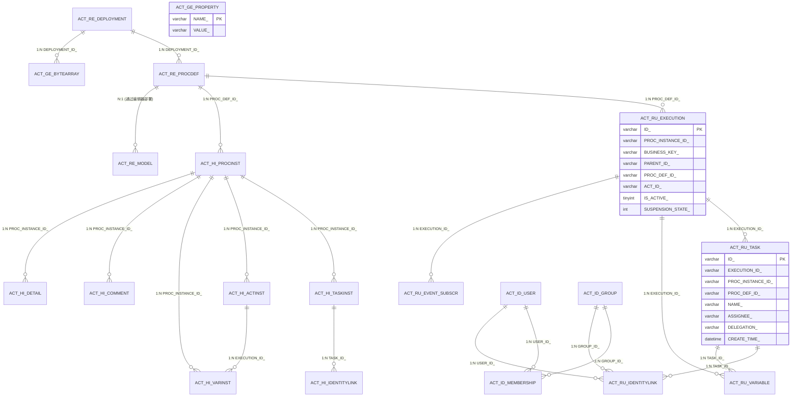
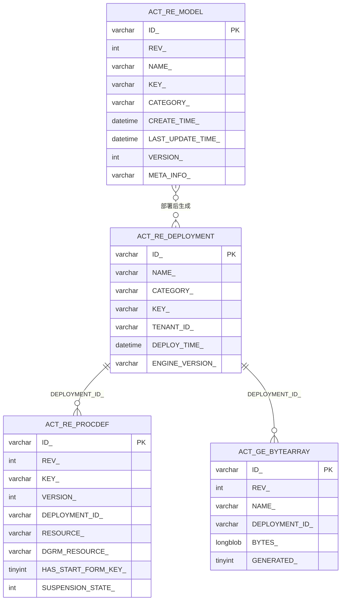
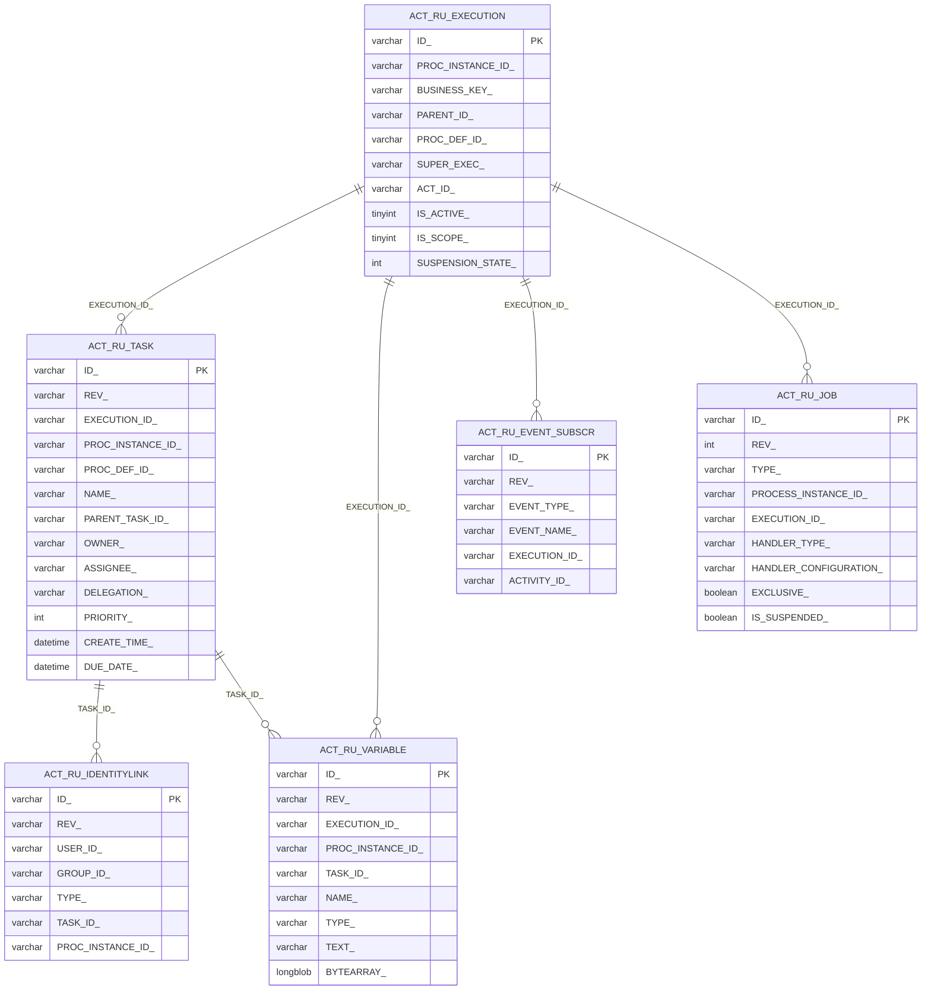
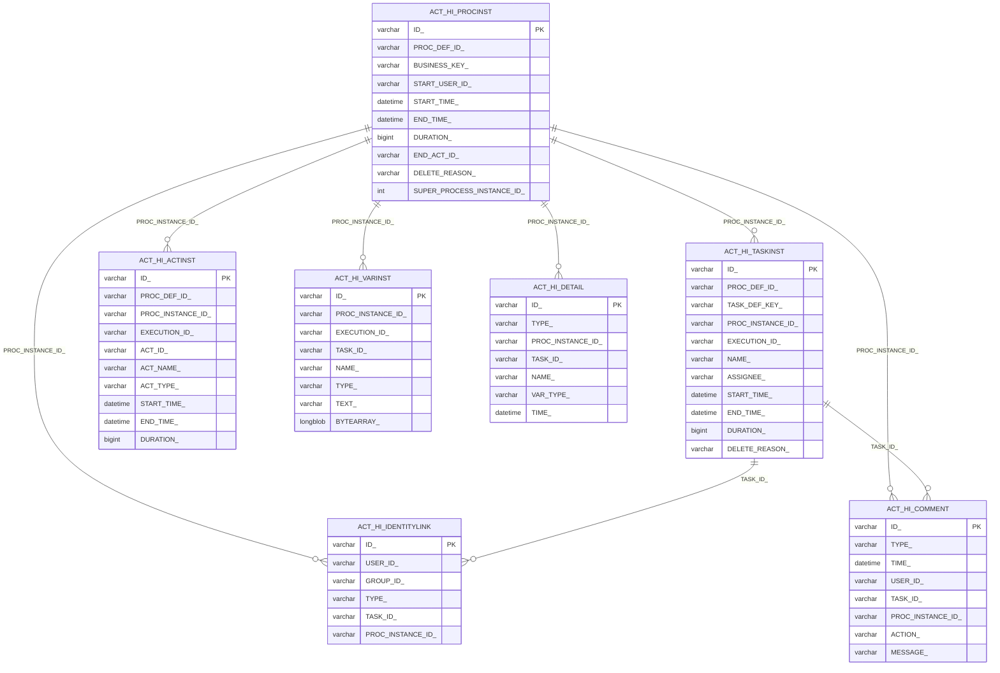
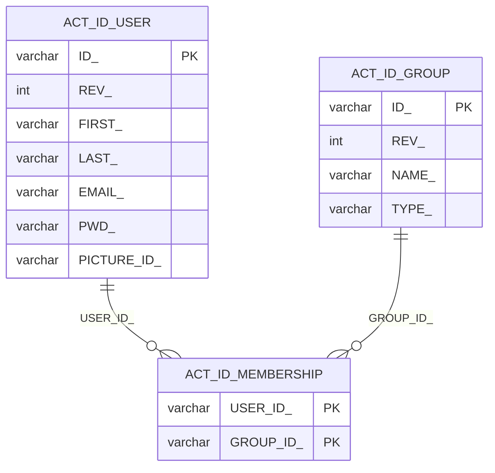
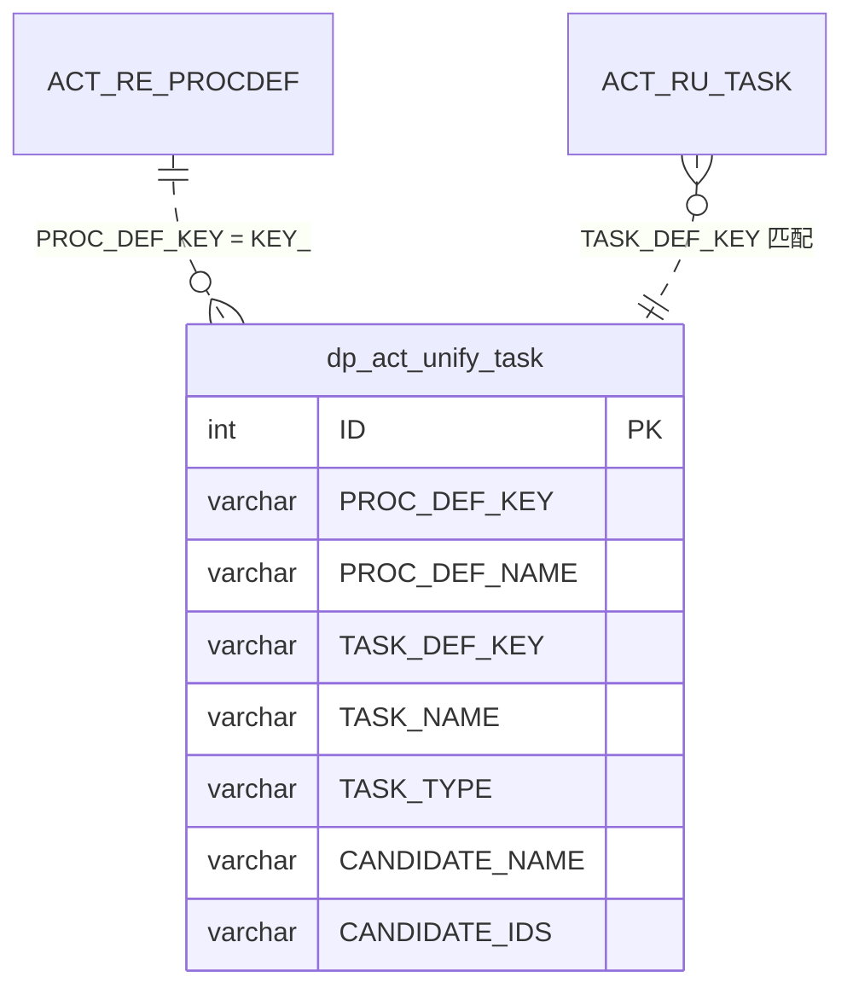
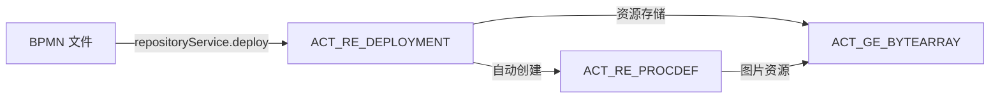
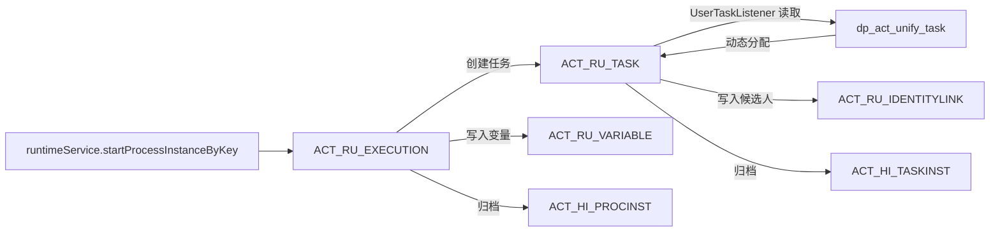
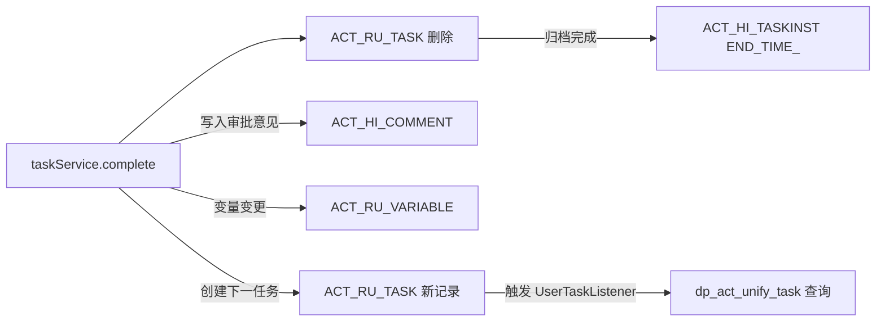

# PMS-activiti 数据库 ER 图

> 本文档基于 Activiti 5.23.0 官方 Schema 与 PMS-activiti 源码梳理，使用 Mermaid `erDiagram` 描述各表之间的关联关系。
> 数据来源：`d:\常规软件\QoderCode\workspace\PMS\PMS-activiti\src\main\resources\spring-activiti.xml`、`complete-data-dictionary.md`。

---

## 1. 表分类总览

Activiti 5.23.0 数据库表按前缀划分为 5 大类，PMS-activiti 模块全部使用：

| 前缀 | 含义 | 表数量 | 说明 |
|------|------|--------|------|
| `ACT_RE_` | Repository（存储库） | 3 | 流程定义、部署、模型等静态数据 |
| `ACT_RU_` | Runtime（运行时） | 6 | 运行中的执行实例、任务、变量、作业等 |
| `ACT_HI_` | History（历史） | 7 | 已完成的流程实例、任务、活动、变量等 |
| `ACT_ID_` | Identity（身份） | 3 | 用户、用户组、成员关系 |
| `ACT_GE_` | General（通用） | 2 | 字节数组、引擎属性 |

另外 PMS-activiti 自定义业务表 `dp_act_unify_task`（统一任务分配表）由 MyBatis 管理，与 Activiti 表协同工作。

---

## 2. 全局 ER 关系图

---

## 3. ACT_RE_ 存储库表关系图

存储库表保存流程定义的静态数据，部署一次即持久化保存。

**关键关系说明**：
- `ACT_RE_DEPLOYMENT` 1:N `ACT_RE_PROCDEF`：一次部署可包含多个流程定义
- `ACT_RE_DEPLOYMENT` 1:N `ACT_GE_BYTEARRAY`：部署资源（BPMN XML、流程图 PNG）以字节数组存储
- `ACT_RE_MODEL` 通过 ModelController 的 `deploy` 方法转换为部署，关系为可选

---

## 4. ACT_RU_ 运行时表关系图

运行时表保存流程实例运行中的数据，流程结束后相关记录被清理并迁移至历史表。

**关键关系说明**：
- `ACT_RU_EXECUTION` 是运行时核心表，既存储流程实例（`PROC_INSTANCE_ID_ = ID_`）也存储子执行实例
- `ACT_RU_EXECUTION` 1:N `ACT_RU_TASK`：一个执行实例可对应多个任务（多实例场景）
- `ACT_RU_TASK` 1:N `ACT_RU_IDENTITYLINK`：任务关联候选用户/候选组/办理人
- `ACT_RU_VARIABLE` 同时关联执行实例和任务，任务级变量 `TASK_ID_` 非空

---

## 5. ACT_HI_ 历史表关系图

历史表保存流程结束后的归档数据，用于审计与查询。`history.level=full` 配置下记录全部历史数据。

**关键关系说明**：
- `ACT_HI_PROCINST` 是历史归档的核心，所有历史表通过 `PROC_INSTANCE_ID_` 关联
- `ACT_HI_ACTINST` 记录流程经过的所有活动（包括网关、开始/结束事件），是流程轨迹图的来源
- `ACT_HI_COMMENT` 由 `taskService.addComment()` 写入，存储审批意见
- `ACT_HI_DETAIL` 在 `history.level=full` 时记录变量变更明细

---

## 6. ACT_ID_ 身份表关系图

身份表存储 Activiti 自带的用户与用户组信息。PMS-activiti 实际通过 `UserTaskListener` 动态分配任务，身份表使用较少。

**关键关系说明**：
- `ACT_ID_USER` 与 `ACT_ID_GROUP` 为 N:N 关系，通过 `ACT_ID_MEMBERSHIP` 关联
- `ACT_ID_MEMBERSHIP` 为联合主键（`USER_ID_` + `GROUP_ID_`）
- PMS-activiti 实际审批人通过 `dp_act_unify_task` 配置，身份表主要供 Activiti 内置查询使用

---

## 7. 自定义业务表 dp_act_unify_task

PMS-activiti 自定义的统一任务分配表，由 `UserTaskListener` 在任务创建时读取，实现动态任务分配。

**关键关系说明**：
- `dp_act_unify_task.PROC_DEF_KEY` 与 `ACT_RE_PROCDEF.KEY_` 逻辑关联（无外键约束）
- `dp_act_unify_task.TASK_DEF_KEY` 与 `ACT_RU_TASK.TASK_DEF_KEY_`（流程定义中的节点 ID）匹配
- `TASK_TYPE` 取值：`assignee` / `candidateUser` / `candidateGroup` / `modify`
- `CANDIDATE_IDS` 多值字段，逗号分隔

详细字段说明参见 [unify-task-table.md](unify-task-table.md)。

---

## 8. 跨表关联业务场景

### 8.1 流程部署数据流

### 8.2 流程启动数据流

### 8.3 任务办理数据流

---

## 9. 表关系说明汇总

| 主表 | 从表 | 关系 | 关联字段 | 业务含义 |
|------|------|------|----------|----------|
| `ACT_RE_DEPLOYMENT` | `ACT_RE_PROCDEF` | 1:N | `DEPLOYMENT_ID_` | 一次部署多个流程定义 |
| `ACT_RE_DEPLOYMENT` | `ACT_GE_BYTEARRAY` | 1:N | `DEPLOYMENT_ID_` | 部署资源（BPMN/PNG） |
| `ACT_RE_PROCDEF` | `ACT_RU_EXECUTION` | 1:N | `PROC_DEF_ID_` | 流程定义对应运行实例 |
| `ACT_RE_PROCDEF` | `ACT_HI_PROCINST` | 1:N | `PROC_DEF_ID_` | 流程定义对应历史实例 |
| `ACT_RU_EXECUTION` | `ACT_RU_TASK` | 1:N | `EXECUTION_ID_` | 执行实例对应任务 |
| `ACT_RU_EXECUTION` | `ACT_RU_VARIABLE` | 1:N | `EXECUTION_ID_` | 执行实例对应变量 |
| `ACT_RU_TASK` | `ACT_RU_IDENTITYLINK` | 1:N | `TASK_ID_` | 任务对应身份关联 |
| `ACT_RU_TASK` | `ACT_RU_VARIABLE` | 1:N | `TASK_ID_` | 任务级变量 |
| `ACT_HI_PROCINST` | `ACT_HI_TASKINST` | 1:N | `PROC_INSTANCE_ID_` | 历史实例对应历史任务 |
| `ACT_HI_PROCINST` | `ACT_HI_ACTINST` | 1:N | `PROC_INSTANCE_ID_` | 历史实例对应活动轨迹 |
| `ACT_HI_PROCINST` | `ACT_HI_VARINST` | 1:N | `PROC_INSTANCE_ID_` | 历史实例对应历史变量 |
| `ACT_HI_PROCINST` | `ACT_HI_COMMENT` | 1:N | `PROC_INSTANCE_ID_` | 历史实例对应审批意见 |
| `ACT_HI_TASKINST` | `ACT_HI_IDENTITYLINK` | 1:N | `TASK_ID_` | 历史任务对应历史身份 |
| `ACT_ID_USER` | `ACT_ID_MEMBERSHIP` | 1:N | `USER_ID_` | 用户对应成员关系 |
| `ACT_ID_GROUP` | `ACT_ID_MEMBERSHIP` | 1:N | `GROUP_ID_` | 用户组对应成员关系 |
| `ACT_RE_PROCDEF` | `dp_act_unify_task` | 1:N | `KEY_ = PROC_DEF_KEY` | 流程定义对应任务分配规则 |

---

## 10. 数据完整性约束

### 10.1 外键约束（Activiti 自动创建）

| 外键名 | 从表.字段 | 主表.字段 | 删除行为 |
|--------|-----------|-----------|----------|
| `ACT_FK_BYTEARR_DEPL` | `ACT_GE_BYTEARRAY.DEPLOYMENT_ID_` | `ACT_RE_DEPLOYMENT.ID_` | CASCADE |
| `ACT_FK_EXEC_PROCDEF` | `ACT_RU_EXECUTION.PROC_DEF_ID_` | `ACT_RE_PROCDEF.ID_` | CASCADE |
| `ACT_FK_EXEC_PARENT` | `ACT_RU_EXECUTION.PARENT_ID_` | `ACT_RU_EXECUTION.ID_` | CASCADE |
| `ACT_FK_TASK_EXEC` | `ACT_RU_TASK.EXECUTION_ID_` | `ACT_RU_EXECUTION.ID_` | CASCADE |
| `ACT_FK_TASK_PROCINST` | `ACT_RU_TASK.PROC_INSTANCE_ID_` | `ACT_RU_EXECUTION.ID_` | CASCADE |
| `ACT_FK_VAR_EXEC` | `ACT_RU_VARIABLE.EXECUTION_ID_` | `ACT_RU_EXECUTION.ID_` | CASCADE |
| `ACT_FK_VAR_TASK` | `ACT_RU_VARIABLE.TASK_ID_` | `ACT_RU_TASK.ID_` | CASCADE |
| `ACT_FK_IDL_TASK` | `ACT_RU_IDENTITYLINK.TASK_ID_` | `ACT_RU_TASK.ID_` | CASCADE |
| `ACT_FK_IDL_PROCINST` | `ACT_RU_IDENTITYLINK.PROC_INSTANCE_ID_` | `ACT_RU_EXECUTION.ID_` | CASCADE |

### 10.2 唯一约束

| 约束名 | 表 | 字段 | 说明 |
|--------|------|------|------|
| `ACT_UNIQ_PROCDEF` | `ACT_RE_PROCDEF` | `KEY_, VERSION_, TENANT_ID_` | 流程定义唯一 |
| `ACT_UNIQ_EXEC_BUSINESS` | `ACT_RU_EXECUTION` | `BUSINESS_KEY_, TENANT_ID_` | 业务键唯一 |
| `ACT_UNIQ_TASK_NAME` | `ACT_RU_TASK` | `PROC_DEF_ID_, TASK_DEF_KEY_` | 任务定义唯一 |

### 10.3 业务约束（应用层保证）

- `dp_act_unify_task.PROC_DEF_KEY` 必须与已部署的 `ACT_RE_PROCDEF.KEY_` 一致
- `dp_act_unify_task.TASK_DEF_KEY` 必须与 BPMN 文件中的节点 ID 一致
- `ACT_RU_TASK.ASSIGNEE_` 与 `ACT_RU_IDENTITYLINK` 中的 `USER_ID_`（type=participant）保持一致

---

## 11. 相关文档

- [database-overview.md](database-overview.md) — 数据库概览
- [complete-data-dictionary.md](complete-data-dictionary.md) — 完整数据字典
- [index-analysis.md](index-analysis.md) — 索引分析
- [unify-task-table.md](unify-task-table.md) — 统一任务表详解
- [../01-architecture/database-configuration.md](../01-architecture/database-configuration.md) — 数据库配置
