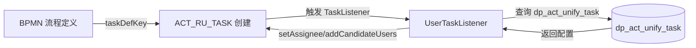
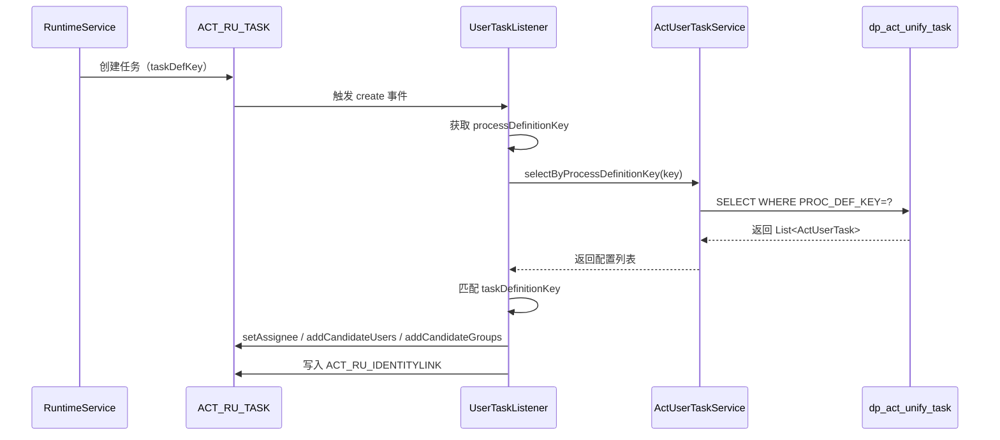

# PMS-activiti 统一任务表 dp_act_unify_task 详解

> 本文档详细描述 PMS-activiti 自定义的统一任务分配表 `dp_act_unify_task` 的设计、字段、使用机制和最佳实践。
> 数据来源：`d:\常规软件\QoderCode\workspace\PMS\PMS-activiti\src\main\java\com\dp\plat\activiti\` 源码。

---

## 1. 设计背景

Activiti 流程定义（BPMN）中，任务分配通常通过以下方式硬编码：

- `activiti:assignee="${userId}"` — 固定办理人
- `activiti:candidateUsers="user1,user2"` — 固定候选人
- `activiti:candidateGroups="group1,group2"` — 固定候选组

**问题**：审批人变更需要修改 BPMN 文件并重新部署，运维成本高。

**解决方案**：PMS-activiti 通过 `dp_act_unify_task` 表将审批人配置与流程定义解耦，由 `UserTaskListener` 在任务创建时动态读取配置并分配。



---

## 2. 表结构

### 2.1 字段定义

| 字段名 | 类型 | 约束 | 默认值 | 业务含义 |
|--------|------|------|--------|----------|
| `ID` | int(11) | PK, AUTO_INCREMENT | - | 主键ID |
| `PROC_DEF_KEY` | varchar(255) | NOT NULL | - | 流程定义键（对应 `ACT_RE_PROCDEF.KEY_`） |
| `PROC_DEF_NAME` | varchar(255) | - | NULL | 流程定义名称（冗余字段，便于展示） |
| `TASK_DEF_KEY` | varchar(255) | NOT NULL | - | 任务定义键（BPMN 中节点的 `id` 属性） |
| `TASK_NAME` | varchar(255) | - | NULL | 任务名称（冗余字段，便于展示） |
| `TASK_TYPE` | varchar(50) | NOT NULL | - | 任务分配类型 |
| `CANDIDATE_NAME` | varchar(500) | - | NULL | 候选人名称（冗余字段，便于展示） |
| `CANDIDATE_IDS` | varchar(500) | - | NULL | 候选人ID（多值逗号分隔） |

### 2.2 DDL 建表语句（建议）

> **重要说明**：PMS-activiti 源码（`ActUserTaskMapper.xml`）中仅包含对 `dp_act_unify_task` 表的 CRUD SQL，未提供 DDL 建表脚本。下方 DDL 为**建议建表语句**，实际生产环境中表结构以数据库中实际定义为准。源码中未发现为该表创建索引的脚本，因此**当前表实际无业务索引**（除主键外），详见 [index-analysis.md](index-analysis.md) 第 3.5 节与第 4.1.3 节的索引优化建议。

```sql
CREATE TABLE `dp_act_unify_task` (
  `ID` int(11) NOT NULL AUTO_INCREMENT COMMENT '主键ID',
  `PROC_DEF_KEY` varchar(255) NOT NULL COMMENT '流程定义键',
  `PROC_DEF_NAME` varchar(255) DEFAULT NULL COMMENT '流程定义名称',
  `TASK_DEF_KEY` varchar(255) NOT NULL COMMENT '任务定义键',
  `TASK_NAME` varchar(255) DEFAULT NULL COMMENT '任务名称',
  `TASK_TYPE` varchar(50) NOT NULL COMMENT '任务分配类型：assignee/candidateUser/candidateGroup/modify',
  `CANDIDATE_NAME` varchar(500) DEFAULT NULL COMMENT '候选人名称',
  `CANDIDATE_IDS` varchar(500) DEFAULT NULL COMMENT '候选人ID（逗号分隔）',
  PRIMARY KEY (`ID`)
) ENGINE=InnoDB DEFAULT CHARSET=utf8mb4 COMMENT='Activiti 统一任务分配表';
```

### 2.3 索引现状与建议

**当前状态**：源码中未提供 `dp_act_unify_task` 表的索引创建脚本，实际表仅有主键索引（`PRIMARY` on `ID`），无任何业务字段索引。该结论与 [index-analysis.md](index-analysis.md) 第 3.5 节"`dp_act_unify_task` 表无索引"以及 `audit-modules.md` ISSUE-002 一致。

**优化建议**（详见 [index-analysis.md](index-analysis.md) 第 4.1.3 节）：

| 建议索引名 | 字段 | 类型 | 说明 | 优先级 |
|--------|------|------|------|--------|
| `PRIMARY` | `ID` | 主键 | 主键（已存在） | - |
| `idx_dp_act_unify_task_proc_def_key` | `PROC_DEF_KEY` | 普通 | 加速 `selectByProcessDefinitionKey` 查询 | 高 |
| `idx_dp_act_unify_task_proc_task` | `PROC_DEF_KEY`, `TASK_DEF_KEY` | 复合 | 加速按流程定义+任务定义联合查询 | 中 |

**建议添加索引 SQL**：
```sql
-- 高优先级：UserTaskListener.notify() 每次任务创建都按 PROC_DEF_KEY 查询
CREATE INDEX idx_dp_act_unify_task_proc_def_key ON dp_act_unify_task(PROC_DEF_KEY);

-- 中优先级：复合索引，覆盖按流程定义+任务定义的精确查询
CREATE INDEX idx_dp_act_unify_task_proc_task ON dp_act_unify_task(PROC_DEF_KEY, TASK_DEF_KEY);
```

---

## 3. TASK_TYPE 取值说明

`dp_act_unify_task.TASK_TYPE` 字段决定 `UserTaskListener` 如何分配任务，共 4 种取值：

| 取值 | 含义 | CANDIDATE_IDS 格式 | 对应 Activiti API | 使用场景 |
|------|------|-------------------|-------------------|----------|
| `assignee` | 固定办理人 | 单个用户ID | `delegateTask.setAssignee(ids)` | 单人审批节点 |
| `candidateUser` | 候选用户 | 多个用户ID，逗号分隔 | `delegateTask.addCandidateUsers(users)` | 多人抢办 |
| `candidateGroup` | 候选用户组 | 多个用户组ID，逗号分隔 | `delegateTask.addCandidateGroups(groups)` | 按角色审批 |
| `modify` | 动态办理人 | 无（从流程变量读取） | `delegateTask.setAssignee(entity.getUserId())` | 申请人指定审批人 |

### 3.1 assignee（固定办理人）

**配置示例**：
```sql
INSERT INTO dp_act_unify_task (PROC_DEF_KEY, PROC_DEF_NAME, TASK_DEF_KEY, TASK_NAME, TASK_TYPE, CANDIDATE_NAME, CANDIDATE_IDS)
VALUES ('CallBack', '回访流程', 'approveTask', '主管审批', 'assignee', '张三', 'zhangsan');
```

**效果**：任务创建时直接分配给 `zhangsan`。

### 3.2 candidateUser（候选用户）

**配置示例**：
```sql
INSERT INTO dp_act_unify_task (PROC_DEF_KEY, TASK_DEF_KEY, TASK_TYPE, CANDIDATE_NAME, CANDIDATE_IDS)
VALUES ('CallBack', 'approveTask', 'candidateUser', '张三,李四', 'zhangsan,lisi');
```

**效果**：
- 当 `CANDIDATE_IDS` 仅 1 个用户时，直接 `setAssignee`
- 当 `CANDIDATE_IDS` 多个用户时，`addCandidateUsers`，任务进入候选人的待办列表，需 `claim` 后才能办理

### 3.3 candidateGroup（候选用户组）

**配置示例**：
```sql
INSERT INTO dp_act_unify_task (PROC_DEF_KEY, TASK_DEF_KEY, TASK_TYPE, CANDIDATE_NAME, CANDIDATE_IDS)
VALUES ('CallBack', 'approveTask', 'candidateGroup', '工程管理部', 'engManager');
```

**效果**：任务分配给 `engManager` 用户组的所有成员，需 `claim` 后办理。

### 3.4 modify（动态办理人）

**配置示例**：
```sql
INSERT INTO dp_act_unify_task (PROC_DEF_KEY, TASK_DEF_KEY, TASK_TYPE, CANDIDATE_NAME, CANDIDATE_IDS)
VALUES ('CallBack', 'modifyTask', 'modify', NULL, NULL);
```

**效果**：从流程变量 `entity`（`BaseVO` 类型）中读取 `userId` 字段作为办理人。适用于"申请人指定下一审批人"的场景。

---

## 4. 工作机制

### 4.1 UserTaskListener 源码分析

**源码位置**：`d:\常规软件\QoderCode\workspace\PMS\PMS-activiti\src\main\java\com\dp\plat\activiti\process\listener\UserTaskListener.java`

```java
@Component("userTaskListener")
public class UserTaskListener implements TaskListener {
    @Autowired
    protected RepositoryService repositoryService;

    @Autowired
    private IActUserTaskService actUserTaskService;

    @Override
    public void notify(DelegateTask delegateTask) {
        String processDefinitionId = delegateTask.getProcessDefinitionId();
        ProcessDefinition processDefinition = this.repositoryService
            .createProcessDefinitionQuery()
            .processDefinitionId(processDefinitionId)
            .singleResult();
        String processDefinitionKey = processDefinition.getKey();
        String taskDefinitionKey = delegateTask.getTaskDefinitionKey();
        
        try {
            List<ActUserTask> taskList = this.actUserTaskService
                .selectByProcessDefinitionKey(processDefinitionKey);
            for (ActUserTask userTask : taskList) {
                String taskKey = userTask.getTaskDefKey();
                String taskType = userTask.getTaskType();
                String ids = userTask.getCandidateIds();
                if (taskDefinitionKey.equals(taskKey)) {
                    switch (taskType) {
                        case "assignee":
                            delegateTask.setAssignee(ids);
                            break;
                        case "candidateUser":
                            String[] userIds = ids.split(",");
                            List<String> users = new ArrayList<String>();
                            for (String user : userIds) {
                                if (StringUtils.isNoneBlank(user)) {
                                    users.add(user);
                                }
                            }
                            if (users.size() == 1) {
                                delegateTask.setAssignee(users.get(0));
                            } else {
                                delegateTask.addCandidateUsers(users);
                            }
                            break;
                        case "candidateGroup":
                            String[] groupIds = ids.split(",");
                            List<String> groups = new ArrayList<String>();
                            for (int i = 0; i < groupIds.length; i++) {
                                groups.add(groupIds[i]);
                            }
                            delegateTask.addCandidateGroups(groups);
                            break;
                        case "modify":
                            BaseVO entity = delegateTask.getVariable("entity", BaseVO.class);
                            String userId = entity.getUserId().toString();
                            delegateTask.setAssignee(userId);
                            break;
                    }
                }
            }
        } catch (Exception e) {
            e.printStackTrace();
        }
    }
}
```

### 4.2 BPMN 中配置监听器

在 BPMN 流程定义中，需要为 `userTask` 节点配置 `TaskListener`：

```xml
<userTask id="approveTask" name="主管审批">
    <extensionElements>
        <activiti:taskListener event="create" 
            delegateExpression="${userTaskListener}"/>
    </extensionElements>
</userTask>
```

**关键属性**：
- `event="create"` — 任务创建时触发
- `delegateExpression="${userTaskListener}"` — 通过 Spring Bean 注入监听器

### 4.3 任务分配流程



---

## 5. 数据访问层

### 5.1 Entity 实体类

**源码位置**：`d:\常规软件\QoderCode\workspace\PMS\PMS-activiti\src\main\java\com\dp\plat\activiti\entity\ActUserTask.java`

```java
public class ActUserTask {
    private Integer id;
    private String procDefKey;
    private String procDefName;
    private String taskDefKey;
    private String taskName;
    private String taskType;
    private String candidateName;
    private String candidateIds;
    // getter/setter 省略
}
```

### 5.2 DAO 接口

**源码位置**：`d:\常规软件\QoderCode\workspace\PMS\PMS-activiti\src\main\java\com\dp\plat\activiti\dao\ActUserTaskMapper.java`

```java
public interface ActUserTaskMapper extends BaseMapper<ActUserTask> {
    List<ActUserTask> selectByProcessDefinitionKey(String procDefKey);
}
```

### 5.3 MyBatis 映射

**源码位置**：`d:\常规软件\QoderCode\workspace\PMS\PMS-activiti\src\main\java\com\dp\plat\activiti\mapping\ActUserTaskMapper.xml`

核心查询：

```xml
<select id="selectByProcessDefinitionKey" parameterType="string" resultMap="BaseResultMap">
    SELECT ID, PROC_DEF_KEY, PROC_DEF_NAME, TASK_DEF_KEY, TASK_NAME, TASK_TYPE, CANDIDATE_NAME, CANDIDATE_IDS
    FROM dp_act_unify_task
    WHERE PROC_DEF_KEY = #{procDefKey,jdbcType=VARCHAR}
</select>
```

### 5.4 Service 层

**源码位置**：`d:\常规软件\QoderCode\workspace\PMS\PMS-activiti\src\main\java\com\dp\plat\activiti\service\impl\ActUserTaskService.java`

```java
@Service("actUserTaskService")
public class ActUserTaskService extends AbstractBaseService<ActUserTaskMapper, ActUserTask>
        implements IActUserTaskService {

    public List<ActUserTask> selectByProcessDefinitionKey(String processDefinitionKey) {
        return dao.selectByProcessDefinitionKey(processDefinitionKey);
    }
}
```

---

## 6. 配置示例

### 6.1 CallBack 回访流程配置

```sql
-- 申请人提交节点：动态办理人（modify）
INSERT INTO dp_act_unify_task (PROC_DEF_KEY, PROC_DEF_NAME, TASK_DEF_KEY, TASK_NAME, TASK_TYPE, CANDIDATE_NAME, CANDIDATE_IDS)
VALUES ('CallBack', '回访流程', 'applyTask', '申请人提交', 'modify', NULL, NULL);

-- 主管审批节点：固定办理人
INSERT INTO dp_act_unify_task (PROC_DEF_KEY, PROC_DEF_NAME, TASK_DEF_KEY, TASK_NAME, TASK_TYPE, CANDIDATE_NAME, CANDIDATE_IDS)
VALUES ('CallBack', '回访流程', 'approveTask', '主管审批', 'assignee', '张三', 'zhangsan');

-- 回访节点：候选用户组
INSERT INTO dp_act_unify_task (PROC_DEF_KEY, PROC_DEF_NAME, TASK_DEF_KEY, TASK_NAME, TASK_TYPE, CANDIDATE_NAME, CANDIDATE_IDS)
VALUES ('CallBack', '回访流程', 'callbackTask', '回访办理', 'candidateGroup', '回访组', 'callbackRole');
```

### 6.2 Subcontract 转包流程配置

```sql
-- 服务经理发起：动态办理人
INSERT INTO dp_act_unify_task (PROC_DEF_KEY, TASK_DEF_KEY, TASK_TYPE, CANDIDATE_IDS)
VALUES ('Subcontract', 'serviceTask', 'modify', NULL);

-- 工程管理部主管审批：候选用户组
INSERT INTO dp_act_unify_task (PROC_DEF_KEY, TASK_DEF_KEY, TASK_TYPE, CANDIDATE_NAME, CANDIDATE_IDS)
VALUES ('Subcontract', 'approveTask', 'candidateGroup', '工程管理部', 'emlRole');

-- 办事处主任审批：候选用户组
INSERT INTO dp_act_unify_task (PROC_DEF_KEY, TASK_DEF_KEY, TASK_TYPE, CANDIDATE_NAME, CANDIDATE_IDS)
VALUES ('Subcontract', 'approveZRTask', 'candidateGroup', '办事处主任', 'zrRole');

-- 生成合同：候选用户组
INSERT INTO dp_act_unify_task (PROC_DEF_KEY, TASK_DEF_KEY, TASK_TYPE, CANDIDATE_NAME, CANDIDATE_IDS)
VALUES ('Subcontract', 'generateContractTask', 'candidateGroup', '工程管理部', 'emRole');
```

---

## 7. 与 Activiti 原生机制对比

| 对比项 | Activiti 原生 | dp_act_unify_task |
|--------|---------------|-----------------|
| 配置位置 | BPMN XML 文件 | 数据库表 |
| 修改方式 | 修改 BPMN + 重新部署 | UPDATE SQL 即时生效 |
| 动态性 | 需重启流程定义 | 实时生效 |
| 多租户支持 | 通过 `TENANT_ID_` | 通过 `PROC_DEF_KEY` 区分 |
| 用户组管理 | `ACT_ID_GROUP` | 业务系统用户组 |
| 审批人变更 | 复杂 | 简单（UPDATE SQL） |
| 性能 | 直接读取流程定义 | 每次任务创建查询一次 |

---

## 8. 注意事项与最佳实践

### 8.1 注意事项

1. **BPMN 必须配置 TaskListener**：`dp_act_unify_task` 配置不会自动生效，BPMN 中必须为 `userTask` 配置 `UserTaskListener`。

2. **taskDefKey 必须匹配**：`dp_act_unify_task.TASK_DEF_KEY` 必须与 BPMN 中 `userTask` 的 `id` 属性完全一致，否则无法匹配。

3. **异常处理**：`UserTaskListener.notify()` 中 catch 了所有异常并 `printStackTrace()`，不会中断流程。需注意配置错误时任务可能无 assignee。

4. **modify 类型依赖流程变量**：`modify` 类型从流程变量 `entity` 读取 `userId`，启动流程时必须设置该变量：
   ```java
   Map<String, Object> variables = new HashMap<>();
   variables.put("entity", baseVO);
   runtimeService.startProcessInstanceByKey(processKey, businessKey, variables);
   ```

5. **候选人去重**：`candidateUser` 类型未做去重处理，配置时需确保 `CANDIDATE_IDS` 中无重复用户ID。

### 8.2 最佳实践

1. **冗余字段维护**：`PROC_DEF_NAME`、`TASK_NAME`、`CANDIDATE_NAME` 为冗余字段，修改时需同步更新。

2. **批量查询优化**：`UserTaskListener` 每次任务创建查询一次，可考虑加缓存（如 EhCache）。

3. **配置界面化**：建议开发配置管理界面，避免直接操作 SQL，降低出错概率。

4. **配置审计**：对 `dp_act_unify_task` 的增删改操作记录操作日志，便于追溯审批人变更历史。

5. **配置校验**：部署流程定义时校验 `dp_act_unify_task` 中是否存在对应的 `TASK_DEF_KEY` 配置，避免任务无 assignee。

---

## 9. 常见问题

### 9.1 任务创建后 ASSIGNEE_ 为空

**原因**：
1. BPMN 中未配置 `UserTaskListener`
2. `dp_act_unify_task` 中无对应 `PROC_DEF_KEY` + `TASK_DEF_KEY` 的记录
3. `TASK_TYPE` 取值错误（如写成 `Assignee` 而非 `assignee`）
4. `UserTaskListener` 抛出异常被 catch

**排查 SQL**：
```sql
-- 检查配置是否存在
SELECT * FROM dp_act_unify_task 
WHERE PROC_DEF_KEY = 'CallBack' AND TASK_DEF_KEY = 'approveTask';

-- 检查任务实际 assignee
SELECT ID_, NAME_, ASSIGNEE_, PROC_DEF_ID_ FROM ACT_RU_TASK 
WHERE PROC_INSTANCE_ID_ = 'xxx';
```

### 9.2 candidateUser 单人时直接分配

**现象**：`candidateUser` 类型配置单个用户时，任务直接分配给该用户，而非进入候选人待办。

**原因**：`UserTaskListener` 源码中，当 `users.size() == 1` 时调用 `setAssignee` 而非 `addCandidateUsers`。

**解决方案**：如需强制走 claim 流程，可使用 `candidateGroup` 类型。

### 9.3 modify 类型报 NullPointerException

**原因**：流程变量中未设置 `entity` 或 `entity` 中 `userId` 为 null。

**解决方案**：
```java
// 启动流程时必须设置 entity 变量
BaseVO entity = new BaseVO();
entity.setUserId(loginUserId);
Map<String, Object> variables = new HashMap<>();
variables.put("entity", entity);
runtimeService.startProcessInstanceByKey(processKey, businessKey, variables);
```

---

## 10. 相关文档

- [er-diagram.md](er-diagram.md) — ER 图
- [complete-data-dictionary.md](complete-data-dictionary.md) — 完整数据字典
- [index-analysis.md](index-analysis.md) — 索引分析
- [../02-modules/listeners.md](../02-modules/listeners.md) — 监听器详解
- [../02-modules/task-management.md](../02-modules/task-management.md) — 任务管理
