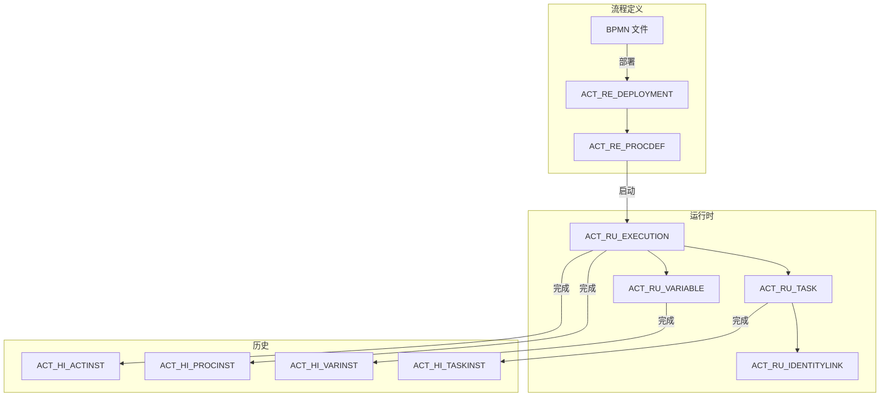

# PMS-activiti 模块-表CRUD映射矩阵

> 数据库：Activiti 引擎表 (MySQL)
> C=创建(Create) R=读取(Read) U=更新(Update) D=删除(Delete)

---

## 1. 完整模块-表CRUD矩阵

### 1.1 流程定义管理

| 数据表 | C | R | U | D | 操作频率 | 说明 |
|--------|---|---|---|---|----------|------|
| ACT_RE_DEPLOYMENT | ✓ | ✓ | | ✓ | 低 | 部署管理 |
| ACT_RE_PROCDEF | | ✓ | ✓ | | 中 | 流程定义查询/挂起 |
| ACT_GE_BYTEARRAY | ✓ | ✓ | | ✓ | 低 | 流程资源存储 |

### 1.2 流程实例管理

| 数据表 | C | R | U | D | 操作频率 | 说明 |
|--------|---|---|---|---|----------|------|
| ACT_RU_EXECUTION | ✓ | ✓ | ✓ | ✓ | 高 | 运行时执行管理 |
| ACT_RU_TASK | ✓ | ✓ | ✓ | ✓ | 高 | 运行时任务管理 |
| ACT_RU_VARIABLE | ✓ | ✓ | ✓ | ✓ | 高 | 运行时变量管理 |
| ACT_RU_IDENTITYLINK | ✓ | ✓ | ✓ | ✓ | 高 | 身份关联管理 |

### 1.3 历史数据

| 数据表 | C | R | U | D | 操作频率 | 说明 |
|--------|---|---|---|---|----------|------|
| ACT_HI_PROCINST | ✓ | ✓ | | | 高 | 历史流程实例 |
| ACT_HI_TASKINST | ✓ | ✓ | | | 高 | 历史任务实例 |
| ACT_HI_ACTINST | ✓ | ✓ | | | 高 | 历史活动实例 |
| ACT_HI_VARINST | ✓ | ✓ | | | 高 | 历史变量实例 |

---

## 2. 数据流向图

---

## 3. 数据转换规则

### 3.1 流程实例状态转换

| 原状态 | 目标状态 | 触发条件 | 转换规则 |
|--------|----------|----------|----------|
| 未启动 | 运行中 | 启动流程 | ACT_RU_EXECUTION 创建 |
| 运行中 | 已完成 | 流程结束 | ACT_RU_EXECUTION 删除，ACT_HI_PROCINST 更新 |
| 运行中 | 已挂起 | 挂起流程 | ACT_RU_EXECUTION.SUSPENSION_STATE_ = 2 |
| 已挂起 | 运行中 | 激活流程 | ACT_RU_EXECUTION.SUSPENSION_STATE_ = 1 |

### 3.2 任务状态转换

| 原状态 | 目标状态 | 触发条件 | 转换规则 |
|--------|----------|----------|----------|
| 待处理 | 已签收 | 签收任务 | ACT_RU_TASK.ASSIGNEE_ 设置 |
| 待处理 | 已完成 | 完成任务 | ACT_RU_TASK 删除，ACT_HI_TASKINST 更新 |
| 已签收 | 已完成 | 完成任务 | ACT_RU_TASK 删除，ACT_HI_TASKINST 更新 |
| 已签收 | 待处理 | 释放任务 | ACT_RU_TASK.ASSIGNEE_ 清空 |

---

## 4. 数据校验机制

### 4.1 流程定义校验

- 流程定义 Key 唯一性
- BPMN 文件格式校验
- 流程节点完整性校验

### 4.2 流程实例校验

- 流程定义是否存在
- 流程定义是否已挂起
- 启动变量是否完整

### 4.3 任务校验

- 任务是否存在
- 任务是否已签收
- 任务是否已过期
