# PMS-activiti 数据流向图

> 本文档详细描述 PMS-activiti 模块在各业务场景下的数据流向，包括流程部署、流程启动、任务办理、任务撤回、任务跳转等核心场景。
> 数据来源：`d:\常规软件\QoderCode\workspace\PMS\PMS-activiti\src\main\java\com\dp\plat\activiti\` 源码。

---

## 1. 数据流向概览

PMS-activiti 的数据流向围绕 Activiti 7 类 Service 展开，所有数据最终落地到 Activiti 引擎表与自定义业务表 `dp_act_unify_task`。

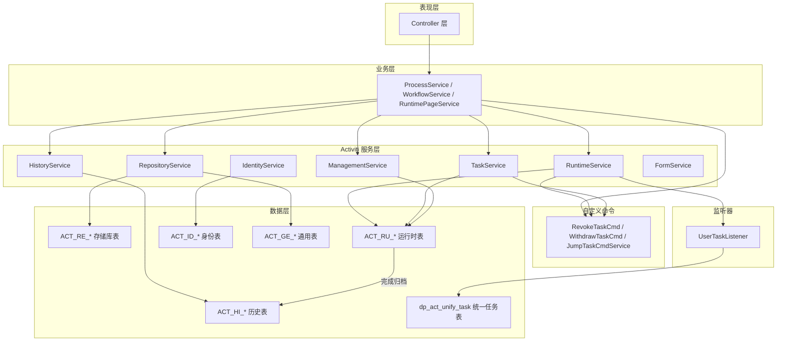

---

## 2. 流程部署数据流

### 2.1 BPMN 文件部署

**触发入口**：`ProcessDefinitionController.deploy()` / `ModelController.deploy()`

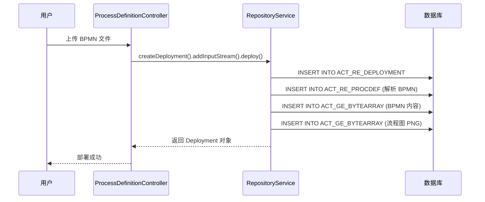

**涉及表写入**：

| 表名 | 操作 | 字段 | 说明 |
|------|------|------|------|
| `ACT_RE_DEPLOYMENT` | INSERT | `ID_`, `NAME_`, `DEPLOY_TIME_` | 部署记录 |
| `ACT_RE_PROCDEF` | INSERT | `ID_`, `KEY_`, `VERSION_`, `DEPLOYMENT_ID_` | 流程定义 |
| `ACT_GE_BYTEARRAY` | INSERT | `NAME_`, `BYTES_`, `DEPLOYMENT_ID_` | BPMN XML + PNG |
| `ACT_GE_PROPERTY` | UPDATE | `VALUE_` (next.dbid) | 主键生成器 |

### 2.2 模型部署

**触发入口**：`ModelController.deploy()`

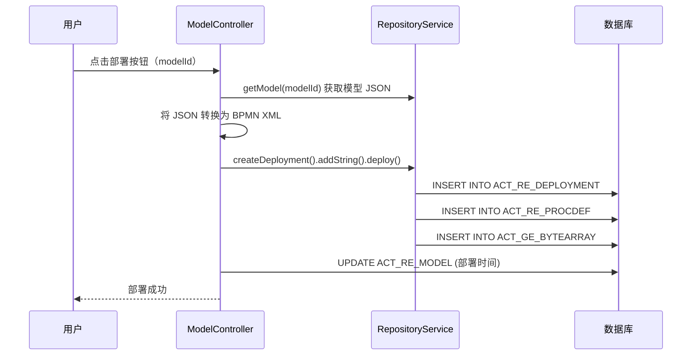

---

## 3. 流程启动数据流

### 3.1 启动流程实例

**触发入口**：业务模块调用 `runtimeService.startProcessInstanceByKey()`

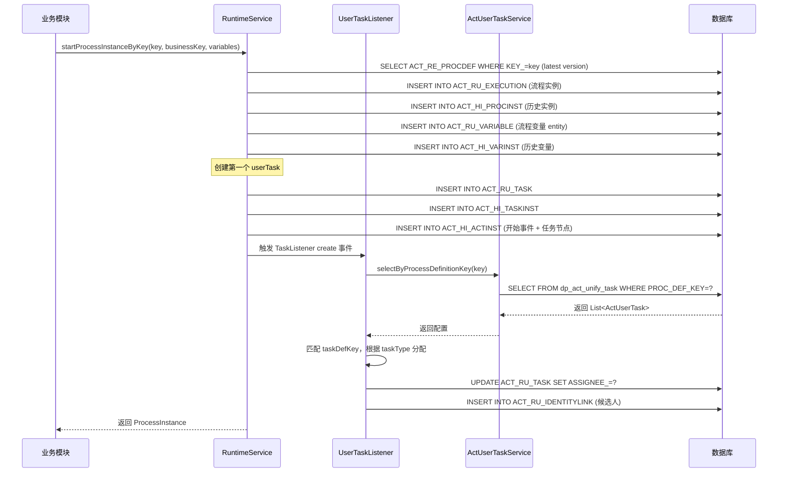

**涉及表写入**：

| 表名 | 操作 | 说明 |
|------|------|------|
| `ACT_RU_EXECUTION` | INSERT | 创建流程实例与根执行 |
| `ACT_RU_TASK` | INSERT | 创建第一个任务 |
| `ACT_RU_VARIABLE` | INSERT | 写入流程变量（含 `entity`） |
| `ACT_RU_IDENTITYLINK` | INSERT | 任务候选人/办理人 |
| `ACT_HI_PROCINST` | INSERT | 历史流程实例 |
| `ACT_HI_TASKINST` | INSERT | 历史任务 |
| `ACT_HI_ACTINST` | INSERT | 历史活动（开始事件 + 任务） |
| `ACT_HI_VARINST` | INSERT | 历史变量 |
| `dp_act_unify_task` | SELECT | 读取任务分配配置 |

---

## 4. 任务办理数据流

### 4.1 完成任务（complete）

**触发入口**：`TaskController.complete()` → `ProcessService.complete()`

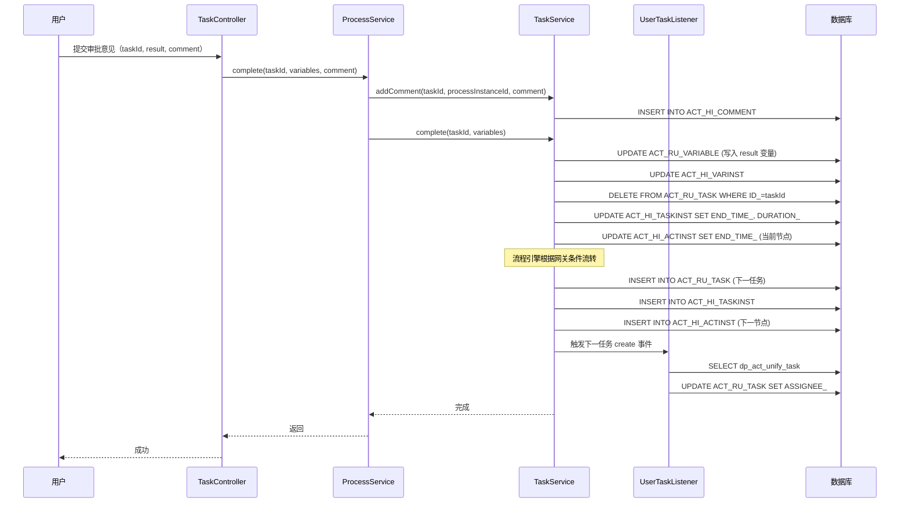

**涉及表操作**：

| 表名 | 操作 | 说明 |
|------|------|------|
| `ACT_HI_COMMENT` | INSERT | 审批意见 |
| `ACT_RU_VARIABLE` | UPDATE | 写入 `result` 变量 |
| `ACT_RU_TASK` | DELETE + INSERT | 删除当前任务，创建下一任务 |
| `ACT_HI_TASKINST` | UPDATE + INSERT | 当前任务归档，下一任务历史记录 |
| `ACT_HI_ACTINST` | UPDATE + INSERT | 当前活动归档，下一活动记录 |
| `ACT_RU_IDENTITYLINK` | DELETE + INSERT | 当前任务身份删除，下一任务身份创建 |
| `dp_act_unify_task` | SELECT | 读取下一任务分配配置 |

### 4.2 签收任务（claim）

**触发入口**：`TaskController.claim()` → `ProcessService.claim()`

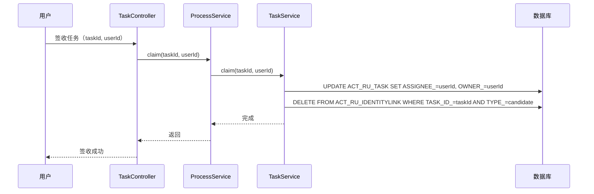

### 4.3 委托任务（delegate）

**触发入口**：`TaskController.delegate()` → `ProcessService.delegate()`

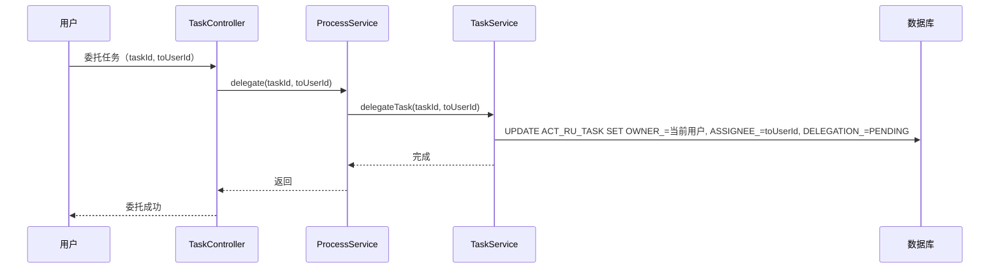

### 4.4 转办任务（transfer）

**触发入口**：`TaskController.transfer()` → `ProcessService.transfer()`

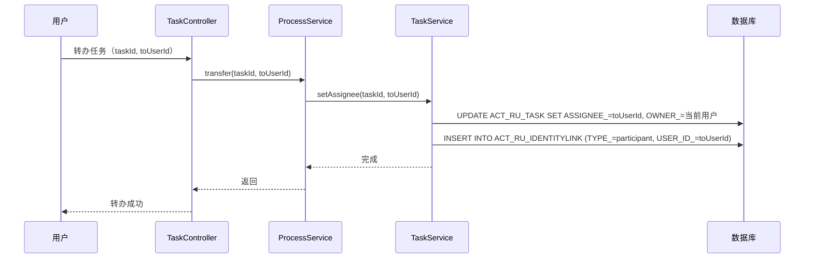

---

## 5. 任务撤回数据流

### 5.1 撤回任务（revoke）

**触发入口**：`TaskController.revoke()` → `ProcessService.revoke()` → `RevokeTaskCmd`

撤回是指**当前办理人**从已办理的任务中撤回，让流程回到上一节点。

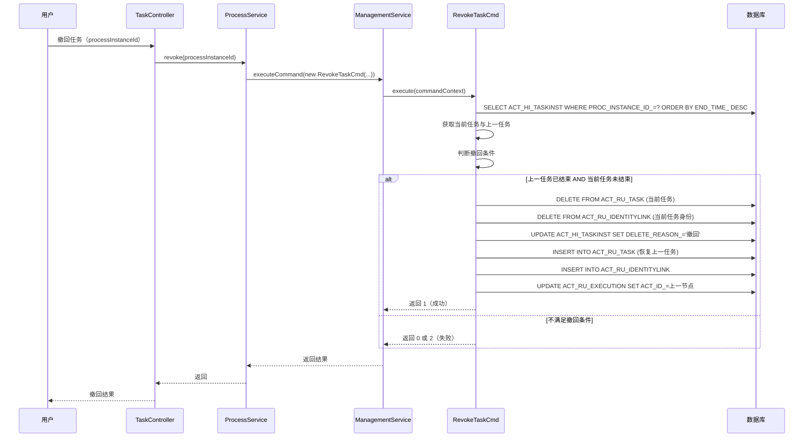

**RevokeTaskCmd 返回值**：

| 返回值 | 含义 | 说明 |
|--------|------|------|
| 0 | 撤回失败 | 上一任务不存在或当前任务已结束 |
| 1 | 撤回成功 | 已恢复上一任务 |
| 2 | 撤回失败 | 不满足撤回条件（如已无下一任务） |

### 5.2 撤销任务（withdraw）

**触发入口**：`TaskController.withdraw()` → `ProcessService.withdrawTask()` → `WithdrawTaskCmd`

撤销是指**上一节点办理人**从当前办理人处撤销任务，让流程回到自己。

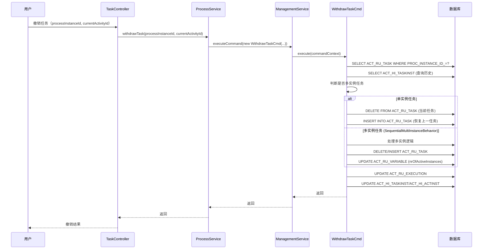

---

## 6. 任务跳转数据流

### 6.1 自由跳转（jump）

**触发入口**：`TaskController.jump()` → `ProcessService.moveTo()` → `JumpTaskCmdService`

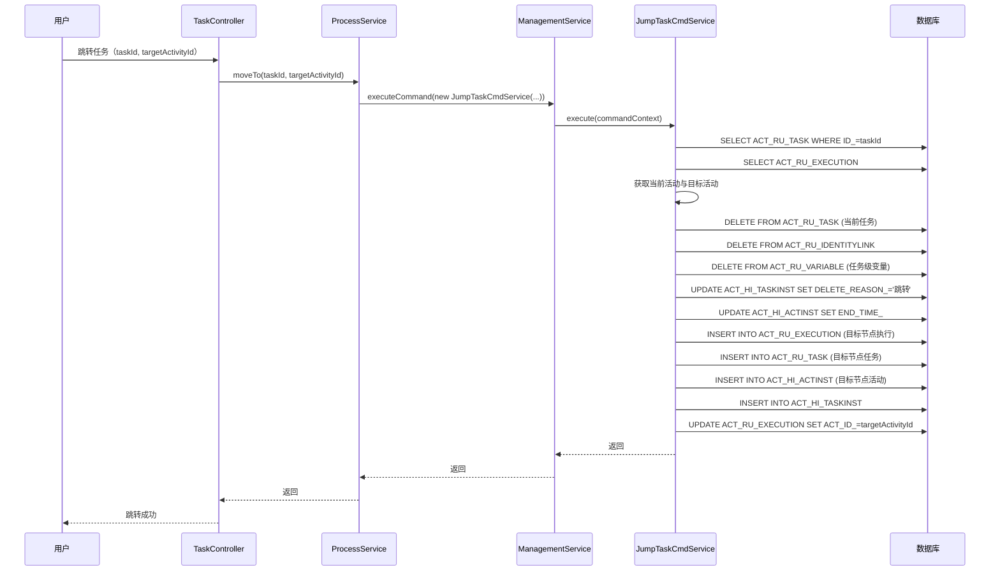

### 6.2 终止流程（terminate）

**触发入口**：`ProcessInstanceController.delete()` → `ProcessService.terminateProcess()`

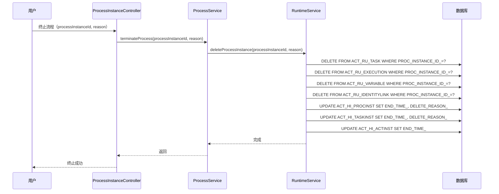

---

## 7. 流程图生成数据流

### 7.1 生成流程图

**触发入口**：`ProcessInstanceController.diagram()`

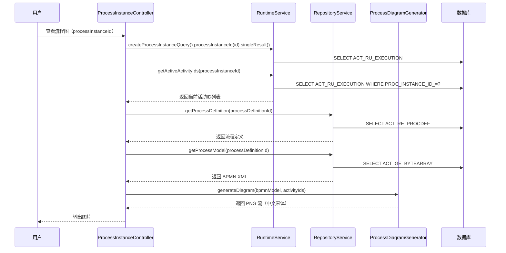

---

## 8. 待办查询数据流

### 8.1 查询待办任务

**触发入口**：`TaskController.todoList()` → `ProcessService.findTodoTask()`

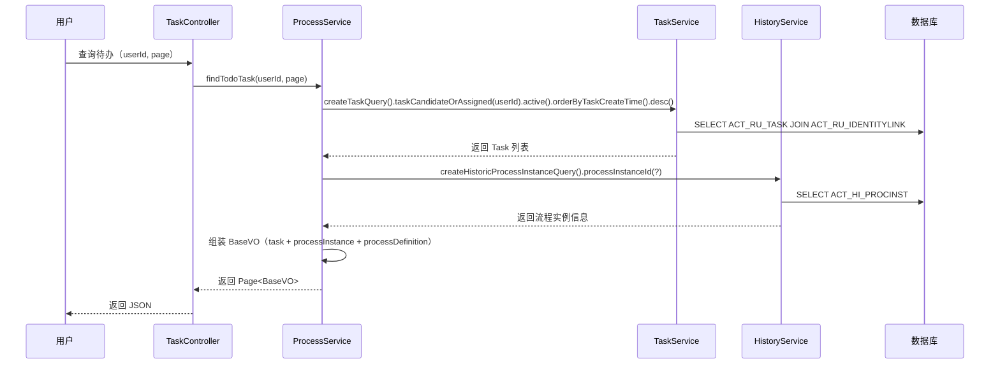

**涉及表查询**：

| 表名 | 查询字段 | 说明 |
|------|----------|------|
| `ACT_RU_TASK` | `ASSIGNEE_`, `CREATE_TIME_` | 待办任务 |
| `ACT_RU_IDENTITYLINK` | `USER_ID_`, `TASK_ID_` | 候选人关联 |
| `ACT_HI_PROCINST` | `ID_` | 流程实例信息 |
| `ACT_RE_PROCDEF` | `ID_` | 流程定义信息 |

---

## 9. 运行时页面数据流

### 9.1 获取活动节点列表

**触发入口**：`RuntimePageService.getActivityList()`

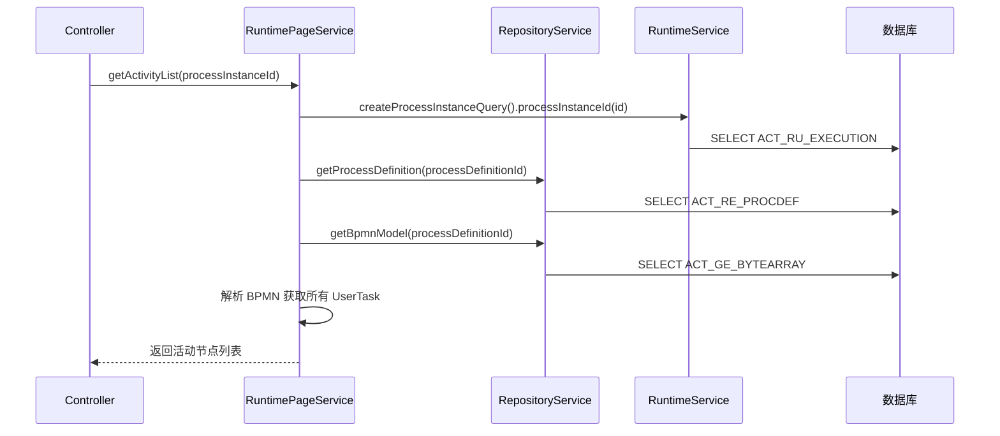

### 9.2 查询候选人

**触发入口**：`RuntimePageService.getCandidateUserNames()`

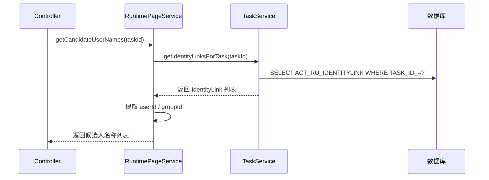

---

## 10. 数据流转规则汇总

### 10.1 运行时 → 历史归档规则

| 触发事件 | 运行时表操作 | 历史表操作 |
|----------|-------------|-----------|
| 流程启动 | INSERT `ACT_RU_EXECUTION` | INSERT `ACT_HI_PROCINST` |
| 任务创建 | INSERT `ACT_RU_TASK` | INSERT `ACT_HI_TASKINST` + `ACT_HI_ACTINST` |
| 任务完成 | DELETE `ACT_RU_TASK` | UPDATE `ACT_HI_TASKINST.END_TIME_` |
| 流程结束 | DELETE `ACT_RU_EXECUTION` | UPDATE `ACT_HI_PROCINST.END_TIME_` |
| 变量写入 | INSERT/UPDATE `ACT_RU_VARIABLE` | INSERT `ACT_HI_VARINST` + `ACT_HI_DETAIL` |
| 添加评论 | - | INSERT `ACT_HI_COMMENT` |

### 10.2 撤回/撤销数据恢复规则

| 操作 | 当前任务 | 上一任务 | 历史记录 |
|------|----------|----------|----------|
| 撤回（revoke） | DELETE `ACT_RU_TASK` | INSERT `ACT_RU_TASK`（恢复） | UPDATE `ACT_HI_TASKINST.DELETE_REASON_='撤回'` |
| 撤销（withdraw） | DELETE `ACT_RU_TASK` | INSERT `ACT_RU_TASK`（恢复） | UPDATE `ACT_HI_TASKINST.DELETE_REASON_='撤销'` |
| 跳转（jump） | DELETE `ACT_RU_TASK` | INSERT `ACT_RU_TASK`（目标节点） | UPDATE `ACT_HI_TASKINST.DELETE_REASON_='跳转'` |

### 10.3 任务分配数据流规则

| TASK_TYPE | 读取来源 | 写入目标 |
|-----------|----------|----------|
| `assignee` | `dp_act_unify_task.CANDIDATE_IDS` | `ACT_RU_TASK.ASSIGNEE_` |
| `candidateUser` | `dp_act_unify_task.CANDIDATE_IDS` | `ACT_RU_TASK.ASSIGNEE_`（单人）或 `ACT_RU_IDENTITYLINK`（多人） |
| `candidateGroup` | `dp_act_unify_task.CANDIDATE_IDS` | `ACT_RU_IDENTITYLINK` (TYPE_=candidate, GROUP_ID_=) |
| `modify` | 流程变量 `entity.userId` | `ACT_RU_TASK.ASSIGNEE_` |

---

## 11. 跨模块数据流

### 11.1 与 PMS-struts 业务模块的交互

PMS-activiti 作为工作流引擎，被 PMS-struts 的业务模块调用：

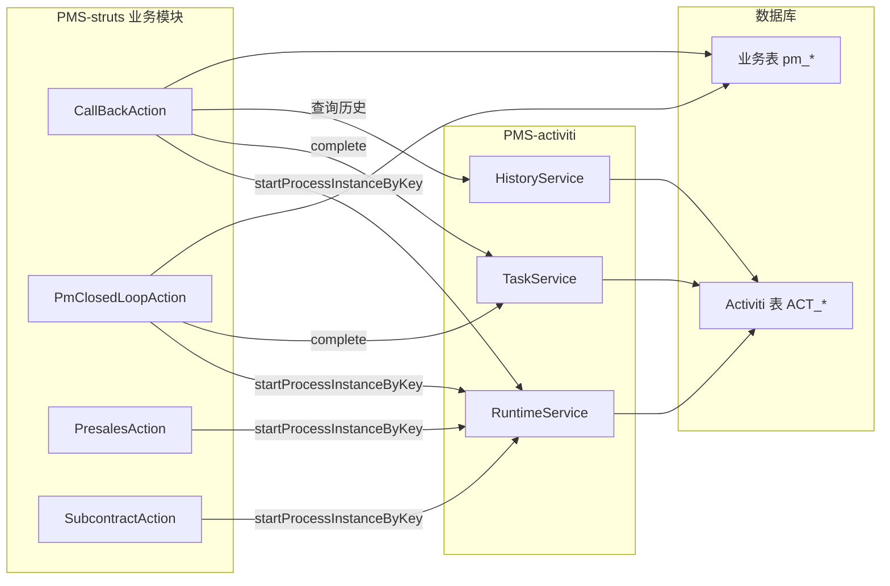

### 11.2 业务键关联

业务模块启动流程时传入 `businessKey`，作为业务表与流程实例的关联：

```java
// 业务模块代码示例
runtimeService.startProcessInstanceByKey(
    "CallBack",           // 流程定义键
    projectCode,          // businessKey（项目编号）
    variables             // 流程变量
);
```

**关联查询**：
```sql
SELECT 
    p.projectCode, p.projectName,
    h.ID_ as processInstanceId, h.START_TIME_, h.END_TIME_
FROM pm_project_header p
JOIN ACT_HI_PROCINST h ON h.BUSINESS_KEY_ = p.projectCode
WHERE h.PROC_DEF_ID_ LIKE 'CallBack:%';
```

---

## 12. 相关文档

- [crud-matrix.md](crud-matrix.md) — 模块-表 CRUD 矩阵
- [../03-database/er-diagram.md](../03-database/er-diagram.md) — ER 图
- [../03-database/unify-task-table.md](../03-database/unify-task-table.md) — 统一任务表
- [../02-modules/custom-commands.md](../02-modules/custom-commands.md) — 自定义命令
- [../02-modules/task-management.md](../02-modules/task-management.md) — 任务管理
- [../02-modules/process-instance-management.md](../02-modules/process-instance-management.md) — 流程实例管理
