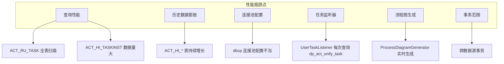

# PMS-activiti 性能优化指南

> 本文档针对 PMS-activiti 模块的性能优化提供指导，涵盖查询优化、历史数据清理、连接池配置、缓存策略等方面。
> 数据来源：`d:\常规软件\QoderCode\workspace\PMS\PMS-activiti\src\main\resources\` 配置文件与源码分析。

---

## 1. 性能瓶颈分析

### 1.1 常见性能瓶颈



### 1.2 性能指标基线

| 操作 | 期望响应时间 | 告警阈值 | 说明 |
|------|-------------|----------|------|
| 待办任务查询（10条） | < 200ms | > 1s | 单用户待办 |
| 流程启动 | < 500ms | > 2s | 含任务创建+监听器 |
| 任务办理 | < 300ms | > 1.5s | 含流转+下一任务创建 |
| 流程图生成 | < 1s | > 3s | 含 PNG 渲染 |
| 流程部署 | < 2s | > 5s | 含 BPMN 解析 |
| 历史查询（分页） | < 500ms | > 2s | 单用户历史 |

---

## 2. 查询性能优化

### 2.1 待办任务查询优化

**问题**：`ProcessService.findTodoTask()` 使用 `taskCandidateOrAssigned(userId)`，当任务量大时性能差。

**源码位置**：`d:\常规软件\QoderCode\workspace\PMS\PMS-activiti\src\main\java\com\dp\plat\activiti\service\impl\ProcessService.java`

**优化建议**：

1. **添加索引**（参见 [index-analysis.md](../03-database/index-analysis.md)）：
   ```sql
   CREATE INDEX idx_act_ru_task_assignee ON ACT_RU_TASK(ASSIGNEE_);
   CREATE INDEX idx_act_ru_task_assignee_create ON ACT_RU_TASK(ASSIGNEE_, CREATE_TIME_);
   ```

2. **分页查询**：使用 `listPage(firstResult, maxResults)` 而非 `list()`：
   ```java
   // 推荐
   taskService.createTaskQuery()
       .taskCandidateOrAssigned(userId)
       .active()
       .orderByTaskCreateTime().desc()
       .listPage(firstResult, maxResults);
   
   // 避免
   taskService.createTaskQuery()
       .taskCandidateOrAssigned(userId)
       .list();  // 全量加载
   ```

3. **限定流程定义**：如业务场景允许，通过 `processDefinitionKeyIn()` 缩小范围：
   ```java
   taskService.createTaskQuery()
       .taskCandidateOrAssigned(userId)
       .processDefinitionKeyIn(Arrays.asList("CallBack", "Subcontract"))
       .active()
       .listPage(firstResult, maxResults);
   ```

### 2.2 历史任务查询优化

**问题**：`ACT_HI_TASKINST` 表数据量大，按 `ASSIGNEE_` 查询无索引。

**优化建议**：

1. **添加索引**：
   ```sql
   CREATE INDEX idx_act_hi_taskinst_assignee ON ACT_HI_TASKINST(ASSIGNEE_);
   CREATE INDEX idx_act_hi_taskinst_assignee_end ON ACT_HI_TASKINST(ASSIGNEE_, END_TIME_);
   ```

2. **限定时间范围**：
   ```java
   historyService.createHistoricTaskInstanceQuery()
       .taskAssignee(userId)
       .finished()
       .taskCompletedAfter(date)  // 限定时间范围
       .orderByHistoricTaskInstanceEndTime().desc()
       .listPage(firstResult, maxResults);
   ```

3. **避免全量统计**：使用 `count()` 时确保有索引，避免 `COUNT(*)` 全表扫描。

### 2.3 流程实例查询优化

**优化建议**：

1. **按业务键查询**（已有索引 `ACT_UNIQ_EXEC_BUSINESS`）：
   ```java
   runtimeService.createProcessInstanceQuery()
       .processInstanceBusinessKey(businessKey)
       .singleResult();
   ```

2. **避免 LIKE 查询**：
   ```java
   // 避免
   runtimeService.createProcessInstanceQuery()
       .processInstanceBusinessKeyLike("%" + key + "%")
       .list();
   
   // 推荐：精确查询
   runtimeService.createProcessInstanceQuery()
       .processInstanceBusinessKey(key)
       .singleResult();
   ```

---

## 3. 历史数据清理

### 3.1 历史级别配置

**配置位置**：`d:\常规软件\QoderCode\workspace\PMS\PMS-activiti\src\main\resources\spring-activiti.xml`

当前配置：`history.level=full`（记录全部历史）

| 历史级别 | 记录内容 | 适用场景 | 数据量 |
|----------|----------|----------|--------|
| `none` | 不记录历史 | 性能优先，无需审计 | 最小 |
| `activity` | 流程实例+活动实例 | 需流程轨迹，不需变量 | 中等 |
| `audit` | +任务实例+身份关联 | 默认级别，满足大多数审计 | 较大 |
| `full` | +变量实例+详情+评论 | 完整审计（当前配置） | 最大 |

**优化建议**：如不需要变量变更详情，可降级为 `audit`：
```xml
<property name="historyLevel" value="AUDIT" />
```

### 3.2 定期清理策略

**清理脚本**（保留最近 6 个月）：

```sql
-- 1. 清理历史详情
DELETE FROM ACT_HI_DETAIL 
WHERE PROC_INSTANCE_ID_ IN (
    SELECT ID_ FROM ACT_HI_PROCINST 
    WHERE END_TIME_ < DATE_SUB(NOW(), INTERVAL 6 MONTH)
);

-- 2. 清理历史变量
DELETE FROM ACT_HI_VARINST 
WHERE PROC_INSTANCE_ID_ IN (
    SELECT ID_ FROM ACT_HI_PROCINST 
    WHERE END_TIME_ < DATE_SUB(NOW(), INTERVAL 6 MONTH)
);

-- 3. 清理历史评论
DELETE FROM ACT_HI_COMMENT 
WHERE PROC_INSTANCE_ID_ IN (
    SELECT ID_ FROM ACT_HI_PROCINST 
    WHERE END_TIME_ < DATE_SUB(NOW(), INTERVAL 6 MONTH)
);

-- 4. 清理历史身份关联
DELETE FROM ACT_HI_IDENTITYLINK 
WHERE PROC_INSTANCE_ID_ IN (
    SELECT ID_ FROM ACT_HI_PROCINST 
    WHERE END_TIME_ < DATE_SUB(NOW(), INTERVAL 6 MONTH)
);

-- 5. 清理历史活动
DELETE FROM ACT_HI_ACTINST 
WHERE PROC_INSTANCE_ID_ IN (
    SELECT ID_ FROM ACT_HI_PROCINST 
    WHERE END_TIME_ < DATE_SUB(NOW(), INTERVAL 6 MONTH)
);

-- 6. 清理历史任务
DELETE FROM ACT_HI_TASKINST 
WHERE PROC_INSTANCE_ID_ IN (
    SELECT ID_ FROM ACT_HI_PROCINST 
    WHERE END_TIME_ < DATE_SUB(NOW(), INTERVAL 6 MONTH)
);

-- 7. 清理历史流程实例（最后执行）
DELETE FROM ACT_HI_PROCINST 
WHERE END_TIME_ < DATE_SUB(NOW(), INTERVAL 6 MONTH);

-- 8. 清理孤立的字节数组
DELETE FROM ACT_GE_BYTEARRAY 
WHERE DEPLOYMENT_ID_ IS NOT NULL 
  AND DEPLOYMENT_ID_ NOT IN (SELECT ID_ FROM ACT_RE_DEPLOYMENT);
```

**清理建议**：
- 每月执行一次，避开业务高峰（建议凌晨 2-4 点）
- 分批删除，每批 1000 条，避免锁表
- 删除前备份

### 3.3 分批删除脚本示例

```sql
-- 分批删除历史流程实例（每批 1000 条）
SET @batch_size = 1000;
SET @total = (SELECT COUNT(*) FROM ACT_HI_PROCINST WHERE END_TIME_ < DATE_SUB(NOW(), INTERVAL 6 MONTH));

WHILE @total > 0 DO
    DELETE FROM ACT_HI_PROCINST 
    WHERE END_TIME_ < DATE_SUB(NOW(), INTERVAL 6 MONTH)
    LIMIT @batch_size;
    
    SET @total = @total - @batch_size;
    COMMIT;
    -- 间隔 1 秒，减少锁竞争
    DO SLEEP(1);
END WHILE;
```

---

## 4. 连接池优化

### 4.1 当前配置

**配置位置**：`d:\常规软件\QoderCode\workspace\PMS\PMS-activiti\src\main\resources\db.properties`

```properties
db.type=mysql
db.driver=com.mysql.jdbc.Driver
db.url=jdbc:mysql://10.102.0.106:3306/activiti
db.username=xxx
db.password=xxx
```

PMS-activiti 使用 `org.apache.commons.dbcp.BasicDataSource`（参见 `spring-activiti.xml`）。

### 4.2 连接池参数优化

```xml
<bean id="dataSource" class="org.apache.commons.dbcp.BasicDataSource">
    <property name="driverClassName" value="${db.driver}" />
    <property name="url" value="${db.url}" />
    <property name="username" value="${db.username}" />
    <property name="password" value="${db.password}" />
    
    <!-- 连接池大小 -->
    <property name="initialSize" value="5" />        <!-- 初始连接数 -->
    <property name="maxActive" value="50" />         <!-- 最大活跃连接数 -->
    <property name="maxIdle" value="20" />           <!-- 最大空闲连接数 -->
    <property name="minIdle" value="5" />            <!-- 最小空闲连接数 -->
    
    <!-- 超时配置 -->
    <property name="maxWait" value="10000" />        <!-- 获取连接超时（ms） -->
    <property name="removeAbandonedTimeout" value="300" /> <!-- 连接泄漏超时（秒） -->
    
    <!-- 连接有效性检查 -->
    <property name="testWhileIdle" value="true" />
    <property name="testOnBorrow" value="false" />
    <property name="testOnReturn" value="false" />
    <property name="validationQuery" value="SELECT 1" />
    <property name="timeBetweenEvictionRunsMillis" value="60000" />
    <property name="minEvictableIdleTimeMillis" value="300000" />
    
    <!-- 连接泄漏检测 -->
    <property name="removeAbandoned" value="true" />
    <property name="logAbandoned" value="true" />
</bean>
```

### 4.3 参数调优建议

| 参数 | 推荐值 | 说明 |
|------|--------|------|
| `initialSize` | 5 | 启动时建立 5 个连接，避免冷启动 |
| `maxActive` | 50 | 根据并发量调整，避免过大导致数据库压力 |
| `maxIdle` | 20 | 空闲连接数，减少连接创建开销 |
| `maxWait` | 10000 | 10 秒超时，避免长时间阻塞 |
| `testWhileIdle` | true | 空闲时检查连接有效性 |
| `removeAbandoned` | true | 开启连接泄漏检测 |
| `removeAbandonedTimeout` | 300 | 5 分钟未归还视为泄漏 |

---

## 5. 任务监听器优化

### 5.1 UserTaskListener 缓存优化

**问题**：`UserTaskListener.notify()` 每次任务创建都查询 `dp_act_unify_task` 表。

**源码位置**：`d:\常规软件\QoderCode\workspace\PMS\PMS-activiti\src\main\java\com\dp\plat\activiti\process\listener\UserTaskListener.java`

**优化方案**：引入本地缓存（如 Guava Cache 或 Spring Cache）：

```java
@Component("userTaskListener")
public class UserTaskListener implements TaskListener {
    
    @Autowired
    private IActUserTaskService actUserTaskService;
    
    // 使用 Guava Cache 缓存 10 分钟
    private LoadingCache<String, List<ActUserTask>> cache = CacheBuilder.newBuilder()
            .expireAfterWrite(10, TimeUnit.MINUTES)
            .build(new CacheLoader<String, List<ActUserTask>>() {
                @Override
                public List<ActUserTask> load(String procDefKey) {
                    return actUserTaskService.selectByProcessDefinitionKey(procDefKey);
                }
            });
    
    @Override
    public void notify(DelegateTask delegateTask) {
        String processDefinitionKey = ...;
        try {
            List<ActUserTask> taskList = cache.get(processDefinitionKey);
            // 后续逻辑不变
        } catch (Exception e) {
            // 缓存失败时回退到直接查询
            List<ActUserTask> taskList = actUserTaskService.selectByProcessDefinitionKey(processDefinitionKey);
        }
    }
}
```

**注意事项**：
- 修改 `dp_act_unify_task` 后需手动清除缓存：`cache.invalidate(procDefKey)`
- 缓存时间不宜过长（建议 10-30 分钟），避免配置变更不及时生效

### 5.2 监听器异常处理优化

**问题**：当前 `UserTaskListener` catch 异常后仅 `printStackTrace()`，可能掩盖配置错误。

**优化建议**：
```java
@Override
public void notify(DelegateTask delegateTask) {
    try {
        // 业务逻辑
    } catch (Exception e) {
        logger.error("任务分配失败: procDefKey={}, taskDefKey={}", 
            processDefinitionKey, taskDefinitionKey, e);
        // 可选：抛出运行时异常，让流程引擎感知
        // throw new ActivitiException("任务分配失败", e);
    }
}
```

---

## 6. 流程图生成优化

### 6.1 问题分析

**问题**：`ProcessDiagramGenerator` 每次查看流程图都实时生成 PNG，CPU 开销大。

**源码位置**：`d:\常规软件\QoderCode\workspace\PMS\PMS-activiti\src\main\java\com\dp\plat\activiti\controller\ProcessInstanceController.java`

### 6.2 优化方案

1. **静态流程图缓存**：流程部署时预生成流程图 PNG，缓存到文件系统：
   ```java
   // 部署时生成静态流程图
   BpmnModel bpmnModel = repositoryService.getBpmnModel(processDefinitionId);
   InputStream png = processDiagramGenerator.generateDiagram(bpmnModel, "宋体", "宋体", "宋体");
   Files.copy(png, Paths.get("/data/activiti/diagram/" + processDefinitionId + ".png"));
   ```

2. **运行时流程图按需生成**：仅高亮当前节点，复用静态底图：
   ```java
   // 读取静态底图
   BufferedImage baseImage = ImageIO.read(new File("/data/activiti/diagram/" + procDefId + ".png"));
   // 仅绘制高亮节点
   // ...
   ```

3. **CDN 缓存**：流程图 URL 加版本号，浏览器缓存：
   ```
   /processInstance/diagram?processInstanceId=xxx&v=时间戳
   ```

---

## 7. 事务优化

### 7.1 事务范围控制

**问题**：`ProcessService` 方法事务范围过大，包含多次数据库操作。

**优化建议**：

1. **细分事务边界**：将查询操作移出事务：
   ```java
   @Transactional(readOnly = true)
   public Page<BaseVO> findTodoTask(String userId, int page) {
       // 查询操作，只读事务
   }
   
   @Transactional(rollbackFor = Exception.class)
   public void complete(String taskId, Map<String, Object> variables) {
       // 写操作，读写事务
   }
   ```

2. **避免长事务**：流程启动时避免在事务内调用外部系统：
   ```java
   @Transactional(rollbackFor = Exception.class)
   public String startProcess(String key, String businessKey, Map<String, Object> vars) {
       // 仅 Activiti 操作在事务内
       ProcessInstance pi = runtimeService.startProcessInstanceByKey(key, businessKey, vars);
       return pi.getId();
   }
   // 外部系统调用在事务外
   public void startProcessAndNotify(String key, String businessKey, Map<String, Object> vars) {
       String processInstanceId = startProcess(key, businessKey, vars);
       notifyExternalSystem(processInstanceId);  // 事务外调用
   }
   ```

### 7.2 批量操作优化

**问题**：批量完成任务时，每次调用 `taskService.complete()` 都开启事务。

**优化建议**：
```java
@Transactional(rollbackFor = Exception.class)
public void batchComplete(List<String> taskIds, Map<String, Object> variables) {
    for (String taskId : taskIds) {
        taskService.complete(taskId, variables);
    }
}
```

---

## 8. JVM 调优

### 8.1 推荐 JVM 参数

```bash
-Xms2g -Xmx2g                    # 堆内存 2G
-XX:NewRatio=2                    # 新生代:老年代 = 1:2
-XX:SurvivorRatio=8               # Eden:Survivor = 8:1
-XX:+UseG1GC                      # 使用 G1 收集器
-XX:MaxGCPauseMillis=200          # 最大 GC 停顿 200ms
-XX:+HeapDumpOnOutOfMemoryError   # OOM 时 dump
-XX:HeapDumpPath=/data/logs/      # dump 路径
-Dfile.encoding=UTF-8             # 编码
```

### 8.2 监控指标

| 指标 | 告警阈值 | 说明 |
|------|----------|------|
| 堆内存使用率 | > 80% | 可能 OOM |
| GC 频率 | Full GC > 1次/小时 | 老年代空间不足 |
| GC 停顿时间 | > 500ms | 影响响应 |
| 线程数 | > 500 | 可能线程泄漏 |
| 活跃数据库连接 | > 40 (maxActive=50) | 连接池接近耗尽 |

---

## 9. 性能测试

### 9.1 压测建议

| 场景 | 并发用户数 | 期望 TPS | 期望响应时间 |
|------|-----------|----------|-------------|
| 待办查询 | 100 | > 200 | < 200ms |
| 流程启动 | 50 | > 30 | < 500ms |
| 任务办理 | 100 | > 50 | < 300ms |
| 流程图生成 | 20 | > 10 | < 1s |

### 9.2 压测工具

- **JMeter**：模拟并发用户，测试接口 TPS
- **Druid**：监控 SQL 执行时间与频率
- **Arthas**：在线诊断方法耗时

---

## 10. 性能优化检查清单

- [ ] 为 `ACT_RU_TASK.ASSIGNEE_` 添加索引
- [ ] 为 `ACT_HI_TASKINST.ASSIGNEE_` 添加索引
- [ ] 为 `dp_act_unify_task.PROC_DEF_KEY` 添加索引
- [ ] 配置历史数据定期清理任务
- [ ] 评估历史级别是否可降级为 `audit`
- [ ] 连接池参数调优（`maxActive`, `maxWait`）
- [ ] `UserTaskListener` 引入缓存
- [ ] 流程图生成优化（静态缓存）
- [ ] 事务范围细分（只读事务）
- [ ] JVM 参数调优（G1GC, 堆大小）
- [ ] 配置性能监控告警

---

## 11. 相关文档

- [coding-standards.md](coding-standards.md) — 编码规范
- [security-practices.md](security-practices.md) — 安全实践
- [troubleshooting.md](troubleshooting.md) — 故障排查
- [../03-database/index-analysis.md](../03-database/index-analysis.md) — 索引分析
- [../01-architecture/database-configuration.md](../01-architecture/database-configuration.md) — 数据库配置
