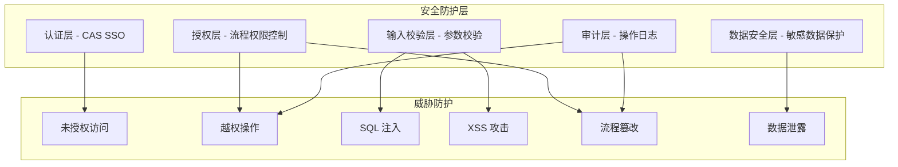

# PMS-activiti 安全实践指南

> 本文档描述 PMS-activiti 模块的安全实践，涵盖流程权限控制、数据安全、输入校验、审计日志等方面。
> 数据来源：`d:\常规软件\QoderCode\workspace\PMS\PMS-activiti\src\main\java\com\dp\plat\activiti\` 源码。

> ⚠️ **重要声明**（2026-07-01 审查）：本文档中的 `CustomRuntimeException` 用法为**教学化示例**，PMS-activiti 源码中**不使用** `CustomRuntimeException`（该类存在于 core 模块但 PMS-activiti 未引用）。源码实际异常处理：Controller 层使用 try-catch + `ExceptionHandler.insertException(e)` 捕获 Activiti 原生异常。PMS-activiti 自定义异常类为 `CustomActivitiException`（继承 `ActivitiException`），仅在 `WithdrawTaskCmd` 中使用。本文档中的安全实践示例仅作为设计参考，不代表源码实际实现。

---

## 1. 安全架构概览



---

## 2. 流程权限控制

### 2.1 任务办理权限

**原则**：只有任务的 `assignee` 或 `candidateUser/candidateGroup` 才能办理任务。

**源码实现**：`ProcessService.complete()` 应校验当前用户是否有权办理。

```java
@Service
public class ProcessService {
    
    public void complete(String taskId, Map<String, Object> variables, String comment) {
        Task task = taskService.createTaskQuery()
            .taskId(taskId)
            .taskCandidateOrAssigned(currentUserId())
            .singleResult();
        
        if (task == null) {
            throw new CustomRuntimeException("无权办理此任务");
        }
        
        // 办理任务
        taskService.addComment(taskId, task.getProcessInstanceId(), comment);
        taskService.complete(taskId, variables);
    }
}
```

**安全检查清单**：
- [ ] `complete` 校验当前用户是 assignee 或候选人
- [ ] `claim` 校验当前用户是候选人
- [ ] `delegate` 校验当前用户是 assignee
- [ ] `transfer` 校验当前用户是 assignee

### 2.2 流程实例操作权限

**原则**：只有流程发起人或管理员才能终止流程。

```java
public void terminateProcess(String processInstanceId, String reason) {
    HistoricProcessInstance instance = historyService.createHistoricProcessInstanceQuery()
        .processInstanceId(processInstanceId)
        .singleResult();
    
    if (instance == null) {
        throw new CustomRuntimeException("流程实例不存在");
    }
    
    // 校验权限：发起人或管理员
    String startUserId = instance.getStartUserId();
    if (!currentUserId().equals(startUserId) && !isAdmin()) {
        throw new CustomRuntimeException("无权终止此流程");
    }
    
    runtimeService.deleteProcessInstance(processInstanceId, reason);
}
```

### 2.3 流程定义管理权限

**原则**：只有管理员才能部署/删除流程定义。

```java
@Controller
@RequestMapping("/processDefinition")
public class ProcessDefinitionController {
    
    @RequestMapping("/deploy")
    public String deploy(@RequestParam MultipartFile file) {
        // 校验管理员权限
        if (!isAdmin()) {
            throw new CustomRuntimeException("无权部署流程定义");
        }
        // 部署逻辑
    }
    
    @RequestMapping("/delete")
    public String delete(@RequestParam String deploymentId) {
        // 校验管理员权限
        if (!isAdmin()) {
            throw new CustomRuntimeException("无权删除流程定义");
        }
        // 删除逻辑
    }
}
```

### 2.4 统一任务表配置权限

**原则**：`dp_act_unify_task` 表的增删改操作仅限管理员。

```java
@Controller
@RequestMapping("/actUserTask")
public class ActUserTaskController {
    
    @RequestMapping("/save")
    public String save(ActUserTask actUserTask) {
        if (!isAdmin()) {
            throw new CustomRuntimeException("无权配置任务分配规则");
        }
        actUserTaskService.insertOrUpdate(actUserTask);
        return "success";
    }
}
```

---

## 3. 数据安全

### 3.1 敏感数据保护

**数据库连接信息加密**：

**当前配置**（`db.properties`）：明文存储
```properties
db.username=root
db.password=123456
```

**安全建议**：使用密文存储，启动时解密：
```properties
db.username=ENC(xxxxxx)
db.password=ENC(yyyyyy)
```

```java
// 使用 Jasypt 解密
@Configuration
public class DataSourceConfig {
    @Value("${db.username}")
    private String encryptedUsername;
    
    @Bean
    public DataSource dataSource() {
        StandardPBEStringEncryptor encryptor = new StandardPBEStringEncryptor();
        encryptor.setPassword(System.getProperty("jasypt.password"));
        
        BasicDataSource ds = new BasicDataSource();
        ds.setUsername(encryptor.decrypt(encryptedUsername));
        // ...
        return ds;
    }
}
```

### 3.2 流程变量数据保护

**问题**：流程变量中可能包含敏感信息（如金额、客户信息），存储在 `ACT_RU_VARIABLE.TEXT_` 明文。

**安全建议**：

1. **敏感变量加密存储**：
   ```java
   public void startProcess(String key, Map<String, Object> variables) {
       Map<String, Object> encryptedVars = new HashMap<>();
       for (Map.Entry<String, Object> entry : variables.entrySet()) {
           if (isSensitive(entry.getKey())) {
               encryptedVars.put(entry.getKey(), encrypt(entry.getValue().toString()));
           } else {
               encryptedVars.put(entry.getKey(), entry.getValue());
           }
       }
       runtimeService.startProcessInstanceByKey(key, encryptedVars);
   }
   ```

2. **日志脱敏**：日志中不输出流程变量内容：
   ```java
   // 错误
   logger.info("启动流程，变量: {}", variables);
   
   // 正确
   logger.info("启动流程: key={}, businessKey={}", key, businessKey);
   ```

### 3.3 流程图访问控制

**问题**：流程图可能泄露审批人信息。

**安全建议**：
```java
@RequestMapping("/diagram")
public void diagram(String processInstanceId, HttpServletResponse response) {
    // 校验当前用户是否有权查看此流程
    HistoricProcessInstance instance = historyService.createHistoricProcessInstanceQuery()
        .processInstanceId(processInstanceId)
        .singleResult();
    
    if (instance == null) {
        throw new CustomRuntimeException("流程实例不存在");
    }
    
    // 校验权限：发起人、参与者或管理员
    if (!hasAccessRight(instance, currentUserId())) {
        throw new CustomRuntimeException("无权查看此流程图");
    }
    
    // 生成流程图
    InputStream diagram = generateDiagram(processInstanceId);
    // 输出
}
```

---

## 4. 输入校验

### 4.1 SQL 注入防护

**MyBatis 参数化查询**：PMS-activiti 使用 MyBatis，默认参数化查询，防止 SQL 注入。

**正确示例**（`ActUserTaskMapper.xml`）：
```xml
<select id="selectByProcessDefinitionKey" parameterType="string" resultMap="BaseResultMap">
    SELECT ID, PROC_DEF_KEY, ... FROM dp_act_unify_task
    WHERE PROC_DEF_KEY = #{procDefKey,jdbcType=VARCHAR}
</select>
```

**错误示例**（禁止）：
```xml
<!-- 禁止使用 ${} 拼接 SQL -->
<select id="selectByProcessDefinitionKey">
    SELECT * FROM dp_act_unify_task WHERE PROC_DEF_KEY = '${procDefKey}'
</select>
```

### 4.2 XSS 防护

**审批意见 XSS 防护**：

```java
public void complete(String taskId, String comment, Map<String, Object> variables) {
    // 对审批意见进行 XSS 过滤
    String safeComment = XssFilter.clean(comment);
    taskService.addComment(taskId, processInstanceId, safeComment);
    taskService.complete(taskId, variables);
}
```

**XSS 过滤工具类**：
```java
public class XssFilter {
    private static final Pattern[] PATTERNS = {
        Pattern.compile("<script.*?>.*?</script>", Pattern.CASE_INSENSITIVE),
        Pattern.compile("javascript:", Pattern.CASE_INSENSITIVE),
        Pattern.compile("on\\w+\\s*=", Pattern.CASE_INSENSITIVE)
    };
    
    public static String clean(String value) {
        if (value == null) return null;
        String result = value;
        for (Pattern pattern : PATTERNS) {
            result = pattern.matcher(result).replaceAll("");
        }
        return result;
    }
}
```

### 4.3 文件上传校验

**流程部署文件校验**：

```java
@RequestMapping("/deploy")
public String deploy(@RequestParam MultipartFile file) {
    // 1. 校验文件大小
    if (file.getSize() > 10 * 1024 * 1024) {  // 10MB
        throw new CustomRuntimeException("文件大小超过限制");
    }
    
    // 2. 校验文件类型
    String filename = file.getOriginalFilename();
    if (!filename.endsWith(".bpmn") && !filename.endsWith(".zip") && !filename.endsWith(".xml")) {
        throw new CustomRuntimeException("仅支持 BPMN/XML/ZIP 文件");
    }
    
    // 3. 校验文件内容（BPMN XML 格式）
    try {
        byte[] content = file.getBytes();
        String xmlContent = new String(content, "UTF-8");
        if (!xmlContent.contains("<definitions") && !xmlContent.contains("<process")) {
            throw new CustomRuntimeException("文件内容不是有效的 BPMN XML");
        }
    } catch (IOException e) {
        throw new CustomRuntimeException("文件读取失败");
    }
    
    // 4. 部署
    repositoryService.createDeployment()
        .addInputStream(filename, new ByteArrayInputStream(file.getBytes()))
        .deploy();
    
    return "success";
}
```

### 4.4 参数校验

**Controller 参数校验**：

```java
@RequestMapping("/complete")
@ResponseBody
public Result<?> complete(
        @RequestParam @NotBlank String taskId,
        @RequestParam @NotNull Integer result,
        @RequestParam(required = false) String comment) {
    
    // 校验 result 取值范围
    if (result != 1 && result != -1 && result != -2 && result != 2) {
        return Result.fail("无效的审批结果");
    }
    
    // 校验 comment 长度
    if (comment != null && comment.length() > 1000) {
        return Result.fail("审批意见长度超过限制");
    }
    
    processService.complete(taskId, variables, comment);
    return Result.success();
}
```

---

## 5. 流程定义安全

### 5.1 BPMN 文件完整性校验

**问题**：恶意 BPMN 文件可能包含危险脚本（如 `scriptTask` 执行任意代码）。

**安全建议**：

1. **禁用 ScriptTask**：在流程部署时校验 BPMN 是否包含 `scriptTask`：
   ```java
   public void deploy(MultipartFile file) {
       BpmnModel model = new BpmnXMLConverter().convertToBpmnModel(
           new InputStreamSource(file.getInputStream()));
       
       for (Process process : model.getProcesses()) {
           for (FlowElement element : process.getFlowElements()) {
               if (element instanceof ScriptTask) {
                   throw new CustomRuntimeException("禁止使用 ScriptTask");
               }
           }
       }
       
       // 部署
       repositoryService.createDeployment()...deploy();
   }
   ```

2. **限制表达式权限**：BPMN 中的 `${}` 表达式可访问流程变量，需限制可访问的类：
   ```xml
   <!-- spring-activiti.xml -->
   <property name="beans">
       <map>
           <!-- 仅暴露安全的 Bean -->
           <entry key="processService" value-ref="processService" />
       </map>
   </property>
   ```

### 5.2 流程定义版本控制

**问题**：流程定义可被重复部署，版本号自增。

**安全建议**：
- 部署前校验流程定义是否已存在
- 禁止删除正在使用的流程定义
- 流程定义变更需审批

```java
public void deploy(MultipartFile file) {
    // 解析流程定义 Key
    String processKey = parseProcessKey(file);
    
    // 校验是否已存在
    List<ProcessDefinition> existing = repositoryService.createProcessDefinitionQuery()
        .processDefinitionKey(processKey)
        .latestVersion()
        .list();
    
    if (!existing.isEmpty()) {
        logger.warn("流程定义 {} 已存在，将创建新版本", processKey);
    }
    
    // 部署
    repositoryService.createDeployment()...deploy();
}
```

---

## 6. 审计日志

### 6.1 操作日志记录

**关键操作需记录审计日志**：

| 操作 | 日志内容 | 日志级别 |
|------|----------|----------|
| 流程部署 | 部署人、流程Key、版本号 | INFO |
| 流程启动 | 启动人、流程Key、businessKey | INFO |
| 任务办理 | 办理人、taskId、result、comment | INFO |
| 任务签收 | 签收人、taskId | INFO |
| 任务委托 | 委托人、taskId、toUserId | INFO |
| 任务转办 | 转办人、taskId、toUserId | INFO |
| 任务撤回 | 撤回人、processInstanceId | WARN |
| 任务跳转 | 跳转人、taskId、targetActivityId | WARN |
| 流程终止 | 终止人、processInstanceId、reason | WARN |
| 流程定义删除 | 删除人、deploymentId | WARN |

### 6.2 审计日志实现

```java
@Aspect
@Component
public class WorkflowAuditAspect {
    
    private static final Logger logger = Logger.getLogger(WorkflowAuditAspect.class);
    
    @AfterReturning(pointcut = "execution(* com.dp.plat.activiti.service.impl.ProcessService.complete(..)) && args(taskId, variables, comment)")
    public void logComplete(String taskId, Map<String, Object> variables, String comment) {
        String userId = UserContext.getCurrentUserId();
        String processInstanceId = taskService.createTaskQuery().taskId(taskId).singleResult().getProcessInstanceId();
        
        logger.info(String.format("[AUDIT] 任务办理: user=%s, taskId=%s, processInstanceId=%s, result=%s, comment=%s",
            userId, taskId, processInstanceId, variables.get("result"), comment));
    }
    
    @AfterReturning(pointcut = "execution(* com.dp.plat.activiti.service.impl.ProcessService.revoke(..)) && args(processInstanceId)")
    public void logRevoke(String processInstanceId) {
        String userId = UserContext.getCurrentUserId();
        logger.warn(String.format("[AUDIT] 任务撤回: user=%s, processInstanceId=%s", userId, processInstanceId));
    }
}
```

### 6.3 审计日志存储

**建议**：审计日志独立存储，避免与应用日志混淆。

```sql
CREATE TABLE act_audit_log (
    ID BIGINT AUTO_INCREMENT PRIMARY KEY,
    OPERATE_TIME DATETIME NOT NULL COMMENT '操作时间',
    USER_ID VARCHAR(64) NOT NULL COMMENT '操作人',
    USER_NAME VARCHAR(100) COMMENT '操作人姓名',
    OPERATION VARCHAR(50) NOT NULL COMMENT '操作类型',
    TARGET_TYPE VARCHAR(50) COMMENT '目标类型',
    TARGET_ID VARCHAR(64) COMMENT '目标ID',
    PROCESS_INSTANCE_ID VARCHAR(64) COMMENT '流程实例ID',
    DETAIL TEXT COMMENT '操作详情',
    IP_ADDRESS VARCHAR(50) COMMENT 'IP地址',
    INDEX idx_user_time (USER_ID, OPERATE_TIME),
    INDEX idx_process (PROCESS_INSTANCE_ID),
    INDEX idx_operate_time (OPERATE_TIME)
) ENGINE=InnoDB DEFAULT CHARSET=utf8mb4 COMMENT='工作流审计日志';
```

---

## 7. 网络安全

### 7.1 接口访问控制

**建议**：所有 Controller 接口通过 Spring 拦截器校验登录状态：

```xml
<!-- spring-activiti-mvc.xml -->
<mvc:interceptors>
    <mvc:interceptor>
        <mvc:mapping path="/**"/>
        <mvc:exclude-mapping path="/login"/>
        <mvc:exclude-mapping path="/resources/**"/>
        <bean class="com.dp.plat.activiti.interceptor.LoginInterceptor"/>
    </mvc:interceptor>
</mvc:interceptors>
```

### 7.2 CSRF 防护

**建议**：对状态变更操作启用 CSRF Token：

```java
@Controller
@RequestMapping("/task")
public class TaskController {
    
    @RequestMapping("/complete")
    @ResponseBody
    public Result<?> complete(
            @RequestParam String taskId,
            @RequestHeader("X-CSRF-Token") String csrfToken) {
        
        // 校验 CSRF Token
        if (!validateCsrfToken(csrfToken)) {
            return Result.fail("CSRF 校验失败");
        }
        
        // 业务逻辑
    }
}
```

### 7.3 HTTPS 强制

**建议**：生产环境强制 HTTPS：

```xml
<!-- web.xml -->
<security-constraint>
    <web-resource-collection>
        <web-resource-name>HTTPS</web-resource-name>
        <url-pattern>/*</url-pattern>
    </web-resource-collection>
    <user-data-constraint>
        <transport-guarantee>CONFIDENTIAL</transport-guarantee>
    </user-data-constraint>
</security-constraint>
```

---

## 8. 安全检查清单

### 8.1 权限控制

- [ ] 任务办理校验 assignee/candidate 权限
- [ ] 流程终止校验发起人/管理员权限
- [ ] 流程定义部署/删除校验管理员权限
- [ ] `dp_act_unify_task` 配置校验管理员权限
- [ ] 流程图查看校验参与人权限

### 8.2 数据安全

- [ ] 数据库密码密文存储
- [ ] 流程变量敏感信息加密
- [ ] 日志中不输出敏感数据
- [ ] 流程图不泄露非参与人信息

### 8.3 输入校验

- [ ] MyBatis 参数化查询（禁止 `${}`）
- [ ] 审批意见 XSS 过滤
- [ ] 文件上传校验（大小、类型、内容）
- [ ] Controller 参数校验（`@NotBlank`, `@NotNull`）

### 8.4 流程安全

- [ ] 禁用 `ScriptTask`
- [ ] 限制表达式可访问的 Bean
- [ ] 流程定义变更需审批
- [ ] 禁止删除正在使用的流程定义

### 8.5 审计日志

- [ ] 关键操作记录审计日志
- [ ] 审计日志独立存储
- [ ] 审计日志包含操作人、时间、IP
- [ ] 审计日志不可篡改

### 8.6 网络安全

- [ ] 接口登录状态校验
- [ ] CSRF Token 防护
- [ ] 生产环境 HTTPS
- [ ] 接口限流（防暴力攻击）

---

## 9. 相关文档

- [coding-standards.md](coding-standards.md) — 编码规范
- [performance-optimization.md](performance-optimization.md) — 性能优化
- [troubleshooting.md](troubleshooting.md) — 故障排查
- [../06-reference/error-codes.md](../06-reference/error-codes.md) — 错误码
