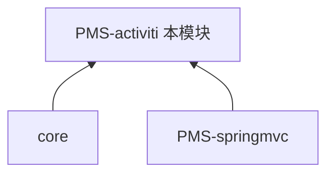

# PMS-activiti 模块知识库

> DPtech PMS **工作流引擎模块**。基于 Activiti 5.23.0，为 PMS 系统的闭环审批、转包审批、售前审批等业务流程提供引擎支撑。本知识库独立维护。

---

## 模块定位

| 项 | 值 |
|----|----|
| 目录 | `PMS/PMS-activiti/` |
| artifactId | `pms-activiti` |
| 基础包 | `com.dp.plat.activiti` |
| 技术栈 | Activiti 5.23.0 + Spring + MyBatis |
| 打包类型 | war+jar（可独立部署为工作流管理 Web 应用） |
| 职责 | 流程定义部署、流程实例管理、任务查询/签收/委托、流程监控 |

### 依赖关系

> PMS-springmvc 的工作流模块（WorkFlowController）调用 PMS-activiti 的引擎服务；业务流程（闭环/转包/售前）由 PMS-struts 发起，经 Activiti 引擎流转。

---

## 文档目录

| 章节 | 内容 |
|------|------|
| [01-architecture](01-architecture/) | 系统架构、Activiti 配置、流程引擎组件 |
| [02-modules](02-modules/) | 工作流功能说明、Service 方法参考 |
| [03-database](03-database/) | 数据字典（act_* 引擎表）、数据库概览 |
| [04-mapping](04-mapping/) | 功能-表 CRUD 矩阵 |
| [05-standards](05-standards/) | 编码规范 |
| [06-reference](06-reference/) | 代码示例 |

---

## 跨库知识共享

- 业务流程发起方：[PMS-struts 工作流](../../PMS-struts/docs/02-modules/workflow.md)
- 工作流调用方：[PMS-springmvc 工作流](../../PMS-springmvc/docs/02-modules/workflow.md)
- 引擎表（act_*）：全量字典见 [PMS-struts/03-database/database_dict final.md](../../PMS-struts/docs/03-database/database_dict%20final.md)
- 基础框架：[core](../../core/docs/README.md)
