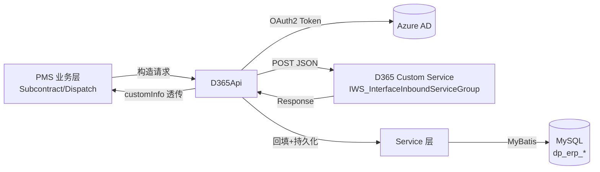
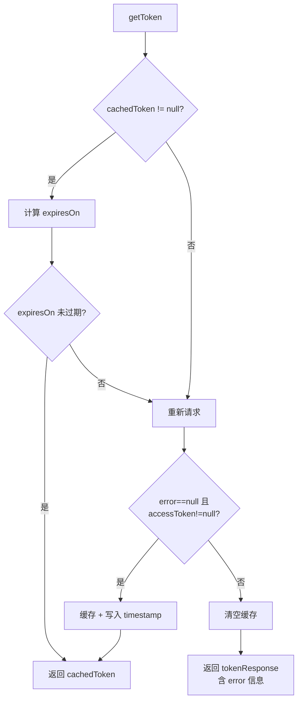
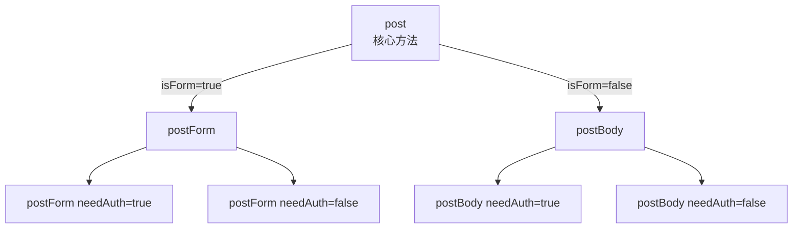

# D365 API 架构

> 本文档基于 `com.dp.plat.pms.extend.d365.util.D365Api` 实际源码编写。
> 注意：早期版本的 `system-architecture.md` 与 `d365-integration.md` 中描述的 `getToken(String username, String password)`、`D365Exception` 等均属虚构，实际源码中不存在。本文档已纠正。

---

## 1. 架构概览

PMS-ext-d365 通过 `D365Api` 工具类与 Microsoft Dynamics 365（D365）ERP 系统交互。整体架构为**推送式集成**：PMS 业务侧主动调用 D365 自定义服务（Custom Service）完成采购订单创建、采购收货创建、合同验收节点回写，并将 D365 返回的回执数据回填到本地数据库。



---

## 2. OAuth2 认证机制

### 2.1 认证方式

D365 集成使用 **Azure AD OAuth2 client_credentials 授权模式**（非用户名密码模式）。模块作为后台服务直接以应用身份获取访问令牌，无需用户交互。

### 2.2 配置参数

配置通过 `Map<String, Object> config` 传入 `D365Api.initConfig(config)`，通过反射设置到 `D365Api` 的静态 String 字段：

| 配置项 | 说明 | 示例值 |
|--------|------|--------|
| `appId` | Azure AD 租户/应用注册 ID（用于填充 tokenUrl 模板） | `1402f304-d45a-48fa-8ad7-920a9acd8800` |
| `clientId` | 应用（客户端）ID | `69d7585c-1665-4013-a8fe-08c9eff4f287` |
| `clientSecret` | 应用密钥 | `F-58Q~...` |
| `grantType` | 授权类型，固定 `client_credentials` | `client_credentials` |
| `resource` | 目标资源（可选，缺省取 serviceUrl） | D365 实例 URL |
| `tokenUrl` | Token 端点模板（含 `%s` 占位符，由 appId 填充） | `https://login.microsoftonline.com/%s/oauth2/token` |
| `serviceUrl` | D365 服务基础 URL | `https://usnconeboxax1aos.cloud.onebox.dynamics.com` |
| `createPOUrl` | 创建采购订单接口路径 | `/api/services/IWS_InterfaceInboundServiceGroup/CreatePurchTable/create` |
| `receiptPOUrl` | 创建采购收货接口路径 | `/api/services/IWS_InterfaceInboundServiceGroup/CreatePurchPackingSlip/create` |
| `paymentSchedUrl` | 合同付款计划（验收交付）接口路径 | 配置项 |

> ⚠️ `initConfig` 末尾会执行 `tokenUrl = String.format(tokenUrl, appId)`，因此 `tokenUrl` 必须含 `%s` 占位符，否则会抛出 `IllegalFormatException`。

### 2.3 Token 请求

Token 请求体（`TokenRequest`，继承 `Request<TokenResponse>`）以 **form 表单**形式 POST 到 `tokenUrl`：

| 字段 | JSON 名称 | 说明 |
|------|-----------|------|
| resource | `resource` | 目标资源 |
| clientSecret | `client_secret` | 应用密钥 |
| clientId | `client_id` | 应用 ID |
| grantType | `grant_type` | `client_credentials` |

请求通过 `postForm(tokenUrl, request, false)` 发送，`needAuth=false` 表示该请求本身不需要 Authorization 头。

### 2.4 Token 响应

`TokenResponse` 关键字段：

| 字段 | JSON 名称 | 说明 |
|------|-----------|------|
| tokenType | `token_type` | 令牌类型（如 `Bearer`） |
| accessToken | `access_token` | 访问令牌 |
| expiresIn | `expires_in` | 有效期（秒） |
| expiresOn | `expires_on` | 过期时间戳（秒） |
| error | `error` | 错误标识 |
| errorDescription | `error_description` | 错误描述 |
| timestamp | `timestamp` | 本地记录的获取时间戳（毫秒，由代码写入） |

### 2.5 Token 缓存

`D365Api` 使用 `volatile TokenResponse cachedToken` 缓存令牌，避免每次调用都重新获取：



过期判断逻辑（`getToken()` 第 122-139 行）：
1. 若 `expiresOn` 为空但 `expiresIn` 非空，则按 `timestamp/1000 + expiresIn` 计算并回填 `expiresOn`；
2. 将 `expiresOn`（秒）转为毫秒，与当前时间比较；
3. 未过期则返回缓存，过期或异常则重新请求。

> ⚠️ 缓存为进程级单例（静态字段），多实例部署时各实例独立缓存。Token 失效后下次调用会自动刷新。

---

## 3. HTTP 客户端

### 3.1 技术选型

使用 **Hutool** 的 `HttpUtil` / `HttpRequest`（依赖 `cn.hutool:hutool-http`），未使用 Apache HttpClient 或 OkHttp。

### 3.2 请求方法层次



| 方法 | 签名 | 说明 |
|------|------|------|
| `post` | `post(String url, Request<T> request, boolean isForm, boolean needAuth)` | 核心方法，统一处理认证、序列化、反序列化 |
| `postForm` | `postForm(String url, Request<T> params)` / `postForm(url, params, needAuth)` | 表单提交（Token 请求用） |
| `postBody` | `postBody(String url, Request<T> params)` / `postBody(url, params, needAuth)` | JSON Body 提交（业务接口用） |

### 3.3 请求处理流程（`post` 方法）

1. 若 `request == null`，创建空 `Request<T>`；
2. 从 `request.getResponseType()` 获取响应类型（用于反序列化）；
3. 若 `url` 为空，返回空对象；
4. 解析 URI，若 `uri.getHost() == null`，则拼接 `serviceUrl + url`；
5. 创建 POST 请求，附加 `request.getHeaders()`；
6. 若 `needAuth=true`，调用 `getToken()` 获取令牌，设置 `Authorization: {tokenType} {accessToken}` 头；
7. 根据 `isForm`：
   - `true`：`httpRequest.form(toJSONMap(request))` 表单提交
   - `false`：`httpRequest.body(toJSONString(request))` JSON 提交
8. 执行请求，获取响应体；
9. `JSON.parseObject(body, responseType)` 反序列化为响应对象；为 null 时返回空对象。

### 3.4 限流机制

> ⚠️ **当前源码未实现限流机制**。`D365Api` 直接调用 HTTP，无重试、无熔断、无速率限制。如需限流，需在调用方（PMS-struts / PMS-springmvc 业务层）实现。

---

## 4. JSON 序列化策略

### 4.1 字段顺序保留

Fastjson 默认按字母排序字段，但 D365 接口对字段顺序敏感。`D365Api` 通过自定义序列化保留声明顺序：

- `toJSONString(Object)`：禁用 `SortField` 和 `MapSortField`，使用 `SerializeConfig(true)`（按字段声明顺序）。
- `toJSONMap(Object)`：使用 `Feature.OrderedField` 解析为 `LinkedHashMap`，保留顺序。

### 4.2 Request 类型推断

`Request<T>` 构造函数通过反射获取泛型实际类型参数，缓存到 `ConcurrentMap<Type, Type> classTypeCache`，用于响应反序列化。无显式泛型时默认 `Response.class`。

---

## 5. D365 自定义服务接口

D365 侧通过 **Custom Service**（`IWS_InterfaceInboundServiceGroup`）暴露接口，路径格式：`/api/services/{ServiceGroup}/{Service}/{Operation}`。

| 业务 | 配置项 | 服务路径 | HTTP |
|------|--------|----------|------|
| 创建采购订单 | `createPOUrl` | `/api/services/IWS_InterfaceInboundServiceGroup/CreatePurchTable/create` | POST JSON |
| 创建采购收货 | `receiptPOUrl` | `/api/services/IWS_InterfaceInboundServiceGroup/CreatePurchPackingSlip/create` | POST JSON |
| 合同验收交付 | `paymentSchedUrl` | 配置项 | POST JSON |

### 5.1 请求结构

采购订单请求体（`PurchaseRequestBody extends RequestBody`）：

```json
{
  "request": {
    "dataAreaId": "DPGF",
    "purchTable": { ...PurchaseHeader },
    "purchLine": [ ...PurchaseLine ]
  }
}
```

采购收货请求体（`PurchaseReceiptHeader`，含 `lines`）：

```json
{
  "request": {
    "dataAreaId": "DPGF",
    "deliveryDate": "...",
    "documentDate": "...",
    "packingSlipId": "...",
    "packingSlipRemark": "...",
    "projectProgress": "...",
    "lines": [ ...PurchaseReceiptLine ]
  }
}
```

合同验收请求体（`HashMap`）：

```json
{
  "request": {
    "dataAreaId": "...",
    "contract": "合同号",
    "line": [ ...验收节点 ]
  }
}
```

### 5.2 响应结构

`Response`：

| 字段 | JSON 名称 | 类型 | 说明 |
|------|-----------|------|------|
| code | `code` | Integer | 200 表示成功 |
| message | `message` | String | 错误信息 |
| data | `data` | `List<Map<String, Object>>` | 业务数据 |

`isSuccess()` 判断 `code == 200`。失败时抛出 `CustomRuntimeException(message)`。

---

## 6. 静态方法与 Spring 注入的桥接

`D365Api` 的业务方法（`pushPurchaseOrder` 等）为 `static`，但需要调用 Spring 注入的 Service。采用**静态实例桥接模式**：

```mermaid
graph LR
    Spring -->|@Autowired| INSTANCE[D365Api 实例]
    INSTANCE -->|@PostConstruct<br/>init| STATIC[d365Api 静态字段]
    STATIC -->|d365Api.purchaseService| SVC[Service 层]
    CALLER[静态方法调用] -->|d365Api.xxx| SVC
```

- `@Component("d365Api")` 注册为 Spring Bean；
- `@PostConstruct init()` 将当前实例赋值给静态字段 `d365Api`，并复制注入的 Service 引用；
- 静态方法通过 `d365Api.purchaseService` 等访问 Service。

> ⚠️ 该模式要求 Spring 容器必须先初始化 `D365Api` Bean 后，静态方法才能正常工作。单元测试时需注意。

---

## 7. 配置初始化（initConfig）

`initConfig(Map<String, Object> config)` 通过反射将 config 中的值设置到 `D365Api` 的 String 类型静态字段：

1. 遍历 `D365Api.class.getDeclaredFields()`；
2. 跳过非 String 类型字段（Service 等注入字段不受影响）；
3. 按字段名从 config 取值，反射 `field.set(api, value)`；
4. 最后执行 `tokenUrl = String.format(tokenUrl, appId)`。

> ⚠️ `initConfig` 在每次 `pushPurchaseOrder` / `pushPurchaseReceipt` / `pushContractAcceptanceDeliveryInfo` 调用前都会执行，意味着**每次调用都会重新设置静态配置**。调用方需传入完整 config。

---

## 8. 相关文档

- [数据同步架构](data-sync-architecture.md) — 推送/回填机制详解
- [D365 API 工具类](../02-modules/d365-api.md) — 方法清单与使用说明
- [安全实践](../05-standards/security-practices.md) — OAuth2 凭据管理
- [故障排查](../05-standards/troubleshooting.md) — Token 过期等问题
