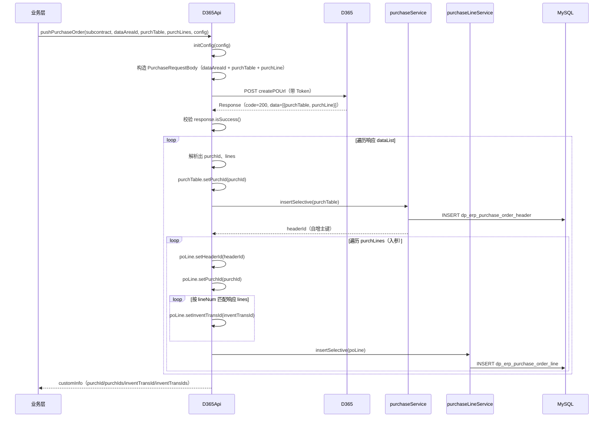
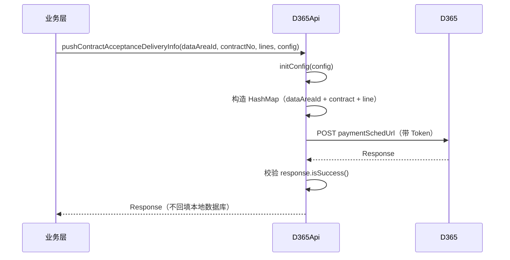
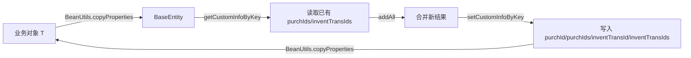

# 数据同步架构

> 本文档基于 `D365Api` 实际源码编写，描述 PMS 与 D365 之间的数据同步机制。
> 注意：实际源码为**推送式同步**（PMS → D365），不存在从 D365 拉取数据的 `getPurchaseOrders` 等方法。早期文档中"增量同步/全量同步/定时同步"的描述无源码依据。

---

## 1. 同步模式总览

PMS-ext-d365 采用**实时推送式同步**：PMS 业务流程触发时，主动调用 D365 接口创建单据，并将 D365 返回的回执（如生成的采购订单号、批次号）回填到本地数据库。

```mermaid
graph LR
    subgraph PMS 业务侧
        BIZ[业务对象<br/>Subcontract/Dispatch] -->|1.构造请求| PUSH
    end
    subgraph D365Api
        PUSH[pushPurchaseOrder<br/>pushPurchaseReceipt<br/>pushContractAcceptanceDeliveryInfo] -->|2.POST JSON| HTTP[post/postBody]
        HTTP -->|3.解析响应| RESP[Response]
        RESP -->|4.回填+持久化| FILL[回填 purchId/inventTransId]
        FILL -->|5.insertSelective| SVC[Service 层]
    end
    subgraph D365
        D365[D365 Custom Service] -->|响应| HTTP
    end
    SVC -->|6.MyBatis| DB[(MySQL<br/>dp_erp_*)]
    PUSH -->|7.customInfo 透传| BIZ
```

### 1.1 与"定时同步"的区别

| 维度 | 实际实现（推送式） | 早期文档描述（虚构） |
|------|-------------------|---------------------|
| 触发方式 | 业务流程实时触发 | 定时任务（Quartz @Scheduled） |
| 数据方向 | PMS → D365（创建）+ D365 → PMS（回执回填） | D365 → PMS（拉取） |
| 同步类型 | 实时单条/批量推送 | 增量/全量同步 |
| 失败处理 | 抛 `CustomRuntimeException` | 记录 SyncLog |
| 源码依据 | `D365Api.pushPurchaseOrder` 等 | 无 |

---

## 2. 采购订单推送同步

### 2.1 流程



### 2.2 回填字段

| 回填对象 | 回填字段 | 来源 | 用途 |
|----------|----------|------|------|
| `purchTable`（PurchaseHeader） | `purchId` | D365 响应 | D365 生成的采购订单号 |
| `poLine`（PurchaseLine） | `headerId` | 本地 insertSelective 返回 | 关联本地订单头主键 |
| `poLine`（PurchaseLine） | `purchId` | D365 响应 | 关联采购订单号 |
| `poLine`（PurchaseLine） | `inventTransId` | D365 响应（按 lineNum 匹配） | D365 生成的库存批次号 |

### 2.3 customInfo 透传

泛型版 `pushPurchaseOrder(T subcontract, ...)` 通过 `BeanUtils.copyProperties` 与 `BaseEntity` 互转，将以下 key 写回业务对象的 `customInfo`：

| key | 类型 | 说明 |
|-----|------|------|
| `purchId` | String | 最近一次推送的采购订单号 |
| `purchIds` | `List<Object>` | 累计推送的采购订单号列表 |
| `inventTransId` | String | 最近一次推送的批次号 |
| `inventTransIds` | `List<Object>` | 累计推送的批次号列表 |

> ⚠️ `purchIds` / `inventTransIds` 会**累加**（从业务对象已有 customInfo 取出后 addAll），支持一个业务对象多次推送多张采购订单。

---

## 3. 采购收货推送同步

### 3.1 流程

```mermaid
sequenceDiagram
    participant BIZ as 业务层
    participant API as D365Api
    participant D365 as D365
    participant RSVC as purchaseReceiptService
    participant RLSVC as purchaseReceiptLineService
    participant DB as MySQL

    BIZ->>API: pushPurchaseReceipt(subcontract, dataAreaId, receipt, receiptLines, config)
    API->>API: initConfig(config)
    API->>API: receipt.setDataAreaId(dataAreaId); receipt.setLines(receiptLines)
    API->>D365: POST receiptPOUrl（带 Token）
    D365-->>API: Response（code=200, data=[{...PurchaseReceiptHeader}]）
    API->>API: 校验 response.isSuccess()
    loop 遍历响应 dataList
        API->>RSVC: insertSelective(receipt)
        RSVC->>DB: INSERT dp_erp_purchase_receipt_header
        RSVC-->>API: headerId（自增主键）
        loop 遍历 receiptLines（入参）
            API->>API: poLine.setReceiptId(headerId)
            API->>API: poLine.setPurchId(purchId)
            loop 按 inventTransId 匹配响应 lines
                API->>API: 预留回填（当前为空逻辑）
            end
            API->>RLSVC: insertSelective(poLine)
            RLSVC->>DB: INSERT dp_erp_purchase_receipt_line
        end
    end
    API-->>BIZ: customInfo（packingSlipId/purchId/purchIds/inventTransId/inventTransIds）
```

### 3.2 与采购订单推送的差异

| 维度 | 采购订单 | 采购收货 |
|------|----------|----------|
| 匹配键 | `lineNum` | `inventTransId` |
| 回填到行 | `inventTransId` | 预留（当前为空逻辑） |
| customInfo 额外 key | — | `packingSlipId` |
| 请求体 | `PurchaseRequestBody`（purchTable + purchLine） | `PurchaseReceiptHeader`（含 lines） |

> ⚠️ 收货行回填逻辑（`pushPurchaseReceipt` 第 339-346 行）当前为**预留空逻辑**：匹配到 `inventTransId` 后仅 `break`，未实际回填字段。如需扩展需在此处补充。

---

## 4. 合同验收交付同步

### 4.1 流程

`pushContractAcceptanceDeliveryInfo` 推送合同收款计划的验收交付节点信息：



### 4.2 特点

- 请求体为 `HashMap<String, Object>`（非专用 model 类）；
- **不持久化到本地数据库**，仅返回 `Response`；
- 失败抛 `CustomRuntimeException`。

---

## 5. 回填机制详解

### 5.1 本地持久化

推送成功后，`D365Api` 调用 Service 层 `insertSelective` 将回填后的对象写入本地表：

| 业务 | Service | 表 |
|------|---------|-----|
| 采购订单头 | `d365PurchaseService` | `dp_erp_purchase_order_header` |
| 采购订单行 | `d365PurchaseLineService` | `dp_erp_purchase_order_line` |
| 采购收货头 | `d365PurchaseReceiptService` | `dp_erp_purchase_receipt_header` |
| 采购收货行 | `d365PurchaseReceiptLineService` | `dp_erp_purchase_receipt_line` |

`insertSelective` 由 `AbstractBaseService` 实现，会通过反射调用 `setCreateBy(getCurrentUsername())` 自动填充创建人。

### 5.2 主键回填

`insertSelective` 通过 MyBatis `<selectKey keyProperty="id" order="AFTER">SELECT LAST_INSERT_ID()</selectKey>` 回填自增主键 `id` 到实体对象，供后续关联行使用（如 `headerId`）。

### 5.3 customInfo 透传机制



> ⚠️ 该机制要求业务对象 `T` 必须是 `BaseEntity` 子类（或具有兼容的 `customInfo` 属性），否则 `BeanUtils.copyProperties` 会丢失 customInfo。

---

## 6. 失败处理

### 6.1 接口调用失败

当 `response.isSuccess() == false`（code != 200）时：

```java
throw new CustomRuntimeException(StringUtils.defaultIfBlank(response.getMessage(), "接口调用异常！"));
```

- 优先使用 D365 返回的 `message`；
- message 为空时使用默认提示"接口调用异常！"；
- 异常向上抛出，由调用方处理。

### 6.2 Token 获取失败

`getToken()` 返回含 `error` 字段的 `TokenResponse`（不抛异常）。后续 `post` 方法中 `token.getTokenType()` 可能为 null，导致不设置 Authorization 头，D365 将返回 401，最终由 `response.isSuccess()` 判定失败。

### 6.3 无重试机制

> ⚠️ 当前源码**无重试逻辑**。网络抖动或 D365 短暂不可用会导致推送失败并抛异常。如需重试，需在调用方实现。

---

## 7. 数据一致性

### 7.1 事务边界

> ⚠️ `D365Api.pushPurchaseOrder` / `pushPurchaseReceipt` **未使用 `@Transactional`**。本地持久化（多次 `insertSelective`）与 D365 调用不在同一事务中。

风险场景：
- D365 创建成功，本地头表插入成功，但行表插入失败 → D365 已有订单，本地数据不完整；
- 多行插入中途失败 → 部分行未持久化。

建议：调用方应在业务层包裹事务，或实现补偿机制（如根据 D365 返回的 purchId 做幂等检查）。

### 7.2 幂等性

- D365 侧：依赖 D365 Custom Service 实现幂等（通常基于 `otherSysNum` 外部系统编号去重）；
- 本地侧：`insertSelective` 仅插入，无 upsert 逻辑。重复推送会生成多条本地记录。

---

## 8. 相关文档

- [D365 API 架构](d365-api-architecture.md) — OAuth2、HTTP 客户端
- [采购订单模块](../02-modules/purchase-order.md) — 推送流程细节
- [采购收货模块](../02-modules/purchase-receipt.md) — 推送流程细节
- [数据流向图](../04-mapping/data-flow.md) — 可视化数据流
- [故障排查](../05-standards/troubleshooting.md) — 数据回填异常处理
