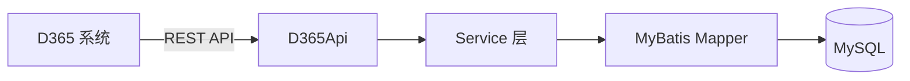

# PMS-ext-d365 模块架构文档

> ⚠️ **过时警告**：本文档包含虚构内容，与实际源码不符，仅作历史参考保留。
>
> **虚构内容**：
> - `getToken(String username, String password)` — 实际为**无参** `getToken()`（OAuth2 client_credentials 模式）
> - `getPurchaseOrders(String token, String filter)` / `getPurchaseReceipts(String token, String filter)` — 实际源码中**不存在**这些方法
> - 表名 `purchase_order` 等 — 实际表名带 `dp_erp_` 前缀（如 `dp_erp_purchase_order_header`）
> - "增量同步/全量同步" — 实际为**推送式同步**，无定时任务
>
> **请参考以下准确文档**：
> - [D365 API 架构](d365-api-architecture.md) — OAuth2 认证、HTTP 客户端、真实方法清单
> - [数据同步架构](data-sync-architecture.md) — 推送式同步机制
> - [ER 图](../03-database/er-diagram.md) — 真实表名与字段
> - [D365 API 工具类](../02-modules/d365-api.md) — 真实方法签名

---

## 1. 模块概述

PMS-ext-d365 是 PMS 系统的 D365（Dynamics 365）集成扩展模块，提供与 D365 系统的数据交互能力。

- **包名**：`com.dp.plat.pms.extend.d365`
- **打包类型**：jar
- **职责**：D365 API 集成、采购数据同步、收货数据同步

---

## 2. 目录结构

```
PMS-ext-d365/src/main/java/com/dp/plat/pms/extend/d365/
├── dao/                 # 数据访问层
│   ├── AbstractBaseMapper.java       # 基础 Mapper
│   ├── PurchaseMapper.java           # 采购 Mapper
│   ├── PurchaseLineMapper.java       # 采购行 Mapper
│   ├── PurchaseReceiptMapper.java    # 采购收货 Mapper
│   └── PurchaseReceiptLineMapper.java
├── entity/              # 实体类
│   ├── BaseEntity.java               # 基础实体
│   ├── Purchase.java                 # 采购实体
│   ├── PurchaseLine.java             # 采购行实体
│   ├── PurchaseReceipt.java          # 采购收货实体
│   └── PurchaseReceiptLine.java
├── exception/
│   └── CustomRuntimeException.java   # 自定义异常
├── model/               # API 模型
│   ├── Request.java                  # 请求模型
│   ├── RequestBody.java              # 请求体
│   ├── Response.java                 # 响应模型
│   ├── TokenRequest.java             # Token 请求
│   ├── TokenResponse.java            # Token 响应
│   ├── PurchaseRequest.java          # 采购请求
│   ├── PurchaseRequestBody.java      # 采购请求体
│   ├── PurchaseHeader.java           # 采购头
│   ├── PurchaseLine.java             # 采购行
│   ├── PurchaseReceiptHeader.java    # 收货头
│   └── PurchaseReceiptLine.java      # 收货行
├── service/             # 服务层
│   ├── IAbstractBaseService.java     # 基础服务接口
│   ├── IPurchaseService.java         # 采购服务接口
│   ├── IPurchaseLineService.java     # 采购行服务接口
│   ├── IPurchaseReceiptService.java  # 收货服务接口
│   ├── IPurchaseReceiptLineService.java
│   └── impl/
│       ├── AbstractBaseService.java  # 基础服务实现
│       ├── PurchaseService.java      # 采购服务实现
│       ├── PurchaseLineService.java  # 采购行服务实现
│       ├── PurchaseReceiptService.java
│       └── PurchaseReceiptLineService.java
└── util/
    └── D365Api.java                  # D365 API 工具类
```

---

## 3. 核心功能

### 3.1 D365 API 集成

**D365Api**：封装 D365 REST API 调用，支持：
- Token 认证
- 采购订单查询
- 采购收货查询
- 数据同步

```java
public class D365Api {
    
    // 获取访问令牌
    public static TokenResponse getToken(String username, String password) {
        // 调用 D365 Token API
        return tokenResponse;
    }
    
    // 查询采购订单
    public static List<PurchaseHeader> getPurchaseOrders(String token, String filter) {
        // 调用 D365 Purchase Orders API
        return purchaseHeaders;
    }
    
    // 查询采购收货
    public static List<PurchaseReceiptHeader> getPurchaseReceipts(String token, String filter) {
        // 调用 D365 Purchase Receipts API
        return receiptHeaders;
    }
}
```

### 3.2 采购数据同步

- 从 D365 同步采购订单数据
- 同步采购订单行数据
- 支持增量同步和全量同步

### 3.3 收货数据同步

- 从 D365 同步采购收货数据
- 同步收货行数据
- 关联采购订单

---

## 4. 数据流向



---

## 5. 与其他模块集成

PMS-ext-d365 被 PMS-struts 和 PMS-springmvc 依赖：

```xml
<dependency>
    <groupId>com.dp.plat</groupId>
    <artifactId>pms-ext-d365</artifactId>
    <version>${project.version}</version>
</dependency>
```

---

## 6. 数据库表

| 表名 | 说明 |
|------|------|
| `purchase_order` | 采购订单表 |
| `purchase_order_line` | 采购订单行表 |
| `purchase_receipt` | 采购收货表 |
| `purchase_receipt_line` | 采购收货行表 |
