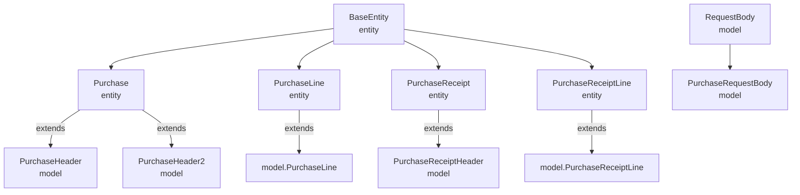
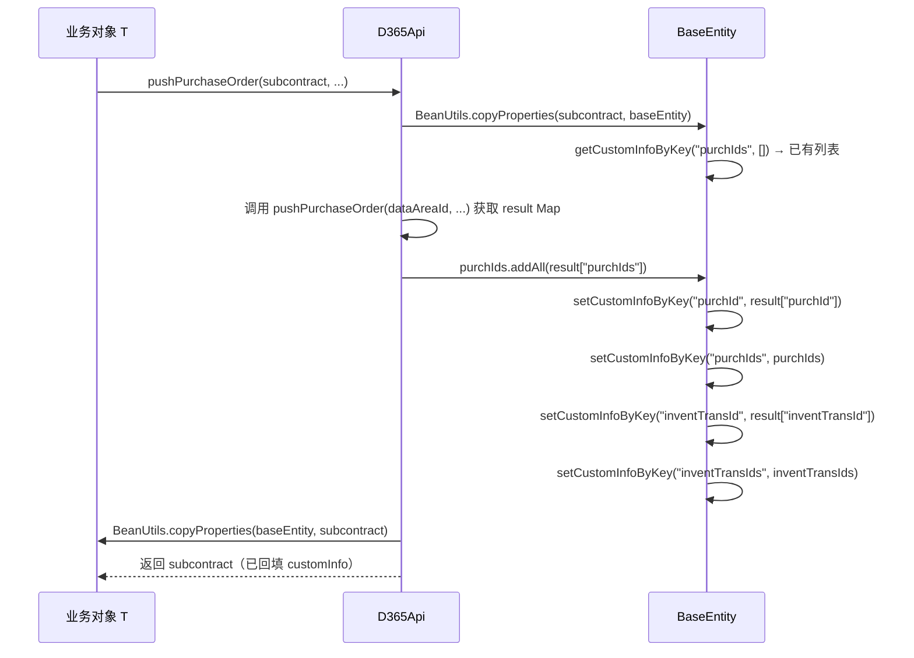

# 数据映射与转换规则

> 本文档基于实际源码编写，描述 Entity 与 Model 的对应关系、customInfo 透传机制、D365 字段映射规则。

---

## 1. Entity 与 Model 对应关系

PMS-ext-d365 的实体类分为两层：
- **Entity 层**（`entity` 包）：对应数据库表，由 MyBatisGenerator 生成
- **Model 层**（`model` 包）：对应 D365 API 请求/响应，继承 Entity 并添加链式 setter、JSON 注解



### 1.1 对照表

| Entity（entity 包） | Model（model 包） | 关系 | Model 新增内容 |
|---------------------|-------------------|------|----------------|
| `Purchase` | `PurchaseHeader` | extends | 链式 setter；`setPurchId` 重写（`@JSONField alternateNames={"PurchId"}`） |
| `Purchase` | `PurchaseHeader2` | extends | 自带字段定义（非继承）+ `@JSONField` 注解；当前未使用 |
| `entity.PurchaseLine` | `model.PurchaseLine` | extends | 链式 setter |
| `PurchaseReceipt` | `PurchaseReceiptHeader` | extends | 链式 setter；新增 `lines` 字段（`List<PurchaseReceiptLine>`） |
| `entity.PurchaseReceiptLine` | `model.PurchaseReceiptLine` | extends | 链式 setter |
| — | `RequestBody` | — | `dataAreaId` 字段 |
| — | `PurchaseRequestBody` | extends RequestBody | `purchTable`、`purchLine` 字段 |

### 1.2 PurchaseHeader vs PurchaseHeader2

| 维度 | PurchaseHeader | PurchaseHeader2 |
|------|----------------|-----------------|
| 字段来源 | 继承自 `Purchase`（父类字段） | 自带字段定义（覆盖父类） |
| `@JSONField` 注解 | 仅 `setPurchId` 有 `alternateNames` | 所有字段都有 `@JSONField` |
| 链式方法 | 调用 `super.setXxx` | 直接设置自身字段 |
| 当前使用 | `D365Api.pushPurchaseOrder` 使用 | 未使用（备用/早期版本） |

> ⚠️ `PurchaseHeader2` 自带字段会**遮蔽**父类 `Purchase` 的同名字段，可能导致序列化/反序列化行为差异。当前主流程使用 `PurchaseHeader`。

### 1.3 PurchaseLine 的双包问题

| 类型 | 全限定名 | 使用位置 |
|------|----------|----------|
| `entity.PurchaseLine` | `com.dp.plat.pms.extend.d365.entity.PurchaseLine` | `PurchaseLineMapper.xml` 的 resultMap |
| `model.PurchaseLine` | `com.dp.plat.pms.extend.d365.model.PurchaseLine` | `PurchaseLineMapper` 接口泛型、`IPurchaseLineService` 泛型、`PurchaseRequestBody.purchLine` |

由于 `model.PurchaseLine extends entity.PurchaseLine`，MyBatis 可将查询结果映射到 `model.PurchaseLine`（子类）。但需注意：
- `D365Api.pushPurchaseOrder` 中 `purchLines` 参数为 `List<PurchaseLine>`（model 版）；
- 持久化时 `purchaseLineService.insertSelective(poLine)` 操作的是 model 版；
- XML `parameterType` 为 `entity.PurchaseLine`，由于子类兼容父类，可正常工作。

---

## 2. customInfo 透传机制

### 2.1 BaseEntity 的 customInfo

`BaseEntity` 提供 `customInfo`（`Map<String, Object>`）字段，用于在业务对象与 D365Api 之间传递扩展信息：

| 方法 | 说明 |
|------|------|
| `getCustomInfo()` | 获取整个 Map |
| `setCustomInfo(Map)` | 设置整个 Map |
| `getCustomInfoByKey(String key)` | 按 key 获取（null 安全） |
| `getCustomInfoByKey(String key, Object defaultValue)` | 按 key 获取，带默认值 |
| `setCustomInfoByKey(String key, Object value)` | 按 key 设置（Map 为 null 时自动创建） |

### 2.2 透传流程

`D365Api.pushPurchaseOrder(T subcontract, ...)` 的 customInfo 透传：



### 2.3 customInfo key 清单

| key | 类型 | 写入位置 | 说明 |
|-----|------|----------|------|
| `purchId` | String | pushPurchaseOrder / pushPurchaseReceipt | 最近一次推送的采购订单号 |
| `purchIds` | `List<Object>` | pushPurchaseOrder / pushPurchaseReceipt | 累计推送的采购订单号列表（addAll 累加） |
| `inventTransId` | String | pushPurchaseOrder / pushPurchaseReceipt | 最近一次推送的批次号 |
| `inventTransIds` | `List<Object>` | pushPurchaseOrder / pushPurchaseReceipt | 累计推送的批次号列表（addAll 累加） |
| `packingSlipId` | String | pushPurchaseReceipt | 收货单号（来自入参 receipt） |
| `purchUnitBase` | String | fillPurchaseUnitBase | 采购单位基准（默认 "price"） |
| `purchPriceBase` | BigDecimal | fillPurchaseUnitBase | 价格基准（默认 1.00） |
| `purchQtyBase` | BigDecimal | fillPurchaseUnitBase | 数量基准（默认 1.00） |

> ⚠️ `purchIds` / `inventTransIds` 使用 `addAll` 累加，支持一个业务对象多次推送多张订单/收货。

---

## 3. D365 字段映射规则

### 3.1 采购订单头映射（PurchaseHeader）

| PMS 字段（Purchase） | D365 字段 | 映射规则 | 说明 |
|----------------------|-----------|----------|------|
| purchId | PurchId | D365 生成 → 回填 PMS | `@JSONField alternateNames={"PurchId"}` 兼容大小写 |
| vendAccount | vendAccount | 直接映射 | 供应商账号 |
| purchName | purchName | 直接映射 | 采购事项 |
| purchPoolId | purchPoolId | 直接映射 | 采购订单池 |
| purContract | purContract | 直接映射 | 采购合同号 |
| salesContract | salesContract | 直接映射 | 销售合同号 |
| contractAmount | contractAmount | 直接映射 | 总金额（String 类型） |
| workerPurchPlacer | workerPurchPlacer | 直接映射 | 订货人 |
| applicant | applicant | 直接映射 | 申请人 |
| inventLocationId | inventLocationId | 直接映射 | 仓库 |
| deliveryDate | deliveryDate | 直接映射 | 交货日期（String，非 Date） |
| otherSysNum | otherSysNum | 直接映射 | 外部系统编号（幂等键） |
| dataAreaId | dataAreaId | 请求时设置 | 账套（在 PurchaseRequestBody 中设置） |

### 3.2 采购订单行映射（PurchaseLine）

| PMS 字段 | D365 字段 | 映射规则 | 说明 |
|----------|-----------|----------|------|
| lineNum | lineNum | PMS → D365 | 行号（匹配键） |
| itemId | itemId | 直接映射 | 物料编码 |
| purchQty | purchQty | 直接映射 | 采购数量 |
| purchPrice | purchPrice | 直接映射 | 采购价 |
| inventTransId | inventTransId | D365 生成 → 回填 PMS | 批次号（按 lineNum 匹配回填） |
| inventSerialId | inventSerialId | 直接映射 | 厂商型号（复用 D365 序列号字段） |
| taxItemGroup | taxItemGroup | 直接映射 | 税收组 |
| inventSiteId | inventSiteId | 直接映射 | 站点 |
| inventLocationId | inventLocationId | 直接映射 | 仓库 |
| officeCode | officeCode | 直接映射 | 办事处 |
| multiDimID | multiDimID | 直接映射 | 行多维度ID |
| dim*（10个维度） | dim* | 直接映射 | 财务维度 |

### 3.3 采购收货映射（PurchaseReceiptHeader）

| PMS 字段 | D365 字段 | 映射规则 | 说明 |
|----------|-----------|----------|------|
| packingSlipId | packingSlipId | PMS → D365 | 收货单号（PMS 生成） |
| purchId | purchId | PMS → D365 | 关联采购订单号 |
| deliveryDate | deliveryDate | 直接映射 | 交货日期 |
| documentDate | documentDate | 直接映射 | 单据日期 |
| packingSlipRemark | packingSlipRemark | 直接映射 | 收货备注 |
| projectProgress | projectProgress | 直接映射 | 项目进度 |
| lines | lines | 嵌套结构 | 收货行列表（嵌套在头中） |

### 3.4 采购收货行映射（PurchaseReceiptLine）

| PMS 字段 | D365 字段 | 映射规则 | 说明 |
|----------|-----------|----------|------|
| inventTransId | inventTransId | PMS → D365 | 批次号（匹配键） |
| lineNum | lineNum | PMS → D365 | 行号（与批次号二选一） |
| qty | qty | 直接映射 | 收货数量 |
| inventSiteId | inventSiteId | 直接映射 | 站点 |
| inventLocationId | inventLocationId | 直接映射 | 仓库 |
| wmsLocationId | wmsLocationId | 直接映射 | 库位 |

---

## 4. JSON 序列化规则

### 4.1 字段顺序保留

D365 接口对 JSON 字段顺序敏感。`D365Api` 通过自定义 Fastjson 序列化保留声明顺序：

```java
// toJSONString - 禁用 SortField 和 MapSortField
int features = JSON.DEFAULT_GENERATE_FEATURE & ~SerializerFeature.SortField.getMask();
SerializeConfig serializeConfig = new SerializeConfig(true);  // true = 按字段声明顺序
serializeConfig.config(clazz, SerializerFeature.SortField, false);
serializeConfig.config(clazz, SerializerFeature.MapSortField, false);

// toJSONMap - 使用 OrderedField
LinkedHashMap<String, Object> map = JSON.parseObject(json,
    new TypeReference<LinkedHashMap<String, Object>>() {}, Feature.OrderedField);
```

### 4.2 字段别名

`PurchaseHeader.setPurchId` 使用 `@JSONField(name = "purchId", alternateNames = {"PurchId"})`，兼容 D365 响应中 `PurchId`（首字母大写）与 `purchId`（小写）两种格式。

### 4.3 序列化排除字段

`Request<T>` 中以下字段标记 `@JSONField(serialize = false, deserialize = false)`，不参与序列化：
- `classTypeCache`（静态缓存）
- `responseType`（响应类型，仅用于反序列化）
- `headers`（请求头，由 HttpRequest 单独处理）

---

## 5. 数据类型转换说明

### 5.1 日期类型

> ⚠️ Entity 中 `deliveryDate`、`documentDate`、`subcontStartDate`、`subcontEndDate` 等字段为 **String 类型**（非 Date），但 Mapper XML 中 `jdbcType=DATE`。MyBatis 会自动在 String 与 DATE 间转换。

### 5.2 金额类型

- `contractAmount`（Purchase）：**String 类型**（非 BigDecimal），D365 返回的金额可能含格式化字符
- `purchQty`、`purchPrice`（PurchaseLine）：BigDecimal
- `qty`、`price`、`amount`（PurchaseReceiptLine）：BigDecimal

### 5.3 customInfo 的 JSON 存储

`customInfo` 字段在数据库中为 `JSON` 类型（`jdbcType=JSON`），MyBatis 自动序列化/反序列化为 `Map<String, Object>`。

---

## 6. RequestBody 结构对比

### 6.1 采购订单请求体（PurchaseRequestBody）

```json
{
  "request": {
    "dataAreaId": "DPGF",
    "purchTable": { ...PurchaseHeader },
    "purchLine": [ ...PurchaseLine ]
  }
}
```

- 继承 `RequestBody`（含 `dataAreaId`）
- `purchTable` 和 `purchLine` 为平级字段

### 6.2 采购收货请求体（PurchaseReceiptHeader）

```json
{
  "request": {
    "dataAreaId": "DPGF",
    "deliveryDate": "...",
    "packingSlipId": "...",
    "lines": [ ...PurchaseReceiptLine ]
  }
}
```

- 直接使用 `PurchaseReceiptHeader` 作为 request（非 RequestBody 子类）
- `lines` 嵌套在头对象中

### 6.3 合同验收请求体（HashMap）

```json
{
  "request": {
    "dataAreaId": "...",
    "contract": "合同号",
    "line": [ ...验收节点 ]
  }
}
```

- 使用原生 `HashMap`（无 model 类）
- `line` 为 key（非 `lines`）

---

## 7. 相关文档

- [采购订单模块](purchase-order.md)
- [采购收货模块](purchase-receipt.md)
- [D365 API 工具类](d365-api.md)
- [DAO/SQL 参考](dao-sql-reference.md)
- [数据同步架构](../01-architecture/data-sync-architecture.md)
