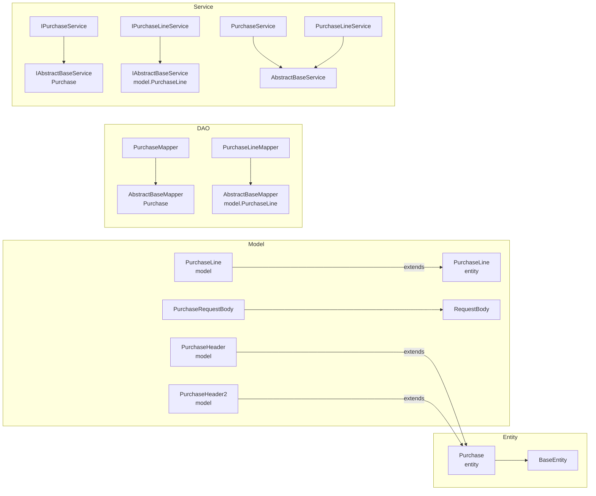

# 采购订单模块

> 本文档基于实际源码编写，涵盖采购订单的 Entity、Model、DAO、Service 实现。
> 注意：实际表名为 `dp_erp_purchase_order_header` / `dp_erp_purchase_order_line`（带 `dp_erp_` 前缀），早期文档中的 `purchase_order` 表名有误。

---

## 1. 模块结构



---

## 2. 实体类

### 2.1 Purchase（采购订单头实体）

- **全限定名**：`com.dp.plat.pms.extend.d365.entity.Purchase`
- **继承**：`BaseEntity`
- **对应表**：`dp_erp_purchase_order_header`
- **业务含义**：存储从 PMS 推送到 D365 后回填的采购订单头信息

| 属性 | 类型 | 字段 | 说明 |
|------|------|------|------|
| sourceType | String | sourceType | 源数据类型（Subcontract/Dispatch） |
| sourceId | Integer | sourceId | 源数据ID |
| purchPoolId | String | purchPoolId | 采购订单池 |
| purchId | String | purchId | 采购订单号（D365 生成） |
| vendAccount | String | vendAccount | 供应商账号 |
| purchName | String | purchName | 采购事项 |
| purContract | String | purContract | 采购合同号 |
| salesContract | String | salesContract | 销售合同号 |
| contractAmount | String | contractAmount | 总金额 |
| workerPurchPlacer | String | workerPurchPlacer | 订货人 |
| applicant | String | applicant | 申请人 |
| inventLocationId | String | inventLocationId | 仓库 |
| deliveryDate | String | deliveryDate | 交货日期 |
| dlvMode | String | dlvMode | 交货模式 |
| dlvTerm | String | dlvTerm | 交货条款 |
| payment | String | payment | 付款条款 |
| paymMode | String | paymMode | 付款方式 |
| remark | String | remark | 整单备注 |
| otherSysNum | String | otherSysNum | 外部系统编号（幂等键） |
| projectName | String | projectName | 项目名称 |
| projectProgress | String | projectProgress | 项目进度 |
| subcontractType | String | subcontractType | 转包类型 |
| subcontStartDate | String | subcontStartDate | 转包开始日期 |
| subcontEndDate | String | subcontEndDate | 转包结束日期 |
| dataAreaId | String | dataAreaId | 账套 |

> 继承自 `BaseEntity` 的字段：`id`、`createBy`、`createTime`、`updateBy`、`updateTime`、`customInfo`。

### 2.2 PurchaseLine（采购订单行实体）

- **全限定名**：`com.dp.plat.pms.extend.d365.entity.PurchaseLine`
- **继承**：`BaseEntity`
- **对应表**：`dp_erp_purchase_order_line`

| 属性 | 类型 | 字段 | 说明 |
|------|------|------|------|
| headerId | Integer | headerId | 关联订单头ID（FK → header.id） |
| purchId | String | purchId | 采购订单号 |
| lineNum | String | lineNum | 行号（可指定） |
| itemId | String | itemId | 物料编码 |
| purchQty | BigDecimal | purchQty | 采购数量 |
| purchPrice | BigDecimal | purchPrice | 采购价 |
| taxItemGroup | String | taxItemGroup | 税收组 |
| inventSerialId | String | inventSerialId | 厂商型号（复用 D365 序列号字段） |
| inventSiteId | String | inventSiteId | 站点 |
| inventLocationId | String | inventLocationId | 仓库 |
| wmsLocationId | String | wmsLocationId | 库位 |
| inventTransId | String | inventTransId | 批次号（D365 生成，回填） |
| officeCode | String | officeCode | 办事处 |
| deliveryDate | String | deliveryDate | 交货日期 |
| remark | String | remark | 行备注 |
| multiDimID | String | multiDimID | 行多维度ID |
| investmentProject | String | investmentProject | 募投项目 |
| dimBankAccount | String | dimBankAccount | 维度-银行账户 |
| dimCustomer | String | dimCustomer | 维度-客户 |
| dimVendor | String | dimVendor | 维度-供应商 |
| dimEmployee | String | dimEmployee | 维度-员工 |
| dimContract | String | dimContract | 维度-合同号 |
| dimDepartment | String | dimDepartment | 维度-部门 |
| dimBU | String | dimBU | 维度-BU |
| dimProductLine | String | dimProductLine | 维度-产品线 |
| dimTerritory | String | dimTerritory | 维度-区域 |
| dimIndustry | String | dimIndustry | 维度-行业 |
| dimMultiDimID | String | dimMultiDimID | 维度-多维度ID |
| dataAreaId | String | dataAreaId | 账套 |

---

## 3. Model 类（API 交互）

### 3.1 PurchaseHeader

- **全限定名**：`com.dp.plat.pms.extend.d365.model.PurchaseHeader`
- **继承**：`entity.Purchase`
- **作用**：D365 API 请求/响应中的采购订单头模型，提供链式 setter

特殊点：
- 重写 `setPurchId`，添加 `@JSONField(name = "purchId", alternateNames = {"PurchId"})`，兼容 D365 响应中 `PurchId`（首字母大写）字段；
- 提供所有字段的链式方法（如 `purchId(String)` 返回 `this`）。

### 3.2 model.PurchaseLine

- **全限定名**：`com.dp.plat.pms.extend.d365.model.PurchaseLine`
- **继承**：`entity.PurchaseLine`
- **作用**：D365 API 请求/响应中的采购订单行模型，提供链式 setter

> ⚠️ 注意：`PurchaseLineMapper` 和 `IPurchaseLineService` 的泛型参数是 `model.PurchaseLine`（非 `entity.PurchaseLine`），但 `PurchaseLineMapper.xml` 的 `resultMap` 指向 `entity.PurchaseLine`。由于 `model.PurchaseLine extends entity.PurchaseLine`，MyBatis 可正常映射。

### 3.3 PurchaseHeader2 / PurchaseLine2

- `PurchaseHeader2` / `PurchaseLine2`：与 `PurchaseHeader` / `PurchaseLine` 并行的版本，**自带字段定义**（非继承父类字段），带 `@JSONField` 注解。
- 当前 `D365Api` 主流程未使用这两个类，可能为早期版本或备用实现。

### 3.4 PurchaseRequestBody

- **全限定名**：`com.dp.plat.pms.extend.d365.model.PurchaseRequestBody`
- **继承**：`RequestBody`（含 `dataAreaId`）
- **作用**：创建采购订单的请求体

| 属性 | JSON 名称 | 类型 | 说明 |
|------|-----------|------|------|
| dataAreaId | `dataAreaId` | String | 账套（继承自 RequestBody） |
| purchTable | `purchTable` | PurchaseHeader | 采购订单头 |
| purchLine | `purchLine` | `List<PurchaseLine>` | 采购订单行列表 |

提供链式方法：`dataAreaId(String)`、`purchTable(PurchaseHeader)`、`purchLine(List<PurchaseLine>)`、`addPurchLineItem(PurchaseLine)`。

---

## 4. DAO 层

### 4.1 PurchaseMapper

- **全限定名**：`com.dp.plat.pms.extend.d365.dao.PurchaseMapper`
- **继承**：`AbstractBaseMapper<Purchase>`
- **对应表**：`dp_erp_purchase_order_header`
- **XML**：`com/dp/plat/pms/extend/d365/mapping/PurchaseMapper.xml`

### 4.2 PurchaseLineMapper

- **全限定名**：`com.dp.plat.pms.extend.d365.dao.PurchaseLineMapper`
- **继承**：`AbstractBaseMapper<model.PurchaseLine>`
- **对应表**：`dp_erp_purchase_order_line`
- **XML**：`com/dp/plat/pms/extend/d365/mapping/PurchaseLineMapper.xml`

> ⚠️ 泛型为 `model.PurchaseLine`，但 XML `resultMap` 类型为 `entity.PurchaseLine`。

### 4.3 继承的方法（AbstractBaseMapper）

| 方法 | 说明 |
|------|------|
| `int deleteByPrimaryKey(Object pk)` | 按主键删除 |
| `int insert(T t)` | 全字段插入 |
| `int insertSelective(T t)` | 选择性插入（非空字段） |
| `T selectByPrimaryKey(Object pk)` | 按主键查询 |
| `int updateByPrimaryKeySelective(T t)` | 选择性更新（非空字段） |
| `int updateByPrimaryKey(T t)` | 全字段更新 |
| `long countBySelective(T t)` | 按条件计数 |
| `List<T> selectBySelective(T t)` | 按条件查询 |

详见 [DAO/SQL 参考](dao-sql-reference.md)。

---

## 5. Service 层

### 5.1 IPurchaseService

- **全限定名**：`com.dp.plat.pms.extend.d365.service.IPurchaseService`
- **继承**：`IAbstractBaseService<Purchase>`
- **生成方式**：CodeGenerator 生成

### 5.2 IPurchaseLineService

- **全限定名**：`com.dp.plat.pms.extend.d365.service.IPurchaseLineService`
- **继承**：`IAbstractBaseService<model.PurchaseLine>`

### 5.3 PurchaseService（实现）

- **全限定名**：`com.dp.plat.pms.extend.d365.service.impl.PurchaseService`
- **注解**：`@Service("d365PurchaseService")`
- **继承**：`AbstractBaseService<PurchaseMapper, Purchase>`
- **创建时间**：2022-07-01 18:10:45

### 5.4 PurchaseLineService（实现）

- **全限定名**：`com.dp.plat.pms.extend.d365.service.impl.PurchaseLineService`
- **注解**：`@Service("d365PurchaseLineService")`
- **继承**：`AbstractBaseService<PurchaseLineMapper, model.PurchaseLine>`

### 5.5 AbstractBaseService 行为

`AbstractBaseService` 在调用 DAO 前通过反射自动填充审计字段：

| 方法 | 自动填充 |
|------|----------|
| `insert` | `setCreateBy(getCurrentUsername())` |
| `insertSelective` | `setCreateBy(getCurrentUsername())` |
| `updateByPrimaryKey` | `setUpdateBy(getCurrentUsername())` |
| `updateByPrimaryKeySelective` | `setUpdateBy(getCurrentUsername())` |

`getCurrentUsername()` 反射调用 `com.dp.plat.core.context.UserContext.getCurrentUsername()`，失败时回退到 `getUsername()`，再失败返回 null。

---

## 6. 推送流程

采购订单推送由 `D365Api.pushPurchaseOrder` 实现，详见 [数据同步架构 - 采购订单推送](../01-architecture/data-sync-architecture.md#2-采购订单推送同步)。

### 6.1 调用方式

```java
// 方式一：泛型回填版（推荐，自动透传 customInfo 到业务对象）
Subcontract result = D365Api.pushPurchaseOrder(
    subcontract,       // 业务对象（BaseEntity 子类）
    "DPGF",             // dataAreaId
    purchTable,         // PurchaseHeader
    purchLines,         // List<PurchaseLine>
    config              // Map<String, Object> 配置
);

// 方式二：Map 返回版（仅获取回填结果，不透传到业务对象）
Map<String, Object> result = D365Api.pushPurchaseOrder(
    "DPGF", purchTable, purchLines, config
);
```

### 6.2 返回的 customInfo key

| key | 说明 |
|-----|------|
| `purchId` | 最近一次推送的采购订单号 |
| `purchIds` | 累计推送的采购订单号列表 |
| `inventTransId` | 最近一次推送的批次号 |
| `inventTransIds` | 累计推送的批次号列表 |

---

## 7. 相关文档

- [采购收货模块](purchase-receipt.md)
- [D365 API 工具类](d365-api.md)
- [数据映射与转换](data-mapping.md)
- [DAO/SQL 参考](dao-sql-reference.md)
- [数据同步架构](../01-architecture/data-sync-architecture.md)
