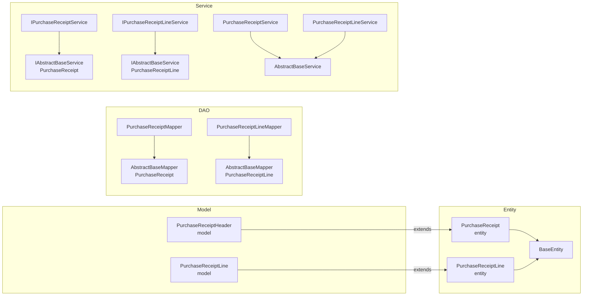

# 采购收货模块

> 本文档基于实际源码编写，涵盖采购收货的 Entity、Model、DAO、Service 实现。
> 注意：实际表名为 `dp_erp_purchase_receipt_header` / `dp_erp_purchase_receipt_line`（带 `dp_erp_` 前缀）。

---

## 1. 模块结构



---

## 2. 实体类

### 2.1 PurchaseReceipt（采购收货头实体）

- **全限定名**：`com.dp.plat.pms.extend.d365.entity.PurchaseReceipt`
- **继承**：`BaseEntity`
- **对应表**：`dp_erp_purchase_receipt_header`
- **业务含义**：存储从 PMS 推送到 D365 后回填的采购收货头信息

| 属性 | 类型 | 字段 | 说明 |
|------|------|------|------|
| sourceOrderType | String | sourceOrderType | 订单源数据类型（Subcontract/Dispatch） |
| sourceOrderId | Integer | sourceOrderId | 订单源数据ID |
| sourceReceiptType | String | sourceReceiptType | 订单源收货类型（SubcontractPayment/DispatchSettlement） |
| sourceReceiptId | Integer | sourceReceiptId | 订单源收货ID |
| purchId | String | purchId | 采购订单号 |
| deliveryDate | String | deliveryDate | 交货日期 |
| documentDate | String | documentDate | 单据日期 |
| packingSlipId | String | packingSlipId | 采购收货单号 |
| packingSlipRemark | String | packingSlipRemark | 采购收货备注 |
| projectProgress | String | projectProgress | 项目进度 |
| dataAreaId | String | dataAreaId | 账套 |

> 继承自 `BaseEntity` 的字段：`id`、`createBy`、`createTime`、`updateBy`、`updateTime`、`customInfo`。

### 2.2 PurchaseReceiptLine（采购收货行实体）

- **全限定名**：`com.dp.plat.pms.extend.d365.entity.PurchaseReceiptLine`
- **继承**：`BaseEntity`
- **对应表**：`dp_erp_purchase_receipt_line`

| 属性 | 类型 | 字段 | 说明 |
|------|------|------|------|
| receiptId | Integer | receiptId | 关联收货头ID（FK → receipt.id） |
| purchId | String | purchId | 采购订单号 |
| inventSiteId | String | inventSiteId | 站点 |
| inventLocationId | String | inventLocationId | 仓库 |
| wmsLocationId | String | wmsLocationId | 库位 |
| inventTransId | String | inventTransId | 批次号 |
| lineNum | String | lineNum | 采购订单行号（与批次号二选一） |
| qty | BigDecimal | qty | 收货数量 |
| price | BigDecimal | price | 收货单价 |
| amount | BigDecimal | amount | 收货金额 |
| dataAreaId | String | dataAreaId | 账套 |

> ⚠️ `lineNum` 与 `inventTransId` 二选一：有批次号时按批次号收货，否则按行号收货。

---

## 3. Model 类（API 交互）

### 3.1 PurchaseReceiptHeader

- **全限定名**：`com.dp.plat.pms.extend.d365.model.PurchaseReceiptHeader`
- **继承**：`entity.PurchaseReceipt`
- **作用**：D365 API 请求/响应中的采购收货头模型

新增字段：

| 属性 | JSON 名称 | 类型 | 说明 |
|------|-----------|------|------|
| lines | `lines` | `List<PurchaseReceiptLine>` | 收货行列表（嵌套在头中） |

> 与采购订单不同，收货请求体**直接使用 `PurchaseReceiptHeader` 作为 request**（含 `lines`），而非独立的 `RequestBody` 子类。

### 3.2 model.PurchaseReceiptLine

- **全限定名**：`com.dp.plat.pms.extend.d365.model.PurchaseReceiptLine`
- **继承**：`entity.PurchaseReceiptLine`
- **作用**：D365 API 请求/响应中的采购收货行模型，提供链式 setter

---

## 4. DAO 层

### 4.1 PurchaseReceiptMapper

- **全限定名**：`com.dp.plat.pms.extend.d365.dao.PurchaseReceiptMapper`
- **继承**：`AbstractBaseMapper<PurchaseReceipt>`
- **对应表**：`dp_erp_purchase_receipt_header`
- **XML**：`com/dp/plat/pms/extend/d365/mapping/PurchaseReceiptMapper.xml`

### 4.2 PurchaseReceiptLineMapper

- **全限定名**：`com.dp.plat.pms.extend.d365.dao.PurchaseReceiptLineMapper`
- **继承**：`AbstractBaseMapper<PurchaseReceiptLine>`
- **对应表**：`dp_erp_purchase_receipt_line`
- **XML**：`com/dp/plat/pms/extend/d365/mapping/PurchaseReceiptLineMapper.xml`

> 与采购订单行不同，收货行 Mapper 的泛型是 `entity.PurchaseReceiptLine`（非 model 版），与 XML resultMap 类型一致。

继承的方法同 [采购订单模块 - DAO 层](purchase-order.md#43-继承的方法abstractbasemapper)，详见 [DAO/SQL 参考](dao-sql-reference.md)。

---

## 5. Service 层

### 5.1 IPurchaseReceiptService

- **全限定名**：`com.dp.plat.pms.extend.d365.service.IPurchaseReceiptService`
- **继承**：`IAbstractBaseService<PurchaseReceipt>`

### 5.2 IPurchaseReceiptLineService

- **全限定名**：`com.dp.plat.pms.extend.d365.service.IPurchaseReceiptLineService`
- **继承**：`IAbstractBaseService<PurchaseReceiptLine>`

### 5.3 PurchaseReceiptService（实现）

- **全限定名**：`com.dp.plat.pms.extend.d365.service.impl.PurchaseReceiptService`
- **注解**：`@Service("d365PurchaseReceiptService")`
- **继承**：`AbstractBaseService<PurchaseReceiptMapper, PurchaseReceipt>`

### 5.4 PurchaseReceiptLineService（实现）

- **全限定名**：`com.dp.plat.pms.extend.d365.service.impl.PurchaseReceiptLineService`
- **注解**：`@Service("d365PurchaseReceiptLineService")`
- **继承**：`AbstractBaseService<PurchaseReceiptLineMapper, PurchaseReceiptLine>`

`AbstractBaseService` 的审计字段自动填充行为同 [采购订单模块 - Service 层](purchase-order.md#55-abstractbaseservice-行为)。

---

## 6. 推送流程

采购收货推送由 `D365Api.pushPurchaseReceipt` 实现，详见 [数据同步架构 - 采购收货推送](../01-architecture/data-sync-architecture.md#3-采购收货推送同步)。

### 6.1 调用方式

```java
// 方式一：泛型回填版（推荐）
Subcontract result = D365Api.pushPurchaseReceipt(
    subcontract,        // 业务对象（BaseEntity 子类）
    "DPGF",              // dataAreaId
    receipt,             // PurchaseReceiptHeader
    receiptLines,        // List<PurchaseReceiptLine>
    config               // Map<String, Object> 配置
);

// 方式二：Map 返回版
Map<String, Object> result = D365Api.pushPurchaseReceipt(
    "DPGF", receipt, receiptLines, config
);
```

### 6.2 返回的 customInfo key

| key | 说明 |
|-----|------|
| `packingSlipId` | 收货单号（来自入参 receipt） |
| `purchId` | 采购订单号 |
| `purchIds` | 累计推送的采购订单号列表 |
| `inventTransId` | 最近一次推送的批次号 |
| `inventTransIds` | 累计推送的批次号列表 |

### 6.3 与采购订单推送的差异

| 维度 | 采购订单 | 采购收货 |
|------|----------|----------|
| 请求体 | `PurchaseRequestBody`（purchTable + purchLine） | `PurchaseReceiptHeader`（含 lines） |
| 行匹配键 | `lineNum` | `inventTransId` |
| 行回填字段 | `inventTransId` | 预留（当前空逻辑） |
| customInfo 额外 key | — | `packingSlipId` |
| 头持久化 | `purchTable`（回填 purchId 后） | `receipt`（入参对象） |

> ⚠️ 收货行回填逻辑（`pushPurchaseReceipt` 第 339-346 行）当前为预留空逻辑，匹配到 `inventTransId` 后仅 `break`，未实际回填字段。

---

## 7. 源数据类型与收货类型

### 7.1 sourceOrderType（订单源数据类型）

| 值 | 说明 |
|----|------|
| Subcontract | 转包 |
| Dispatch | 外派 |

### 7.2 sourceReceiptType（订单源收货类型）

| 值 | 说明 |
|----|------|
| SubcontractPayment | 转包付款 |
| DispatchSettlement | 发运结算 |

> 这两个字段用于关联 PMS 业务侧的源单据（转包/外派），实现 PMS 业务单据与 D365 收货单据的追溯。

---

## 8. 相关文档

- [采购订单模块](purchase-order.md)
- [D365 API 工具类](d365-api.md)
- [数据映射与转换](data-mapping.md)
- [DAO/SQL 参考](dao-sql-reference.md)
- [数据同步架构](../01-architecture/data-sync-architecture.md)
