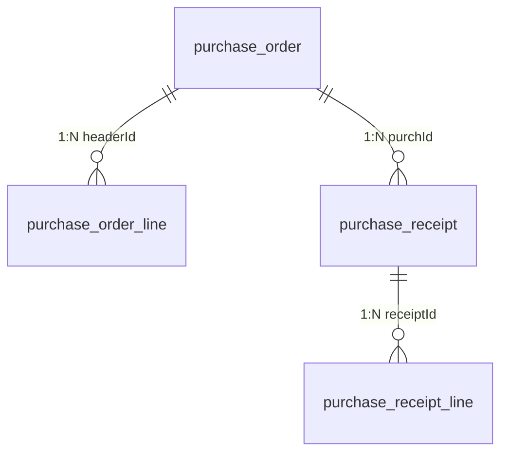

# PMS-ext-d365 完整数据字典

> ⚠️ **过时警告**：本文档表名有误，且包含虚构的状态编码定义，仅作历史参考保留。
>
> **虚构/错误内容**：
> - 表名 `purchase_order`、`purchase_order_line`、`purchase_receipt`、`purchase_receipt_line` — 实际表名带 `dp_erp_` 前缀：
>   - `purchase_order` → `dp_erp_purchase_order_header`
>   - `purchase_order_line` → `dp_erp_purchase_order_line`
>   - `purchase_receipt` → `dp_erp_purchase_receipt_header`
>   - `purchase_receipt_line` → `dp_erp_purchase_receipt_line`
> - "状态编码定义"章节（status 字段及 Draft/Confirmed/Received 等状态值）— 实际源码中**无 status 字段**，状态编码为虚构
>
> **注**：本文档的字段定义（除表名和状态编码外）与实际源码基本一致，可参考字段说明。
>
> **请参考以下准确文档**：
> - [ER 图](er-diagram.md) — 真实表名、字段与关系
> - [DAO/SQL 参考](../02-modules/dao-sql-reference.md) — 基于 Mapper XML 的真实表名与字段
> - [索引分析](index-analysis.md) — 基于真实表名的索引分析

---

> 数据库：dppms_d365 (MySQL)
> 本文档包含 PMS-ext-d365 模块涉及的所有数据库表的完整字段定义、索引信息和业务规则。
> 数据来源：Entity 类、Mapper XML 文件、代码注释。

---

## 表清单

| 序号 | 表名 | 说明 | 字段数 |
|------|------|------|--------|
| 1 | purchase_order | 采购订单表 | 20 |
| 2 | purchase_order_line | 采购订单行表 | 25 |
| 3 | purchase_receipt | 采购收货表 | 10 |
| 4 | purchase_receipt_line | 采购收货行表 | 10 |

---

## BaseEntity 公共字段

> 所有 Entity 类继承自 `com.dp.plat.pms.extend.d365.entity.BaseEntity`

| 字段名 | 类型 | 说明 | 代码属性名 |
|--------|------|------|-----------|
| `id` | Integer | 主键ID | id |
| `createBy` | String | 创建人 | createBy |
| `createTime` | Date | 创建时间 | createTime |
| `updateBy` | String | 更新人 | updateBy |
| `updateTime` | Date | 更新时间 | updateTime |
| `customInfo` | Map<String, Object> | 自定义扩展信息 | customInfo |

---

## 1. purchase_order（采购订单表）

> 实体类：`com.dp.plat.pms.extend.d365.entity.Purchase`（529行）
> Mapper：`PurchaseMapper.xml`
> 说明：存储从 D365 同步的采购订单信息。

| 字段名 | 类型 | 约束 | 默认值 | 业务含义 | 代码属性名 |
|--------|------|------|--------|----------|-----------|
| `id` | int(11) | PK, AUTO_INCREMENT | - | 主键ID | id |
| `sourceType` | varchar(50) | - | NULL | 源数据类型（Subcontract/Dispatch） | sourceType |
| `sourceId` | int(11) | - | NULL | 源数据ID | sourceId |
| `purchPoolId` | varchar(50) | - | NULL | 采购订单池 | purchPoolId |
| `purchId` | varchar(50) | UNIQUE | - | 采购订单号 | purchId |
| `vendAccount` | varchar(50) | - | NULL | 供应商账号 | vendAccount |
| `purchName` | varchar(200) | - | NULL | 采购事项 | purchName |
| `purContract` | varchar(100) | - | NULL | 采购合同号 | purContract |
| `salesContract` | varchar(100) | - | NULL | 销售合同号 | salesContract |
| `contractAmount` | varchar(50) | - | NULL | 总金额 | contractAmount |
| `workerPurchPlacer` | varchar(50) | - | NULL | 订货人 | workerPurchPlacer |
| `applicant` | varchar(50) | - | NULL | 申请人 | applicant |
| `inventLocationId` | varchar(50) | - | NULL | 仓库 | inventLocationId |
| `deliveryDate` | varchar(50) | - | NULL | 交货日期 | deliveryDate |
| `dlvMode` | varchar(50) | - | NULL | 交货模式 | dlvMode |
| `dlvTerm` | varchar(50) | - | NULL | 交货条款 | dlvTerm |
| `payment` | varchar(50) | - | NULL | 付款条款 | payment |
| `paymMode` | varchar(50) | - | NULL | 付款方式 | paymMode |
| `remark` | varchar(500) | - | NULL | 整单备注 | remark |
| `otherSysNum` | varchar(100) | - | NULL | 外部系统编号 | otherSysNum |
| `projectName` | varchar(200) | - | NULL | 项目名称 | projectName |
| `projectProgress` | varchar(50) | - | NULL | 项目进度 | projectProgress |
| `subcontractType` | varchar(50) | - | NULL | 转包类型 | subcontractType |
| `subcontStartDate` | varchar(50) | - | NULL | 转包开始日期 | subcontStartDate |
| `subcontEndDate` | varchar(50) | - | NULL | 转包结束日期 | subcontEndDate |
| `dataAreaId` | varchar(50) | - | NULL | 账套 | dataAreaId |
| `createBy` | varchar(50) | - | - | 创建人 | createBy |
| `createTime` | datetime | - | CURRENT_TIMESTAMP | 创建时间 | createTime |
| `updateBy` | varchar(50) | - | - | 更新人 | updateBy |
| `updateTime` | datetime | - | - | 更新时间 | updateTime |
| `customInfo` | json | - | NULL | 自定义扩展信息 | customInfo |

**索引**：
| 索引名 | 字段 | 类型 | 说明 |
|--------|------|------|------|
| PRIMARY | id | 主键 | 主键 |
| uk_purch_id | purchId | 唯一索引 | 采购订单号唯一 |

---

## 2. purchase_order_line（采购订单行表）

> 实体类：`com.dp.plat.pms.extend.d365.entity.PurchaseLine`（617行）
> Mapper：`PurchaseLineMapper.xml`
> 说明：存储从 D365 同步的采购订单行信息。

| 字段名 | 类型 | 约束 | 默认值 | 业务含义 | 代码属性名 |
|--------|------|------|--------|----------|-----------|
| `id` | int(11) | PK, AUTO_INCREMENT | - | 主键ID | id |
| `headerId` | int(11) | FK → purchase_order.id | - | 关联订单头ID | headerId |
| `purchId` | varchar(50) | - | NULL | 采购订单号 | purchId |
| `lineNum` | varchar(50) | - | NULL | 行号 | lineNum |
| `itemId` | varchar(50) | - | NULL | 物料编码 | itemId |
| `purchQty` | decimal(18,2) | - | NULL | 采购数量 | purchQty |
| `purchPrice` | decimal(18,2) | - | NULL | 采购价 | purchPrice |
| `taxItemGroup` | varchar(50) | - | NULL | 税收组 | taxItemGroup |
| `inventSerialId` | varchar(100) | - | NULL | 厂商型号（复用D365序列号字段） | inventSerialId |
| `inventSiteId` | varchar(50) | - | NULL | 站点 | inventSiteId |
| `inventLocationId` | varchar(50) | - | NULL | 仓库 | inventLocationId |
| `wmsLocationId` | varchar(50) | - | NULL | 库位 | wmsLocationId |
| `inventTransId` | varchar(50) | - | NULL | 批次号 | inventTransId |
| `officeCode` | varchar(50) | - | NULL | 办事处 | officeCode |
| `deliveryDate` | varchar(50) | - | NULL | 交货日期 | deliveryDate |
| `remark` | varchar(500) | - | NULL | 行备注 | remark |
| `multiDimID` | varchar(100) | - | NULL | 行多维度ID | multiDimID |
| `investmentProject` | varchar(100) | - | NULL | 募投项目 | investmentProject |
| `dimBankAccount` | varchar(100) | - | NULL | 维度-银行账户 | dimBankAccount |
| `dimCustomer` | varchar(100) | - | NULL | 维度-客户 | dimCustomer |
| `dimVendor` | varchar(100) | - | NULL | 维度-供应商 | dimVendor |
| `dimEmployee` | varchar(100) | - | NULL | 维度-员工 | dimEmployee |
| `dimContract` | varchar(100) | - | NULL | 维度-合同号 | dimContract |
| `dimDepartment` | varchar(100) | - | NULL | 维度-部门 | dimDepartment |
| `dimBU` | varchar(100) | - | NULL | 维度-BU | dimBU |
| `dimProductLine` | varchar(100) | - | NULL | 维度-产品线 | dimProductLine |
| `dimTerritory` | varchar(100) | - | NULL | 维度-区域 | dimTerritory |
| `dimIndustry` | varchar(100) | - | NULL | 维度-行业 | dimIndustry |
| `dimMultiDimID` | varchar(100) | - | NULL | 维度-多维度ID | dimMultiDimID |
| `dataAreaId` | varchar(50) | - | NULL | 账套 | dataAreaId |
| `createBy` | varchar(50) | - | - | 创建人 | createBy |
| `createTime` | datetime | - | CURRENT_TIMESTAMP | 创建时间 | createTime |
| `updateBy` | varchar(50) | - | - | 更新人 | updateBy |
| `updateTime` | datetime | - | - | 更新时间 | updateTime |
| `customInfo` | json | - | NULL | 自定义扩展信息 | customInfo |

**索引**：
| 索引名 | 字段 | 类型 | 说明 |
|--------|------|------|------|
| PRIMARY | id | 主键 | 主键 |
| idx_header_id | headerId | 普通索引 | 关联订单头 |
| idx_purch_id | purchId | 普通索引 | 按订单号查询 |

---

## 3. purchase_receipt（采购收货表）

> 实体类：`com.dp.plat.pms.extend.d365.entity.PurchaseReceipt`（229行）
> Mapper：`PurchaseReceiptMapper.xml`
> 说明：存储从 D365 同步的采购收货信息。

| 字段名 | 类型 | 约束 | 默认值 | 业务含义 | 代码属性名 |
|--------|------|------|--------|----------|-----------|
| `id` | int(11) | PK, AUTO_INCREMENT | - | 主键ID | id |
| `sourceOrderType` | varchar(50) | - | NULL | 订单源数据类型（Subcontract/Dispatch） | sourceOrderType |
| `sourceOrderId` | int(11) | - | NULL | 订单源数据ID | sourceOrderId |
| `sourceReceiptType` | varchar(50) | - | NULL | 订单源收货类型（SubcontractPayment/DispatchSettlement） | sourceReceiptType |
| `sourceReceiptId` | int(11) | - | NULL | 订单源收货ID | sourceReceiptId |
| `purchId` | varchar(50) | - | NULL | 采购订单号 | purchId |
| `deliveryDate` | varchar(50) | - | NULL | 交货日期 | deliveryDate |
| `documentDate` | varchar(50) | - | NULL | 单据日期 | documentDate |
| `packingSlipId` | varchar(50) | - | NULL | 采购收货单号 | packingSlipId |
| `packingSlipRemark` | varchar(500) | - | NULL | 采购收货备注 | packingSlipRemark |
| `projectProgress` | varchar(50) | - | NULL | 项目进度 | projectProgress |
| `dataAreaId` | varchar(50) | - | NULL | 账套 | dataAreaId |
| `createBy` | varchar(50) | - | - | 创建人 | createBy |
| `createTime` | datetime | - | CURRENT_TIMESTAMP | 创建时间 | createTime |
| `updateBy` | varchar(50) | - | - | 更新人 | updateBy |
| `updateTime` | datetime | - | - | 更新时间 | updateTime |
| `customInfo` | json | - | NULL | 自定义扩展信息 | customInfo |

**索引**：
| 索引名 | 字段 | 类型 | 说明 |
|--------|------|------|------|
| PRIMARY | id | 主键 | 主键 |
| uk_packing_slip_id | packingSlipId | 唯一索引 | 收货单号唯一 |
| idx_purch_id | purchId | 普通索引 | 按订单号查询 |

---

## 4. purchase_receipt_line（采购收货行表）

> 实体类：`com.dp.plat.pms.extend.d365.entity.PurchaseReceiptLine`（237行）
> Mapper：`PurchaseReceiptLineMapper.xml`
> 说明：存储从 D365 同步的采购收货行信息。

| 字段名 | 类型 | 约束 | 默认值 | 业务含义 | 代码属性名 |
|--------|------|------|--------|----------|-----------|
| `id` | int(11) | PK, AUTO_INCREMENT | - | 主键ID | id |
| `receiptId` | int(11) | FK → purchase_receipt.id | - | 采购订单收货ID | receiptId |
| `purchId` | varchar(50) | - | NULL | 采购订单号 | purchId |
| `inventSiteId` | varchar(50) | - | NULL | 站点 | inventSiteId |
| `inventLocationId` | varchar(50) | - | NULL | 仓库 | inventLocationId |
| `wmsLocationId` | varchar(50) | - | NULL | 库位 | wmsLocationId |
| `inventTransId` | varchar(50) | - | NULL | 批次号 | inventTransId |
| `lineNum` | varchar(50) | - | NULL | 采购订单行号（与批次号二选一） | lineNum |
| `qty` | decimal(18,2) | - | NULL | 收货数量 | qty |
| `price` | decimal(18,2) | - | NULL | 收货单价 | price |
| `amount` | decimal(18,2) | - | NULL | 收货金额 | amount |
| `dataAreaId` | varchar(50) | - | NULL | 账套 | dataAreaId |
| `createBy` | varchar(50) | - | - | 创建人 | createBy |
| `createTime` | datetime | - | CURRENT_TIMESTAMP | 创建时间 | createTime |
| `updateBy` | varchar(50) | - | - | 更新人 | updateBy |
| `updateTime` | datetime | - | - | 更新时间 | updateTime |
| `customInfo` | json | - | NULL | 自定义扩展信息 | customInfo |

**索引**：
| 索引名 | 字段 | 类型 | 说明 |
|--------|------|------|------|
| PRIMARY | id | 主键 | 主键 |
| idx_receipt_id | receiptId | 普通索引 | 关联收货头 |
| idx_purch_id | purchId | 普通索引 | 按订单号查询 |

---

## ER 关系图

---

## 状态编码定义

### 采购订单状态（status）

| 值 | 说明 |
|----|------|
| Draft | 草稿 |
| Confirmed | 已确认 |
| Received | 已收货 |
| Invoiced | 已开票 |
| Cancelled | 已取消 |

### 采购收货状态（status）

| 值 | 说明 |
|----|------|
| Draft | 草稿 |
| Received | 已收货 |
| Posted | 已过账 |
| Cancelled | 已取消 |

### 源数据类型（sourceType）

| 值 | 说明 |
|----|------|
| Subcontract | 转包 |
| Dispatch | 外派 |

### 源收货类型（sourceReceiptType）

| 值 | 说明 |
|----|------|
| SubcontractPayment | 转包付款 |
| DispatchSettlement | 发运结算 |

### 账套（dataAreaId）

| 值 | 说明 |
|----|------|
| DIPU | 迪普科技主账套 |
