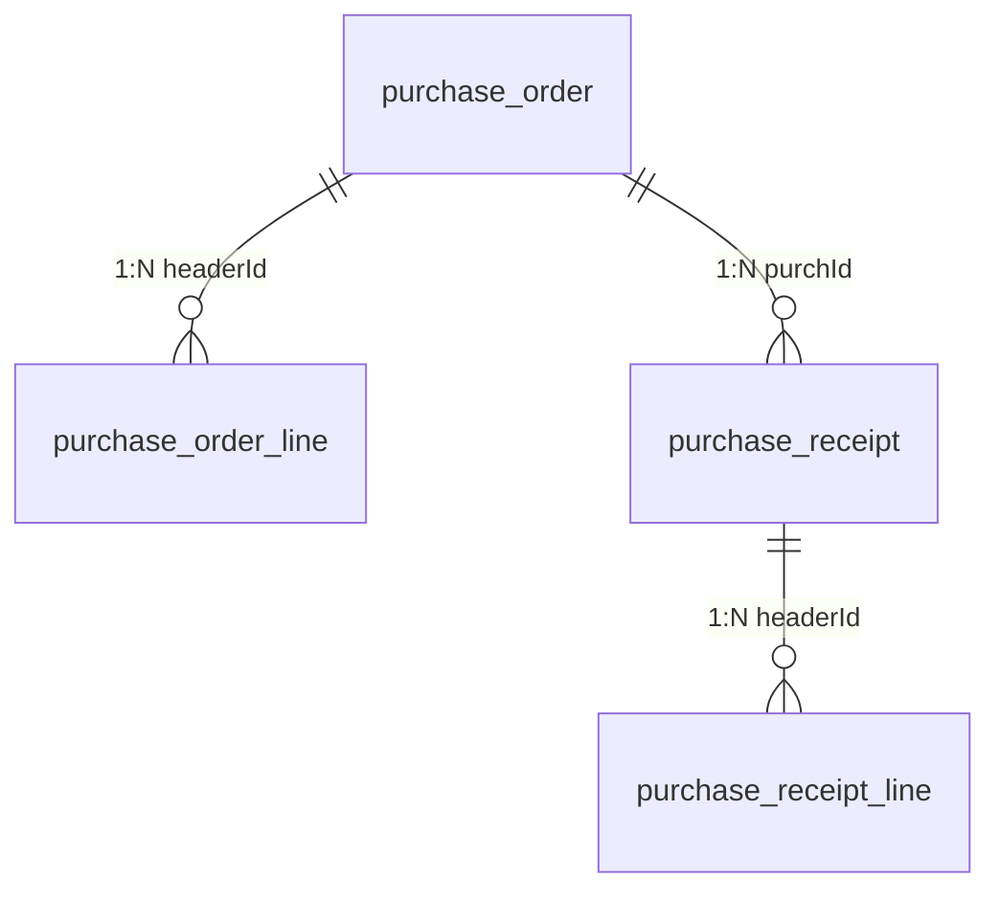

# PMS-ext-d365 数据库文档

> ⚠️ **过时警告**：本文档表名与字段均为虚构，与实际源码不符，仅作历史参考保留。
>
> **虚构/错误内容**：
> - 表名 `purchase_order`、`purchase_order_line`、`purchase_receipt`、`purchase_receipt_line` — 实际表名带 `dp_erp_` 前缀：
>   - `purchase_order` → `dp_erp_purchase_order_header`
>   - `purchase_order_line` → `dp_erp_purchase_order_line`
>   - `purchase_receipt` → `dp_erp_purchase_receipt_header`
>   - `purchase_receipt_line` → `dp_erp_purchase_receipt_line`
> - 字段 `purchaseType`、`vendorName`、`orderDate`、`status`、`currencyCode`、`totalAmount`、`itemNumber`、`itemName`、`quantity`、`unitPrice`、`lineAmount`、`receiptId`、`receiptDate` 等 — 实际源码中**不存在**这些字段（真实字段见 ER 图）
>
> **请参考以下准确文档**：
> - [ER 图](er-diagram.md) — 真实表名、完整字段与关系
> - [完整数据字典](complete-data-dictionary.md) — 字段说明（表名已标注过时，但字段定义可参考）
> - [索引分析](index-analysis.md) — 基于真实表名的索引分析
> - [DAO/SQL 参考](../02-modules/dao-sql-reference.md) — 基于 Mapper XML 的真实表名与字段

---

## 1. 数据库表概览

PMS-ext-d365 模块涉及以下数据库表：

| 表名 | 说明 | 主要字段 |
|------|------|----------|
| `purchase_order` | 采购订单表 | id, purchId, dataAreaId |
| `purchase_order_line` | 采购订单行表 | id, headerId, lineNum |
| `purchase_receipt` | 采购收货表 | id, receiptId, purchId |
| `purchase_receipt_line` | 采购收货行表 | id, headerId, lineNum |

---

## 2. 核心表详细字段

### 2.1 purchase_order（采购订单表）

| 字段名 | 数据类型 | 约束 | 业务含义 |
|--------|----------|------|----------|
| `id` | INT | PK, 自增 | 主键ID |
| `purchId` | VARCHAR(50) | UNIQUE | 采购订单号 |
| `dataAreaId` | VARCHAR(50) | - | 数据区域ID |
| `purchaseType` | VARCHAR(50) | - | 采购类型 |
| `vendorAccount` | VARCHAR(50) | - | 供应商账号 |
| `vendorName` | VARCHAR(200) | - | 供应商名称 |
| `orderDate` | DATE | - | 订单日期 |
| `deliveryDate` | DATE | - | 交货日期 |
| `status` | VARCHAR(20) | - | 状态 |
| `currencyCode` | VARCHAR(10) | - | 货币代码 |
| `totalAmount` | DECIMAL(18,2) | - | 总金额 |
| `createTime` | DATETIME | NOT NULL | 创建时间 |
| `updateTime` | DATETIME | - | 更新时间 |

### 2.2 purchase_order_line（采购订单行表）

| 字段名 | 数据类型 | 约束 | 业务含义 |
|--------|----------|------|----------|
| `id` | INT | PK, 自增 | 主键ID |
| `headerId` | INT | FK | 关联订单头ID |
| `purchId` | VARCHAR(50) | - | 采购订单号 |
| `lineNum` | INT | - | 行号 |
| `itemNumber` | VARCHAR(50) | - | 物料编号 |
| `itemName` | VARCHAR(200) | - | 物料名称 |
| `quantity` | DECIMAL(18,2) | - | 数量 |
| `unitPrice` | DECIMAL(18,2) | - | 单价 |
| `lineAmount` | DECIMAL(18,2) | - | 行金额 |
| `deliveryDate` | DATE | - | 交货日期 |
| `status` | VARCHAR(20) | - | 状态 |

### 2.3 purchase_receipt（采购收货表）

| 字段名 | 数据类型 | 约束 | 业务含义 |
|--------|----------|------|----------|
| `id` | INT | PK, 自增 | 主键ID |
| `receiptId` | VARCHAR(50) | UNIQUE | 收货单号 |
| `purchId` | VARCHAR(50) | - | 采购订单号 |
| `dataAreaId` | VARCHAR(50) | - | 数据区域ID |
| `receiptDate` | DATE | - | 收货日期 |
| `status` | VARCHAR(20) | - | 状态 |
| `createTime` | DATETIME | NOT NULL | 创建时间 |

---

## 3. ER 关系图

---

## 4. 索引分析

| 表名 | 索引名 | 索引类型 | 字段 |
|------|--------|----------|------|
| `purchase_order` | PRIMARY | 主键 | id |
| `purchase_order` | uk_purch_id | 唯一 | purchId |
| `purchase_order_line` | PRIMARY | 主键 | id |
| `purchase_order_line` | idx_header_id | 普通 | headerId |
| `purchase_receipt` | PRIMARY | 主键 | id |
| `purchase_receipt` | uk_receipt_id | 唯一 | receiptId |
