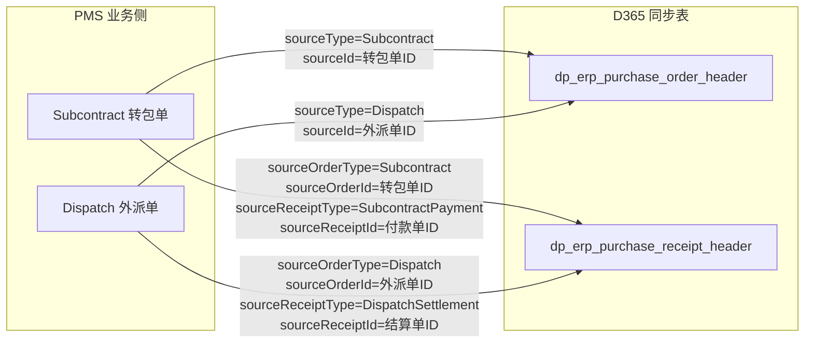

# ER 图

> 本文档基于实际 Mapper XML 与 Entity 源码编写。
> 注意：实际表名带 `dp_erp_` 前缀，早期文档中的 `purchase_order` 等表名有误。

---

## 1. 完整 ER 图

```mermaid
erDiagram
    dp_erp_purchase_order_header ||--o{ dp_erp_purchase_order_line : "1:N headerId"
    dp_erp_purchase_order_header ||--o{ dp_erp_purchase_receipt_header : "1:N purchId"
    dp_erp_purchase_receipt_header ||--o{ dp_erp_purchase_receipt_line : "1:N receiptId"
    dp_erp_purchase_order_line ||--o{ dp_erp_purchase_receipt_line : "1:N inventTransId"

    dp_erp_purchase_order_header {
        int id PK "自增主键"
        varchar sourceType "源数据类型 Subcontract/Dispatch"
        int sourceId "源数据ID"
        varchar purchPoolId "采购订单池"
        varchar purchId UK "采购订单号(D365生成)"
        varchar vendAccount "供应商账号"
        varchar purchName "采购事项"
        varchar purContract "采购合同号"
        varchar salesContract "销售合同号"
        varchar contractAmount "总金额"
        varchar workerPurchPlacer "订货人"
        varchar applicant "申请人"
        varchar inventLocationId "仓库"
        varchar deliveryDate "交货日期"
        varchar dlvMode "交货模式"
        varchar dlvTerm "交货条款"
        varchar payment "付款条款"
        varchar paymMode "付款方式"
        varchar remark "整单备注"
        varchar otherSysNum "外部系统编号(幂等键)"
        varchar projectName "项目名称"
        varchar projectProgress "项目进度"
        varchar subcontractType "转包类型"
        varchar subcontStartDate "转包开始日期"
        varchar subcontEndDate "转包结束日期"
        varchar dataAreaId "账套"
        json customInfo "自定义扩展信息"
        varchar createBy "创建人"
        datetime createTime "创建时间"
        varchar updateBy "更新人"
        datetime updateTime "更新时间"
    }

    dp_erp_purchase_order_line {
        int id PK "自增主键"
        int headerId FK "关联订单头ID"
        varchar purchId "采购订单号"
        varchar lineNum "行号"
        varchar itemId "物料编码"
        decimal purchQty "采购数量"
        decimal purchPrice "采购价"
        varchar taxItemGroup "税收组"
        varchar inventSerialId "厂商型号"
        varchar inventSiteId "站点"
        varchar inventLocationId "仓库"
        varchar wmsLocationId "库位"
        varchar inventTransId "批次号(D365生成)"
        varchar officeCode "办事处"
        varchar deliveryDate "交货日期"
        varchar remark "行备注"
        varchar multiDimID "行多维度ID"
        varchar investmentProject "募投项目"
        varchar dimBankAccount "维度-银行账户"
        varchar dimCustomer "维度-客户"
        varchar dimVendor "维度-供应商"
        varchar dimEmployee "维度-员工"
        varchar dimContract "维度-合同号"
        varchar dimDepartment "维度-部门"
        varchar dimBU "维度-BU"
        varchar dimProductLine "维度-产品线"
        varchar dimTerritory "维度-区域"
        varchar dimIndustry "维度-行业"
        varchar dimMultiDimID "维度-多维度ID"
        varchar dataAreaId "账套"
        json customInfo "自定义扩展信息"
        varchar createBy "创建人"
        datetime createTime "创建时间"
        varchar updateBy "更新人"
        datetime updateTime "更新时间"
    }

    dp_erp_purchase_receipt_header {
        int id PK "自增主键"
        varchar sourceOrderType "订单源数据类型"
        int sourceOrderId "订单源数据ID"
        varchar sourceReceiptType "订单源收货类型"
        int sourceReceiptId "订单源收货ID"
        varchar purchId "采购订单号"
        varchar deliveryDate "交货日期"
        varchar documentDate "单据日期"
        varchar packingSlipId UK "采购收货单号"
        varchar packingSlipRemark "采购收货备注"
        varchar projectProgress "项目进度"
        varchar dataAreaId "账套"
        json customInfo "自定义扩展信息"
        varchar createBy "创建人"
        datetime createTime "创建时间"
        varchar updateBy "更新人"
        datetime updateTime "更新时间"
    }

    dp_erp_purchase_receipt_line {
        int id PK "自增主键"
        int receiptId FK "关联收货头ID"
        varchar purchId "采购订单号"
        varchar inventSiteId "站点"
        varchar inventLocationId "仓库"
        varchar wmsLocationId "库位"
        varchar inventTransId "批次号"
        varchar lineNum "采购订单行号"
        decimal qty "收货数量"
        decimal price "收货单价"
        decimal amount "收货金额"
        varchar dataAreaId "账套"
        json customInfo "自定义扩展信息"
        varchar createBy "创建人"
        datetime createTime "创建时间"
        varchar updateBy "更新人"
        datetime updateTime "更新时间"
    }
```

---

## 2. 关系说明

### 2.1 dp_erp_purchase_order_header → dp_erp_purchase_order_line

- **关系**：1:N（一对多）
- **关联字段**：`dp_erp_purchase_order_line.headerId` → `dp_erp_purchase_order_header.id`
- **业务含义**：一个采购订单头包含多个采购订单行
- **外键类型**：逻辑外键（无数据库级 FK 约束，由应用层维护）

### 2.2 dp_erp_purchase_order_header → dp_erp_purchase_receipt_header

- **关系**：1:N（一对多）
- **关联字段**：`dp_erp_purchase_receipt_header.purchId` → `dp_erp_purchase_order_header.purchId`
- **业务含义**：一个采购订单可对应多次收货（分批收货）
- **关联类型**：通过业务键 `purchId` 关联（非主键）

### 2.3 dp_erp_purchase_receipt_header → dp_erp_purchase_receipt_line

- **关系**：1:N（一对多）
- **关联字段**：`dp_erp_purchase_receipt_line.receiptId` → `dp_erp_purchase_receipt_header.id`
- **业务含义**：一个收货头包含多个收货行
- **外键类型**：逻辑外键

### 2.4 dp_erp_purchase_order_line → dp_erp_purchase_receipt_line

- **关系**：1:N（一对多，可选）
- **关联字段**：`dp_erp_purchase_receipt_line.inventTransId` → `dp_erp_purchase_order_line.inventTransId`
- **业务含义**：一个采购订单行（按批次号）可对应多次收货行（分批收货）
- **关联类型**：通过 `inventTransId`（D365 生成的批次号）关联
- **注意**：收货行也可通过 `lineNum` 关联（与 `inventTransId` 二选一）

---

## 3. 公共字段（BaseEntity）

所有表均含以下公共字段（继承自 `BaseEntity`）：

| 字段 | 类型 | 说明 |
|------|------|------|
| id | int | 主键，自增 |
| createBy | varchar | 创建人（AbstractBaseService 自动填充） |
| createTime | datetime | 创建时间（默认 CURRENT_TIMESTAMP） |
| updateBy | varchar | 更新人（AbstractBaseService 自动填充） |
| updateTime | datetime | 更新时间 |
| customInfo | json | 自定义扩展信息（Map<String, Object>） |

---

## 4. 业务键与幂等键

| 表 | 业务键 | 幂等键 | 说明 |
|----|--------|--------|------|
| dp_erp_purchase_order_header | purchId（D365 生成） | otherSysNum（PMS 外部系统编号） | D365 侧按 otherSysNum 去重 |
| dp_erp_purchase_order_line | purchId + lineNum | — | 行号在订单内唯一 |
| dp_erp_purchase_receipt_header | packingSlipId（PMS 生成） | packingSlipId | 收货单号唯一 |
| dp_erp_purchase_receipt_line | receiptId + inventTransId | — | 批次号在收货内唯一 |

---

## 5. 源数据追溯关系

PMS 业务侧的源单据（转包/外派）通过以下字段关联到 D365 同步数据：

### 5.1 采购订单的源数据字段

| 字段 | 说明 |
|------|------|
| `sourceType` | 源数据类型（Subcontract/Dispatch） |
| `sourceId` | 源数据ID（转包单/外派单的主键） |

### 5.2 采购收货的源数据字段

| 字段 | 说明 |
|------|------|
| `sourceOrderType` | 订单源数据类型（Subcontract/Dispatch） |
| `sourceOrderId` | 订单源数据ID |
| `sourceReceiptType` | 收货源类型（SubcontractPayment/DispatchSettlement） |
| `sourceReceiptId` | 收货源ID（付款单/结算单主键） |

---

## 6. 相关文档

- [完整数据字典](complete-data-dictionary.md)
- [数据库概览](database-overview.md)
- [索引分析](index-analysis.md)
- [DAO/SQL 参考](../02-modules/dao-sql-reference.md)
