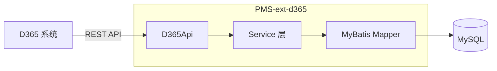

# PMS-ext-d365 模块-表CRUD映射矩阵

> ⚠️ **过时警告**：本文档表名与字段均为虚构，与实际源码不符，仅作历史参考保留。
>
> **虚构/错误内容**：
> - 表名 `purchase_order`、`purchase_order_line`、`purchase_receipt`、`purchase_receipt_line` — 实际表名带 `dp_erp_` 前缀
> - D365 字段 `VendorAccount`（实际 `vendAccount`）、`OrderDate`、`orderDate`、`ReceiptId`、`receiptId`、`ReceiptDate`、`receiptDate` — 实际源码中**不存在**这些字段
> - "数据校验机制"章节（采购订单号唯一性、收货数量校验、状态流转等）— 无源码依据，为虚构内容
> - 数据流向图过于简化，未反映推送式同步的真实流程
>
> **请参考以下准确文档**：
> - [数据流向图](data-flow.md) — 基于实际源码的推送时序图
> - [ER 图](../03-database/er-diagram.md) — 真实表名与字段
> - [数据同步架构](../01-architecture/data-sync-architecture.md) — 推送式同步机制
> - [DAO/SQL 参考](../02-modules/dao-sql-reference.md) — 真实 CRUD 方法

---

> 数据库：dppms_d365 (MySQL)
> C=创建(Create) R=读取(Read) U=更新(Update) D=删除(Delete)

---

## 1. 完整模块-表CRUD矩阵

### 1.1 采购订单模块

| 数据表 | C | R | U | D | 操作频率 | 说明 |
|--------|---|---|---|---|----------|------|
| purchase_order | ✓ | ✓ | ✓ | | R:高 C:中 U:中 | 采购订单同步 |
| purchase_order_line | ✓ | ✓ | ✓ | | R:高 C:中 U:中 | 采购订单行同步 |

### 1.2 采购收货模块

| 数据表 | C | R | U | D | 操作频率 | 说明 |
|--------|---|---|---|---|----------|------|
| purchase_receipt | ✓ | ✓ | ✓ | | R:高 C:中 U:中 | 采购收货同步 |
| purchase_receipt_line | ✓ | ✓ | ✓ | | R:高 C:中 U:中 | 采购收货行同步 |

---

## 2. 数据流向图

---

## 3. 数据转换规则

### 3.1 采购订单同步

| D365 字段 | PMS 字段 | 转换规则 |
|-----------|----------|----------|
| PurchId | purchId | 直接映射 |
| DataAreaId | dataAreaId | 直接映射 |
| VendorAccount | vendorAccount | 直接映射 |
| OrderDate | orderDate | 日期格式转换 |

### 3.2 采购收货同步

| D365 字段 | PMS 字段 | 转换规则 |
|-----------|----------|----------|
| ReceiptId | receiptId | 直接映射 |
| PurchId | purchId | 外键关联 |
| ReceiptDate | receiptDate | 日期格式转换 |

---

## 4. 数据校验机制

### 4.1 数据格式校验

- 采购订单号唯一性
- 日期格式有效性
- 金额数值有效性

### 4.2 业务规则校验

- 采购订单是否存在
- 收货数量是否超过订单数量
- 状态流转是否合法
