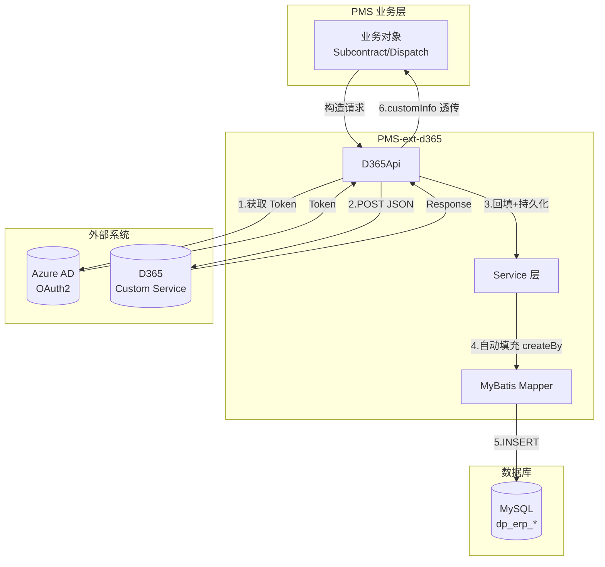
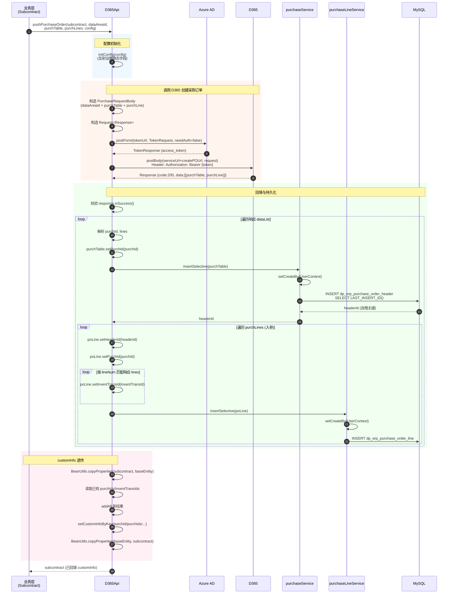
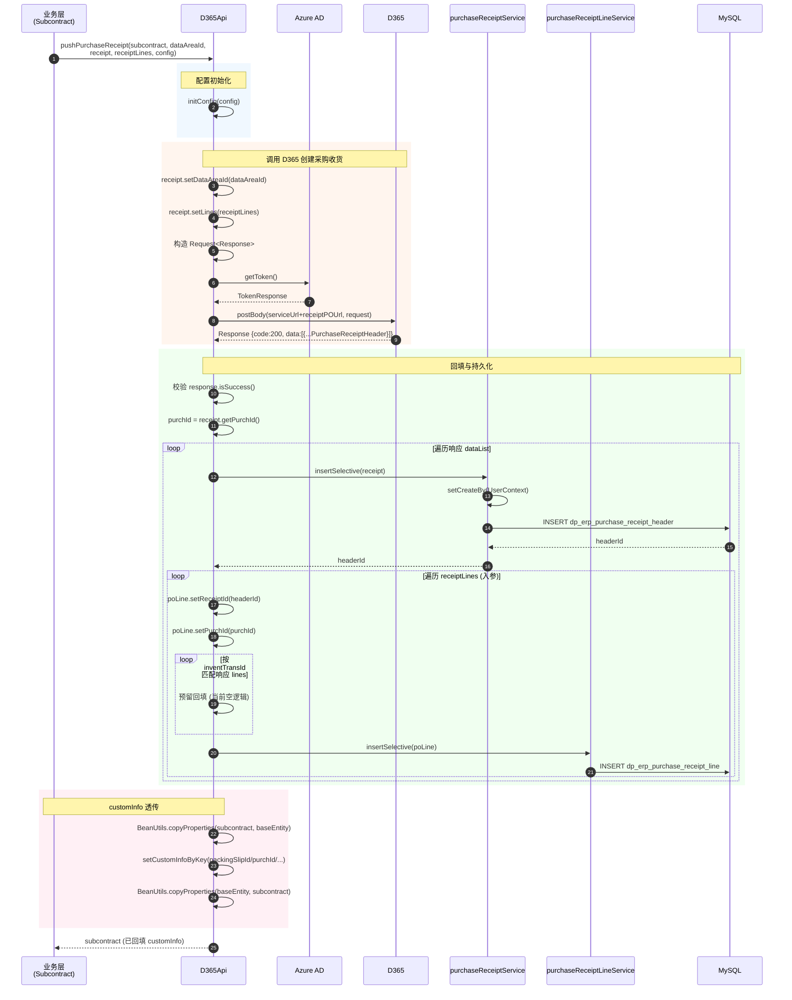
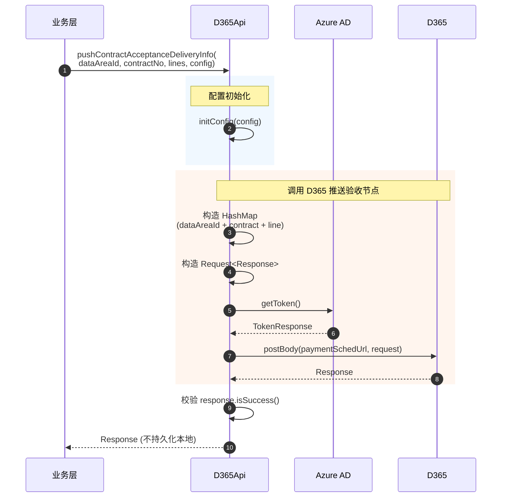
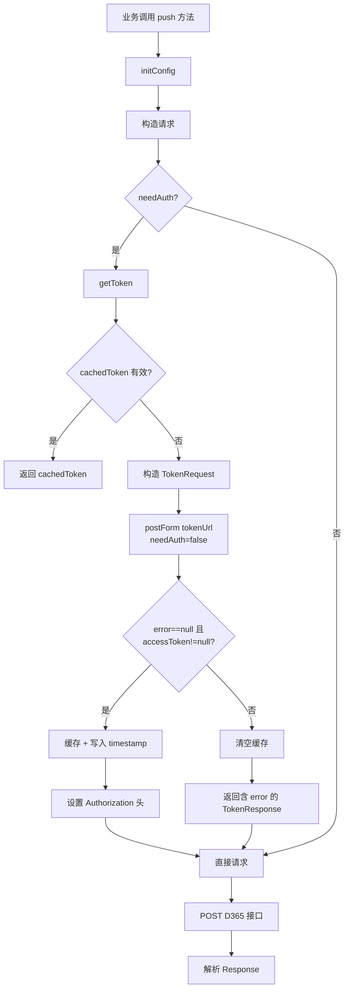
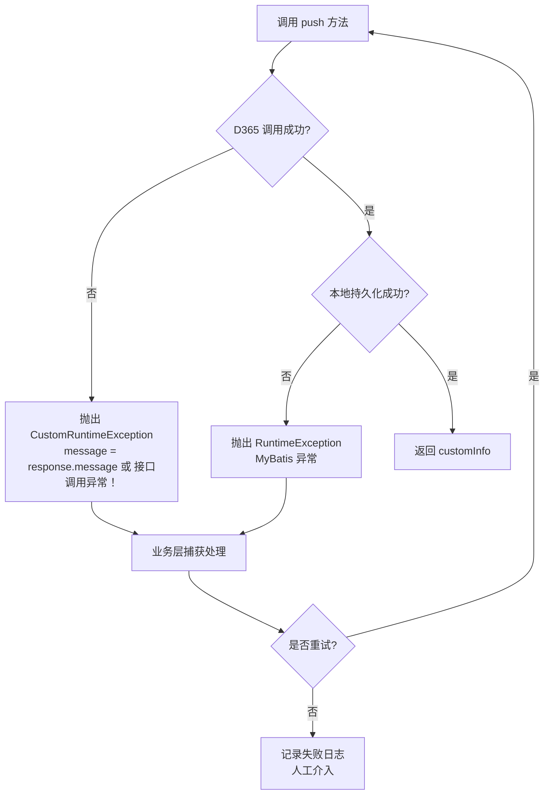

# 数据流向图

> 本文档基于实际源码编写，描述采购订单推送、采购收货推送、合同验收同步的数据流。
> 注意：实际为推送式同步（PMS → D365），非拉取式。

---

## 1. 总体数据流

---

## 2. 采购订单推送数据流

### 2.1 数据流转明细

| 步骤 | 源 | 目标 | 数据 | 方向 |
|------|-----|------|------|------|
| 构造请求 | 业务层 | D365Api | purchTable + purchLines + dataAreaId | PMS → API |
| 获取 Token | D365Api | Azure AD | client_id + client_secret + grant_type | API → AAD |
| 创建订单 | D365Api | D365 | PurchaseRequestBody (JSON) | PMS → D365 |
| 响应回执 | D365 | D365Api | Response {purchId, inventTransId} | D365 → PMS |
| 回填头 | D365Api | purchTable | purchId | API → 内存 |
| 持久化头 | D365Api | DB | Purchase → dp_erp_purchase_order_header | PMS → DB |
| 回填行 | D365Api | purchLines | headerId, purchId, inventTransId | API → 内存 |
| 持久化行 | D365Api | DB | PurchaseLine → dp_erp_purchase_order_line | PMS → DB |
| customInfo | D365Api | 业务对象 | purchId/purchIds/inventTransId/inventTransIds | API → BIZ |

---

## 3. 采购收货推送数据流

### 3.1 与采购订单数据流的差异

| 维度 | 采购订单 | 采购收货 |
|------|----------|----------|
| 请求体 | PurchaseRequestBody（purchTable + purchLine 分离） | PurchaseReceiptHeader（含 lines 嵌套） |
| 头持久化对象 | purchTable（回填 purchId 后） | receipt（入参对象） |
| 行匹配键 | lineNum | inventTransId |
| 行回填字段 | inventTransId | 预留（空逻辑） |
| customInfo 额外 key | — | packingSlipId |

---

## 4. 合同验收同步数据流

### 4.1 特点

- **不持久化到本地数据库**，仅返回 Response；
- 请求体为原生 `HashMap`（无专用 model 类）；
- 失败抛 `CustomRuntimeException`。

---

## 5. Token 获取数据流

---

## 6. 失败数据流

> ⚠️ 当前源码**无自动重试**，失败后由业务层决定是否重试。D365 侧已创建的单据需通过 `otherSysNum` 幂等键避免重复创建。

---

## 7. 数据流涉及的数据表

| 数据流 | 写入表 | 读取表 |
|--------|--------|--------|
| 采购订单推送 | dp_erp_purchase_order_header, dp_erp_purchase_order_line | — |
| 采购收货推送 | dp_erp_purchase_receipt_header, dp_erp_purchase_receipt_line | — |
| 合同验收同步 | —（不写本地） | — |
| Token 获取 | — | —（内存缓存） |

---

## 8. 相关文档

- [数据同步架构](../01-architecture/data-sync-architecture.md)
- [D365 API 架构](../01-architecture/d365-api-architecture.md)
- [CRUD 矩阵](crud-matrix.md)
- [采购订单模块](../02-modules/purchase-order.md)
- [采购收货模块](../02-modules/purchase-receipt.md)
- [ER 图](../03-database/er-diagram.md)
