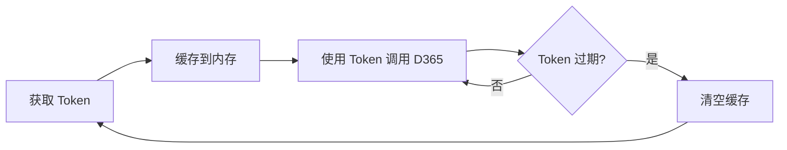

# 安全实践

> 本文档基于实际源码分析安全机制与最佳实践。

---

## 1. OAuth2 认证

### 1.1 认证方式

PMS-ext-d365 使用 **Azure AD OAuth2 client_credentials 授权模式**与 D365 交互：

- **应用身份认证**：以应用（非用户）身份获取 Token，无需用户交互；
- **授权范围**：Token 仅能访问被授予的 D365 资源；
- **Token 类型**：Bearer Token，通过 `Authorization` 头传递。

### 1.2 凭据组成

| 凭据 | 说明 | 泄露风险 |
|------|------|----------|
| `clientId` | 应用（客户端）ID | 中（标识应用） |
| `clientSecret` | 应用密钥 | **高**（等同密码） |
| `appId` | Azure AD 租户/应用 ID | 中 |
| `resource` | 目标资源 URL | 低 |

### 1.3 安全建议

- **凭据存储**：不应硬编码在代码中。当前 `D365Api.main` 方法中含示例凭据（测试用），生产环境需移除；
- **配置外部化**：通过 Spring profile 配置文件（`config/profiles/<env>/`）管理，按环境区分；
- **密钥轮换**：定期轮换 `clientSecret`，Azure AD 支持同时维护新旧密钥实现无停机轮换；
- **最小权限**：在 Azure AD 中为应用分配最小必要权限（仅 D365 Custom Service 的调用权限）。

---

## 2. HTTPS 传输

### 2.1 现有实现

D365 服务端点和 Azure AD Token 端点均使用 HTTPS：

- `tokenUrl`：`https://login.microsoftonline.com/%s/oauth2/token`
- `serviceUrl`：`https://usnconeboxax1aos.cloud.onebox.dynamics.com`

### 2.2 安全保障

- **传输加密**：HTTPS 保证 Token、请求体、响应体在传输过程中加密；
- **身份验证**：TLS 证书验证 D365/Azure AD 服务器身份，防中间人攻击；
- **完整性**：TLS 保证数据传输完整性。

### 2.3 安全建议

- **不要禁用证书验证**：Hutool 默认验证证书，不要通过自定义 SSLContext 绕过；
- **使用 TLS 1.2+**：JDK 1.8 默认支持，确保 D365 端点启用 TLS 1.2+；
- **证书钉扎**（可选）：高安全场景可实施证书钉扎，防止证书伪造。

---

## 3. Token 安全

### 3.1 Token 存储

- **内存缓存**：`volatile TokenResponse cachedToken`，仅存储在 JVM 内存中，不落盘；
- **不记录日志**：当前 `System.out.println` 输出的是 request/body，不含 Token（Token 在 headers 中，但 `post` 方法单独处理 headers，未打印）。

> ⚠️ `initAuthorization` 方法（已废弃）会设置 Token 到 request.headers，若调用 `System.out.println(request)` 可能泄露 Token。当前主流程使用 `post` 方法内部处理认证，不调用 `initAuthorization`。

### 3.2 Token 生命周期



- **过期自动刷新**：基于 `expiresOn` 判断，过期后自动重新获取；
- **无主动撤销**：当前无主动撤销 Token 的机制（依赖 Azure AD 自动过期）。

### 3.3 安全建议

- **日志脱敏**：如需记录请求头，对 `Authorization` 头脱敏（仅记录前 10 字符）；
- **Token 有效期**：Azure AD 默认 1 小时，可接受；
- **异常监控**：监控 Token 获取失败（`error != null`），可能是凭据失效或被撤销。

---

## 4. 凭据管理

### 4.1 当前实践

PMS 项目通过 Maven Profile 管理环境配置：

- `config/profiles/dev/`：开发环境
- `config/profiles/test/`：测试环境
- `config/profiles/release/`：生产环境

> ⚠️ **请勿提交真实凭据**（AGENTS.md 明确要求）。配置文件通过 profile 激活资源过滤。

### 4.2 安全建议

- **环境变量**：生产环境优先使用环境变量注入凭据，而非配置文件；
- **密钥管理服务**：高安全场景使用 Azure Key Vault 或类似服务管理 `clientSecret`；
- **配置文件权限**：生产环境配置文件设置严格文件权限（仅应用运行用户可读）；
- **Git 忽略**：`.gitignore` 中排除含真实凭据的配置文件。

### 4.3 D365Api.main 方法的凭据问题

> ⚠️ `D365Api.java` 第 556-580 行的 `main` 方法含**测试凭据示例**（appId、clientSecret、clientId）。虽然标注为测试用，但已提交到代码仓库。

建议：
- 移除 `main` 方法中的真实凭据，替换为占位符；
- 或将 `main` 方法移至 test 目录；
- 轮换已泄露的 `clientSecret`。

---

## 5. 输入校验

### 5.1 现有实现

> ⚠️ `D365Api` 对入参**无显式校验**：

- `pushPurchaseOrder` 不校验 `purchTable`、`purchLines` 是否为 null；
- `pushPurchaseReceipt` 不校验 `receipt`、`receiptLines` 是否为 null；
- 不校验 `dataAreaId`、`config` 是否为 null。

### 5.2 风险

- 空指针异常：入参为 null 时抛 NPE，错误信息不友好；
- 非法数据：业务字段（如金额、数量）无校验，可能推送非法数据到 D365。

### 5.3 安全建议

```java
// 建议在 push 方法入口添加校验
public static <T> T pushPurchaseOrder(T subcontract, String dataAreaId,
        PurchaseHeader purchTable, List<PurchaseLine> purchLines, Map<String, Object> config) {
    if (subcontract == null) {
        throw new CustomRuntimeException("业务对象不能为空");
    }
    if (StringUtils.isBlank(dataAreaId)) {
        throw new CustomRuntimeException("账套(dataAreaId)不能为空");
    }
    if (purchTable == null) {
        throw new CustomRuntimeException("采购订单头不能为空");
    }
    if (CollectionUtils.isEmpty(purchLines)) {
        throw new CustomRuntimeException("采购订单行不能为空");
    }
    if (config == null || config.isEmpty()) {
        throw new CustomRuntimeException("D365 配置不能为空");
    }
    // ... 原有逻辑
}
```

---

## 6. 异常信息泄露

### 6.1 现有实现

`D365Api.pushPurchaseOrder` 失败时抛出：

```java
throw new CustomRuntimeException(
    StringUtils.defaultIfBlank(response.getMessage(), "接口调用异常！"));
```

- 使用 D365 返回的 `message`，可能含敏感信息（如内部错误细节）；
- 默认提示"接口调用异常！"较模糊。

### 6.2 安全建议

- **日志记录详情**：将 D365 完整响应记录到日志（DEBUG 级别），供排查；
- **异常信息脱敏**：对外抛出的异常信息脱敏，避免泄露 D365 内部结构；
- **错误码映射**：将 D365 错误码映射为业务错误码，详见 [错误码](../06-reference/error-codes.md)。

---

## 7. SQL 注入防护

### 7.1 现有实现

MyBatis Mapper XML 使用 `#{}` 参数占位符（预编译），**不存在 SQL 注入**：

```xml
<!-- 安全：使用 #{} 预编译 -->
<if test="purchId != null and '' != purchId">
    poh.`purchId` = #{purchId, jdbcType=VARCHAR} AND
</if>
```

### 7.2 风险点

> ⚠️ `sql_pageable_limit` 中使用 `${orderBy}`（字符串拼接）：

```xml
<if test="orderBy != null">
    order by ${orderBy}
</if>
```

`${}` 是字符串拼接，存在 SQL 注入风险。但该片段**已被注释**（`selectBySelectivePageable` 被注释），当前不启用。

### 7.3 安全建议

- 如启用分页查询，对 `orderBy` 参数做白名单校验（仅允许 `id desc`、`createTime asc` 等）；
- 或使用 MyBatis-Plus 的 `OrderItem` 等安全排序方案。

---

## 8. 数据安全

### 8.1 敏感数据

PMS-ext-d365 处理的数据包括：

| 数据 | 敏感等级 | 说明 |
|------|----------|------|
| 供应商账号（vendAccount） | 中 | 业务数据 |
| 合同号（purContract/salesContract） | 中 | 业务数据 |
| 金额（contractAmount/purchPrice） | 中 | 财务数据 |
| customInfo | 视内容 | 可能含业务扩展信息 |
| Token | **高** | 访问凭据 |
| clientSecret | **高** | 应用密钥 |

### 8.2 安全建议

- **日志脱敏**：记录请求/响应时，对供应商账号、金额等脱敏；
- **传输加密**：已通过 HTTPS 保证；
- **存储加密**：数据库层面的字段加密由主项目决定，本模块无特殊要求；
- **访问控制**：D365 同步功能应限制为特定角色（如财务、采购管理员）。

---

## 9. 相关文档

- [D365 API 架构](../01-architecture/d365-api-architecture.md) — OAuth2 详解
- [故障排查](troubleshooting.md) — Token 过期等问题
- [错误码](../06-reference/error-codes.md)
- [编码规范](coding-standards.md)
