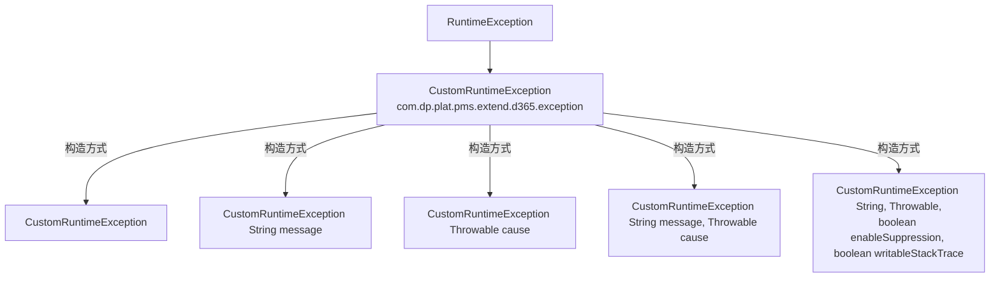

# 错误码

> 本文档基于实际源码梳理错误码与异常体系。
> 注意：实际异常类为 `CustomRuntimeException`（非 `D365Exception`），无 `code` 字段。

---

## 1. 异常体系



### 1.1 CustomRuntimeException

- **全限定名**：`com.dp.plat.pms.extend.d365.exception.CustomRuntimeException`
- **继承**：`RuntimeException`
- **特点**：**无 code 字段**（早期文档中的 `D365Exception` 含 code 字段属虚构）

| 构造方法 | 说明 |
|----------|------|
| `CustomRuntimeException()` | 无参 |
| `CustomRuntimeException(String message)` | 仅消息 |
| `CustomRuntimeException(Throwable cause)` | 仅原因 |
| `CustomRuntimeException(String message, Throwable cause)` | 消息 + 原因 |
| `CustomRuntimeException(String message, Throwable cause, boolean enableSuppression, boolean writableStackTrace)` | 完整构造 |

> ⚠️ 早期文档中的 `D365Exception` 类**不存在**。所有 D365 相关异常均使用 `CustomRuntimeException`。

---

## 2. D365 API 响应码

### 2.1 Response 结构

`com.dp.plat.pms.extend.d365.model.Response`：

| 字段 | 类型 | 说明 |
|------|------|------|
| code | Integer | 状态码，200 表示成功 |
| message | String | 错误信息 |
| data | `List<Map<String, Object>>` | 业务数据 |

判断方法：`isSuccess()` 返回 `SUCCESS_CODE.equals(this.code)`，其中 `SUCCESS_CODE = 200`。

### 2.2 业务响应码

| code | 含义 | 处理方式 |
|------|------|----------|
| 200 | 成功 | 正常处理 |
| 非 200 | 失败 | 抛 `CustomRuntimeException(message)` |

> ⚠️ D365 Custom Service 返回的 code 由 D365 侧自定义，非标准 HTTP 状态码。具体含义需参考 D365 接口文档。

---

## 3. HTTP 状态码

D365Api 使用 Hutool HTTP 客户端，HTTP 层面的状态码由 D365/Azure AD 返回：

| HTTP 状态码 | 含义 | 可能原因 | 处理建议 |
|-------------|------|----------|----------|
| 200 | 成功 | — | 解析响应体 |
| 400 | Bad Request | 请求格式错误、字段缺失 | 检查请求体 JSON |
| 401 | Unauthorized | Token 无效或过期 | 重新获取 Token |
| 403 | Forbidden | 权限不足 | 检查 Azure AD 应用权限 |
| 404 | Not Found | URL 错误 | 检查 serviceUrl、createPOUrl 等配置 |
| 500 | Internal Server Error | D365 服务异常 | 联系 D365 管理员 |
| 502 | Bad Gateway | 网关错误 | 重试或联系运维 |
| 503 | Service Unavailable | 服务不可用 | 重试 |
| 504 | Gateway Timeout | 网关超时 | 检查网络、重试 |

> ⚠️ 当前 `D365Api.post` 方法**不检查 HTTP 状态码**，直接解析响应体。若 D365 返回非 200 HTTP 状态码，响应体可能非 JSON，`JSON.parseObject` 会返回 null，最终返回空对象。

---

## 4. Token 响应错误

### 4.1 TokenResponse 错误字段

| 字段 | JSON 名称 | 说明 |
|------|-----------|------|
| error | `error` | 错误标识（如 `invalid_client`） |
| errorDescription | `error_description` | 错误描述 |
| errorCodes | `error_codes` | 错误码列表 |
| errorUri | `error_uri` | 错误详情 URI |

### 4.2 常见 Token 错误

| error | 含义 | 原因 | 处理 |
|-------|------|------|------|
| `invalid_client` | 客户端无效 | clientId/clientSecret 错误 | 检查凭据 |
| `invalid_request` | 请求无效 | 参数缺失或格式错误 | 检查 TokenRequest |
| `invalid_grant` | 授权无效 | grantType 错误或权限不足 | 检查 grantType 和应用权限 |
| `invalid_resource` | 资源无效 | resource URL 错误 | 检查 serviceUrl |
| `unauthorized_client` | 客户端未授权 | 应用未获授权 | Azure AD 管理员授权 |

### 4.3 Token 失败的处理

`getToken()` 在 Token 获取失败时：
- **不抛异常**，返回含 `error` 字段的 `TokenResponse`；
- **清空缓存**（`cachedToken = null`）；
- 后续 `post` 方法中 `token.getTokenType()` 可能为 null，不设置 Authorization 头；
- D365 返回 401，`response.isSuccess()` 为 false，最终抛 `CustomRuntimeException`。

---

## 5. 异常抛出场景

### 5.1 D365Api 中的异常抛出

| 位置 | 触发条件 | 异常 | 消息 |
|------|----------|------|------|
| `pushPurchaseOrder` (Map版) | `response.isSuccess() == false` | `CustomRuntimeException` | `response.getMessage()` 或 "接口调用异常！" |
| `pushPurchaseReceipt` (Map版) | `response.isSuccess() == false` | `CustomRuntimeException` | `response.getMessage()` 或 "接口调用异常！" |
| `pushContractAcceptanceDeliveryInfo` | `response.isSuccess() == false` | `CustomRuntimeException` | `response.getMessage()` 或 "接口调用异常！" |

### 5.2 消息处理逻辑

```java
throw new CustomRuntimeException(
    StringUtils.defaultIfBlank(response.getMessage(), "接口调用异常！"));
```

- 优先使用 D365 返回的 `message`；
- `message` 为空白（null/空串/纯空格）时使用默认提示"接口调用异常！"。

---

## 6. MyBatis 异常

本地持久化时可能抛出的 Spring/MyBatis 异常（非本模块定义）：

| 异常 | 场景 | 处理 |
|------|------|------|
| `BadSqlGrammarException` | SQL 语法错误、表/字段不存在 | 检查表结构 |
| `DataIntegrityViolationException` | 数据完整性违反（如主键冲突） | 检查唯一性 |
| `DuplicateKeyException` | 唯一键冲突 | 检查 purchId/packingSlipId |
| `TypeMismatchException` | 类型不匹配 | 检查 customInfo (JSON) 字段 |
| `CannotGetJdbcConnectionException` | 获取连接失败 | 检查连接池 |
| `NullPointerException` | 空指针 | 检查入参 |

---

## 7. 错误处理建议

### 7.1 调用方异常处理

```java
try {
    Subcontract result = D365Api.pushPurchaseOrder(
        subcontract, dataAreaId, purchTable, purchLines, config);
    // 处理成功
} catch (CustomRuntimeException e) {
    // D365 接口调用失败
    log.error("D365 采购订单推送失败: {}", e.getMessage());
    // 业务处理：记录失败状态、通知用户等
} catch (DataIntegrityViolationException e) {
    // 本地数据库异常
    log.error("本地持久化失败", e);
    // 注意：D365 可能已创建订单，需幂等处理
}
```

### 7.2 幂等处理

D365 侧已创建订单但本地持久化失败时，重试需避免重复创建：

```java
// 推送前检查 otherSysNum 是否已存在
Purchase existing = purchaseService.selectBySelective(
    new Purchase().setOtherSysNum(otherSysNum));  // 需扩展查询
if (existing != null) {
    // 已推送过，跳过或更新
    return existing;
}
// 执行推送
```

---

## 8. 相关文档

- [D365 API 工具类](../02-modules/d365-api.md)
- [故障排查](../05-standards/troubleshooting.md)
- [安全实践](../05-standards/security-practices.md)
- [术语表](glossary.md)
