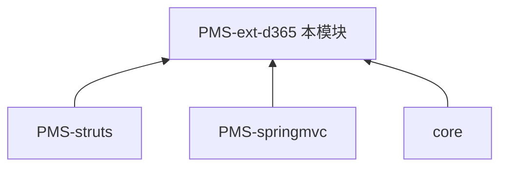

# PMS-ext-d365 模块知识库

> DPtech PMS **D365（Dynamics 365）集成扩展模块**。提供与 Microsoft Dynamics 365 ERP 系统的数据交互，支持采购数据同步、收货数据同步等。本知识库独立维护。

---

## 模块定位

| 项 | 值 |
|----|----|
| 目录 | `PMS/PMS-ext-d365/` |
| artifactId | `pms-ext-d365` |
| 基础包 | `com.dp.plat.pms.extend.d365` |
| 打包类型 | jar |
| 职责 | D365 API 集成、采购数据同步、收货数据同步 |

### 依赖关系

> PMS-struts 和 PMS-springmvc 的业务模块调用 D365 集成服务实现与外部 ERP 数据互通。

---

## 文档目录

| 章节 | 内容 |
|------|------|
| [01-architecture](01-architecture/) | D365 集成架构、API 设计 |
| [02-modules](02-modules/) | D365 集成功能说明 |
| [03-database](03-database/) | 数据字典（同步表）、数据库概览 |
| [04-mapping](04-mapping/) | 功能-表 CRUD 矩阵 |
| [05-standards](05-standards/) | 编码规范 |
| [06-reference](06-reference/) | 代码示例 |

---

## 跨库知识共享

- 调用方：[PMS-struts](../PMS-struts/docs/README.md)、[PMS-springmvc](../PMS-springmvc/docs/README.md)
- 基础框架（多数据源 @DataSource）：[core](../core/docs/README.md)
- 共用数据库同步表：[PMS-struts 同步表文档](../PMS-struts/docs/03-database/sync-tables.md)
