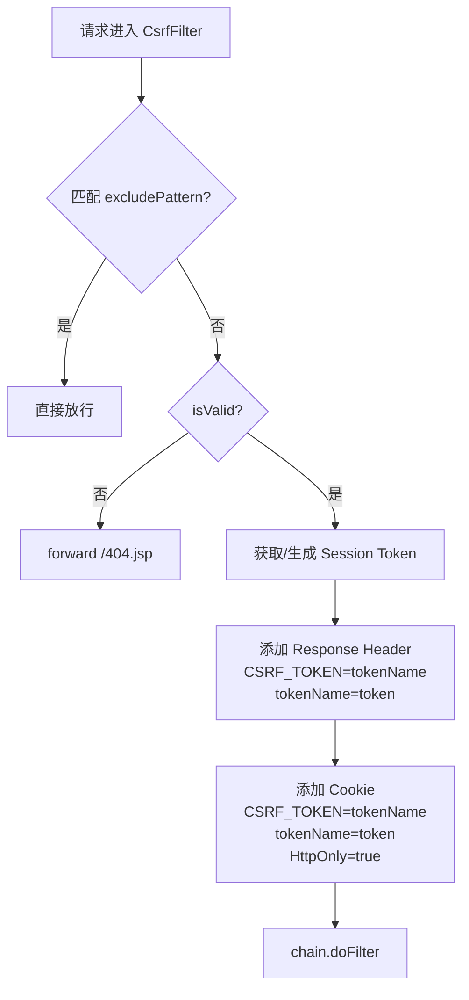
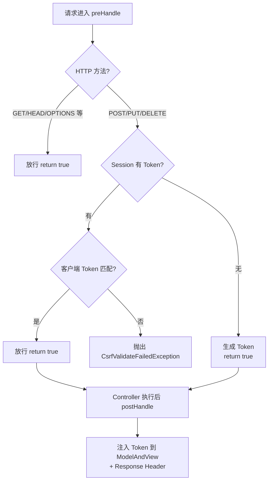

# CSRF 防护架构

## 1. 概述

PMS-security 提供双环境 CSRF 防护：
- **Struts2 环境**（PMS-struts dev）：使用 `CsrfFilter`（Servlet Filter）
- **Spring MVC 环境**（PMS-springmvc）：使用 `CsrfInterceptor`（HandlerInterceptor）

两者共享 `CSRFTokenManager` 进行 Token 的生成、存储与提取。

---

## 2. Token 机制

### 2.1 Token 标识

| 常量 | 值 | 用途 |
|------|-----|------|
| `CSRF_PARAM_NAME_DEFAULT` | `__RequestVerificationToken` | 默认 Token 参数名 |
| `CSRF_TOKEN_FOR_SESSION_ATTR_NAME` | `com.dp.plat.security.csrf.CSRFTokenManager.tokenval` | Session 中存储 Token 的属性名 |
| `CSRF_TOKEN_PARAM_NAME` | `CSRF_TOKEN` | Cookie/Header 中的 Token 名称标识 |

### 2.2 Token 生成

```java
// CSRFTokenManager.generateToken()
public static String generateToken() {
    return UUID.randomUUID().toString();
}
```

- 算法：`UUID.randomUUID()`（Java 原生 UUID，128 位）
- 格式：`xxxxxxxx-xxxx-xxxx-xxxx-xxxxxxxxxxxx`
- 无参方法，不直接写入 Session

### 2.3 Token 会话存储

```java
// CSRFTokenManager.getTokenForSession()
public static String getTokenForSession(HttpSession session) {
    synchronized (session) {
        token = (String) session.getAttribute(CSRF_TOKEN_FOR_SESSION_ATTR_NAME);
        if (null == token) {
            token = generateToken();
            session.setAttribute(CSRF_TOKEN_FOR_SESSION_ATTR_NAME, token);
        }
    }
    return token;
}
```

- **懒加载**：首次调用时生成并存储，后续直接返回
- **线程安全**：对 Session 对象加锁，防止并发重复生成
- **会话级有效**：Token 绑定到 HttpSession，整个会话期间不变

### 2.4 Token 提取（三通道）

```java
// CSRFTokenManager.getTokenFromRequest()
public static String getTokenFromRequest(HttpServletRequest request) {
    String csrfToken = request.getParameter(getTokenName());      // 1. 请求参数
    if (StringUtils.isEmpty(csrfToken)) {
        csrfToken = request.getHeader(getTokenName());            // 2. 请求头
    }
    if (StringUtils.isEmpty(csrfToken)) {
        Cookie[] cookies = request.getCookies();                  // 3. Cookie
        if (cookies != null) {
            for (Cookie cookie : cookies) {
                if (getTokenName().equals(cookie.getName())) {
                    csrfToken = cookie.getValue();
                    break;
                }
            }
        }
    }
    return csrfToken;
}
```

**提取优先级**：请求参数 > 请求头 > Cookie

> ⚠️ 注意：`getTokenName()` 返回的是 `csrfTokenName` 字段（默认 `__RequestVerificationToken`），而非 `CSRF_TOKEN`。Cookie 查找使用 `getTokenName()` 作为名称匹配。

---

## 3. CsrfFilter（Struts2 环境）

### 3.1 处理流程



### 3.2 isValid 校验逻辑

```java
// CsrfFilter.isValid()
String serverCsrfToken = (String) session.getAttribute(CSRF_TOKEN_FOR_SESSION_ATTR_NAME);
if (StringUtils.isEmpty(serverCsrfToken)) {
    CSRFTokenManager.getTokenForSession(session);  // 首次访问，生成 Token
} else {
    if (isNeedValidatorCsrfToken(method)) {
        String clientCsrfToken = CSRFTokenManager.getTokenFromRequest(request);
        if (StringUtils.isEmpty(clientCsrfToken) || !clientCsrfToken.equals(serverCsrfToken)) {
            return false;  // 校验失败
        }
    }
}
return true;
```

### 3.3 方法过滤

```java
// CsrfFilter.isNeedValidatorCsrfToken()
private boolean isNeedValidatorCsrfToken(String method) {
    return true;  // 当前实现：所有方法都校验
    // return "POST".equals(method) || "DELETE".equals(method) || "PUT".equals(method);
}
```

> ⚠️ **注意**：CsrfFilter 当前实现**对所有 HTTP 方法（包括 GET）都校验 Token**。POST/DELETE/PUT 的过滤逻辑被注释掉了。这与 CsrfInterceptor 的行为不同。

### 3.4 Token 下发

校验通过后，CsrfFilter 通过两个通道下发 Token：

| 通道 | Header/Cookie 名 | 值 |
|------|------------------|-----|
| Response Header | `CSRF_TOKEN` | tokenName（即 `__RequestVerificationToken`） |
| Response Header | `__RequestVerificationToken` | token 值 |
| Cookie | `CSRF_TOKEN` | tokenName |
| Cookie | `__RequestVerificationToken` | token 值 |

所有 Cookie 设置 `HttpOnly=true`，路径为 contextPath。

### 3.5 失败处理

校验失败时：`request.getRequestDispatcher("/404.jsp").forward(request, response)`

---

## 4. CsrfInterceptor（Spring MVC 环境）

### 4.1 处理流程



### 4.2 preHandle 校验逻辑

```java
// CsrfInterceptor.preHandle()
String method = request.getMethod();
HttpSession session = request.getSession();
String serverCsrfToken = (String) session.getAttribute(CSRF_TOKEN_FOR_SESSION_ATTR_NAME);

if (StringUtils.isEmpty(serverCsrfToken)) {
    CSRFTokenManager.getTokenForSession(session);  // 首次访问，生成 Token
} else {
    if (isNeedValidatorCsrfToken(method)) {
        String clientCsrfToken = CSRFTokenManager.getTokenFromRequest(request);
        if (StringUtils.isEmpty(clientCsrfToken) || !clientCsrfToken.equals(serverCsrfToken)) {
            throw new CsrfValidateFailedException("csrf token validate failed");
        }
    }
}
return true;
```

### 4.3 方法过滤

```java
// CsrfInterceptor.isNeedValidatorCsrfToken()
private boolean isNeedValidatorCsrfToken(String method) {
    return "POST".equals(method) || "DELETE".equals(method) || "PUT".equals(method);
}
```

> **与 CsrfFilter 的区别**：CsrfInterceptor **仅对 POST/PUT/DELETE 校验**，GET 等安全方法放行。

### 4.4 postHandle Token 注入

```java
// CsrfInterceptor.postHandle()
if (modelAndView != null) {
    Map<String, Object> model = modelAndView.getModel();
    String token = CSRFTokenManager.getTokenForSession(request.getSession());
    model.put(CSRFTokenManager.getTokenName(), token);          // 注入到 Model
    response.addHeader(CSRFTokenManager.getTokenName(), token); // 添加到 Header
}
```

> **作用**：使 JSP/Thymeleaf 等视图可通过 `${__RequestVerificationToken}` 直接获取 Token，无需手动从 Session 读取。

### 4.5 异常处理

抛出 `CsrfValidateFailedException`（继承 `RuntimeException`），由 Spring MVC 的 `ExceptionHandler` 或全局异常处理器捕获。

---

## 5. CsrfFilter vs CsrfInterceptor 对比

| 维度 | CsrfFilter | CsrfInterceptor |
|------|-----------|-----------------|
| 类型 | Servlet Filter | Spring MVC HandlerInterceptor |
| 部署环境 | PMS-struts（dev） | PMS-springmvc |
| 校验方法 | **所有方法**（含 GET） | 仅 POST/PUT/DELETE |
| 失败处理 | forward `/404.jsp` | 抛出 `CsrfValidateFailedException` |
| Token 下发 | Response Header + Cookie（双 Cookie） | ModelAndView + Response Header |
| 排除路径 | `excludePattern` 正则 | `<mvc:exclude-mapping>` |
| postHandle | 无（Filter 无后置处理） | 有（注入 Token 到 Model） |
| 依赖 | `commons-lang3` StringUtils | `spring-core` StringUtils |

---

## 6. 豁免路径

### 6.1 PMS-struts（dev）

CsrfFilter 未配置 `excludePattern`，**无豁免路径**，所有请求都校验。

### 6.2 PMS-springmvc

CsrfInterceptor 配置了 `<mvc:exclude-mapping path="/sys/login.json"/>`，登录接口豁免。

> **原因**：登录请求时 Session 尚未建立 Token，无法通过校验。

---

## 7. 客户端集成

### 7.1 表单集成

```jsp
<!-- 从 Model 获取 Token（CsrfInterceptor 注入） -->
<input type="hidden" name="__RequestVerificationToken" 
       value="${__RequestVerificationToken}"/>
```

### 7.2 AJAX 集成

```javascript
// 从 Cookie 读取 Token，添加到请求头
var token = getCookie("__RequestVerificationToken");
$.ajaxSetup({
    beforeSend: function(xhr) {
        xhr.setRequestHeader("__RequestVerificationToken", token);
    }
});
```

---

## 8. 相关文档

| 文档 | 说明 |
|------|------|
| [../02-modules/csrf-filter.md](../02-modules/csrf-filter.md) | CSRF 组件详细说明 |
| [security-filter-chain.md](security-filter-chain.md) | 过滤器链架构 |
| [../06-reference/error-codes.md](../06-reference/error-codes.md) | CsrfValidateFailedException 错误码 |
