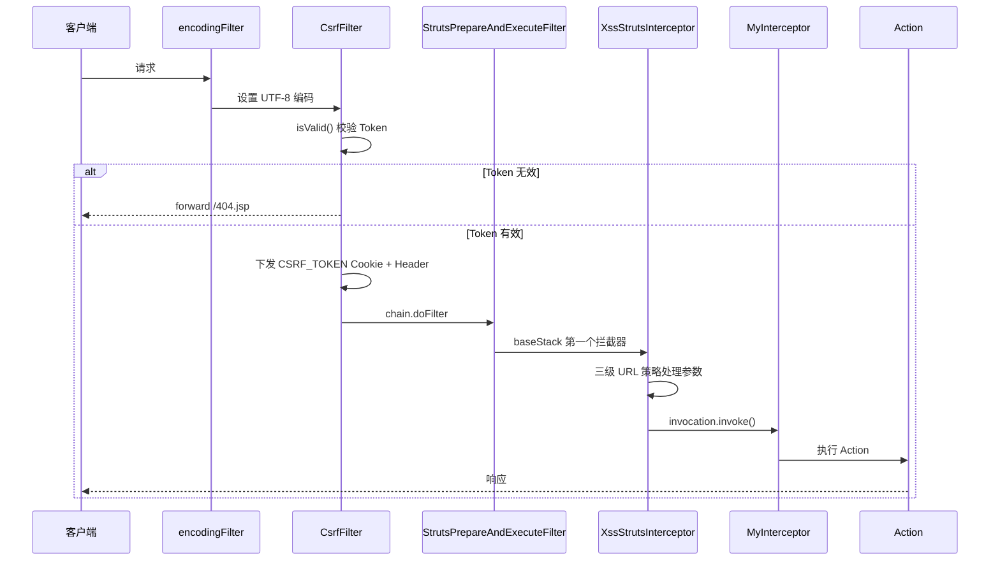
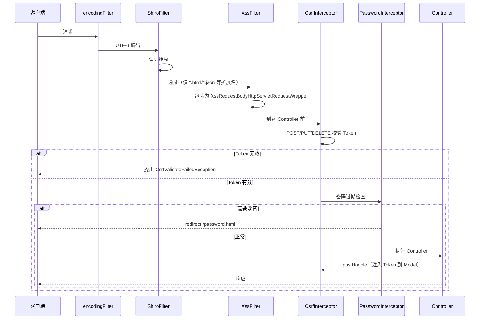

# 安全过滤器链架构

## 1. 概述

PMS-security 模块提供的安全 Filter/Interceptor 在 PMS-struts 和 PMS-springmvc 两个 Web 层模块中以不同组合启用。本文档详细说明各组件的执行顺序、配置方式与 URL 匹配规则。

---

## 2. PMS-struts 过滤器链（dev 环境）

### 2.1 web.xml 配置顺序

> 来源：`PMS-struts/config/profiles/dev/web.xml`

| 序号 | Filter 名称 | 类 | URL Pattern | 说明 |
|------|------------|-----|-------------|------|
| 1 | `encodingFilter` | `org.springframework.web.filter.CharacterEncodingFilter` | `/*` | UTF-8 编码 |
| 2 | `CsrfFilter` | `com.dp.plat.security.csrf.CsrfFilter` | `/*` | CSRF Token 校验 + Cookie 下发 |
| 3 | `XssFilter` | `com.dp.plat.security.xss.XssFilter` | `/*` | **已注释**，未启用 |
| 4 | `UserCheck` | `com.dp.plat.util.UserCheckFilter` | `*.action` | 用户校验 |
| 5 | `struts2` | `org.apache.struts2.dispatcher.ng.filter.StrutsPrepareAndExecuteFilter` | `*.action` | Struts2 核心 |

> ⚠️ **dev 环境**：`XssFilter` 在 web.xml 中被注释掉，XSS 防护实际由 Struts2 拦截器 `XssStrutsInterceptor` 承担。

### 2.2 Struts2 拦截器栈

> 来源：`PMS-struts/config/struts.xml`

```xml
<interceptor name="XssStrutsInterceptor" class="com.dp.plat.security.xss.struts.XssStrutsInterceptor">
    <param name="enable">true</param>
    <param name="excludeUrls">/base/executeSql.*</param>
    <param name="cleanUrls">/module/prob_*,/probAudit.*,/probAjax_*.*</param>
    <param name="encodeUrls">/*</param>
</interceptor>

<interceptor-stack name="baseStack">
    <interceptor-ref name="XssStrutsInterceptor"/>
    <interceptor-ref name="MyInterceptor"/>
    <interceptor-ref name="fileUpload">...</interceptor-ref>
    <interceptor-ref name="defaultStack"/>
</interceptor-stack>
```

`XssStrutsInterceptor` 是 `baseStack` 的**第一个**拦截器，在所有业务逻辑前执行。

---

## 3. PMS-springmvc 过滤器链

### 3.1 web.xml 配置顺序

> 来源：`PMS-springmvc/src/main/webapp/WEB-INF/web.xml`

| 序号 | Filter 名称 | 类 | URL Pattern | 说明 |
|------|------------|-----|-------------|------|
| 1 | `encodingFilter` | `CharacterEncodingFilter` | `/*` | UTF-8 编码 |
| 2 | `druidWebStatFilter` | `DruidWebStatFilter` | `/*` | Druid 监控 |
| 3 | `shiroFilter` | `ShiroFilter` | `/*` | Shiro 认证授权 |
| 4 | `XssFilter` | `com.dp.plat.security.xss.XssFilter` | `*.html`、`*.json`、`*.xlsx`、`*.xls`、`/modals/*` | XSS 防护（按扩展名过滤） |

> **注意**：PMS-springmvc 的 `XssFilter` 使用**扩展名匹配**而非 `/*`，未覆盖的路径（如 `.do`）不经过 XSS 过滤。

### 3.2 Spring MVC 拦截器链

> 来源：`PMS-springmvc/src/main/resources/spring-mvc.xml`

| 序号 | 拦截器 | 类 | mapping | exclude-mapping | 说明 |
|------|--------|-----|---------|-----------------|------|
| 1 | `localeChangeInterceptor` | `LocaleChangeInterceptor` | `/**` | - | 国际化 |
| 2 | `csrfInterceptor` | `com.dp.plat.security.csrf.CsrfInterceptor` | `/**` | `/sys/login.json` | CSRF 校验 |
| 3 | `pwdInterceptor` | `com.dp.plat.core.interceptor.PasswordInterceptor` | `/**` | `/password.*`、`/modifyPassword.*` | 密码过期检查 |

> **注意**：`pwdInterceptor` 使用的是 core 模块的 `com.dp.plat.core.interceptor.PasswordInterceptor`（继承本模块抽象类），而非本模块的直接类。

---

## 4. URL 匹配规则

### 4.1 CsrfFilter（Servlet Filter）

```java
// CsrfFilter.doFilter()
String excludePattern = filterConfig.getInitParameter("excludePattern");
if (StringUtils.isNotBlank(excludePattern) && servletPath.matches(excludePattern)) {
    chain.doFilter(request, response);  // 跳过
    return;
}
```

- **匹配方式**：`String.matches()` 正则全匹配
- **配置方式**：`<init-param><param-name>excludePattern</param-name>`
- **dev 环境**：未配置 excludePattern，所有路径均校验

### 4.2 XssFilter（Servlet Filter）

```java
// XssFilter.doFilter()
String excludePattern = filterConfig.getInitParameter("excludePattern");
if (StringUtils.isNotBlank(excludePattern) && servletPath.matches(excludePattern)) {
    chain.doFilter(request, response);  // 跳过
    return;
}
```

- **匹配方式**：与 CsrfFilter 相同，`String.matches()` 正则全匹配
- **PMS-springmvc**：注释中可见曾配置 `/sys/notifyTemplate/.*\..*` 作为排除路径

### 4.3 XssStrutsInterceptor（Struts2 Interceptor）

三级 URL 策略，使用 `Pattern.compile("^" + pattern).matcher(url).find()` **前缀匹配**：

| 策略 | 参数 | 处理方式 |
|------|------|---------|
| `excludeUrls` | 排除列表 | 不处理，直接放行 |
| `cleanUrls` | 清理列表 | `JsoupUtil.clean()` HTML 白名单清理 |
| `encodeUrls` | 编码列表 | `JsoupUtil.xssEncode()` HTML 实体编码 |

**匹配优先级**：`excludeUrls` > `cleanUrls` > `encodeUrls`

```java
// XssStrutsInterceptor.isMatch()
Pattern p = Pattern.compile("^" + pattern);
Matcher m = p.matcher(url);
if (m.find()) { return true; }
```

> ⚠️ 注意：`isMatch` 在 `enabled=false` 时**始终返回 true**，即所有 URL 都匹配 cleanUrls（走清理模式）。`enabled` 默认为 false，必须显式配置 `<param name="enable">true</param>` 才能启用三级策略。

### 4.4 CsrfInterceptor（Spring MVC Interceptor）

- **mapping**：`/**`（所有路径）
- **exclude-mapping**：`/sys/login.json`
- **方法过滤**：仅 `POST`、`DELETE`、`PUT` 需要校验 Token，GET/HEAD/OPTIONS 等放行

---

## 5. 执行顺序详解

### 5.1 PMS-struts（dev）完整链路



### 5.2 PMS-springmvc 完整链路



---

## 6. 配置方式总结

### 6.1 Filter 配置（web.xml）

```xml
<filter>
    <filter-name>CsrfFilter</filter-name>
    <filter-class>com.dp.plat.security.csrf.CsrfFilter</filter-class>
    <init-param>
        <param-name>excludePattern</param-name>
        <param-value>正则表达式</param-value>
    </init-param>
</filter>
<filter-mapping>
    <filter-name>CsrfFilter</filter-name>
    <url-pattern>/*</url-pattern>
</filter-mapping>
```

### 6.2 Struts2 Interceptor 配置（struts.xml）

```xml
<interceptor name="XssStrutsInterceptor" 
             class="com.dp.plat.security.xss.struts.XssStrutsInterceptor">
    <param name="enable">true</param>
    <param name="excludeUrls">逗号分隔的URL前缀</param>
    <param name="cleanUrls">逗号分隔的URL前缀</param>
    <param name="encodeUrls">逗号分隔的URL前缀</param>
</interceptor>
```

### 6.3 Spring MVC Interceptor 配置（spring-mvc.xml）

```xml
<mvc:interceptor>
    <mvc:mapping path="/**"/>
    <mvc:exclude-mapping path="/sys/login.json"/>
    <bean class="com.dp.plat.security.csrf.CsrfInterceptor"/>
</mvc:interceptor>
```

---

## 7. 相关文档

| 文档 | 说明 |
|------|------|
| [csrf-architecture.md](csrf-architecture.md) | CSRF 防护架构 |
| [xss-architecture.md](xss-architecture.md) | XSS 防护架构 |
| [../04-mapping/filter-interceptor-matrix.md](../04-mapping/filter-interceptor-matrix.md) | 过滤器/拦截器部署矩阵 |
