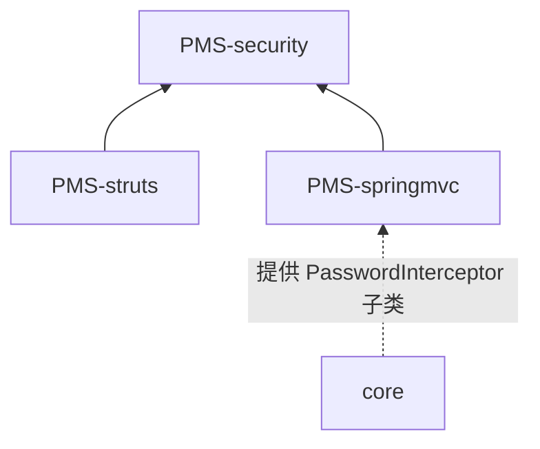
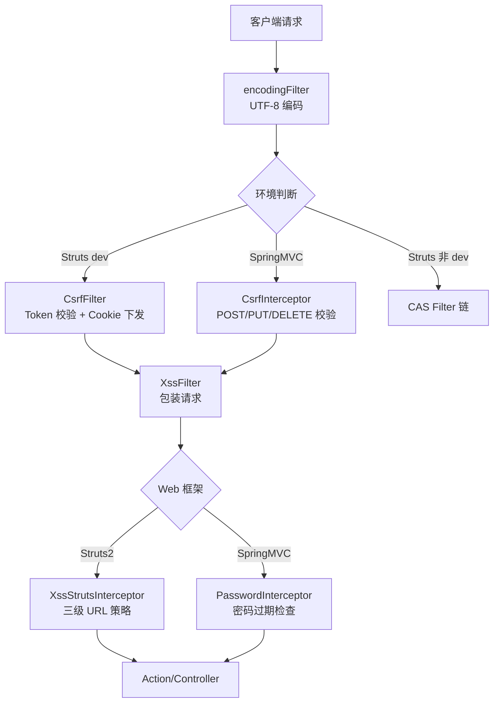

# PMS-security 模块架构文档

## 1. 模块概述

PMS-security 是 PMS 系统的安全组件模块，以纯工具库（jar）形式提供 Web 安全横切能力，被 PMS-struts 与 PMS-springmvc 两个 Web 层模块依赖。

- **包名**：`com.dp.plat.security`
- **artifactId**：`pms-security`
- **打包类型**：jar
- **职责**：XSS 防护、CSRF 防护、SQL 解析（表名提取/变量填充）、AES 加密、图形验证码、HTTP 上下文访问、密码过期拦截
- **Struts2 版本**：2.3.35（与 PMS-struts 一致，**注意** PMS-springmvc 使用 2.5.30）
- **无数据库表**：本模块为纯工具库，不直接管理任何数据库表

---

## 2. 目录结构

```
PMS-security/src/main/java/com/dp/plat/security/
├── context/
│   └── HttpContext.java                  # HTTP 请求上下文（请求/会话获取、请求类型判断、IP 获取）
├── csrf/                                 # CSRF 防护
│   ├── CSRFTokenManager.java             # CSRF Token 管理器（生成/提取/会话存储）
│   ├── CsrfFilter.java                   # Servlet Filter（Struts2 环境使用）
│   ├── CsrfInterceptor.java              # Spring MVC 拦截器（springmvc 环境使用）
│   └── CsrfValidateFailedException.java  # CSRF 校验失败异常
├── interceptor/
│   └── PasswordInterceptor.java          # 密码过期拦截器抽象类（子类在 core 模块）
├── util/
│   ├── ASEUtil.java                      # AES/ECB/PKCS5Padding 加密（基于 KeyGenerator + SHA1PRNG）
│   ├── ByteUtils.java                    # 字节工具（KMP 查找、DirectByteBuffer 扩容）
│   ├── CaptchaUtil.java                  # 图形验证码（80×30 PNG，4 位字符）
│   ├── JsoupUtil.java                    # HTML 清理/转义（基于 Jsoup Safelist + Spring HtmlUtils）
│   └── SQLParser.java                    # SQL 解析（基于 Druid SQLUtils，表名提取/变量填充）
└── xss/                                  # XSS 防护
    ├── XssFilter.java                    # Servlet Filter（包装请求为 XssRequestBodyHttpServletRequestWrapper）
    ├── XssHttpServletRequestWrapper.java # 简单请求包装器（getHeader/getParameter/getParameterValues 清理）
    ├── XssRequestBodyHttpServletRequestWrapper.java   # POST Body 缓存 + multipart 解析 + escapeHtml
    ├── XssRequestBodyHttpServletRequestWrapper2.java # 变体 2（JSON.parseObject 校验、upload 分离处理）
    ├── XssRequestBodyHttpServletRequestWrapper3.java # 变体 3（JSON.parseObject 校验、multipart 简化处理）
    └── struts/                           # Struts2 集成（替换原生 Dispatcher/RequestWrapper）
        ├── XssStrutsInterceptor.java     # Struts2 拦截器（三级 URL 策略：exclude/clean/encode）
        ├── MDispatcher.java              # 自定义 Dispatcher（wrapRequest 使用 M 系列包装器）
        ├── MStrutsRequestWrapper.java    # 替换 StrutsRequestWrapper（getParameter 系列转义）
        ├── MMultiPartRequestWrapper.java # 替换 MultiPartRequestWrapper（getParameter 系列转义）
        └── MStrutsPrepareAndExecuteFilter.java # 替换 StrutsPrepareAndExecuteFilter（使用 MDispatcher）
```

---

## 3. 核心安全组件总览

### 3.1 组件分类

| 分类 | 组件 | 类型 | 部署环境 |
|------|------|------|----------|
| CSRF 防护 | `CsrfFilter` | Servlet Filter | PMS-struts（dev 环境） |
| CSRF 防护 | `CsrfInterceptor` | Spring MVC Interceptor | PMS-springmvc |
| CSRF 防护 | `CSRFTokenManager` | 工具类 | 共用 |
| XSS 防护 | `XssFilter` | Servlet Filter | PMS-struts（dev，已注释）、PMS-springmvc |
| XSS 防护 | `XssRequestBodyHttpServletRequestWrapper` 系列 | Request Wrapper | 通过 XssFilter 装配 |
| XSS 防护 | `XssStrutsInterceptor` | Struts2 Interceptor | PMS-struts |
| XSS 防护 | `MStrutsPrepareAndExecuteFilter` / `MDispatcher` / `M*RequestWrapper` | Struts2 替换组件 | PMS-struts（可选） |
| SQL 解析 | `SQLParser` | 工具类 | 共用 |
| 数据加密 | `ASEUtil` | 工具类 | 共用 |
| 验证码 | `CaptchaUtil` | 工具类 | 共用 |
| HTTP 上下文 | `HttpContext` | 工具类 | 共用 |
| 密码过期 | `PasswordInterceptor` | 抽象 Interceptor | PMS-springmvc（子类在 core） |

### 3.2 依赖关系



> PMS-security 不依赖 core；core 的 `com.dp.plat.core.interceptor.PasswordInterceptor` 继承本模块的抽象类。

---

## 4. 安全防护链路

### 4.1 请求处理总流程



### 4.2 关键设计要点

1. **双环境适配**：CSRF 在 Struts2 环境用 Filter，在 SpringMVC 环境用 Interceptor；XSS 在两者均用 Filter，但 Struts2 额外有 Interceptor 层
2. **Token 双通道下发**：CsrfFilter 同时通过 Response Header 和 Cookie 下发 Token，CsrfInterceptor 在 postHandle 将 Token 注入 ModelAndView
3. **请求体缓存**：`XssRequestBodyHttpServletRequestWrapper` 系列缓存 POST Body 字节，支持多次读取（getInputStream/getReader/getParameter 共用缓存）
4. **password 字段豁免**：所有 XSS 包装器对名为 `password` 的参数跳过转义，避免破坏密码原文
5. **Struts2 深度集成**：通过替换 `Dispatcher`、`StrutsRequestWrapper`、`MultiPartRequestWrapper`、`StrutsPrepareAndExecuteFilter` 四个核心组件，在请求包装阶段即完成转义

---

## 5. 技术栈依赖

| 依赖 | 版本 | 用途 |
|------|------|------|
| `struts2-core` | 2.3.35 | Struts2 集成（MDispatcher 等继承原生类） |
| `spring-webmvc` | 5.3.19（父 pom） | CsrfInterceptor/PasswordInterceptor 实现 HandlerInterceptor |
| `jsoup` | 父 pom 管理 | HTML 清理（Safelist 白名单） |
| `fastjson` | 父 pom 管理 | JSON 校验/解析（XssRequestBodyWrapper 系列） |
| `druid` | 1.2.8（父 pom） | SQL 解析（SQLParser 使用 SQLUtils） |
| `commons-lang3` | 父 pom 管理 | StringUtils |
| `commons-fileupload` | Struts2 传递依赖 | multipart 解析 |
| `javaee-api` | 父 pom 管理 | Servlet API |

> ⚠️ **重要**：SQLParser 使用 **Druid 的 SQLUtils**，而非 JSQLParser。ASEUtil 使用 **KeyGenerator + SHA1PRNG** 派生密钥，而非硬编码密钥。

---

## 6. 跨模块协作

### 6.1 与 core 模块

- core 的 `com.dp.plat.core.interceptor.PasswordInterceptor` 继承本模块的抽象类，实现 `isNeedRedirect()`
- core 的 Shiro/CAS 提供认证基础，本模块的 CSRF/XSS 提供请求级防护

### 6.2 与 PMS-struts 模块

- dev 环境：`web.xml` 配置 `CsrfFilter`（`/*`）+ `XssFilter`（已注释）
- `struts.xml` 配置 `XssStrutsInterceptor` 作为 `baseStack` 首个拦截器
- 可选启用 `MStrutsPrepareAndExecuteFilter` 替换原生 Struts2 Filter

### 6.3 与 PMS-springmvc 模块

- `web.xml` 配置 `XssFilter`（`*.html`、`*.json`、`*.xlsx` 等）
- `spring-mvc.xml` 配置 `CsrfInterceptor`（排除 `/sys/login.json`）和 `PasswordInterceptor`（排除 `/password.*`、`/modifyPassword.*`）

---

## 7. 相关文档

| 文档 | 说明 |
|------|------|
| [security-filter-chain.md](security-filter-chain.md) | 安全过滤器链详细架构 |
| [csrf-architecture.md](csrf-architecture.md) | CSRF 防护架构 |
| [xss-architecture.md](xss-architecture.md) | XSS 防护架构 |
| [../02-modules/security-components.md](../02-modules/security-components.md) | 安全组件功能说明 |
| [../04-mapping/filter-interceptor-matrix.md](../04-mapping/filter-interceptor-matrix.md) | 过滤器/拦截器部署矩阵 |
