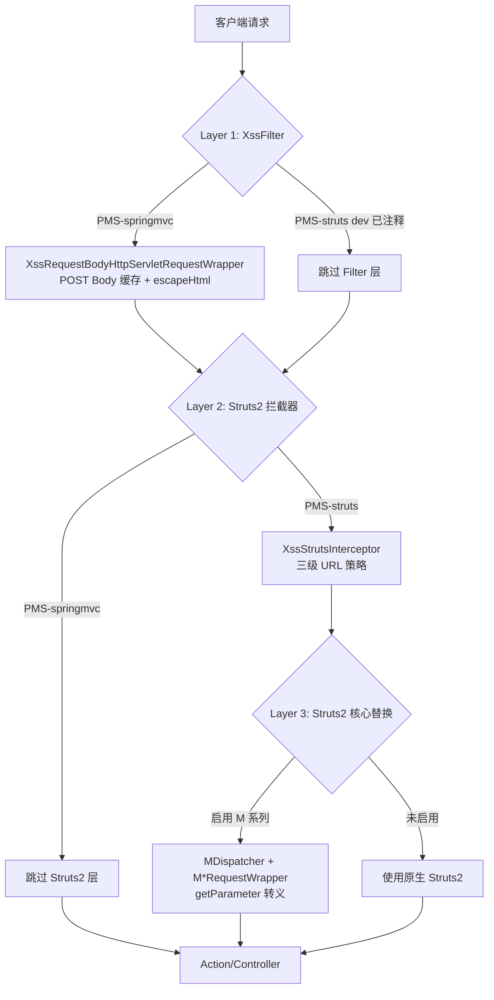
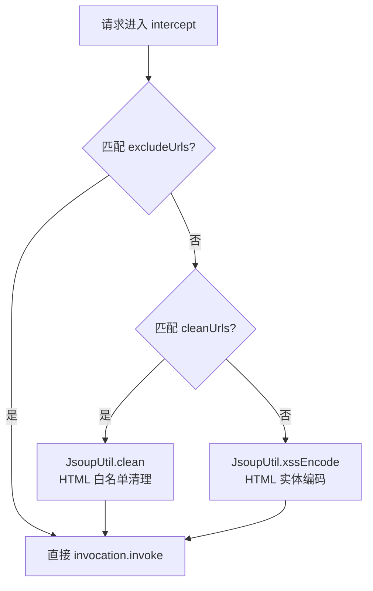

# XSS 防护架构

## 1. 概述

PMS-security 提供多层 XSS 防护，覆盖 Servlet Filter、Struts2 Interceptor、Struts2 核心组件替换三个层级，并区分 HTML 编码（escape）与 HTML 清理（clean）两种策略。

---

## 2. 防护层级



---

## 3. Layer 1: XssFilter（Servlet Filter）

### 3.1 装配的 Wrapper

```java
// XssFilter.doFilter()
request = new XssRequestBodyHttpServletRequestWrapper(httpRequest);
chain.doFilter(request, response);
```

> ⚠️ **注意**：当前 `XssFilter` 装配的是 `XssRequestBodyHttpServletRequestWrapper`（版本 1），而非 `XssHttpServletRequestWrapper`。代码中 `XssHttpServletRequestWrapper` 的使用已被注释掉。

### 3.2 excludePattern 配置

```java
String excludePattern = filterConfig.getInitParameter("excludePattern");
if (StringUtils.isNotBlank(excludePattern) && servletPath.matches(excludePattern)) {
    chain.doFilter(request, response);  // 跳过
    return;
}
```

PMS-springmvc 的 web.xml 中曾配置（已注释）：`/sys/notifyTemplate/.*\..*`

---

## 4. XssHttpServletRequestWrapper（简单包装器）

> 此类当前未被 XssFilter 使用，但保留作为轻量级包装器。

| 方法 | 处理方式 |
|------|---------|
| `getHeader(name)` | `JsoupUtil.clean()` |
| `getParameter(name)` | `JsoupUtil.clean()` |
| `getParameterValues(name)` | `JsoupUtil.clean()` + `trim()` |

---

## 5. XssRequestBodyHttpServletRequestWrapper 系列

### 5.1 三个版本对比

| 版本 | JSON 校验方式 | multipart 处理 | getRequestBody 返回 | 使用场景 |
|------|--------------|----------------|---------------------|---------|
| 版本 1 | `JSONValidator.from(temp).validate()` | `ByteUtils` + `ServletFileUpload` 手动解析 | `byte[]`（StreamUtils.copyToByteArray） | 当前 XssFilter 装配 |
| 版本 2 | `JSON.parseObject(temp)` | `CommonsMultipartResolver` 分离处理 | `String`（StreamUtils.copyToString） | 备选 |
| 版本 3 | `JSON.parseObject(temp)` | `CommonsMultipartResolver` 简化处理 | `String`（StreamUtils.copyToString） | 备选 |

### 5.2 核心机制：POST Body 缓存

```java
// 构造函数中缓存
if ("POST".equals(method)) {
    requestBodyStr = getRequestBody(request);  // 读取 InputStream
    if (null != requestBodyStr && !"".equals(requestBodyStr)) {
        String temp = escapeHtml(requestBodyStr);  // 转义
        if (JSONValidator.from(temp).validate()) {  // JSON 校验
            requestBody = temp.getBytes(getCharset());
        }
    }
    processParameters(requestBody, 0, getContentLength(), getCharset());
}
```

**关键点**：
1. **InputStream 只能读一次**：构造时读取并缓存为 `byte[] requestBody`
2. `getInputStream()` / `getReader()` 返回基于缓存的 ByteArrayInputStream
3. `getParameter*()` 系列从 `paramHashValues` 读取（手动解析的结果）

### 5.3 escapeHtml 转义策略

```java
public static String escapeHtml(String s) {
    for (int i = 0; i < s.length(); i++) {
        char c = s.charAt(i);
        switch (c) {
            case '>': sb.append("&gt;"); break;
            case '<': sb.append("&lt;"); break;
            case '&': sb.append('＆'); break;  // 全角 & 符号
            default: sb.append(c);
        }
    }
}
```

| 字符 | 转义结果 | 说明 |
|------|---------|------|
| `<` | `&lt;` | HTML 实体 |
| `>` | `&gt;` | HTML 实体 |
| `&` | `＆` | **全角** &（非 HTML 实体） |

> ⚠️ 注意：`&` 被替换为全角字符 `＆`（U+FF06），而非 `&amp;`。这是为了避免双重转义问题，但可能导致部分系统不兼容。

### 5.4 password 字段豁免

```java
// getParameter() / getParameterValues()
if ("password".equals(parameter)) {
    return value;  // 不转义，返回原值
}
```

> **原因**：密码中可能包含 `<`、`>`、`&` 等特殊字符，转义会破坏密码原文。

### 5.5 multipart 处理（版本 1）

```java
// processParameters() 中 isMultipart 分支
multipartRequest = multipartResolver.resolveMultipart(this);
Map<String, String[]> parameters = multipartRequest.getParameterMap();
// 将参数填入 paramHashValues

// 手动解析 FileItem，对 formField 进行 escapeHtml
List<FileItem> parseRequest = ((ServletFileUpload) multipartResolver.getFileUpload()).parseRequest(this);
for (FileItem currentItem : parseRequest) {
    if (currentItem.isFormField()) {
        itemContent = escapeHtml(new String(itemContent, getCharset())).getBytes();
    }
    builder = ByteUtils.append(builder, prev);
    builder = ByteUtils.append(builder, itemContent);
}
requestBody = ByteUtils.readBytes(builder);
```

---

## 6. Layer 2: XssStrutsInterceptor（Struts2 拦截器）

### 6.1 三级 URL 策略



### 6.2 处理逻辑

```java
// XssStrutsInterceptor.intercept()
if (isExcludeUrl(servletPath)) {
    return invocation.invoke();  // 排除，不处理
}
boolean isClean = isMatch(servletPath, this.cleanUrls);

Map<String, Object> httpParameters = actionContext.getParameters();
for (Entry<String, Object> entry : httpParameters.entrySet()) {
    Object parameter = entry.getValue();
    if (parameter instanceof String[]) {
        String[] strArr = (String[]) parameter;
        for (int i = 0; i < strArr.length; i++) {
            strArr[i] = isClean ? JsoupUtil.clean(strArr[i]) : JsoupUtil.xssEncode(strArr[i]);
        }
    } else if (parameter instanceof String) {
        String param = parameter.toString();
        param = isClean ? JsoupUtil.clean(param, JsoupUtil.getFormSafelist()) : JsoupUtil.xssEncode(param);
        entry.setValue(param);
    }
}
return invocation.invoke();
```

### 6.3 Struts 2.3 适配

> ⚠️ 代码中注释保留了 Struts 2.5 的 `HttpParameters` 适配逻辑，当前使用 Struts 2.3 的 `Map<String, Object>` 参数模型。

### 6.4 enabled 开关

```java
private boolean isMatch(String urlPath, Set<String> paths) {
    if (!enabled) {
        return true;  // 未启用时，所有 URL 都匹配 cleanUrls
    }
    // ...
}
```

> ⚠️ **陷阱**：`enabled` 默认为 `false`。若未配置 `<param name="enable">true</param>`，则 `isMatch` 始终返回 true，导致**所有请求都走 cleanUrls 模式**（HTML 清理），encodeUrls 配置失效。

---

## 7. Layer 3: Struts2 核心组件替换

### 7.1 组件替换关系

| 原生组件 | 替换组件 | 替换点 |
|---------|---------|--------|
| `StrutsPrepareAndExecuteFilter` | `MStrutsPrepareAndExecuteFilter` | `createDispatcher()` 返回 `MDispatcher` |
| `Dispatcher` | `MDispatcher` | `wrapRequest()` 使用 `M*RequestWrapper` |
| `StrutsRequestWrapper` | `MStrutsRequestWrapper` | `getParameter*()` 调用 `JsoupUtil.escape()` |
| `MultiPartRequestWrapper` | `MMultiPartRequestWrapper` | `getParameter*()` 调用 `JsoupUtil.escape()` |

### 7.2 MStrutsRequestWrapper 转义

```java
// MStrutsRequestWrapper.getParameter()
public String getParameter(String name) {
    name = JsoupUtil.escape(name);  // 参数名转义
    return JsoupUtil.escape(super.getParameter(name));  // 参数值转义
}
```

### 7.3 启用方式

在 web.xml 中将 Struts2 的 Filter 替换为 MStrutsPrepareAndExecuteFilter：

```xml
<filter>
    <filter-name>struts2</filter-name>
    <filter-class>com.dp.plat.security.xss.struts.MStrutsPrepareAndExecuteFilter</filter-class>
</filter>
```

> **当前状态**：PMS-struts 的 web.xml 仍使用原生 `StrutsPrepareAndExecuteFilter`，M 系列组件**未实际启用**。

---

## 8. JsoupUtil 清理策略

### 8.1 方法清单

| 方法 | 策略 | 使用场景 |
|------|------|---------|
| `clean(html)` | `Safelist.relaxed()` + 通用属性 | 默认清理 |
| `clean(html, baseUri)` | 同上 + 指定 baseUri | 相对路径处理 |
| `clean(html, safelist)` | 自定义 Safelist | 特殊需求 |
| `clean(html, baseUri, safelist)` | 完全自定义 | 高级需求 |
| `escape(html)` | `HtmlUtils.htmlEscape` + `&` → `＆` | 转义（M 系列使用） |
| `unescape(html)` | `HtmlUtils.htmlUnescape` + `＆` → `&` | 反转义 |
| `xssEncode(s)` | `<`/`>` → 实体 + `%3c`/`%3e` 处理 | XssStrutsInterceptor 编码模式 |
| `getFormSafelist()` | `relaxed` + input/select/label | 表单清理 |

### 8.2 默认 Safelist

```java
Safelist.relaxed()
    .addAttributes(":all", "style", "title", "width", "height", "align", "valign")
    .addAttributes("table", "cellpadding", "cellspacing", "rule", "border")
    .preserveRelativeLinks(true)
```

### 8.3 表单 Safelist

```java
Safelist.relaxed()
    .addTags("input", "select", "label")
    .addAttributes("input", "type", "name", "placeholder", "autocomplete", 
                   "data-flag", "data-src", "value", "checked")
    .addAttributes("select", "type", "name", "placeholder", "autocomplete", 
                   "data-flag", "data-src", "value", "selected")
    .addAttributes(":all", "id", "class", "style", "title", "width", "height", "align", "valign")
    .addAttributes("table", "cellpadding", "cellspacing", "rule", "border")
    .preserveRelativeLinks(true)
```

### 8.4 xssEncode 特殊处理

```java
// JsoupUtil.xssEncode()
case '%':
    processUrlEncoder(sb, s, i);  // 处理 %3c/%3e 等 URL 编码
    break;
```

`processUrlEncoder` 检测 `%3c`、`%3C`、`%60`（即 `<` 的 URL 编码）并替换为 `&gt;`，防止 URL 编码绕过。

> ⚠️ **疑似 Bug**：`%3c`（小于号 `<`）被替换为 `&gt;`（大于号的实体），`%3e`（大于号 `>`）被替换为 `&lt;`（小于号的实体），逻辑似乎是反的。

---

## 9. 相关文档

| 文档 | 说明 |
|------|------|
| [../02-modules/xss-filter.md](../02-modules/xss-filter.md) | XSS 组件详细说明 |
| [security-filter-chain.md](security-filter-chain.md) | 过滤器链架构 |
| [../05-standards/security-practices.md](../05-standards/security-practices.md) | XSS 白名单清理实践 |
