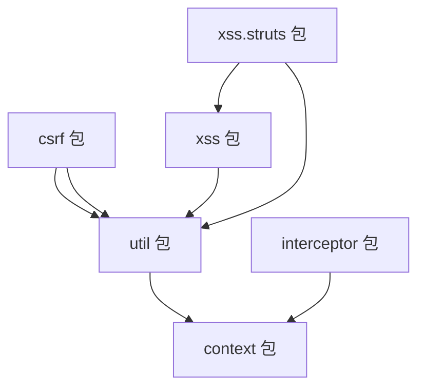

# 类参考清单

> PMS-security 模块全部 21 个 Java 类的完整清单与方法签名（基于实际源码）。

---

## 1. 类总览

| 序号 | 包 | 类 | 类型 | 行数 |
|------|-----|-----|------|------|
| 1 | `csrf` | `CSRFTokenManager` | final 工具类 | 95 |
| 2 | `csrf` | `CsrfFilter` | Servlet Filter | 94 |
| 3 | `csrf` | `CsrfInterceptor` | Spring MVC Interceptor | 58 |
| 4 | `csrf` | `CsrfValidateFailedException` | RuntimeException | 25 |
| 5 | `context` | `HttpContext` | 工具类 | 138 |
| 6 | `interceptor` | `PasswordInterceptor` | 抽象 Interceptor | 66 |
| 7 | `util` | `ASEUtil` | 工具类 | 101 |
| 8 | `util` | `ByteUtils` | 工具类 | 186 |
| 9 | `util` | `CaptchaUtil` | 工具类 | 201 |
| 10 | `util` | `JsoupUtil` | 工具类 | 154 |
| 11 | `util` | `SQLParser` | 工具类 | 955 |
| 12 | `util` | `SQLParser.SqlParserResult` | 内部类 | 32 |
| 13 | `xss` | `XssFilter` | Servlet Filter | 56 |
| 14 | `xss` | `XssHttpServletRequestWrapper` | Request Wrapper | 81 |
| 15 | `xss` | `XssRequestBodyHttpServletRequestWrapper` | Request Wrapper | 488 |
| 16 | `xss` | `XssRequestBodyHttpServletRequestWrapper2` | Request Wrapper | 463 |
| 17 | `xss` | `XssRequestBodyHttpServletRequestWrapper3` | Request Wrapper | 442 |
| 18 | `xss.struts` | `XssStrutsInterceptor` | Struts2 Interceptor | 265 |
| 19 | `xss.struts` | `MDispatcher` | Dispatcher 替换 | 128 |
| 20 | `xss.struts` | `MStrutsRequestWrapper` | Request Wrapper 替换 | 52 |
| 21 | `xss.struts` | `MMultiPartRequestWrapper` | Request Wrapper 替换 | 50 |
| 22 | `xss.struts` | `MStrutsPrepareAndExecuteFilter` | Filter 替换 | 63 |

> 共 22 个类（含 1 个内部类 `SqlParserResult`）。

---

## 2. CSRF 包

### 2.1 CSRFTokenManager

```java
public final class CSRFTokenManager {
    // 常量
    public static final String CSRF_PARAM_NAME_DEFAULT = "__RequestVerificationToken";
    public static final String CSRF_TOKEN_FOR_SESSION_ATTR_NAME = CSRFTokenManager.class.getName() + ".tokenval";
    public static final String CSRF_TOKEN_PARAM_NAME = "CSRF_TOKEN";
    
    private static String csrfTokenName = CSRF_PARAM_NAME_DEFAULT;
    
    // 私有构造
    private CSRFTokenManager() {}
    private CSRFTokenManager(String csrfTokenName) {}
    
    // 静态方法
    public static String generateToken();
    public static String getTokenForSession(HttpSession session);
    public static String getTokenFromRequest(HttpServletRequest request);
    public static String getTokenName();
    public static void setCsrfTokenName(String csrfTokenName);
}
```

### 2.2 CsrfFilter

```java
public class CsrfFilter implements Filter {
    FilterConfig filterConfig = null;
    
    public void init(FilterConfig filterConfig) throws ServletException;
    public void destroy();
    public void doFilter(ServletRequest request, ServletResponse response, FilterChain chain) 
            throws IOException, ServletException;
    public boolean isValid(HttpServletRequest request, HttpServletResponse response);
    private boolean isNeedValidatorCsrfToken(String method);
}
```

### 2.3 CsrfInterceptor

```java
public class CsrfInterceptor implements AsyncHandlerInterceptor {
    public boolean preHandle(HttpServletRequest request, HttpServletResponse response, Object handler) 
            throws Exception;
    public void postHandle(HttpServletRequest request, HttpServletResponse response, 
                          Object handler, ModelAndView modelAndView) throws Exception;
    private boolean isNeedValidatorCsrfToken(String method);
}
```

### 2.4 CsrfValidateFailedException

```java
public class CsrfValidateFailedException extends RuntimeException {
    private static final long serialVersionUID = 1L;
    private String message;
    
    public String getMessage();
    public void setMessage(String message);
    public CsrfValidateFailedException(String message);
}
```

---

## 3. Context 包

### 3.1 HttpContext

```java
public class HttpContext {
    public static HttpServletRequest getCurrentRequest();
    public static HttpSession getCurrentSession();
    public static boolean isAjax();
    public static boolean isJSON();
    public static boolean isHTML();
    public static String baseUri();
    public static boolean isExcel();
    public static String getCurrentIp(HttpServletRequest request);
    public static String getCurrentIp();
}
```

---

## 4. Interceptor 包

### 4.1 PasswordInterceptor

```java
public abstract class PasswordInterceptor implements AsyncHandlerInterceptor {
    private String redirect;
    
    public boolean preHandle(HttpServletRequest request, HttpServletResponse response, 
                            Object handler) throws Exception;
    public abstract boolean isNeedRedirect(HttpServletRequest request);
    
    public String getRedirect();
    public void setRedirect(String redirect);
}
```

---

## 5. Util 包

### 5.1 ASEUtil

```java
public class ASEUtil {
    private static final String KEY_ALGORITHM = "AES";
    private static final String DEFAULT_CIPHER_ALGORITHM = "AES/ECB/PKCS5Padding";
    private static final String DEFAULT_SECRET_PASSWORD = "DP_SECRET";
    
    public static String encrypt(String content, String password);
    public static String decrypt(String content, String password);
    private static SecretKeySpec getSecretKey(final String password);
}
```

### 5.2 ByteUtils

```java
public class ByteUtils {
    public static int indexOf(byte[] text, String pattern);
    public static int indexOf(byte[] text, byte[] pattern);
    private static int[] computeLPSArray(byte[] pattern);
    public static ByteBuffer append(ByteBuffer builder, byte[] bytes);
    private static ByteBuffer expandDirectByteBuffer(ByteBuffer builder, int additionalCapacity);
    public static byte[] readBytes(ByteBuffer builder);
    public static ByteArrayOutputStream append(ByteArrayOutputStream builder, byte[] bytes) throws IOException;
    public static void main(String[] args);
}
```

### 5.3 CaptchaUtil

```java
public class CaptchaUtil {
    private static final String RANDOM_STRS = "123456789ABCDEFGHIJKLMNPQRSTUVWXYZ";
    private static final String FONT_NAME = "Fixedsys";
    private static final int FONT_SIZE = 20;
    private Random random = new SecureRandom();
    
    private int width = 80;
    private int height = 30;
    private int lineNum = 50;
    private int strNum = 4;
    
    public String genRandomCode();
    public BufferedImage genRandomCodeImage(String randomCode);
    public BufferedImage genRandomCodeImage(StringBuffer randomCode);
    private Color getRandColor(int fc, int bc);
    private String drowString(Graphics g, int i);
    private String drowString(Graphics g, String rand, int offset);
    private void drowLine(Graphics g);
    public String getRandomString(int num);
    public static void responseCaptcha(HttpServletRequest req, HttpServletResponse resp, String KEY_CAPTCHA);
    public static void main(String[] args);
}
```

### 5.4 JsoupUtil

```java
public class JsoupUtil {
    public static Safelist getFormSafelist();
    public static String escape(String html);
    public static String unescape(String html);
    public static String xssEncode(String s);
    public static void processUrlEncoder(StringBuilder sb, String s, int index);
    public static String clean(String html);
    public static String clean(String html, String baseUri);
    public static String clean(String html, Safelist safelist);
    public static String clean(String html, String baseUri, Safelist safelist);
}
```

### 5.5 SQLParser

```java
public class SQLParser {
    private static final String regex = "...";
    private static final Pattern parserSqlTablePattern = ...;
    private static final TypeReference<Map<String, Object>> MapType = ...;
    private static final TypeReference<Map<String, Map<String, Object>>> MapMapType = ...;
    
    // SQL 解析
    public static List<SQLStatement> parseStatements(String sql, DbType dbType);
    public static SQLStatement parseSingleStatement(String sql, DbType dbType);
    public static List<SchemaStatVisitor> parseStatementsVisitors(String sql, DbType dbType);
    public static SchemaStatVisitor parseStatementsVisitor(String sql, DbType dbType);
    
    // 表名提取
    public static Set<String> parseTables(String sql, DbType dbType);
    public static Set<String> parseTables(String sql);
    
    // 正则匹配
    public static boolean matcherAll(String sql, String regex);
    public static boolean matcherAll(String sql, String regex, DbType dbType);
    public static SqlParserResult matcherSqlTables(String sql, String regex);
    public static SqlParserResult matcherSqlTables(String sql, String regex, DbType dbType);
    public static boolean unMatcherAll(String sql, String regex);
    public static boolean unMatcherAll(String sql, String regex, DbType dbType);
    public static SqlParserResult unMatcherSqlTables(String sql, String regex);
    public static SqlParserResult unMatcherSqlTables(String sql, String regex, DbType dbType);
    public static boolean matcherAll(Set<String> tables, String regex);
    public static SqlParserResult matcherTables(Set<String> tables, String regex);
    public static boolean unMatcherAll(Set<String> tables, String regex);
    public static SqlParserResult unMatcherTables(Set<String> tables, String regex);
    
    // 数据库类型
    public static DbType getCurrentDbType(DataSource dataSource);
    
    // 变量解析
    public static Map<String, Map<String, Object>> parseSqlParams(String sql);
    public static Map<String, Map<String, Object>> parseSqlParams(String sql, Map<String, Map<String, Object>> splitPartMap);
    public static String quoteSplit(String split);
    public static Object parseObjectValue(Map<String, Object> param, Map<String, Object> values);
    public static String fillSqlParams(String sql, Map<String, Object> values);
    
    // 辅助
    public static String toJSONString(Object obj);
    public static void handlerException(Throwable... e);
    
    public static void main(String[] args);
}
```

### 5.6 SQLParser.SqlParserResult

```java
public static class SqlParserResult {
    private boolean valid;
    private Set<String> matchTables;
    
    public SqlParserResult();
    public SqlParserResult(boolean valid, Set<String> matchTables);
    public boolean isValid();
    public void setValid(boolean valid);
    public Set<String> getMatchTables();
    public void setMatchTables(Set<String> matchTables);
}
```

---

## 6. XSS 包

### 6.1 XssFilter

```java
public class XssFilter implements Filter {
    FilterConfig filterConfig = null;
    
    public void init(FilterConfig filterConfig) throws ServletException;
    public void destroy();
    public void doFilter(ServletRequest request, ServletResponse response, FilterChain chain) 
            throws IOException, ServletException;
}
```

### 6.2 XssHttpServletRequestWrapper

```java
public class XssHttpServletRequestWrapper extends HttpServletRequestWrapper {
    private static final Log logger = LogFactory.getLog(XssHttpServletRequestWrapper.class);
    
    public XssHttpServletRequestWrapper(HttpServletRequest request);
    
    @Override public String getHeader(String name);
    @Override public String getParameter(String name);
    @Override public String[] getParameterValues(String name);
}
```

### 6.3 XssRequestBodyHttpServletRequestWrapper（版本 1）

```java
public class XssRequestBodyHttpServletRequestWrapper extends HttpServletRequestWrapper {
    private static final String DEFAULT_CHARSET = "UTF-8";
    private CommonsMultipartResolver multipartResolver;
    private HttpServletRequest orginRequest;
    private boolean isMultipart;
    private MultipartHttpServletRequest multipartRequest;
    private byte[] requestBody;
    private Charset charSet;
    private final Map<String, ArrayList<String>> paramHashValues;
    protected Map<String, String[]> parameterMap;
    
    public XssRequestBodyHttpServletRequestWrapper(HttpServletRequest request);
    
    @Override public Map<String, String[]> getParameterMap();
    @Override public String[] getParameterValues(String parameter);
    @Override public String getParameter(String parameter);
    @Override public Enumeration<String> getParameterNames();
    public String getRequestBody(HttpServletRequest request) throws IOException;
    @Override public BufferedReader getReader() throws IOException;
    public ServletInputStream getInputStream() throws IOException;
    public static String escapeHtml(String s);
    private void processParameters(byte bytes[], int start, int len, Charset charset);
    private void addParameter(String key, String value) throws IllegalStateException;
    private String urlDecode(String value);
    private Charset getCharset();
    public HttpServletRequest getOrginRequest();
    public static HttpServletRequest getOrgRequest(HttpServletRequest req);
}
```

### 6.4 XssRequestBodyHttpServletRequestWrapper2（版本 2）

```java
public class XssRequestBodyHttpServletRequestWrapper2 extends HttpServletRequestWrapper {
    // 字段类似版本 1，但 isMultipart → isUpload
    private boolean isUpload;
    
    public XssRequestBodyHttpServletRequestWrapper2(HttpServletRequest request);
    
    @Override public Map<String, String[]> getParameterMap();
    @Override public String[] getParameterValues(String parameter);
    @Override public String getParameter(String parameter);
    @Override public Enumeration<String> getParameterNames();
    public String getRequestBody(HttpServletRequest request) throws IOException;
    @Override public BufferedReader getReader() throws IOException;
    public ServletInputStream getInputStream() throws IOException;
    private static String escapeHtml(String s);  // private
    private void processParameters(byte bytes[], int start, int len, Charset charset);
    private void addParameter(String key, String value) throws IllegalStateException;
    private String urlDecode(String value);
    private Charset getCharset();
    public HttpServletRequest getOrginRequest();
    public static HttpServletRequest getOrgRequest(HttpServletRequest req);
}
```

### 6.5 XssRequestBodyHttpServletRequestWrapper3（版本 3）

```java
public class XssRequestBodyHttpServletRequestWrapper3 extends HttpServletRequestWrapper {
    // 字段类似版本 1
    private boolean isMultipart;
    private MultipartHttpServletRequest multipartRequest;
    
    public XssRequestBodyHttpServletRequestWrapper3(HttpServletRequest request);
    
    // 方法类似版本 1
    @Override public Map<String, String[]> getParameterMap();
    @Override public String[] getParameterValues(String parameter);
    @Override public String getParameter(String parameter);
    @Override public Enumeration<String> getParameterNames();
    public String getRequestBody(HttpServletRequest request) throws IOException;
    @Override public BufferedReader getReader() throws IOException;
    public ServletInputStream getInputStream() throws IOException;
    public static String escapeHtml(String s);  // public
    private void processParameters(byte bytes[], int start, int len, Charset charset);
    private void addParameter(String key, String value) throws IllegalStateException;
    private String urlDecode(String value);
    private Charset getCharset();
    public HttpServletRequest getOrginRequest();
    public static HttpServletRequest getOrgRequest(HttpServletRequest req);
}
```

---

## 7. XSS Struts 包

### 7.1 XssStrutsInterceptor

```java
public class XssStrutsInterceptor extends AbstractInterceptor {
    private static final long serialVersionUID = 8642204240305659814L;
    
    private String excludes;
    private Set<String> excludeUrls;
    private String encodes;
    private Set<String> encodeUrls;
    private String cleans;
    private Set<String> cleanUrls;
    private String enable;
    private boolean enabled;
    
    @Override public void init();
    @Override public void destroy();
    @Override public String intercept(ActionInvocation invocation) throws Exception;
    
    private boolean isExcludeUrl(String urlPath);
    private boolean isMatch(String urlPath, Set<String> paths);
    
    // Getter/Setter
    public String getExcludes();
    public void setExcludes(String excludes);
    public Set<String> getExcludeUrls();
    public void setExcludeUrls(String excludeUrls);
    public Set<String> getEncodeUrls();
    public void setEncodeUrls(String encodeUrls);
    public Set<String> getCleanUrls();
    public void setCleanUrls(String cleanUrls);
    public String getEnable();
    public void setEnable(String enable);
    public boolean isEnabled();
    public void setEnabled(boolean enabled);
}
```

### 7.2 MDispatcher

```java
public class MDispatcher extends Dispatcher {
    private static final Logger LOG = LoggerFactory.getLogger(MDispatcher.class);
    private boolean disableRequestAttributeValueStackLookup;
    private ServletContext servletContext;
    private Map<String, String> initParams;
    private String multipartSaveDir;
    private boolean devMode;
    
    public MDispatcher(ServletContext servletContext, Map<String, String> initParams);
    
    @Override public HttpServletRequest wrapRequest(HttpServletRequest request, ServletContext servletContext) 
            throws IOException;
    private String getSaveDir(ServletContext servletContext);
    
    @Override @Inject(StrutsConstants.STRUTS_MULTIPART_SAVEDIR)
    public void setMultipartSaveDir(String val);
    @Override @Inject(StrutsConstants.STRUTS_DEVMODE)
    public void setDevMode(String mode);
}
```

### 7.3 MStrutsRequestWrapper

```java
public class MStrutsRequestWrapper extends StrutsRequestWrapper {
    public MStrutsRequestWrapper(HttpServletRequest req);
    public MStrutsRequestWrapper(HttpServletRequest req, boolean bool);
    
    @Override public String getParameter(String name);
    @Override public String[] getParameterValues(String name);
    @Override public Enumeration<String> getParameterNames();
}
```

### 7.4 MMultiPartRequestWrapper

```java
public class MMultiPartRequestWrapper extends MultiPartRequestWrapper {
    public MMultiPartRequestWrapper(MultiPartRequest multiPartRequest, HttpServletRequest request, 
                                    String saveDir, LocaleProvider provider);
    
    @Override public String getParameter(String name);
    @Override public String[] getParameterValues(String name);
    @Override public Enumeration<String> getParameterNames();
}
```

### 7.5 MStrutsPrepareAndExecuteFilter

```java
public class MStrutsPrepareAndExecuteFilter extends StrutsPrepareAndExecuteFilter {
    @Override public void init(FilterConfig filterConfig) throws ServletException;
    public Dispatcher initDispatcher(HostConfig filterConfig);
    private Dispatcher createDispatcher(HostConfig filterConfig);
}
```

---

## 8. 包依赖关系



---

## 9. 相关文档

| 文档 | 说明 |
|------|------|
| [security-components.md](security-components.md) | 组件总览 |
| [../audit/audit-modules.md](../audit/audit-modules.md) | 文档审计报告 |
