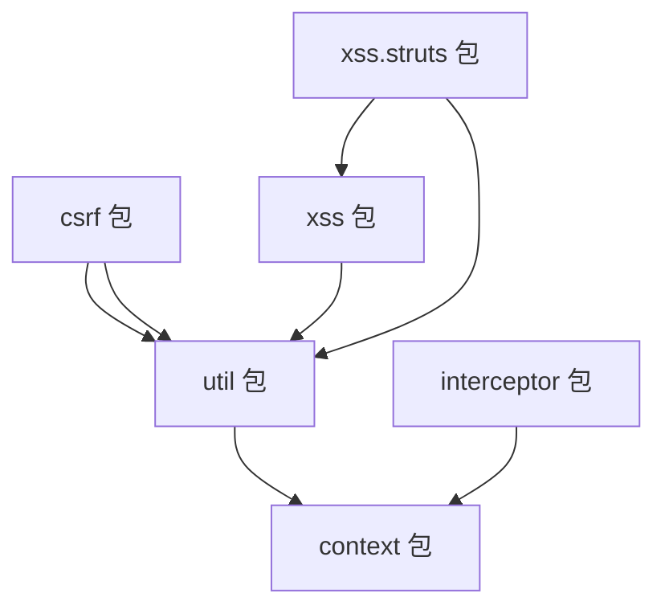

# 类参考清单

> PMS-security 模块全部 21 个 Java 类的完整清单与方法签名（基于实际源码）。

---

## 1. 类总览

| 序号 | 包 | 类 | 类型 | 行数 |
|------|-----|-----|------|------|
| 1 | `csrf` | `CSRFTokenManager` | final 工具类 | 95 |
| 2 | `csrf` | `CsrfFilter` | Servlet Filter | 94 |
| 3 | `csrf` | `CsrfInterceptor` | Spring MVC Interceptor | 58 |
| 4 | `csrf` | `CsrfValidateFailedException` | RuntimeException | 25 |
| 5 | `context` | `HttpContext` | 工具类 | 138 |
| 6 | `interceptor` | `PasswordInterceptor` | 抽象 Interceptor | 66 |
| 7 | `util` | `ASEUtil` | 工具类 | 101 |
| 8 | `util` | `ByteUtils` | 工具类 | 186 |
| 9 | `util` | `CaptchaUtil` | 工具类 | 201 |
| 10 | `util` | `JsoupUtil` | 工具类 | 154 |
| 11 | `util` | `SQLParser` | 工具类 | 955 |
| 12 | `util` | `SQLParser.SqlParserResult` | 内部类 | 32 |
| 13 | `xss` | `XssFilter` | Servlet Filter | 56 |
| 14 | `xss` | `XssHttpServletRequestWrapper` | Request Wrapper | 81 |
| 15 | `xss` | `XssRequestBodyHttpServletRequestWrapper` | Request Wrapper | 488 |
| 16 | `xss` | `XssRequestBodyHttpServletRequestWrapper2` | Request Wrapper | 463 |
| 17 | `xss` | `XssRequestBodyHttpServletRequestWrapper3` | Request Wrapper | 442 |
| 18 | `xss.struts` | `XssStrutsInterceptor` | Struts2 Interceptor | 265 |
| 19 | `xss.struts` | `MDispatcher` | Dispatcher 替换 | 128 |
| 20 | `xss.struts` | `MStrutsRequestWrapper` | Request Wrapper 替换 | 52 |
| 21 | `xss.struts` | `MMultiPartRequestWrapper` | Request Wrapper 替换 | 50 |
| 22 | `xss.struts` | `MStrutsPrepareAndExecuteFilter` | Filter 替换 | 63 |

> 共 22 个类（含 1 个内部类 `SqlParserResult`）。

---

## 2. CSRF 包

### 2.1 CSRFTokenManager

```java
public final class CSRFTokenManager {
    // 常量
    public static final String CSRF_PARAM_NAME_DEFAULT = "__RequestVerificationToken";
    public static final String CSRF_TOKEN_FOR_SESSION_ATTR_NAME = CSRFTokenManager.class.getName() + ".tokenval";
    public static final String CSRF_TOKEN_PARAM_NAME = "CSRF_TOKEN";
    
    private static String csrfTokenName = CSRF_PARAM_NAME_DEFAULT;
    
    // 私有构造
    private CSRFTokenManager() {}
    private CSRFTokenManager(String csrfTokenName) {}
    
    // 静态方法
    public static String generateToken();
    public static String getTokenForSession(HttpSession session);
    public static String getTokenFromRequest(HttpServletRequest request);
    public static String getTokenName();
    public static void setCsrfTokenName(String csrfTokenName);
}
```

**方法参数说明**：

| 方法 | 参数 | 类型 | 取值范围/默认值 | 业务含义 |
|------|------|------|-----------------|----------|
| `generateToken()` | 无 | — | — | 调用 `UUID.randomUUID().toString()` 生成 128 位随机 token |
| `getTokenForSession(HttpSession session)` | `session` | `javax.servlet.http.HttpSession` | 不可为 null（null 抛 NPE） | 当前会话；token 存于 Session attribute `CSRFTokenManager.class.getName() + ".tokenval"` |
| `getTokenFromRequest(HttpServletRequest request)` | `request` | `HttpServletRequest` | 不可为 null | 从中提取 token，**依次**查 parameter → header → cookie（三道兜底） |
| `getTokenName()` | 无 | — | 默认 `__RequestVerificationToken` | 返回当前 csrfTokenName（可通过 `setCsrfTokenName` 修改） |
| `setCsrfTokenName(String csrfTokenName)` | `csrfTokenName` | `String` | 非空字符串 | 修改全局 token 参数名（**进程级静态变量**，影响所有后续请求） |

**返回值说明**：
- `getTokenForSession`：返回当前 Session 中的 CSRF token；若不存在则生成并写入 Session 后返回。同一 Session 内多次调用返回相同值。**线程安全**（对 session 加 `synchronized` 锁）。
- `getTokenFromRequest`：返回请求中携带的 token；若 parameter/header/cookie 均无则返回 `null`。
- `generateToken`：返回新 UUID 字符串（如 `"550e8400-e29b-41d4-a716-446655440000"`）。

> ⚠️ **跨模块冲突提示**：core 模块存在**同名类** `com.dp.plat.security.csrf.CSRFTokenManager`，两者为**不同实现**，不可混用：

| 维度 | core 版本 | PMS-security 版本（本文档） |
|------|-----------|------------------------------|
| 包名 | `com.dp.plat.security.csrf` | `com.dp.plat.security.csrf`（同名不同源） |
| `getTokenForSession` 参数 | `org.apache.shiro.session.Session`（Shiro Session） | `javax.servlet.http.HttpSession`（Servlet HttpSession） |
| 调用方式 | `SecurityUtils.getSubject().getSession()` 获取 Shiro Session 后传入 | `request.getSession()` 获取 Servlet HttpSession 后传入 |
| 常量名 | `CSRF_PARAM_NAME` | `CSRF_PARAM_NAME_DEFAULT` + `CSRF_TOKEN_PARAM_NAME`（多一个） |
| 方法集 | 仅 2 个公共方法 | 5 个公共方法（含 `generateToken`/`getTokenName`/`setCsrfTokenName`） |
| `getTokenFromRequest` 查找顺序 | parameter → header | parameter → header → **cookie**（多一道兜底） |
| StringUtils 依赖 | `org.apache.commons.lang.StringUtils`（lang2） | `org.apache.commons.lang3.StringUtils`（lang3） |
| 类是否可改 token 名 | 否（final 常量硬编码） | 是（`setCsrfTokenName` 可运行时修改） |

> 详见 [core 安全实践 §6.2 CSRFTokenManager](../../core/docs/05-standards/security-practices.md#62-csrftokenmanager--token-管理器) 中关于 core 版本的说明。

**使用示例**：

```java
// 在 Spring MVC 拦截器中获取/生成 token（PMS-security 场景）
HttpSession session = request.getSession();
String token = CSRFTokenManager.getTokenForSession(session);
// 将 token 写入响应头供前端 AJAX 使用
response.addHeader(CSRFTokenManager.getTokenName(), token);

// 从请求中提取 token（含 parameter/header/cookie 三道兜底）
String clientToken = CSRFTokenManager.getTokenFromRequest(request);
```

**边界条件**：
- `getTokenForSession(null)` 会抛 NPE（`synchronized(null)` 非法）
- 同一 Session 并发调用 `getTokenForSession` 安全（`synchronized(session)`）
- `getTokenFromRequest` 在 parameter 为空字符串时也会继续查 header（`StringUtils.isEmpty` 同时判 null 和空串）

### 2.2 CsrfFilter

```java
public class CsrfFilter implements Filter {
    FilterConfig filterConfig = null;
    
    public void init(FilterConfig filterConfig) throws ServletException;
    public void destroy();
    public void doFilter(ServletRequest request, ServletResponse response, FilterChain chain) 
            throws IOException, ServletException;
    public boolean isValid(HttpServletRequest request, HttpServletResponse response);
    private boolean isNeedValidatorCsrfToken(String method);
}
```

### 2.3 CsrfInterceptor

```java
public class CsrfInterceptor implements AsyncHandlerInterceptor {
    public boolean preHandle(HttpServletRequest request, HttpServletResponse response, Object handler) 
            throws Exception;
    public void postHandle(HttpServletRequest request, HttpServletResponse response, 
                          Object handler, ModelAndView modelAndView) throws Exception;
    private boolean isNeedValidatorCsrfToken(String method);
}
```

### 2.4 CsrfValidateFailedException

```java
public class CsrfValidateFailedException extends RuntimeException {
    private static final long serialVersionUID = 1L;
    private String message;
    
    public String getMessage();
    public void setMessage(String message);
    public CsrfValidateFailedException(String message);
}
```

---

## 3. Context 包

### 3.1 HttpContext

```java
public class HttpContext {
    public static HttpServletRequest getCurrentRequest();
    public static HttpSession getCurrentSession();
    public static boolean isAjax();
    public static boolean isJSON();
    public static boolean isHTML();
    public static String baseUri();
    public static boolean isExcel();
    public static String getCurrentIp(HttpServletRequest request);
    public static String getCurrentIp();
}
```

**方法参数说明**：

| 方法 | 参数 | 类型 | 取值范围/默认值 | 业务含义 |
|------|------|------|-----------------|----------|
| `getCurrentRequest()` | 无 | — | — | 从 Spring `RequestContextHolder` 获取当前线程绑定的请求；非 Web 线程或无上下文时返回 `null`（异常被吞掉） |
| `getCurrentSession()` | 无 | — | — | 调用 `getCurrentRequest().getSession()`，无请求时返回 `null`（**会触发 Session 创建**，注意副作用） |
| `isAjax()` | 无 | — | — | 检查 `accept` 含 `application/json` 或 `X-Requested-With` 含 `XMLHttpRequest` |
| `isJSON()` | 无 | — | — | 检查 `accept` 含 `application/json` 或 servletPath 以 `.json` 结尾 |
| `isHTML()` | 无 | — | — | 检查 `accept` 含 `text/plain` 或 servletPath 以 `.html`/`.htm` 结尾，或无扩展名 |
| `baseUri()` | 无 | — | 默认空串 | 返回 `scheme://serverName:port/contextPath`（无请求时返回 `""`） |
| `isExcel()` | 无 | — | — | 检查 servletPath 以 `.xlsx` 或 `.xls` 结尾 |
| `getCurrentIp(HttpServletRequest request)` | `request` | `HttpServletRequest` | 可为 null（null 时内部调用 `getCurrentRequest()` 兜底，仍 null 返回 `""`） | 从中提取客户端 IP |
| `getCurrentIp()` | 无 | — | 默认 `""` | 内部调用 `getCurrentIp(null)` |

**`getCurrentIp` IP 提取顺序**（依次尝试，前者为空或 `"unknown"` 才查下一个）：

| 顺序 | 来源 | Header 名 | 备注 |
|------|------|-----------|------|
| 1 | `request.getRemoteAddr()` | — | TCP 直连 IP，最可信 |
| 2 | Request Header | `x-forwarded-for` | 反向代理透传；**注意：源码未按逗号分割取首段**，整个 header 值被当作 IP 返回（多级代理场景下可能返回 `"1.1.1.1, 2.2.2.2"` 形式） |
| 3 | Request Header | `Proxy-Client-IP` | Apache 代理 |
| 4 | Request Header | `WL-Proxy-Client-IP` | WebLogic 代理 |
| 5 | Request Header | `HTTP_CLIENT_IP` | 部分代理 |
| 6 | Request Header | `HTTP_X_FORWARDED_FOR` | CGI 风格 |
| 7 | `request.getRemoteAddr()` | — | 全部失败时回退到 TCP 直连 |

> ⚠️ **安全避坑**：
> - 源码注释明确写有「**从请求头中获取容易被伪造**」。除 `getRemoteAddr()` 外的所有来源均可被客户端伪造，**不可作为鉴权唯一依据**。
> - 字符串 `"unknown"` 被视为无效（继续尝试下一个来源），但 `null` 和空字符串也视为无效。
> - 多级代理时 `x-forwarded-for` 形如 `"client, proxy1, proxy2"`，**源码未取首段**，需在调用方自行 split 取第一个 IP。

**使用示例**：

```java
// Controller 中获取客户端 IP（推荐传入 request，避免再走 RequestContext 兜底）
String clientIp = HttpContext.getCurrentIp(request);

// 在非 Controller 层（无 request 引用）获取 IP，内部会从 RequestContextHolder 兜底
String ip = HttpContext.getCurrentIp();
if (ip == null || ip.isEmpty()) {
    // 非 Web 线程（如定时任务、异步线程）会得到 ""
    return;
}

// 多级代理场景：自行 split x-forwarded-for 取首段
String rawIp = HttpContext.getCurrentIp(request);
String realIp = rawIp != null && rawIp.contains(",") ? rawIp.split(",")[0].trim() : rawIp;
```

**边界条件**：
- 非请求线程调用 `getCurrentRequest()` 返回 `null`（`RequestContextHolder.currentRequestAttributes()` 抛 `IllegalStateException` 被吞掉）
- `getCurrentIp(null)` 在无 RequestContext 时返回 `""`（非 `null`，调用方判空需用 `isEmpty()`）
- `getCurrentSession()` 会**强制创建** Session（`request.getSession()` 等价 `getSession(true)`），如仅判存在性应改用 `request.getSession(false)`

---

## 4. Interceptor 包

### 4.1 PasswordInterceptor

```java
public abstract class PasswordInterceptor implements AsyncHandlerInterceptor {
    private String redirect;
    
    public boolean preHandle(HttpServletRequest request, HttpServletResponse response, 
                            Object handler) throws Exception;
    public abstract boolean isNeedRedirect(HttpServletRequest request);
    
    public String getRedirect();
    public void setRedirect(String redirect);
}
```

**方法参数说明**：

| 方法 | 参数 | 类型 | 取值范围/默认值 | 业务含义 |
|------|------|------|-----------------|----------|
| `preHandle(request, response, handler)` | `request`/`response`/`handler` | `HttpServletRequest`/`HttpServletResponse`/`Object` | 标准 Spring MVC 参数 | 拦截入口；若 `isNeedRedirect` 返回 true 则 `sendRedirect(contextPath + redirect)` 并返回 false 中断流程 |
| `isNeedRedirect(HttpServletRequest request)` | `request` | `HttpServletRequest` | 非空 | **抽象方法**，子类决定是否需要重定向到改密页 |
| `getRedirect()` / `setRedirect(String redirect)` | `redirect` | `String` | 配置注入（如 `/system/password/modify`） | 强制改密页的 URL |

> ⚠️ **跨模块冲突提示**：core 与 PMS-security 各有一个 `PasswordInterceptor`，**同名但不同实现**：

| 维度 | core 版本 | PMS-security 版本（本文档） |
|------|-----------|------------------------------|
| 包名 | `com.dp.plat.core.interceptor.PasswordInterceptor` | `com.dp.plat.security.interceptor.PasswordInterceptor` |
| 继承 | `HandlerInterceptorAdapter`（已弃用） | `AsyncHandlerInterceptor`（接口） |
| 是否抽象 | **具体类**（可直接实例化） | **抽象类**（`abstract`，需子类实现 `isNeedRedirect`） |
| `isNeedRedirect` 修饰符 | `private`（已实现具体逻辑） | `abstract`（无实现） |
| 实现细节 | 完整：Shiro 认证态判断 + Session `needChangePwd` 缓存 + `Principal.getNeedChangePwd()` + CAS 集成（`sys.cas`/`CasFilter`） | 仅 preHandle 调 `isNeedRedirect`，业务逻辑下推到子类 |
| 行数 | 73 行 | 67 行（含大量被注释的旧实现） |

> **使用注意**：core 版本可直接通过 `<mvc:interceptor>` 注册并配置 `redirect` 即可工作；PMS-security 版本必须先实现 `isNeedRedirect` 的子类才能使用。

**使用示例**：

```java
// PMS-security 版本使用方式：必须先实现子类
@Component
public class ForceChangePasswordInterceptor extends PasswordInterceptor {
    @Override
    public boolean isNeedRedirect(HttpServletRequest request) {
        // 业务自行判断：例如 Session 中 needChangePwd=true 且不在改密页
        HttpSession session = request.getSession(false);
        if (session == null) return false;
        Object needChangePwd = session.getAttribute("needChangePwd");
        if (Boolean.TRUE.equals(needChangePwd) && !request.getServletPath().contains("/password/modify")) {
            return true;
        }
        return false;
    }
}
```

**边界条件**：
- `preHandle` 中 `isNeedRedirect` 返回 true 后**直接 `sendRedirect` 并返回 false**，不调用 `super.preHandle`（实际返回 true 分支也无 super 调用，源码中被注释掉）
- `redirect` 为 null 时，若 `isNeedRedirect` 仍返回 true 会触发 `sendRedirect(contextPath + "null")` 异常

---

## 5. Util 包

### 5.1 ASEUtil

```java
public class ASEUtil {
    private static final String KEY_ALGORITHM = "AES";
    private static final String DEFAULT_CIPHER_ALGORITHM = "AES/ECB/PKCS5Padding";
    private static final String DEFAULT_SECRET_PASSWORD = "DP_SECRET";
    
    public static String encrypt(String content, String password);
    public static String decrypt(String content, String password);
    private static SecretKeySpec getSecretKey(final String password);
}
```

### 5.2 ByteUtils

```java
public class ByteUtils {
    public static int indexOf(byte[] text, String pattern);
    public static int indexOf(byte[] text, byte[] pattern);
    private static int[] computeLPSArray(byte[] pattern);
    public static ByteBuffer append(ByteBuffer builder, byte[] bytes);
    private static ByteBuffer expandDirectByteBuffer(ByteBuffer builder, int additionalCapacity);
    public static byte[] readBytes(ByteBuffer builder);
    public static ByteArrayOutputStream append(ByteArrayOutputStream builder, byte[] bytes) throws IOException;
    public static void main(String[] args);
}
```

### 5.3 CaptchaUtil

```java
public class CaptchaUtil {
    private static final String RANDOM_STRS = "123456789ABCDEFGHIJKLMNPQRSTUVWXYZ";
    private static final String FONT_NAME = "Fixedsys";
    private static final int FONT_SIZE = 20;
    private Random random = new SecureRandom();
    
    private int width = 80;
    private int height = 30;
    private int lineNum = 50;
    private int strNum = 4;
    
    public String genRandomCode();
    public BufferedImage genRandomCodeImage(String randomCode);
    public BufferedImage genRandomCodeImage(StringBuffer randomCode);
    private Color getRandColor(int fc, int bc);
    private String drowString(Graphics g, int i);
    private String drowString(Graphics g, String rand, int offset);
    private void drowLine(Graphics g);
    public String getRandomString(int num);
    public static void responseCaptcha(HttpServletRequest req, HttpServletResponse resp, String KEY_CAPTCHA);
    public static void main(String[] args);
}
```

### 5.4 JsoupUtil

```java
public class JsoupUtil {
    public static Safelist getFormSafelist();
    public static String escape(String html);
    public static String unescape(String html);
    public static String xssEncode(String s);
    public static void processUrlEncoder(StringBuilder sb, String s, int index);
    public static String clean(String html);
    public static String clean(String html, String baseUri);
    public static String clean(String html, Safelist safelist);
    public static String clean(String html, String baseUri, Safelist safelist);
}
```

### 5.5 SQLParser

```java
public class SQLParser {
    private static final String regex = "...";
    private static final Pattern parserSqlTablePattern = ...;
    private static final TypeReference<Map<String, Object>> MapType = ...;
    private static final TypeReference<Map<String, Map<String, Object>>> MapMapType = ...;

    // SQL 解析
    public static List<SQLStatement> parseStatements(String sql, DbType dbType);
    public static SQLStatement parseSingleStatement(String sql, DbType dbType);
    public static List<SchemaStatVisitor> parseStatementsVisitors(String sql, DbType dbType);
    public static SchemaStatVisitor parseStatementsVisitor(String sql, DbType dbType);

    // 表名提取
    public static Set<String> parseTables(String sql, DbType dbType);
    public static Set<String> parseTables(String sql);

    // 正则匹配
    public static boolean matcherAll(String sql, String regex);
    public static boolean matcherAll(String sql, String regex, DbType dbType);
    public static SqlParserResult matcherSqlTables(String sql, String regex);
    public static SqlParserResult matcherSqlTables(String sql, String regex, DbType dbType);
    public static boolean unMatcherAll(String sql, String regex);
    public static boolean unMatcherAll(String sql, String regex, DbType dbType);
    public static SqlParserResult unMatcherSqlTables(String sql, String regex);
    public static SqlParserResult unMatcherSqlTables(String sql, String regex, DbType dbType);
    public static boolean matcherAll(Set<String> tables, String regex);
    public static SqlParserResult matcherTables(Set<String> tables, String regex);
    public static boolean unMatcherAll(Set<String> tables, String regex);
    public static SqlParserResult unMatcherTables(Set<String> tables, String regex);
    
    // 数据库类型
    public static DbType getCurrentDbType(DataSource dataSource);
    
    // 变量解析
    public static Map<String, Map<String, Object>> parseSqlParams(String sql);
    public static Map<String, Map<String, Object>> parseSqlParams(String sql, Map<String, Map<String, Object>> splitPartMap);
    public static String quoteSplit(String split);
    public static Object parseObjectValue(Map<String, Object> param, Map<String, Object> values);
    public static String fillSqlParams(String sql, Map<String, Object> values);
    
    // 辅助
    public static String toJSONString(Object obj);
    public static void handlerException(Throwable... e);
    
    public static void main(String[] args);
}
```

### 5.6 SQLParser.SqlParserResult

```java
public static class SqlParserResult {
    private boolean valid;
    private Set<String> matchTables;

    public SqlParserResult();
    public SqlParserResult(boolean valid, Set<String> matchTables);
    public boolean isValid();
    public void setValid(boolean valid);
    public Set<String> getMatchTables();
    public void setMatchTables(Set<String> matchTables);
}
```

**SQLParser 方法参数说明**：

| 方法 | 参数 | 类型 | 取值范围/默认值 | 返回值 | 业务含义 |
|------|------|------|-----------------|--------|----------|
| `parseTables(String sql, DbType dbType)` | `sql` | `String` | 非空 SQL 字符串 | `Set<String>` | 要解析的 SQL（支持 SELECT/INSERT/UPDATE/DELETE） |
| | `dbType` | `com.alibaba.druid.DbType` | 可为 null | | 数据库类型（mysql/postgresql/sql_server 等）；null 由 Druid 自动推断 |
| `parseTables(String sql)` | `sql` | `String` | 非空 | `Set<String>` | 等价 `parseTables(sql, null)` |
| `matcherSqlTables(String sql, String regex)` | `sql` | `String` | 非空 | `SqlParserResult` | 要校验的 SQL |
| | `regex` | `String` | 合法 Java 正则 | | 表名白名单正则（如 `"(pm_project\|t_user)"`） |

> ⚠️ **跨模块冲突提示**：core 与 PMS-security 各有一个 `SQLParser`，签名相同但**实现存在关键差异**：

| 维度 | core 版本（`com.dp.plat.core.util.SQLParser`） | PMS-security 版本（本文档，`com.dp.plat.security.util.SQLParser`） |
|------|-----------|------------------------------|
| `parseTables` 异常处理 | **有 try-catch 重试**：解析失败时用 `select * from (sql) t` 包装重试 | **无 try-catch**：解析失败直接抛 Druid `ParserException` |
| StringUtils 依赖 | `org.apache.commons.lang.StringUtils`（lang2） | `org.apache.commons.lang3.StringUtils`（lang3） |
| 是否引用 UserContext | 是（import `UserContext`） | 否 |
| 是否引用 ExceptionHandler | 是 | 否 |

> **使用注意**：core 版本对子查询/UNION 等 Druid 直接解析失败的 SQL 有兜底，PMS-security 版本遇到同样 SQL 会抛异常向上传播。如需更稳健的解析能力，建议使用 core 版本。

> ⚠️ **避坑提示（虚构方法澄清）**：
> - **`validateSql` 方法不存在**！SQLParser 类中**没有任何** SQL 注入关键字黑名单校验方法。SQL 注入防护实际由 MyBatis `#{}` 参数化 + 表名白名单（`matcherSqlTables`）共同实现。
> - 类似的 `parsePage` / `parseCount` 方法也**不存在**。
> - 表名提取的真实方法名为 `parseTables`（注意是 `parse` 而非 `parser`，旧版 `parserSqlTables` 已被注释禁用）。

**使用示例**：

```java
// 提取 SQL 涉及的所有表名
String sql = "SELECT * FROM pm_project p LEFT JOIN t_user u ON p.creator = u.id";
Set<String> tables = SQLParser.parseTables(sql);
// 结果: [pm_project, t_user]

// 表名白名单校验（防动态表名注入）
String dynamicSql = "..."; // 业务拼接的 SQL
String allowedPattern = "(pm_project|pm_project_task|t_user)";
SQLParser.SqlParserResult result = SQLParser.matcherSqlTables(dynamicSql, allowedPattern);
if (!result.isValid()) {
    // result.getMatchTables() 返回不在白名单中的表名
    throw new SecurityException("非法表访问：" + result.getMatchTables());
}
```

**边界条件**：
- `parseTables(null, ...)` 会抛 NPE（Druid 内部）
- `parseTables("", ...)` 返回空 Set（Druid 解析空 SQL 为空语句列表）
- PMS-security 版本遇到子查询（如 `SELECT * FROM (SELECT * FROM t) tmp`）可能直接抛 `ParserException`，调用方需自行 try-catch 或改用 core 版本

---

## 6. XSS 包

### 6.1 XssFilter

```java
public class XssFilter implements Filter {
    FilterConfig filterConfig = null;

    public void init(FilterConfig filterConfig) throws ServletException;
    public void destroy();
    public void doFilter(ServletRequest request, ServletResponse response, FilterChain chain)
            throws IOException, ServletException;
}
```

### 6.2 XssHttpServletRequestWrapper

```java
public class XssHttpServletRequestWrapper extends HttpServletRequestWrapper {
    private static final Log logger = LogFactory.getLog(XssHttpServletRequestWrapper.class);

    public XssHttpServletRequestWrapper(HttpServletRequest request);

    @Override public String getHeader(String name);
    @Override public String getParameter(String name);
    @Override public String[] getParameterValues(String name);
}
```

> ⚠️ **避坑提示（虚构方法澄清）**：
> - **`XssHttpServletRequestWrapper.escapeHtml` 方法不存在**！此类重写 `getHeader` / `getParameter` / `getParameterValues` 时调用的是 `JsoupUtil.clean(...)`（基于 Jsoup 白名单），**不是** 自定义的 `escapeHtml`。
> - `escapeHtml(String s)` 方法实际定义在 **`XssRequestBodyHttpServletRequestWrapper`** 和 **`XssRequestBodyHttpServletRequestWrapper3`**（见 §6.3 / §6.5），且为 `public static`。`XssRequestBodyHttpServletRequestWrapper2` 中也有同名方法但为 `private`。
> - 三者实现完全相同：仅替换 `<` `>` `&` 三个字符（`&` 替换为全角 `＆`），**不替换** `;`（源码 `case ';'` 已注释）。
> - `XssHttpServletRequestWrapper` 与 `XssRequestBodyHttpServletRequestWrapper` 系列的**关键区别**：
>   - 前者：基于 Jsoup Safelist 白名单清洗，保留合法 HTML 标签，**适用富文本**
>   - 后者：基于字符替换，会破坏合法 HTML 实体（如 `&amp;`），**适用纯文本参数**

### 6.3 XssRequestBodyHttpServletRequestWrapper（版本 1）

```java
public class XssRequestBodyHttpServletRequestWrapper extends HttpServletRequestWrapper {
    private static final String DEFAULT_CHARSET = "UTF-8";
    private CommonsMultipartResolver multipartResolver;
    private HttpServletRequest orginRequest;
    private boolean isMultipart;
    private MultipartHttpServletRequest multipartRequest;
    private byte[] requestBody;
    private Charset charSet;
    private final Map<String, ArrayList<String>> paramHashValues;
    protected Map<String, String[]> parameterMap;
    
    public XssRequestBodyHttpServletRequestWrapper(HttpServletRequest request);
    
    @Override public Map<String, String[]> getParameterMap();
    @Override public String[] getParameterValues(String parameter);
    @Override public String getParameter(String parameter);
    @Override public Enumeration<String> getParameterNames();
    public String getRequestBody(HttpServletRequest request) throws IOException;
    @Override public BufferedReader getReader() throws IOException;
    public ServletInputStream getInputStream() throws IOException;
    public static String escapeHtml(String s);
    private void processParameters(byte bytes[], int start, int len, Charset charset);
    private void addParameter(String key, String value) throws IllegalStateException;
    private String urlDecode(String value);
    private Charset getCharset();
    public HttpServletRequest getOrginRequest();
    public static HttpServletRequest getOrgRequest(HttpServletRequest req);
}
```

### 6.4 XssRequestBodyHttpServletRequestWrapper2（版本 2）

```java
public class XssRequestBodyHttpServletRequestWrapper2 extends HttpServletRequestWrapper {
    // 字段类似版本 1，但 isMultipart → isUpload
    private boolean isUpload;
    
    public XssRequestBodyHttpServletRequestWrapper2(HttpServletRequest request);
    
    @Override public Map<String, String[]> getParameterMap();
    @Override public String[] getParameterValues(String parameter);
    @Override public String getParameter(String parameter);
    @Override public Enumeration<String> getParameterNames();
    public String getRequestBody(HttpServletRequest request) throws IOException;
    @Override public BufferedReader getReader() throws IOException;
    public ServletInputStream getInputStream() throws IOException;
    private static String escapeHtml(String s);  // private
    private void processParameters(byte bytes[], int start, int len, Charset charset);
    private void addParameter(String key, String value) throws IllegalStateException;
    private String urlDecode(String value);
    private Charset getCharset();
    public HttpServletRequest getOrginRequest();
    public static HttpServletRequest getOrgRequest(HttpServletRequest req);
}
```

### 6.5 XssRequestBodyHttpServletRequestWrapper3（版本 3）

```java
public class XssRequestBodyHttpServletRequestWrapper3 extends HttpServletRequestWrapper {
    // 字段类似版本 1
    private boolean isMultipart;
    private MultipartHttpServletRequest multipartRequest;
    
    public XssRequestBodyHttpServletRequestWrapper3(HttpServletRequest request);
    
    // 方法类似版本 1
    @Override public Map<String, String[]> getParameterMap();
    @Override public String[] getParameterValues(String parameter);
    @Override public String getParameter(String parameter);
    @Override public Enumeration<String> getParameterNames();
    public String getRequestBody(HttpServletRequest request) throws IOException;
    @Override public BufferedReader getReader() throws IOException;
    public ServletInputStream getInputStream() throws IOException;
    public static String escapeHtml(String s);  // public
    private void processParameters(byte bytes[], int start, int len, Charset charset);
    private void addParameter(String key, String value) throws IllegalStateException;
    private String urlDecode(String value);
    private Charset getCharset();
    public HttpServletRequest getOrginRequest();
    public static HttpServletRequest getOrgRequest(HttpServletRequest req);
}
```

---

## 7. XSS Struts 包

### 7.1 XssStrutsInterceptor

```java
public class XssStrutsInterceptor extends AbstractInterceptor {
    private static final long serialVersionUID = 8642204240305659814L;
    
    private String excludes;
    private Set<String> excludeUrls;
    private String encodes;
    private Set<String> encodeUrls;
    private String cleans;
    private Set<String> cleanUrls;
    private String enable;
    private boolean enabled;
    
    @Override public void init();
    @Override public void destroy();
    @Override public String intercept(ActionInvocation invocation) throws Exception;
    
    private boolean isExcludeUrl(String urlPath);
    private boolean isMatch(String urlPath, Set<String> paths);
    
    // Getter/Setter
    public String getExcludes();
    public void setExcludes(String excludes);
    public Set<String> getExcludeUrls();
    public void setExcludeUrls(String excludeUrls);
    public Set<String> getEncodeUrls();
    public void setEncodeUrls(String encodeUrls);
    public Set<String> getCleanUrls();
    public void setCleanUrls(String cleanUrls);
    public String getEnable();
    public void setEnable(String enable);
    public boolean isEnabled();
    public void setEnabled(boolean enabled);
}
```

### 7.2 MDispatcher

```java
public class MDispatcher extends Dispatcher {
    private static final Logger LOG = LoggerFactory.getLogger(MDispatcher.class);
    private boolean disableRequestAttributeValueStackLookup;
    private ServletContext servletContext;
    private Map<String, String> initParams;
    private String multipartSaveDir;
    private boolean devMode;
    
    public MDispatcher(ServletContext servletContext, Map<String, String> initParams);
    
    @Override public HttpServletRequest wrapRequest(HttpServletRequest request, ServletContext servletContext) 
            throws IOException;
    private String getSaveDir(ServletContext servletContext);
    
    @Override @Inject(StrutsConstants.STRUTS_MULTIPART_SAVEDIR)
    public void setMultipartSaveDir(String val);
    @Override @Inject(StrutsConstants.STRUTS_DEVMODE)
    public void setDevMode(String mode);
}
```

### 7.3 MStrutsRequestWrapper

```java
public class MStrutsRequestWrapper extends StrutsRequestWrapper {
    public MStrutsRequestWrapper(HttpServletRequest req);
    public MStrutsRequestWrapper(HttpServletRequest req, boolean bool);
    
    @Override public String getParameter(String name);
    @Override public String[] getParameterValues(String name);
    @Override public Enumeration<String> getParameterNames();
}
```

### 7.4 MMultiPartRequestWrapper

```java
public class MMultiPartRequestWrapper extends MultiPartRequestWrapper {
    public MMultiPartRequestWrapper(MultiPartRequest multiPartRequest, HttpServletRequest request, 
                                    String saveDir, LocaleProvider provider);
    
    @Override public String getParameter(String name);
    @Override public String[] getParameterValues(String name);
    @Override public Enumeration<String> getParameterNames();
}
```

### 7.5 MStrutsPrepareAndExecuteFilter

```java
public class MStrutsPrepareAndExecuteFilter extends StrutsPrepareAndExecuteFilter {
    @Override public void init(FilterConfig filterConfig) throws ServletException;
    public Dispatcher initDispatcher(HostConfig filterConfig);
    private Dispatcher createDispatcher(HostConfig filterConfig);
}
```

---

## 8. 包依赖关系



---

## 9. 相关文档

| 文档 | 说明 |
|------|------|
| [security-components.md](security-components.md) | 组件总览 |
| [../audit/audit-modules.md](../audit/audit-modules.md) | 文档审计报告 |
