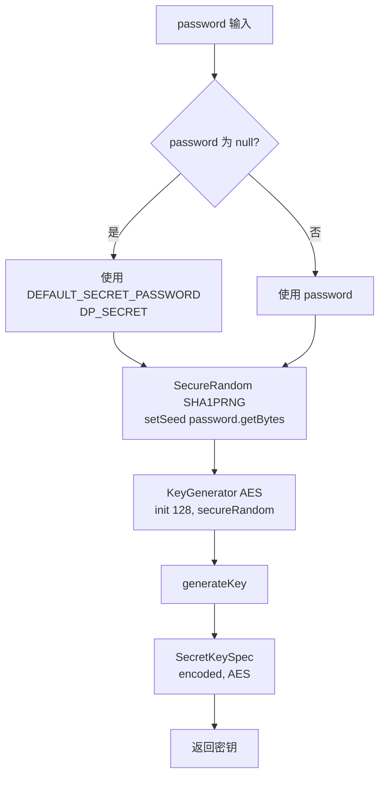

# 数据加密组件

## 1. 概述

`ASEUtil` 提供 AES 对称加密能力，采用 `AES/ECB/PKCS5Padding` 算法，通过 `KeyGenerator` + `SHA1PRNG` 从密码派生密钥。

> ⚠️ **重要纠正**：旧版文档中 `encrypt(String data)` 单参版本、硬编码 `KEY = "your-secret-key"`、直接 `SecretKeySpec(KEY.getBytes(), "AES")` 等描述均为虚构。实际源码为双参方法，使用 KeyGenerator 派生密钥。

---

## 2. 类定义

```java
package com.dp.plat.security.util;

public class ASEUtil {
    private static final String KEY_ALGORITHM = "AES";
    private static final String DEFAULT_CIPHER_ALGORITHM = "AES/ECB/PKCS5Padding";
    private static final String DEFAULT_SECRET_PASSWORD = "DP_SECRET";
}
```

---

## 3. 常量

| 常量 | 值 | 说明 |
|------|-----|------|
| `KEY_ALGORITHM` | `AES` | 密钥算法 |
| `DEFAULT_CIPHER_ALGORITHM` | `AES/ECB/PKCS5Padding` | 加密转换算法 |
| `DEFAULT_SECRET_PASSWORD` | `DP_SECRET` | 默认密码（password 为 null 时使用） |

---

## 4. 方法签名

| 方法 | 返回值 | 说明 |
|------|--------|------|
| `encrypt(String content, String password)` | `String` | AES 加密，返回 Base64 |
| `decrypt(String content, String password)` | `String` | AES 解密，输入 Base64 |
| `getSecretKey(String password)` | `SecretKeySpec`（private） | 派生密钥 |

> ⚠️ **注意**：所有方法都是**双参**，没有单参重载。`content` 为 null 时直接返回 null。

---

## 5. 加密实现

```java
public static String encrypt(String content, String password) {
    if (content == null) {
        return content;
    }
    try {
        Cipher cipher = Cipher.getInstance(DEFAULT_CIPHER_ALGORITHM);
        byte[] byteContent = content.getBytes("utf-8");
        cipher.init(Cipher.ENCRYPT_MODE, getSecretKey(password));
        byte[] result = cipher.doFinal(byteContent);
        return Base64Utils.encodeToString(result);  // Spring Base64Utils
    } catch (Exception ex) {
        Logger.getLogger(ASEUtil.class.getName()).log(Level.SEVERE, null, ex);
    }
    return null;
}
```

### 关键点：
1. **content 为 null 时返回 null**（不抛异常）
2. **编码**：`content.getBytes("utf-8")`
3. **Base64**：使用 `org.springframework.util.Base64Utils.encodeToString()`
4. **异常处理**：捕获后记录日志（`java.util.logging.Logger`），返回 null

---

## 6. 解密实现

```java
public static String decrypt(String content, String password) {
    if (content == null) {
        return content;
    }
    try {
        Cipher cipher = Cipher.getInstance(DEFAULT_CIPHER_ALGORITHM);
        cipher.init(Cipher.DECRYPT_MODE, getSecretKey(password));
        byte[] result = cipher.doFinal(Base64Utils.decodeFromString(content));
        return new String(result, "utf-8");
    } catch (Exception ex) {
        Logger.getLogger(ASEUtil.class.getName()).log(Level.SEVERE, null, ex);
    }
    return null;
}
```

---

## 7. 密钥派生

```java
private static SecretKeySpec getSecretKey(final String password) {
    KeyGenerator kg = null;
    try {
        final String secretKeyPassword = password != null ? password : DEFAULT_SECRET_PASSWORD;
        kg = KeyGenerator.getInstance(KEY_ALGORITHM);
        // AES 要求密钥长度为 128
        SecureRandom secureRandom = SecureRandom.getInstance("SHA1PRNG");
        secureRandom.setSeed(secretKeyPassword.getBytes());
        kg.init(128, secureRandom);
        SecretKey secretKey = kg.generateKey();
        return new SecretKeySpec(secretKey.getEncoded(), KEY_ALGORITHM);
    } catch (NoSuchAlgorithmException ex) {
        Logger.getLogger(ASEUtil.class.getName()).log(Level.SEVERE, null, ex);
    }
    return null;
}
```

### 密钥派生流程



### 跨平台兼容性说明

> ⚠️ **重要**：`SecureRandom.getInstance("SHA1PRNG")` 在不同 JDK 实现中行为可能不一致。代码注释提到"只在 windows 中有效"的 `kg.init(128, new SecureRandom(secretKeyPassword.getBytes()))` 已被替换为显式 `SHA1PRNG` 方式，但 SHA1PRNG 在 Linux/Solaris 上仍可能产生不同密钥序列。**同一密码在不同操作系统上加密的结果可能不同**。

---

## 8. 使用示例

### 8.1 基本加密解密

```java
// 使用自定义密码
String plain = "Hello, PMS!";
String encrypted = ASEUtil.encrypt(plain, "my-secret-key");
String decrypted = ASEUtil.decrypt(encrypted, "my-secret-key");
// decrypted.equals(plain) == true

// 使用默认密码（password 传 null）
String encrypted2 = ASEUtil.encrypt(plain, null);
String decrypted2 = ASEUtil.decrypt(encrypted2, null);
// 使用 DEFAULT_SECRET_PASSWORD = "DP_SECRET"
```

### 8.2 null 处理

```java
ASEUtil.encrypt(null, "key");   // 返回 null
ASEUtil.decrypt(null, "key");   // 返回 null
```

---

## 9. 安全注意事项

### 9.1 ECB 模式风险

- **ECB 模式**不使用 IV（初始向量），相同明文块产生相同密文块，可能泄露模式
- **建议**：对高度敏感数据考虑升级为 `AES/CBC/PKCS5Padding` 并使用随机 IV

### 9.2 密钥派生跨平台问题

- `SHA1PRNG` 派生的密钥在不同 JDK/JRE 实现间可能不一致
- **建议**：生产环境应使用固定密钥字节（如 `SecretKeySpec(hex.decode(key), "AES")`）或 PBKDF2

### 9.3 默认密码

- `DEFAULT_SECRET_PASSWORD = "DP_SECRET"` 是弱密码
- **建议**：始终传入强密码参数，不依赖默认值

---

## 10. 相关文档

| 文档 | 说明 |
|------|------|
| [../05-standards/security-practices.md](../05-standards/security-practices.md) | AES 加密最佳实践 |
| [class-reference.md](class-reference.md) | 类参考清单 |
