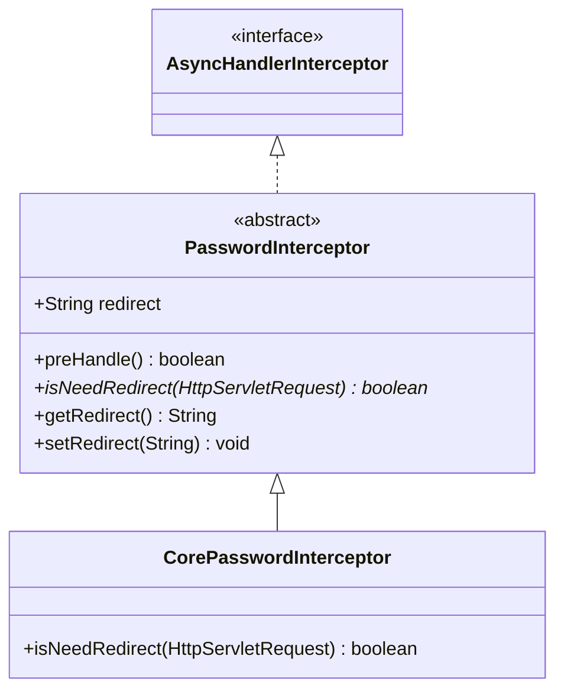
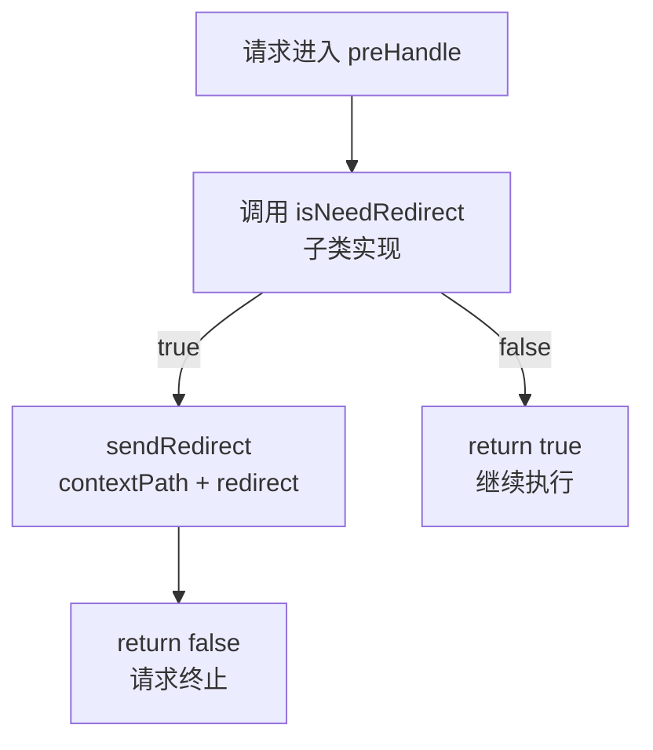

# 密码拦截器组件

## 1. 概述

`PasswordInterceptor` 是一个**抽象类**，采用模板方法模式实现密码过期强制修改逻辑。本模块仅定义骨架，具体判断逻辑由 core 模块的子类实现。

> ⚠️ **重要纠正**：旧版文档描述的"具体类，实现 `isPasswordExpired(UserDetail)`，使用 `UserContext.getCurrentUser()`"均为虚构。实际源码是抽象类，`isNeedRedirect(HttpServletRequest)` 为抽象方法。

---

## 2. 类定义

```java
package com.dp.plat.security.interceptor;

public abstract class PasswordInterceptor implements AsyncHandlerInterceptor {

    private String redirect;

    @Override
    public boolean preHandle(HttpServletRequest request, HttpServletResponse response, 
                             Object handler) throws Exception {
        if (isNeedRedirect(request)) {
            response.sendRedirect(request.getContextPath() + redirect);
            return false;
        }
        return true;
    }

    public abstract boolean isNeedRedirect(HttpServletRequest request);

    public String getRedirect() { return redirect; }
    public void setRedirect(String redirect) { this.redirect = redirect; }
}
```

---

## 3. 设计模式：模板方法



### 模板流程



---

## 4. 方法说明

### 4.1 preHandle（模板方法）

```java
public boolean preHandle(HttpServletRequest request, HttpServletResponse response, 
                         Object handler) throws Exception {
    if (isNeedRedirect(request)) {
        response.sendRedirect(request.getContextPath() + redirect);
        return false;
    }
    return true;
}
```

- 调用抽象方法 `isNeedRedirect()` 判断是否需要重定向
- 需要时：`sendRedirect(contextPath + redirect)`，返回 false 终止请求
- 不需要时：返回 true，继续执行后续拦截器/Controller

### 4.2 isNeedRedirect（抽象方法）

```java
public abstract boolean isNeedRedirect(HttpServletRequest request);
```

由子类实现，定义"是否需要强制修改密码"的判断逻辑。

### 4.3 redirect 属性

- 通过 Spring XML 的 `<property name="redirect" value="..."/>` 注入
- 重定向 URL 会自动拼接 `contextPath`

---

## 5. 子类实现（core 模块）

> core 模块的 `com.dp.plat.core.interceptor.PasswordInterceptor` 继承本类，实现 `isNeedRedirect()`。

源码中注释保留了参考实现逻辑：

```java
// 注释中的参考实现（非实际代码）
private boolean isNeedRedirect(HttpServletRequest request) {
    boolean authenticated = SecurityUtils.getSubject().isAuthenticated();
    if (!authenticated) return false;
    
    String servletPath = request.getServletPath();
    HttpSession session = request.getSession();
    Object needChangePwd = session.getAttribute("needChangePwd");
    
    if (redirect == null || redirect.contains(servletPath)) {
        return false;
    }
    if (needChangePwd != null) {
        return Boolean.TRUE.equals(needChangePwd);
    }
    
    Principal principal = UserContext.getCurrentPrincipal();
    needChangePwd = principal.getNeedChangePwd();
    String isCas = SystemConfig.systemVariables.getOrDefault("sys.cas", "0");
    // ... CAS 环境判断
    Boolean isNeed = Boolean.TRUE.equals(needChangePwd) && "0".equals(isCas);
    session.setAttribute("needChangePwd", isNeed && redirect != null && redirect.length() > 0);
    return isNeed;
}
```

> ⚠️ 以上为注释中的参考实现，**实际逻辑以 core 模块源码为准**。

---

## 6. 配置示例

### PMS-springmvc spring-mvc.xml

```xml
<!-- pwd 拦截器 -->
<mvc:interceptor>
    <mvc:mapping path="/**"/>
    <mvc:exclude-mapping path="/password.*"/>
    <mvc:exclude-mapping path="/modifyPassword.*"/>
    <bean id="pwdInterceptor" 
          class="com.dp.plat.core.interceptor.PasswordInterceptor">
        <property name="redirect" value="/password.html?needChangePwd=true" />
    </bean>
</mvc:interceptor>
```

> **注意**：使用的是 core 模块的 `com.dp.plat.core.interceptor.PasswordInterceptor`（子类），而非本模块的抽象类。

### 配置说明

| 配置项 | 值 | 说明 |
|--------|-----|------|
| `mapping` | `/**` | 拦截所有路径 |
| `exclude-mapping` | `/password.*` | 排除密码修改页面 |
| `exclude-mapping` | `/modifyPassword.*` | 排除密码修改接口 |
| `redirect` | `/password.html?needChangePwd=true` | 重定向目标 |

---

## 7. 相关文档

| 文档 | 说明 |
|------|------|
| [class-reference.md](class-reference.md) | 类参考清单 |
| [../01-architecture/security-filter-chain.md](../01-architecture/security-filter-chain.md) | 过滤器链架构 |
