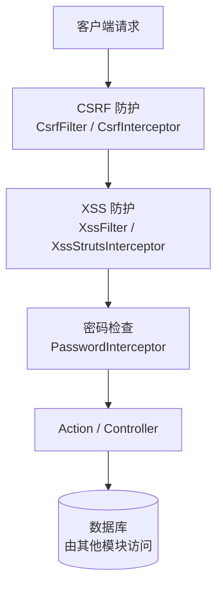

# 模块-表 CRUD 映射矩阵

## 1. 概述

PMS-security 模块是**纯工具库**，不直接管理任何数据库表，因此无 CRUD 映射。

> ⚠️ **重要纠正**：旧版本文档描述的 `fnd_user_info`、`tb_sys_log` 关联表及 CRUD 操作均为虚构。本模块源码中不存在任何数据库访问代码。

详见 [../03-database/no-database.md](../03-database/no-database.md)。

---

## 2. 无 CRUD 映射

| 数据表 | C | R | U | D | 说明 |
|--------|---|---|---|---|------|
| （无） | - | - | - | - | 本模块无数据库表 |

---

## 3. 请求处理数据流

虽然无数据库交互，安全组件在请求处理链路中的位置如下：

> CSRF Token 存储在 HttpSession，XSS 处理在内存中完成，均不涉及数据库。

---

## 4. 相关文档

| 文档 | 说明 |
|------|------|
| [filter-interceptor-matrix.md](filter-interceptor-matrix.md) | 过滤器/拦截器部署矩阵 |
| [../03-database/no-database.md](../03-database/no-database.md) | 无数据库说明 |
