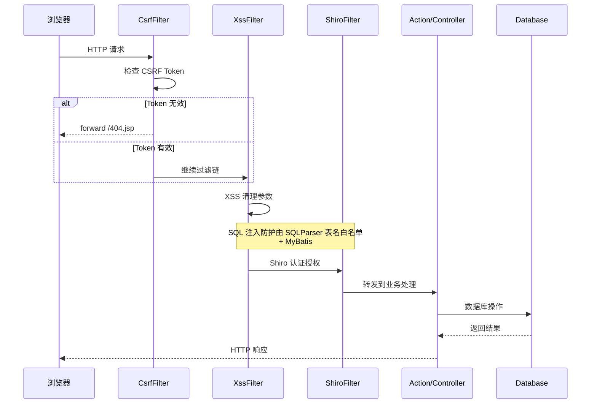
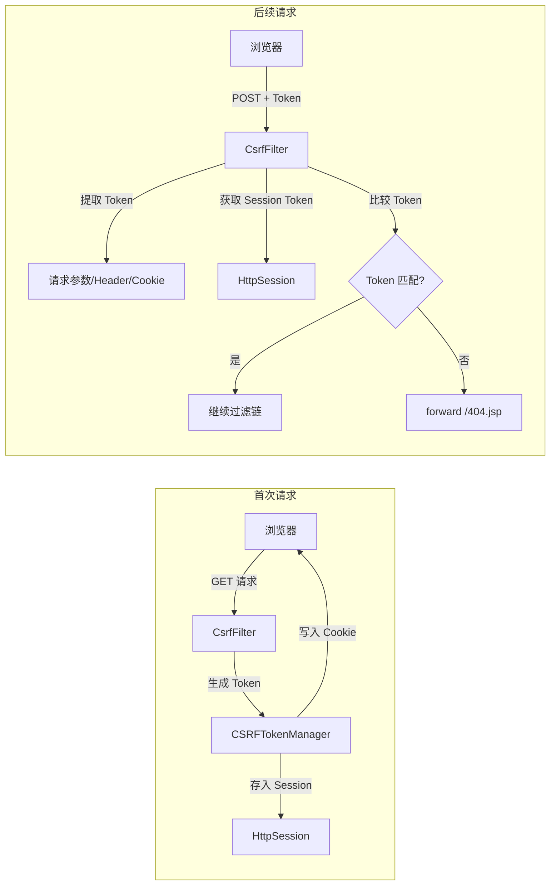
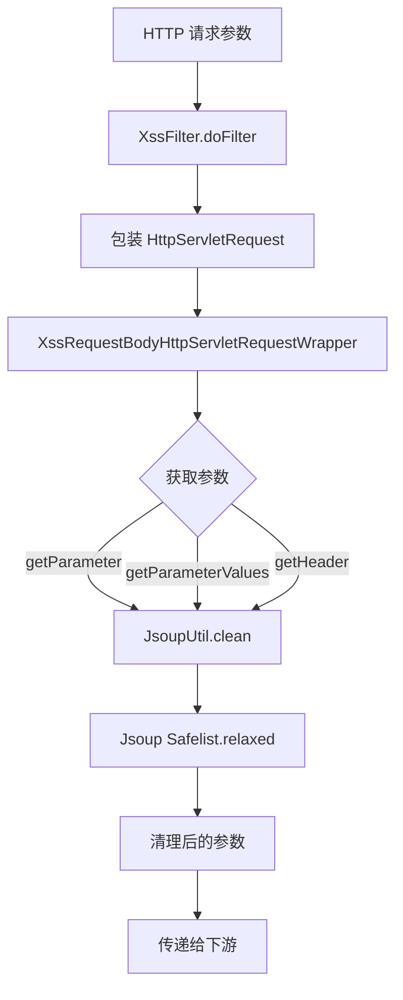
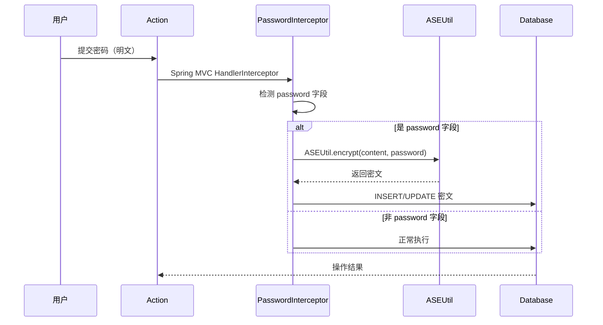
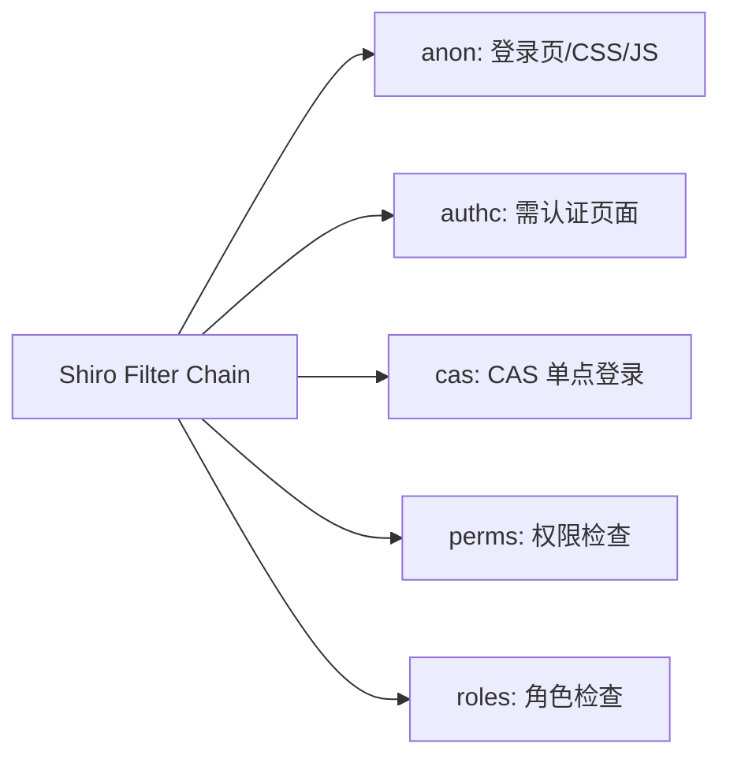
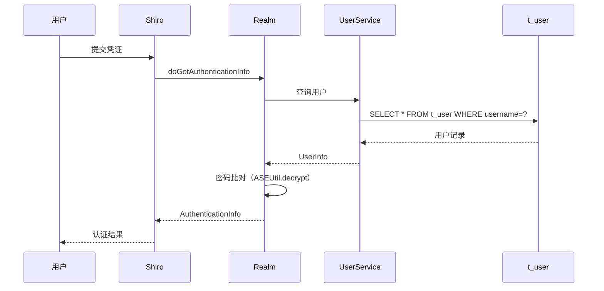
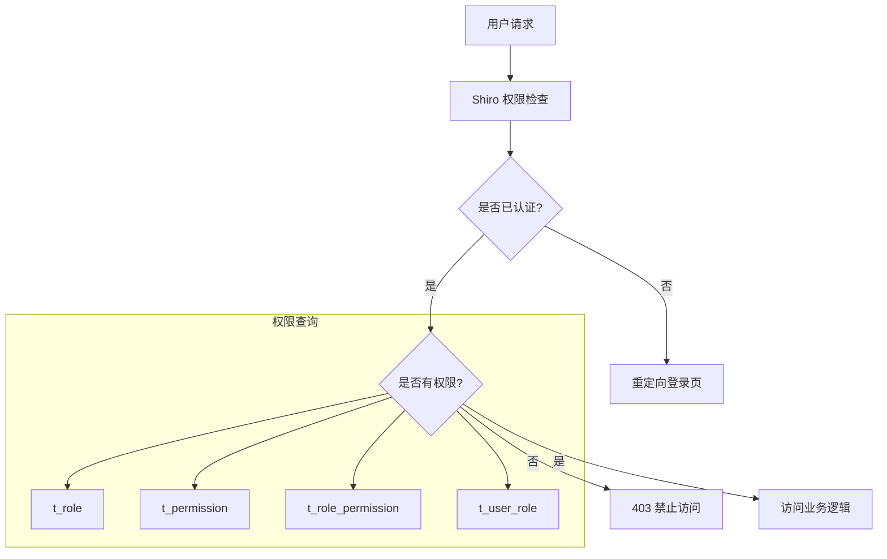

# PMS-security 数据流图

## 1. 安全过滤器链数据流

### 1.1 请求处理流程



### 1.2 CSRF 验证数据流



### 1.3 XSS 清理数据流



### 1.4 密码加密数据流



## 2. 过滤器配置

### 2.1 web.xml 配置（PMS-struts Profile）

```xml
<!-- CSRF 过滤器 -->
<filter>
    <filter-name>CsrfFilter</filter-name>
    <filter-class>com.dp.plat.security.csrf.CsrfFilter</filter-class>
</filter>
<filter-mapping>
    <filter-name>CsrfFilter</filter-name>
    <url-pattern>/*</url-pattern>
</filter-mapping>

<!-- XSS 过滤器（部分 Profile 注释启用） -->
<filter>
    <filter-name>XssFilter</filter-name>
    <filter-class>com.dp.plat.security.xss.XssFilter</filter-class>
</filter>
<filter-mapping>
    <filter-name>XssFilter</filter-name>
    <url-pattern>/*</url-pattern>
</filter-mapping>
```

### 2.2 Shiro 过滤器链



## 3. 安全组件与数据库交互

> ⚠️ **重要说明**：PMS-security 是纯工具库（jar），**无任何数据库表、Mapper、DAO、Service**（见 [no-database.md](../03-database/no-database.md)）。以下 §3.1/§3.2 描述的是 **core 模块**（Shiro 集成）的认证/权限流程，PMS-security 仅提供 `ASEUtil`、`CSRFTokenManager` 等工具类供 core 模块调用。`t_user`、`t_role`、`UserService`、`Realm` 均在 core 模块。

### 3.1 用户认证数据流



### 3.2 权限验证数据流



## 4. 外部系统交互

PMS-security 不与外部系统直接交互，所有安全验证在本地完成。
