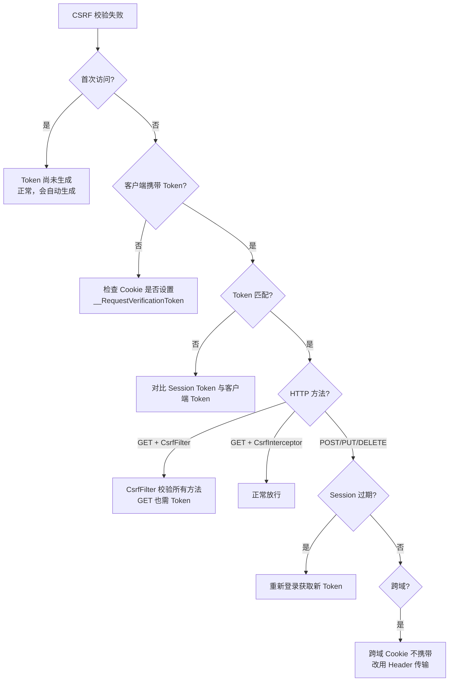

# 故障排查

## 1. CSRF Token 校验失败

### 1.1 现象

- CsrfFilter：请求被 forward 到 `/404.jsp`
- CsrfInterceptor：抛出 `CsrfValidateFailedException("csrf token validate failed")`

### 1.2 排查步骤



### 1.3 常见原因

| 原因 | 环境 | 解决方案 |
|------|------|---------|
| 首次访问无 Token | 所有 | 正常现象，CsrfFilter/Interceptor 会自动生成 |
| GET 请求被拦截 | PMS-struts dev | CsrfFilter 校验所有方法，需在 URL 或 Header 中携带 Token |
| Session 过期 | 所有 | 重新登录，获取新 Token |
| 跨域请求 Cookie 不携带 | 所有 | 改用 Header 传输 Token，或配置 CORS withCredentials |
| Token 参数名错误 | 所有 | 确认使用 `__RequestVerificationToken`（非 `_csrf`） |
| 登录接口被拦截 | PMS-springmvc | 确认 `/sys/login.json` 在 exclude-mapping 中 |

### 1.4 调试技巧

```java
// 在 CsrfFilter.isValid 中添加日志
String serverCsrfToken = (String) session.getAttribute(CSRFTokenManager.CSRF_TOKEN_FOR_SESSION_ATTR_NAME);
String clientCsrfToken = CSRFTokenManager.getTokenFromRequest(request);
System.out.println("Server Token: " + serverCsrfToken);
System.out.println("Client Token: " + clientCsrfToken);
System.out.println("Token Name: " + CSRFTokenManager.getTokenName());
```

---

## 2. XSS 过滤误杀

### 2.1 现象

- 用户输入的合法内容被转义或清理
- 富文本编辑器内容丢失标签
- 密码字段包含特殊字符被破坏（不应发生）

### 2.2 排查步骤

#### 2.2.1 确认过滤层级

| 环境 | 可能的过滤层 |
|------|-------------|
| PMS-struts | XssStrutsInterceptor（三级 URL 策略） |
| PMS-springmvc | XssFilter（XssRequestBodyHttpServletRequestWrapper） |

#### 2.2.2 XssStrutsInterceptor 误杀

```java
// 检查 URL 匹配哪个策略
String servletPath = request.getServletPath();
boolean isExclude = isMatch(servletPath, excludeUrls);  // 排除
boolean isClean = isMatch(servletPath, cleanUrls);      // 清理
// encodeUrls 为默认
```

**常见问题**：
- `enabled` 未设置为 `true`：所有 URL 走 cleanUrls（HTML 清理），富文本被过度清理
- URL 误匹配 cleanUrls：普通表单被 HTML 清理而非编码

**解决方案**：
```xml
<!-- 确保启用 -->
<param name="enable">true</param>
<!-- 富文本 URL 放入 cleanUrls -->
<param name="cleanUrls">/module/prob_*,/probAudit.*</param>
<!-- 普通表单 URL 放入 encodeUrls -->
<param name="encodeUrls">/*</param>
```

#### 2.2.3 XssFilter 误杀

`XssRequestBodyHttpServletRequestWrapper.escapeHtml()` 会转义 `<`、`>`、`&`：

| 输入 | 输出 | 是否误杀 |
|------|------|---------|
| `<script>alert(1)</script>` | `&lt;script&gt;alert(1)&lt;/script&gt;` | ✅ 正确 |
| `a < b` | `a &lt; b` | ⚠️ 数学表达式被转义 |
| `Tom & Jerry` | `Tom ＆ Jerry` | ⚠️ 全角 & 符号 |
| `<b>粗体</b>` | `&lt;b&gt;粗体&lt;/b&gt;` | ⚠️ 富文本被转义 |

**解决方案**：
- 对需要保留 HTML 的路径配置 `excludePattern`
- 或使用 XssStrutsInterceptor 的 cleanUrls 策略（HTML 清理而非编码）

### 2.3 password 字段未豁免

若密码仍被转义，检查：
1. 参数名是否为 `password`（区分大小写）
2. 是否经过 `XssHttpServletRequestWrapper`（该类不豁免 password）
3. 当前 XssFilter 装配的是 `XssRequestBodyHttpServletRequestWrapper`（版本 1，有豁免）

---

## 3. Struts2 版本兼容

### 3.1 版本差异

| 模块 | Struts2 版本 |
|------|-------------|
| PMS-security | 2.3.35 |
| PMS-struts | 2.3.35（部分环境 2.5.30） |
| PMS-springmvc | 2.5.30 |

### 3.2 参数模型差异

```java
// XssStrutsInterceptor 中注释保留了 2.5 的适配
// Struts 2.5
Object parameters = actionContext.getParameters();
if (parameters instanceof HttpParameters) {
    HttpParameters httpParameters = (HttpParameters) parameters;
    // ...
}

// Struts 2.3（当前使用）
Map<String, Object> httpParameters = actionContext.getParameters();
// ...
```

**问题**：若 PMS-struts 升级到 2.5.30，`actionContext.getParameters()` 返回 `HttpParameters` 而非 `Map`，当前代码会抛出 `ClassCastException`。

**解决方案**：取消注释 2.5 适配代码，或使用版本判断。

### 3.3 Dispatcher API 差异

`MDispatcher` 继承自 `org.apache.struts2.dispatcher.Dispatcher`，在 Struts2 2.5 中：
- `wrapRequest()` 签名可能变化
- `StrutsRequestWrapper` 构造函数可能变化
- `MultiPartRequestWrapper` 可能被重构

> ⚠️ M 系列组件当前未实际启用，升级 Struts2 时需验证兼容性。

---

## 4. 富文本内容被清理

### 4.1 现象

- 技术公告（`/module/prob_*`）的 HTML 内容丢失标签
- 表单元素的 `input`、`select` 被移除
- `style` 属性被移除

### 4.2 排查

#### 4.2.1 确认走 cleanUrls 策略

```java
// XssStrutsInterceptor.intercept()
boolean isClean = isMatch(servletPath, this.cleanUrls);
// isClean=true 时使用 JsoupUtil.clean()
```

#### 4.2.2 检查 Safelist

```java
// cleanUrls 使用 getFormSafelist()（对 String 参数）
JsoupUtil.clean(param, JsoupUtil.getFormSafelist());

// cleanUrls 使用默认 clean()（对 String[] 参数）
JsoupUtil.clean(param);  // 无 input/select/label
```

> ⚠️ **不一致**：String 参数用 `getFormSafelist()`（含 input/select），String[] 参数用默认 `clean()`（不含）。可能导致同一表单的不同参数被不同清理。

#### 4.2.3 解决方案

1. **扩展 Safelist**：在 `getFormSafelist()` 中添加需要的标签/属性
2. **调整 URL 策略**：将富文本 URL 从 cleanUrls 移到 excludeUrls（不处理）
3. **统一清理逻辑**：修改 `intercept()` 使 String[] 也使用 `getFormSafelist()`

---

## 5. 其他常见问题

### 5.1 POST Body 无法多次读取

**原因**：`XssRequestBodyHttpServletRequestWrapper` 缓存了 Body，`getInputStream()` 返回基于缓存的流。

**现象**：Controller 中 `@RequestBody` 读取后，Filter 中再读取为空（或反之）。

**解决**：Wrapper 已处理此问题，`getInputStream()`/`getReader()`/`getParameter*()` 共用缓存。若仍有问题，检查是否有其他 Filter 再次包装请求。

### 5.2 multipart 文件上传失败

**原因**：版本 1 的 multipart 处理重建 requestBody，可能破坏文件内容。

**解决**：
- 使用版本 3（不重建 Body）
- 或将文件上传路径加入 `excludePattern`

### 5.3 JSON 请求 Body 被破坏

**原因**：`escapeHtml` 转义了 JSON 中的 `<`、`>`、`&`，可能破坏 JSON 结构。

**现象**：`{"name": "a<b"}` → `{"name": "a&lt;b"}`（JSON 仍有效，但值被改变）

**解决**：
- 对 JSON API 路径配置 `excludePattern`
- 或在 Controller 中使用 `JsoupUtil.unescape()` 还原

### 5.4 ASEUtil 跨平台解密失败

**原因**：`SHA1PRNG` 在不同 JDK 实现间可能产生不同密钥序列。

**解决**：
- 确保加密和解密使用相同 JDK 版本
- 或改用固定密钥字节

---

## 6. 相关文档

| 文档 | 说明 |
|------|------|
| [security-practices.md](security-practices.md) | 安全实践 |
| [performance-optimization.md](performance-optimization.md) | 性能优化 |
| [../06-reference/error-codes.md](../06-reference/error-codes.md) | 错误码 |
