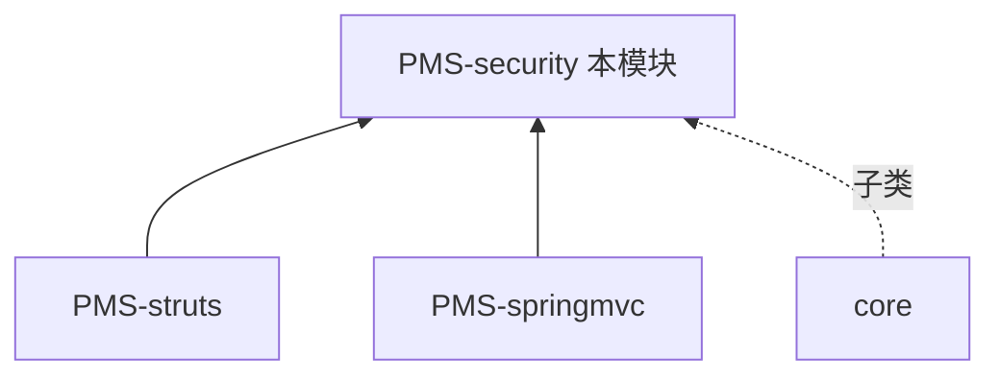

# PMS-security 模块知识库

> DPtech PMS **安全组件模块**。提供 XSS 防护、CSRF 防护、SQL 注入防护等 Web 安全横切能力。本知识库独立维护，所有文档基于实际源码（`src/main/java/com/dp/plat/security/`）整理。

---

## 模块定位

| 项 | 值 |
|----|----|
| 目录 | `PMS/PMS-security/` |
| artifactId | `pms-security` |
| 基础包 | `com.dp.plat.security` |
| 打包类型 | jar（纯工具库，无数据库表） |
| Struts2 版本 | 2.3.35（与 PMS-springmvc 的 2.5.30 不同） |
| 职责 | Web 安全防护、输入验证、数据加密、SQL 解析 |
| 组件数 | 21 个 Java 类 |

### 关键设计要点

- ⚠️ **CSRF Token 参数名**：`__RequestVerificationToken`（非 Spring Security 的 `_csrf`）
- ⚠️ **ASEUtil 加密方法**：`encrypt(String content, String password)` 双参（非单参）
- ⚠️ **SQLParser 基于 Druid SQLUtils**（非 JSQLParser）
- ⚠️ **PasswordInterceptor 是抽象类**（模板方法模式，子类在 core 模块）
- ⚠️ **XssFilter 装配 XssRequestBodyHttpServletRequestWrapper**（非 XssHttpServletRequestWrapper）
- ⚠️ **JsoupUtil 使用 Safelist**（非 Whitelist，Jsoup 1.14+ 更名）

### 依赖关系

> PMS-struts 和 PMS-springmvc 均依赖 PMS-security 实现请求级安全防护。core 模块提供 `PasswordInterceptor` 的具体子类。

---

## 组件清单

| 组件类别 | 类数 | 核心类 | 文档 |
|---------|------|--------|------|
| CSRF 防护 | 4 | `CSRFTokenManager`、`CsrfFilter`、`CsrfInterceptor`、`CsrfValidateFailedException` | [csrf-filter.md](02-modules/csrf-filter.md) |
| XSS 防护 | 10 | `XssFilter`、`XssRequestBodyHttpServletRequestWrapper` 系列、`XssStrutsInterceptor`、M 系列替换类 | [xss-filter.md](02-modules/xss-filter.md) |
| SQL 解析 | 1+1 | `SQLParser`（+ `SqlParserResult` 内部类） | [sql-parser.md](02-modules/sql-parser.md) |
| 数据加密 | 1 | `ASEUtil`（AES/ECB/PKCS5Padding） | [data-encryption.md](02-modules/data-encryption.md) |
| 验证码 | 1 | `CaptchaUtil`（80×30 PNG，4 位字符） | [captcha.md](02-modules/captcha.md) |
| HTTP 上下文 | 1 | `HttpContext`（请求/会话/IP 获取） | [http-context.md](02-modules/http-context.md) |
| 密码拦截器 | 1 | `PasswordInterceptor`（抽象类） | [password-interceptor.md](02-modules/password-interceptor.md) |
| 字节工具 | 1 | `ByteUtils`（KMP 算法） | [class-reference.md](02-modules/class-reference.md) |

---

## 文档目录

| 章节 | 内容 | 文档数 |
|------|------|--------|
| [01-architecture](01-architecture/) | 系统架构、安全过滤器链、CSRF 架构、XSS 架构 | 4 |
| [02-modules](02-modules/) | 安全组件功能说明（21 个 Java 类全覆盖） | 9 |
| [03-database](03-database/) | 无数据库表说明 + 概览 | 2 |
| [04-mapping](04-mapping/) | 过滤器/拦截器部署矩阵 + CRUD 矩阵 + 数据流转 | 3 |
| [05-standards](05-standards/) | 编码规范、性能优化、安全实践、故障排查 | 4 |
| [06-reference](06-reference/) | 代码示例、错误码、术语表、接口模板 | 4 |
| [audit](audit/) | 模块文档审计报告（含虚构内容专项审查 + 综合审查） | 2 |
| **合计** | — | **28** |

### 01-architecture（架构文档）

| 文档 | 说明 |
|------|------|
| [system-architecture.md](01-architecture/system-architecture.md) | 系统架构总览（模块概述、目录结构、组件总览、依赖关系） |
| [security-filter-chain.md](01-architecture/security-filter-chain.md) | 安全过滤器链（Filter/Interceptor 执行顺序、配置方式、URL 匹配规则） |
| [csrf-architecture.md](01-architecture/csrf-architecture.md) | CSRF 防护架构（Token 机制、CsrfFilter vs CsrfInterceptor） |
| [xss-architecture.md](01-architecture/xss-architecture.md) | XSS 防护架构（三层防护、JsoupUtil 清理策略） |

### 02-modules（模块文档）

| 文档 | 说明 |
|------|------|
| [security-components.md](02-modules/security-components.md) | 组件总览（21 个 Java 类清单 + 关键设计纠正） |
| [csrf-filter.md](02-modules/csrf-filter.md) | CSRF 防护（4 个类详细说明） |
| [xss-filter.md](02-modules/xss-filter.md) | XSS 防护（10 个类详细说明，含三个版本对比） |
| [sql-parser.md](02-modules/sql-parser.md) | SQL 解析（SQLParser 完整方法清单、变量解析） |
| [data-encryption.md](02-modules/data-encryption.md) | 数据加密（ASEUtil 加密实现、密钥派生流程） |
| [captcha.md](02-modules/captcha.md) | 验证码（CaptchaUtil 图形验证码生成） |
| [http-context.md](02-modules/http-context.md) | HTTP 上下文（HttpContext 请求/会话获取、IP 获取） |
| [password-interceptor.md](02-modules/password-interceptor.md) | 密码拦截器（PasswordInterceptor 抽象类、模板方法模式） |
| [class-reference.md](02-modules/class-reference.md) | 类参考（22 个类的完整方法签名清单） |

### 03-database（数据库文档）

| 文档 | 说明 |
|------|------|
| [no-database.md](03-database/no-database.md) | 说明本模块为纯工具库，无数据库表 |
| [database-overview.md](03-database/database-overview.md) | 数据库概览（无表，仅说明） |

### 04-mapping（映射文档）

| 文档 | 说明 |
|------|------|
| [filter-interceptor-matrix.md](04-mapping/filter-interceptor-matrix.md) | 过滤器/拦截器部署矩阵（各组件在 PMS-struts/springmvc 中的启用情况） |
| [crud-matrix.md](04-mapping/crud-matrix.md) | CRUD 矩阵（纯工具库，无 CRUD） |
| [data-flow.md](04-mapping/data-flow.md) | 数据流转（请求/响应处理链中的安全组件数据流） |

### 05-standards（规范文档）

| 文档 | 说明 |
|------|------|
| [coding-standards.md](05-standards/coding-standards.md) | 编码规范（基于真实方法签名） |
| [performance-optimization.md](05-standards/performance-optimization.md) | 性能优化（XSS 过滤性能、JsoupUtil 缓存、正则预编译） |
| [security-practices.md](05-standards/security-practices.md) | 安全实践（CSRF Token 管理、XSS 白名单清理、SQL 注入防护、AES 加密） |
| [troubleshooting.md](05-standards/troubleshooting.md) | 故障排查（CSRF 校验失败、XSS 误杀、Struts2 版本兼容） |

### 06-reference（参考文档）

| 文档 | 说明 |
|------|------|
| [code-examples.md](06-reference/code-examples.md) | 代码示例（基于真实源码，含关键设计纠正对照表） |
| [error-codes.md](06-reference/error-codes.md) | 错误码（CsrfValidateFailedException 详细说明） |
| [glossary.md](06-reference/glossary.md) | 术语表（安全术语、组件术语、URL 策略术语、SQL 变量术语） |
| [interface-template.md](06-reference/interface-template.md) | 接口模板（各组件使用模板） |

### audit（审计文档）

| 文档 | 说明 |
|------|------|
| [audit-modules.md](audit/audit-modules.md) | 模块文档审计报告（含旧文档虚构内容专项审查） |
| [comprehensive-review.md](audit/comprehensive-review.md) | 综合审查报告（全模块文档质量评估） |

---

## 快速导航

**新成员**：[系统架构](01-architecture/system-architecture.md) → [组件总览](02-modules/security-components.md) → [类参考](02-modules/class-reference.md)

**开发者**：[编码规范](05-standards/coding-standards.md) → [接口模板](06-reference/interface-template.md) → [代码示例](06-reference/code-examples.md)

**CSRF 集成**：[CSRF 架构](01-architecture/csrf-architecture.md) → [CSRF 模块](02-modules/csrf-filter.md) → [过滤器矩阵](04-mapping/filter-interceptor-matrix.md)

**XSS 集成**：[XSS 架构](01-architecture/xss-architecture.md) → [XSS 模块](02-modules/xss-filter.md) → [故障排查](05-standards/troubleshooting.md)

**加密/SQL**：[数据加密](02-modules/data-encryption.md) → [SQL 解析](02-modules/sql-parser.md) → [安全实践](05-standards/security-practices.md)

**排障**：[故障排查](05-standards/troubleshooting.md) → [审计报告](audit/audit-modules.md)

---

## 跨库知识共享

- Shiro 认证基础：[core 安全架构](../../core/docs/01-architecture/system-architecture.md#4-认证授权架构shiro--cas)
- 安全最佳实践：[core 安全防护](../../core/docs/05-standards/coding-standards.md#5-安全防护)
- 安全组件使用方：[PMS-struts](../../PMS-struts/docs/01-architecture/security-architecture.md)
- PasswordInterceptor 子类：core 模块（`com.dp.plat.core.interceptor.PasswordInterceptor`）
- 共用数据库：[PMS-struts 数据字典](../../PMS-struts/docs/03-database/database_dict%20final.md)（本模块无数据库表）
