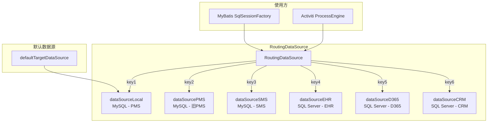
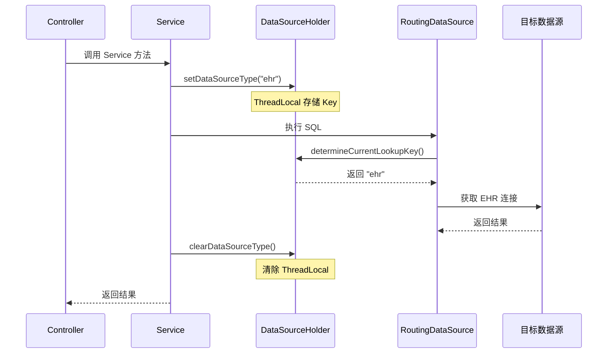

# 多数据源架构文档

> 本文档详细分析 PMS-springmvc 模块的多数据源配置，包括 RoutingDataSource 动态路由机制、各数据源配置参数及切换策略。
> 配置文件：`src/main/resources/spring.xml`、`src/main/resources/profiles/{env}/jdbc.properties`

---

## 1. 多数据源概述

PMS-springmvc 模块通过 `RoutingDataSource` 实现多数据源动态切换，支持在同一应用中访问多个业务系统数据库。

### 1.1 数据源清单

| 序号 | 数据源 Bean | 数据源 Key | 数据库类型 | 目标系统 | 用途 |
|------|------------|-----------|-----------|---------|------|
| 1 | `dataSourceLocal` | `${jdbc.key1}` | MySQL | PMS 主库（dppms_d365） | 项目管理主数据 |
| 2 | `dataSourcePMS` | `${jdbc.key2}` | MySQL | PMS 旧库 | 老系统数据兼容 |
| 3 | `dataSourceSMS` | `${jdbc.key3}` | MySQL | SMS 短信系统 | 短信服务数据 |
| 4 | `dataSourceEHR` | `${jdbc.key4}` | SQL Server | EHR 人力资源 | 组织架构同步 |
| 5 | `dataSourceD365` | `${jdbc.key5}` | SQL Server | Dynamics 365 | ERP 数据同步 |
| 6 | `dataSourceCRM` | `${jdbc.key6}` | SQL Server | CRM 客户关系 | 客户数据（仅 PMS3） |

### 1.2 数据源架构图



---

## 2. RoutingDataSource 配置

### 2.1 路由配置

```xml
<bean id="dataSource" class="com.dp.plat.core.config.RoutingDataSource">
    <property name="targetDataSources">
        <map key-type="java.lang.String">
            <entry key="${jdbc.key1}" value-ref="dataSourceLocal"/>
            <entry key="${jdbc.key2}" value-ref="dataSourcePMS"/>
            <entry key="${jdbc.key3}" value-ref="dataSourceSMS"/>
            <entry key="${jdbc.key4}" value-ref="dataSourceEHR"/>
            <entry key="${jdbc.key5}" value-ref="dataSourceD365"/>
            <entry key="${jdbc.key6}" value-ref="dataSourceCRM"/>
        </map>
    </property>
    <property name="defaultTargetDataSource" ref="dataSourceLocal"/>
</bean>
```

### 2.2 路由机制

`RoutingDataSource` 继承 Spring 的 `AbstractRoutingDataSource`，通过 `determineCurrentLookupKey()` 方法确定当前使用的数据源 Key：

```java
public class RoutingDataSource extends AbstractRoutingDataSource {
    @Override
    protected Object determineCurrentLookupKey() {
        // 从 ThreadLocal 中获取数据源 Key（由 DataSourceAspect 切面或编程式调用设置）
        return DataSourceHolder.getDataSourceType();
    }
}
```

> ⚠️ **类名校正**：旧版文档中误写为 `DataSourceContextHolder`，实际 core 模块提供的类为 `com.dp.plat.core.config.DataSourceHolder`（已被 `DataSourceAspect`、`SMSDataJob`、`ProjectHeaderService` 等使用）。`DataSourceContextHolder` 在源码中不存在。

### 2.3 数据源切换方式

#### 方式一：注解驱动（@DataSource + DataSourceAspect AOP）

```java
@DataSource("ehr")
public List<Employee> queryEhrEmployees() {
    return ehrMapper.selectAll();
}
```

切面 `com.dp.plat.core.aop.DataSourceAspect` 拦截 `@within(DataSource) || @annotation(DataSource)`：
- `@Before`：读取注解 `value()` → `DataSourceHolder.setDataSourceType(value)` → 路由到对应数据源
- `@After`：`DataSourceHolder.setDataSourceType("")` → 清空 ThreadLocal 回到默认数据源

#### 方式二：编程式切换

```java
DataSourceHolder.setDataSourceType("d365");
try {
    // 执行 D365 数据源操作
    List<PurchaseOrder> orders = d365Mapper.selectOrders();
} finally {
    DataSourceHolder.clearDataSourceType();
}
```

> 实际使用案例：
> - `SMSDataJob.insert()`（`com.dp.plat.pms.springmvc.job.SMSDataJob:153, 186`）— 同步任务前显式切换数据源
> - `ProjectHeaderService.transferProject()`（`com.dp.plat.pms.springmvc.service.impl.ProjectHeaderService:738`）— 项目转移时动态获取 `RoutingDataSource` 实例

---

## 3. 主数据源配置（dataSourceLocal）

### 3.1 Druid 连接池配置

```xml
<bean id="dataSourceLocal" class="com.alibaba.druid.pool.DruidDataSource" 
    destroy-method="close">
    <property name="driverClassName" value="${jdbc.driver}"/>
    <property name="url" value="${jdbc.url}"/>
    <property name="username" value="${jdbc.username}"/>
    <property name="password" value="${jdbc.password}"/>
    <property name="initialSize" value="${jdbc.initialSize}"/>
    <property name="maxActive" value="${jdbc.maxActive}"/>
    <property name="maxIdle" value="${jdbc.maxIdle}"/>
    <property name="minIdle" value="${jdbc.minIdle}"/>
    <property name="maxWait" value="${jdbc.maxWait}"/>
    <property name="testOnBorrow" value="${jdbc.testOnBorrowFalse}"/>
    <property name="validationQuery" value="${jdbc.validationQuery}"/>
    <property name="testWhileIdle" value="${jdbc.testWhileIdle}"/>
    <property name="timeBetweenEvictionRunsMillis" value="${jdbc.timeBetweenEvictionRunsMillis}"/>
    <property name="minEvictableIdleTimeMillis" value="${jdbc.minEvictableIdleTimeMillis}"/>
    <property name="numTestsPerEvictionRun" value="${jdbc.numTestsPerEvictionRun}"/>
    <property name="filters" value="stat"/>
</bean>
```

### 3.2 连接池参数说明

| 参数 | 属性 | 说明 |
|------|------|------|
| `initialSize` | 池启动连接数 | 初始化时创建的连接数量 |
| `maxActive` | 最大活跃连接数 | 同一时间可分配的最大连接数 |
| `maxIdle` | 最大空闲连接数 | 池中最大空闲连接数 |
| `minIdle` | 最小空闲连接数 | 池中最小空闲连接数 |
| `maxWait` | 最大等待时间 | 获取连接超时时间（毫秒） |
| `testOnBorrow` | 借出验证 | 获取连接时是否验证有效性 |
| `testWhileIdle` | 空闲验证 | 空闲时是否验证连接有效性 |
| `validationQuery` | 验证 SQL | 连接验证查询（`select 1`） |
| `timeBetweenEvictionRunsMillis` | 空闲检测间隔 | 空闲连接检测任务运行间隔 |
| `minEvictableIdleTimeMillis` | 最小空闲时间 | 连接最小空闲时间（超过则回收） |
| `numTestsPerEvictionRun` | 每次检测数 | 每次空闲检测检查的连接数 |
| `filters` | 过滤器 | `stat` 启用 Druid 监控统计 |

### 3.3 主数据源特性

- **连接池**：Druid 1.2.8
- **监控**：启用 `stat` 过滤器，可通过 `/druid/*` 访问监控页面
- **destroy-method**：`close` 确保应用关闭时释放连接

---

## 4. EHR 数据源配置（dataSourceEHR）

### 4.1 配置特点

EHR 数据源使用较小的连接池参数（`jdbc.initialSizeMini` 等），因为 EHR 数据同步为低频定时任务：

```xml
<bean id="dataSourceEHR" class="com.alibaba.druid.pool.DruidDataSource" 
    destroy-method="close">
    <property name="driverClassName" value="${ehr.driver}"/>
    <property name="url" value="${ehr.url}"/>
    <property name="username" value="${ehr.username}"/>
    <property name="password" value="${ehr.password}"/>
    <property name="initialSize" value="${jdbc.initialSizeMini}"/>
    <property name="maxActive" value="${jdbc.maxActiveMini}"/>
    <property name="maxIdle" value="${jdbc.maxIdleMini}"/>
    <property name="minIdle" value="${jdbc.minIdleMini}"/>
    <property name="testOnBorrow" value="${jdbc.testOnBorrow}"/>
    <property name="validationQuery" value="${jdbc.validationQuery}"/>
    <property name="validationQueryTimeout" value="${jdbc.validationQueryTimeout}"/>
    <property name="timeBetweenEvictionRunsMillis" value="${jdbc.timeBetweenEvictionRunsMillisMini}"/>
    <property name="minEvictableIdleTimeMillis" value="${jdbc.minEvictableIdleTimeMillisMini}"/>
    <property name="numTestsPerEvictionRun" value="${jdbc.numTestsPerEvictionRunMini}"/>
</bean>
```

### 4.2 Mini 参数差异

| 参数 | 主数据源 | Mini 数据源 | 说明 |
|------|---------|------------|------|
| `initialSize` | `jdbc.initialSize` | `jdbc.initialSizeMini` | Mini 较小 |
| `maxActive` | `jdbc.maxActive` | `jdbc.maxActiveMini` | Mini 较小 |
| `maxIdle` | `jdbc.maxIdle` | `jdbc.maxIdleMini` | Mini 较小 |
| `minIdle` | `jdbc.minIdle` | `jdbc.minIdleMini` | Mini 较小 |
| `testOnBorrow` | `false` | `true` | Mini 启用借出验证 |
| `timeBetweenEvictionRunsMillis` | 标准 | Mini | Mini 检测间隔更短 |

---

## 5. D365 数据源配置（dataSourceD365）

D365 数据源配置与 EHR 类似，使用 Mini 连接池参数，连接 SQL Server 数据库：

```xml
<bean id="dataSourceD365" class="com.alibaba.druid.pool.DruidDataSource" 
    destroy-method="close">
    <property name="driverClassName" value="${d365.database.driverClassName}"/>
    <property name="url" value="${d365.database.url}"/>
    <property name="username" value="${d365.database.username}"/>
    <property name="password" value="${d365.database.password}"/>
    <!-- 其他参数同 EHR -->
</bean>
```

---

## 6. CRM 数据源配置（dataSourceCRM）

> **注意**：CRM 数据源仅在 PMS3 版本中配置（`profiles/pms3/spring.xml`），PMS2 版本不包含此数据源。

```xml
<bean id="dataSourceCRM" class="com.alibaba.druid.pool.DruidDataSource" 
    destroy-method="close">
    <property name="driverClassName" value="${crm.database.driverClassName}"/>
    <property name="url" value="${crm.database.url}"/>
    <property name="username" value="${crm.database.username}"/>
    <property name="password" value="${crm.database.password}"/>
    <!-- 其他参数同 EHR -->
</bean>
```

---

## 7. 数据源使用场景

### 7.1 主数据源（dataSourceLocal）

| 使用方 | 说明 |
|--------|------|
| MyBatis SqlSessionFactory | PMS 业务数据访问 |
| Activiti ProcessEngine | 工作流数据存储 |
| 事务管理器 | 事务管理 |

### 7.2 EHR 数据源（dataSourceEHR）

| 使用方 | 说明 |
|--------|------|
| EHR Mapper | 组织架构数据查询 |
| EhrDataJob | 定时同步 EHR 数据 |

### 7.3 D365 数据源（dataSourceD365）

| 使用方 | 说明 |
|--------|------|
| D365 Mapper | ERP 数据查询 |
| D365DataJob | 定时同步 D365 数据 |

### 7.4 SMS 数据源（dataSourceSMS）

| 使用方 | 说明 |
|--------|------|
| SMS Mapper | 短信服务数据查询 |
| SMSDataJob | 定时同步 SMS 数据 |

---

## 8. 事务管理

### 8.1 事务管理器配置

```xml
<bean id="transactionManager"
    class="org.springframework.jdbc.datasource.DataSourceTransactionManager">
    <property name="dataSource" ref="dataSource"/>
</bean>

<tx:annotation-driven transaction-manager="transactionManager" 
    proxy-target-class="true"/>
```

### 8.2 事务边界

- **事务管理器绑定**：`transactionManager` 绑定到 `RoutingDataSource`
- **事务范围**：`@Transactional` 注解标记的方法在当前数据源上开启事务
- **数据源切换限制**：事务开启后不能切换数据源（同一事务内只能使用一个数据源）

### 8.3 跨数据源事务注意事项

> **重要**：PMS-springmvc 不支持跨数据源事务。如需在多个数据源上执行操作，必须：
> 1. 在每个数据源上独立提交事务
> 2. 通过补偿机制处理失败场景
> 3. 定时任务采用"先查询外部数据源，再写入主数据源"的模式

---

## 9. 数据源切换流程



---

## 10. 数据源监控

### 10.1 Druid 监控

主数据源启用了 `filters=stat`，可通过 Druid 监控页面查看：

- **访问地址**：`/druid/*`（需在 web.xml 配置 DruidStatViewServlet）
- **监控内容**：SQL 执行统计、慢查询、连接池状态

### 10.2 连接池健康检查

| 检查项 | 配置 | 说明 |
|--------|------|------|
| `validationQuery` | `select 1` | 连接验证 SQL |
| `testWhileIdle` | `true` | 空闲时验证 |
| `testOnBorrow` | `false`（主）/ `true`（Mini） | 借出时验证 |
| `validationQueryTimeout` | 配置值 | 验证超时时间（秒） |

---

## 附录：数据源配置属性

### jdbc.properties 关键属性

| 属性 | 说明 | 示例 |
|------|------|------|
| `jdbc.driver` | 主库驱动 | `com.mysql.cj.jdbc.Driver` |
| `jdbc.url` | 主库连接 URL | `jdbc:mysql://localhost:3306/dppms_d365` |
| `jdbc.key1` ~ `jdbc.key6` | 数据源路由 Key | `pms`、`pmsOld`、`sms`、`ehr`、`d365`、`crm` |
| `ehr.driver` | EHR 驱动 | `com.microsoft.sqlserver.jdbc.SQLServerDriver` |
| `ehr.url` | EHR 连接 URL | `jdbc:sqlserver://ehr-server:1433;database=ehr` |
| `d365.database.url` | D365 连接 URL | `jdbc:sqlserver://d365-server:1433;database=AXDB` |
| `crm.database.url` | CRM 连接 URL | `jdbc:sqlserver://crm-server:1433;database=crm` |
