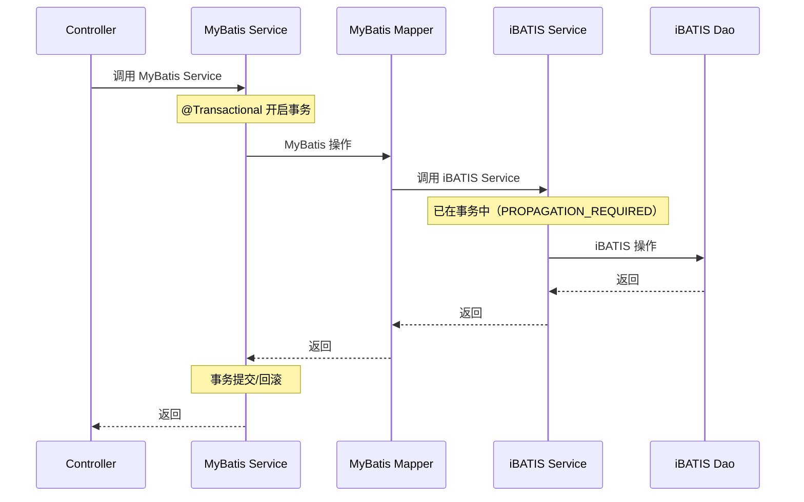

# MyBatis 与 iBATIS 共存机制文档

> 本文档详细分析 PMS-springmvc 模块中 MyBatis 与 iBATIS（遗留）两种 ORM 框架的共存机制。
> 配置文件：`spring-mybatis.xml`、`spring-pms.xml`、`pms-sql-map-config.xml`

---

## 1. 共存背景

PMS-springmvc 模块作为 PMS 系统的扩展模块，需要同时支持：

- **MyBatis 3.5.9**：新模块（PMS-springmvc）使用，注解驱动、灵活的 SQL 映射
- **iBATIS 2.x**：老模块（PMS-struts）遗留，通过 `SqlMapClientTemplate` 访问

两个框架共享同一主数据源和事务管理器，确保数据一致性。

---

## 2. 共存架构

```mermaid
graph TB
    subgraph 事务管理器共享
        TM[DataSourceTransactionManager]
        TM --> DS[RoutingDataSource]
    end
    
    subgraph MyBatis 新模块
        MB_SF[SqlSessionFactoryBean]
        MB_SF --> MB_MAPPER[MapperScanner<br/>com.dp.plat.**.dao]
        MB_SF --> MB_XML[**/mapping/*.xml]
        MB_TX[@Transactional 注解]
    end
    
    subgraph iBATIS 老模块
        IB_SC[SqlMapClientFactoryBean]
        IB_SC --> IB_TMPL[SqlMapClientTemplate]
        IB_TMPL --> IB_DAO[BaseDao]
        IB_DAO --> IB_XML[sql-map-config.xml]
        IB_TX[TransactionProxyFactoryBean<br/>Service + ServiceAgent]
    end
    
    DS --> MB_SF
    DS --> IB_SC
```

---

## 3. MyBatis 配置

### 3.1 SqlSessionFactory 配置

```xml
<bean id="sqlSessionFactory" class="org.mybatis.spring.SqlSessionFactoryBean">
    <property name="dataSource" ref="dataSource"/>
    <property name="mapperLocations" value="classpath*:com/dp/plat/**/mapping/*.xml"/>
    <property name="configuration">
        <bean class="org.apache.ibatis.session.Configuration">
            <property name="cacheEnabled" value="true"/>
            <property name="callSettersOnNulls" value="true"/>
            <property name="defaultExecutorType" value="SIMPLE"/>
        </bean>
    </property>
    <property name="typeHandlers">
        <array>
            <bean id="jsonTypeHandler" class="com.dp.plat.core.handlers.FastjsonTypeHandler"/>
        </array>
    </property>
</bean>
```

### 3.2 MyBatis 配置说明

| 配置项 | 值 | 说明 |
|-------|-----|------|
| `dataSource` | `dataSource` | 共享 RoutingDataSource |
| `mapperLocations` | `classpath*:com/dp/plat/**/mapping/*.xml` | 自动扫描所有模块的 mapping XML |
| `cacheEnabled` | `true` | 启用二级缓存 |
| `callSettersOnNulls` | `true` | 查询结果含 null 时仍调用 setter |
| `defaultExecutorType` | `SIMPLE` | 简单执行器 |
| `typeHandlers` | `FastjsonTypeHandler` | JSON 类型处理器 |

### 3.3 Mapper 接口扫描

```xml
<bean class="org.mybatis.spring.mapper.MapperScannerConfigurer">
    <property name="basePackage" value="com.dp.plat.**.dao"/>
    <property name="sqlSessionFactoryBeanName" value="sqlSessionFactory"/>
</bean>
```

**扫描规则**：
- 扫描 `com.dp.plat.**.dao` 包下的所有接口
- 接口自动注册为 Spring Bean
- Bean ID 为接口首字母小写的类名（如 `projectMapper`）
- 绑定 `sqlSessionFactory`

### 3.4 组件扫描与事务

```xml
<context:component-scan base-package="com.dp.plat"/>

<bean id="transactionManager"
    class="org.springframework.jdbc.datasource.DataSourceTransactionManager">
    <property name="dataSource" ref="dataSource"/>
</bean>

<tx:annotation-driven transaction-manager="transactionManager" 
    proxy-target-class="true"/>
```

---

## 4. iBATIS 配置

### 4.1 SqlMapClient 配置

iBATIS 配置通过 `spring-pms.xml` 引入，使用 `SqlMapClientFactoryBean`：

```xml
<bean id="sqlMapClient" 
    class="org.springframework.orm.ibatis.SqlMapClientFactoryBean">
    <property name="configLocation">
        <value>classpath:pms-sql-map-config.xml</value>
    </property>
    <property name="dataSource" ref="dataSource"/>
</bean>

<bean id="sqlMapClientTemplate" 
    class="org.springframework.orm.ibatis.SqlMapClientTemplate">
    <property name="sqlMapClient">
        <ref bean="sqlMapClient"/>
    </property>
</bean>
```

### 4.2 pms-sql-map-config.xml

iBATIS 主配置文件，定义全局设置和 SQL 映射文件引用：

```xml
<sqlMapConfig>
    <settings cacheModelsEnabled="true" enhancementEnabled="true"
        lazyLoadingEnabled="true" errorTracingEnabled="true"
        maxRequests="32" maxSessions="10" maxTransactions="5"
        useStatementNamespaces="false"/>
    
    <typeAlias type="com.dp.plat.util.DateTimeTypeHandler" alias="DateTimeHandler"/>
    <typeAlias type="com.dp.plat.ibatis.handler.FastjsonTypeHandler" alias="JsonTypeHandler"/>
    
    <sqlMap resource="sql-map-admin-config.xml"/>
    <sqlMap resource="sql-map-project-config.xml"/>
    <!-- 其他 sqlMap 引用 -->
</sqlMapConfig>
```

### 4.3 iBATIS 命名空间策略

| 配置文件 | `useStatementNamespaces` | SQL ID 格式 | 示例 |
|---------|-------------------------|------------|------|
| `pms-sql-map-config.xml` | `false` | 短名 | `saveProject` |
| `sqlMapConfig.xml`（数据刷新） | `true` | 命名空间前缀 | `project.saveProject` |

> **注意**：`useStatementNamespaces=false` 时，SQL ID 直接使用短名，需注意跨映射文件 ID 冲突。

---

## 5. 共存机制详解

### 5.1 数据源共享

MyBatis 和 iBATIS 共享同一个 `RoutingDataSource`：

```
RoutingDataSource (dataSource)
├── MyBatis SqlSessionFactory → 使用 dataSource
└── iBATIS SqlMapClient → 使用 dataSource
```

### 5.2 事务管理共享

两个框架共享同一个 `DataSourceTransactionManager`：

```xml
<!-- MyBatis 使用注解驱动事务 -->
<tx:annotation-driven transaction-manager="transactionManager" 
    proxy-target-class="true"/>

<!-- iBATIS 使用 TransactionProxyFactoryBean 事务代理 -->
<bean id="transactionBaseService" abstract="true"
    class="org.springframework.transaction.interceptor.TransactionProxyFactoryBean">
    <property name="transactionManager">
        <ref bean="transactionManager"/>
    </property>
    <!-- 事务属性配置 -->
</bean>
```

### 5.3 事务传播行为

| 框架 | 事务方式 | 传播行为 | 方法名前缀规则 |
|------|---------|---------|--------------|
| MyBatis | `@Transactional` 注解 | `PROPAGATION_REQUIRED`（默认） | 无限制 |
| iBATIS | `TransactionProxyFactoryBean` | `PROPAGATION_REQUIRED` | `insert*`、`update*`、`delete*`、`save*`、`add*`、`do*`、`start*`、`submit*`、`keep*`、`parse*` |

### 5.4 跨框架事务

当 MyBatis Service 调用 iBATIS Service（或反之）时：



> **重要**：由于共享同一事务管理器和数据源，MyBatis 和 iBATIS 操作在同一事务中执行，保证数据一致性。

---

## 6. JSON 类型处理器共享

两个框架都需要处理 JSON 类型字段，共用 `FastjsonTypeHandler`：

### 6.1 MyBatis 类型处理器

```xml
<property name="typeHandlers">
    <array>
        <bean id="jsonTypeHandler" 
            class="com.dp.plat.core.handlers.FastjsonTypeHandler"/>
    </array>
</property>
```

### 6.2 iBATIS 类型处理器

```xml
<typeAlias type="com.dp.plat.ibatis.handler.FastjsonTypeHandler" 
    alias="JsonTypeHandler"/>
```

### 6.3 类型处理器实现

`FastjsonTypeHandler` 位于 `com.dp.plat.core.handlers` 包，使用 Fastjson 进行 JSON 序列化/反序列化：

| 处理器类 | 框架 | 功能 |
|---------|------|------|
| `FastjsonTypeHandler` | MyBatis + iBATIS | JSON 字段处理（Fastjson） |
| `JacksonTypeHandler` | MyBatis | JSON 字段处理（Jackson，未启用） |
| `Object2StringTypeHandler` | MyBatis | 对象转字符串（未启用） |
| `AbstractJsonTypeHandler` | MyBatis | JSON 处理器基类 |

---

## 7. Mapper XML 文件位置

### 7.1 MyBatis Mapper XML

位于 Java 包目录下（与 Mapper 接口同目录）：

```
src/main/java/com/dp/plat/
├── pms/springmvc/mapping/
│   ├── ProjectMapper.xml
│   ├── DispatchProjectMapper.xml
│   ├── DispatchSettlementMapper.xml
│   ├── IndustryAssetMapper.xml
│   └── ...（20 个 Mapper XML）
├── ehr/mapping/
│   ├── EmployeeMapper.xml
│   ├── DepartmentMapper.xml
│   └── ...（8 个 Mapper XML）
└── activiti/unifytask/mapping/
    └── ...（统一任务相关）
```

**扫描路径**：`classpath*:com/dp/plat/**/mapping/*.xml`

### 7.2 iBATIS SQL Map XML

位于 `config-ibaits/` 目录（父模块 PMS-struts）：

```
config-ibaits/
├── sql-map-config.xml          # 主配置
├── sql-map-admin-config.xml    # 系统管理
├── sql-map-project-config.xml  # 项目管理
├── sql-map-work-config.xml     # 工作流
└── ...（14 个 SQL Map XML）
```

---

## 8. DAO 层差异

### 8.1 MyBatis DAO（Mapper 接口）

```java
public interface ProjectMapper {
    int insert(Project record);
    Project selectByPrimaryKey(Integer id);
    int updateByPrimaryKeySelective(Project record);
    List<Project> selectBySelectivePageable(PageParam<?> pageParam);
}
```

**特点**：
- 接口自动实现，无需编写实现类
- SQL 在 XML 映射文件中定义
- 通过 `MapperScannerConfigurer` 自动注册为 Bean

### 8.2 iBATIS DAO（实现类）

```java
public class ProjectDaoImpl extends BaseDao {
    public Project getProjectById(int id) {
        return (Project) getSqlMapClientTemplate()
            .queryForObject("getProject", id);
    }
}
```

**特点**：
- 需要编写实现类，继承 `BaseDao`
- SQL ID 直接引用（`useStatementNamespaces=false`）
- 通过 XML 显式配置 Bean

---

## 9. Service 层差异

### 9.1 MyBatis Service（注解驱动）

```java
@Service
public class ProjectService implements IProjectService {
    @Autowired
    private ProjectMapper projectMapper;
    
    @Transactional
    public int insertSelective(Project project) {
        return projectMapper.insertSelective(project);
    }
}
```

**特点**：
- `@Service` 注解自动注册
- `@Autowired` 注入 Mapper
- `@Transactional` 注解驱动事务

### 9.2 iBATIS Service（XML 配置 + 事务代理）

```xml
<!-- 真实 Service -->
<bean id="projectService" class="com.dp.plat.service.ProjectServiceImpl"
    parent="baseServce">
    <property name="projectDao" ref="projectDao"/>
</bean>

<!-- 事务代理 -->
<bean id="projectServiceAgent" parent="transactionBaseService">
    <property name="target" ref="projectService"/>
</bean>
```

**特点**：
- XML 显式配置 Bean
- Service + ServiceAgent 双 Bean 模式
- 事务通过方法名前缀匹配

---

## 10. 迁移建议

### 10.1 iBATIS → MyBatis 迁移路径

| 步骤 | 内容 | 说明 |
|------|------|------|
| 1 | 创建 MyBatis Mapper 接口 | 与 iBATIS DAO 方法对应 |
| 2 | 创建 MyBatis Mapper XML | 转换 iBATIS SQL Map 语法 |
| 3 | 创建 MyBatis Service | 使用 `@Service` + `@Transactional` |
| 4 | 修改 Controller 注入 | 从 `*ServiceAgent` 改为 `I*Service` |
| 5 | 删除 iBATIS DAO 和 Service 配置 | 清理 XML Bean 定义 |

### 10.2 SQL 语法转换

| iBATIS 语法 | MyBatis 语法 |
|------------|-------------|
| `<isNotEmpty property="name">` | `<if test="name != null and name != ''">` |
| `<isEqual property="type" compareValue="1">` | `<if test="type == 1">` |
| `#name#` | `#{name}` |
| `$name$` | `${name}` |
| `<iterate property="ids">` | `<foreach collection="ids">` |

---

## 附录：共存配置速查

| 配置项 | MyBatis | iBATIS |
|--------|---------|--------|
| Session 工厂 | `SqlSessionFactoryBean` | `SqlMapClientFactoryBean` |
| 模板类 | 无（Mapper 接口） | `SqlMapClientTemplate` |
| Mapper 扫描 | `MapperScannerConfigurer` | XML 显式配置 |
| 事务管理 | `@Transactional` | `TransactionProxyFactoryBean` |
| XML 位置 | `**/mapping/*.xml` | `config-ibaits/*.xml` |
| 命名空间 | `namespace` 属性 | `useStatementNamespaces` |
