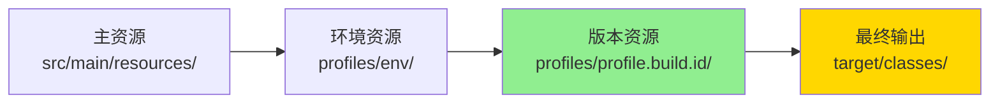

# Profile 机制文档

> 本文档详细分析 PMS-springmvc 模块的 Maven Profile 机制，包括 pms2/pms3/dev/test/release 各环境的差异与资源覆盖策略。
> 配置位置：`pom.xml`、`src/main/resources/profiles/`

---

## 1. Profile 概述

PMS-springmvc 模块通过 Maven Profile 实现多环境构建，采用**二维 Profile 矩阵**：

- **环境维度**（`env`）：`dev`（开发）、`test`（测试）、`release`（生产）
- **版本维度**（`profile.build.id`）：`pms2`（PMS2 版本）、`pms3`（PMS3 版本）

两个维度相互独立，构建时各激活一个 Profile，资源文件按优先级覆盖。

---

## 2. Profile 定义

### 2.1 环境维度 Profile

| Profile ID | 变量 | 默认激活 | 用途 |
|-----------|------|---------|------|
| `dev` | `env=dev` | ✅ 是 | 本地开发环境 |
| `test` | `env=test` | ❌ 否 | 测试环境 |
| `release` | `env=release` | ❌ 否 | 生产环境 |

### 2.2 版本维度 Profile

| Profile ID | 变量 | 默认激活 | 用途 |
|-----------|------|---------|------|
| `pms2` | `profile.build.id=pms2`、`profile.build.name=PMS2` | ✅ 是 | PMS2 版本构建 |
| `pms3` | `profile.build.id=pms3`、`profile.build.name=AFPMS3` | ❌ 否 | PMS3 版本构建 |

### 2.3 Profile 组合示例

| 构建命令 | 环境 | 版本 | 输出 WAR |
|---------|------|------|---------|
| `mvn clean package` | dev | pms2 | `PMS2.war` |
| `mvn clean package -P dev,pms3` | dev | pms3 | `AFPMS3.war` |
| `mvn clean package -P test,pms2` | test | pms2 | `PMS2.war` |
| `mvn clean package -P release,pms3` | release | pms3 | `AFPMS3.war` |

---

## 3. 资源覆盖机制

### 3.1 资源目录配置

```xml
<build>
    <finalName>${profile.build.name}</finalName>
    <resources>
        <!-- 1. 主资源目录（排除 profiles/） -->
        <resource>
            <directory>src/main/resources/</directory>
            <excludes>
                <exclude>profiles/**</exclude>
            </excludes>
        </resource>
        <!-- 2. 环境维度资源（dev/test/release） -->
        <resource>
            <directory>src/main/resources/profiles/${env}/</directory>
        </resource>
        <!-- 3. 版本维度资源（pms2/pms3） -->
        <resource>
            <directory>src/main/resources/profiles/${profile.build.id}/</directory>
        </resource>
    </resources>
</build>
```

### 3.2 资源加载优先级



> **覆盖规则**：版本维度资源（pms2/pms3）优先级最高，会覆盖环境维度资源和主资源中的同名文件。`maven.resources.overwrite=true` 确保覆盖生效。

### 3.3 资源目录结构

```
src/main/resources/
├── profiles/
│   ├── dev/                    # 开发环境
│   │   ├── jdbc.properties
│   │   ├── jdbc_dev.properties
│   │   └── spring.xml
│   ├── test/                   # 测试环境
│   │   ├── jdbc.properties
│   │   ├── jdbc_test.properties
│   │   └── spring.xml
│   ├── release/                # 生产环境
│   │   ├── jdbc.properties
│   │   ├── jdbc_release.properties
│   │   ├── quartz-job.xml
│   │   └── spring.xml
│   ├── pms2/                   # PMS2 版本
│   │   ├── config.properties
│   │   └── system.properties
│   └── pms3/                   # PMS3 版本
│       ├── config.properties
│       ├── quartz-job.xml
│       ├── spring.xml
│       └── system.properties
├── spring.xml                  # 主配置（默认）
├── spring-mvc.xml
├── spring-mybatis.xml
└── ... 其他配置
```

---

## 4. 各 Profile 资源差异

### 4.1 环境维度差异（dev/test/release）

| 配置文件 | dev | test | release | 说明 |
|---------|-----|------|---------|------|
| `jdbc.properties` | 本地 MySQL | 测试 MySQL | 生产 MySQL | 数据源连接信息 |
| `jdbc_dev.properties` | ✅ | ❌ | ❌ | 开发环境扩展配置 |
| `jdbc_test.properties` | ❌ | ✅ | ❌ | 测试环境扩展配置 |
| `jdbc_release.properties` | ❌ | ❌ | ✅ | 生产环境扩展配置 |
| `spring.xml` | ✅ | ✅ | ✅ | 数据源 Bean 配置（连接地址不同） |
| `quartz-job.xml` | ❌ | ❌ | ✅ | 定时任务（仅生产启用） |

### 4.2 版本维度差异（pms2/pms3）

| 配置文件 | pms2 | pms3 | 说明 |
|---------|------|------|------|
| `config.properties` | ✅ | ✅ | 业务配置（内容不同） |
| `system.properties` | ✅ | ✅ | 系统参数（内容不同） |
| `spring.xml` | ❌ | ✅ | PMS3 覆盖数据源配置 |
| `quartz-job.xml` | ❌ | ✅ | PMS3 定时任务配置 |

### 4.3 PMS2 vs PMS3 主要差异

| 差异点 | PMS2 | PMS3 |
|--------|------|------|
| WAR 名称 | `PMS2.war` | `AFPMS3.war` |
| 数据源数量 | 基础数据源 | 增加 CRM 数据源 |
| 定时任务 | 默认不启用 | 启用完整定时任务 |
| 业务功能 | 基础项目管理 | 扩展行业资产、转包结算 |

---

## 5. spring.xml 差异分析

### 5.1 dev/test/release 的 spring.xml 差异

各环境的 `spring.xml` 主要差异在数据源连接信息（通过 `jdbc.properties` 注入）：

```xml
<bean id="dataSourceLocal" class="com.alibaba.druid.pool.DruidDataSource">
    <property name="url" value="${jdbc.url}"/>
    <property name="username" value="${jdbc.username}"/>
    <property name="password" value="${jdbc.password}"/>
</bean>
```

### 5.2 pms3 的 spring.xml 差异

PMS3 版本的 `spring.xml` 相比主配置增加了 `dataSourceCRM` 数据源：

```xml
<!-- PMS3 新增 CRM 数据源 -->
<bean id="dataSourceCRM" class="com.alibaba.druid.pool.DruidDataSource">
    <property name="driverClassName" value="${crm.database.driverClassName}"/>
    <property name="url" value="${crm.database.url}"/>
    <property name="username" value="${crm.database.username}"/>
    <property name="password" value="${crm.database.password}"/>
</bean>

<!-- RoutingDataSource 增加 CRM 路由 -->
<bean id="dataSource" class="com.dp.plat.core.config.RoutingDataSource">
    <property name="targetDataSources">
        <map>
            <entry key="${jdbc.key1}" value-ref="dataSourceLocal"/>
            <entry key="${jdbc.key2}" value-ref="dataSourcePMS"/>
            <entry key="${jdbc.key3}" value-ref="dataSourceSMS"/>
            <entry key="${jdbc.key4}" value-ref="dataSourceEHR"/>
            <entry key="${jdbc.key5}" value-ref="dataSourceD365"/>
            <entry key="${jdbc.key6}" value-ref="dataSourceCRM"/>
        </map>
    </property>
</bean>
```

---

## 6. quartz-job.xml 差异分析

### 6.1 主配置（默认）

主配置的 `quartz-job.xml` 中 `startQuartz` 的 triggers 列表为空（所有触发器被注释）：

```xml
<bean id="startQuartz" lazy-init="false" autowire="no"
    class="org.springframework.scheduling.quartz.SchedulerFactoryBean">
    <property name="triggers">
        <list>
            <!-- 所有触发器被注释，不启用定时任务 -->
        </list>
    </property>
</bean>
```

### 6.2 release/pms3 配置

`release` 和 `pms3` 环境的 `quartz-job.xml` 启用定时任务触发器：

```xml
<bean id="startQuartz" lazy-init="false" autowire="no"
    class="org.springframework.scheduling.quartz.SchedulerFactoryBean">
    <property name="triggers">
        <list>
            <ref bean="smsDataTrigger"/>
            <ref bean="sseDispatchPaymentTrigger"/>
            <ref bean="ehrDataTrigger"/>
            <ref bean="d365DataTrigger"/>
            <ref bean="dispatchSettlementInvoiceToFPTrigger"/>
            <ref bean="mailTrigger"/>
        </list>
    </property>
</bean>
```

---

## 7. 构建命令参考

### 7.1 常用构建命令

```bash
# 本地开发（默认 dev + pms2）
mvn clean package

# 本地开发 + PMS3
mvn clean package -P dev,pms3

# 测试环境 + PMS2
mvn clean package -P test,pms2

# 生产环境 + PMS3
mvn clean package -P release,pms3

# 单独构建（跳过测试）
mvn clean package -P release,pms3 -DskipTests
```

### 7.2 构建产物

| 构建命令 | 产物 | 说明 |
|---------|------|------|
| `-P pms2` | `PMS2.war` | PMS2 版本 WAR |
| `-P pms3` | `AFPMS3.war` | PMS3 版本 WAR |
| - | `PMS2-core.jar` | Spring MVC 核心 JAR（classifier=core） |
| - | `PMS2-sources.jar` | 源码 JAR |

---

## 8. Profile 激活机制

### 8.1 默认激活

```xml
<activation>
    <activeByDefault>true</activeByDefault>
</activation>
```

- `dev` 和 `pms2` 默认激活
- 执行 `mvn package` 时自动使用 dev + pms2

### 8.2 命令行激活

```bash
mvn package -P test,pms3
```

- `-P` 参数指定激活的 Profile
- 多个 Profile 用逗号分隔
- 命令行指定的 Profile 会覆盖默认激活

### 8.3 Profile 互斥

虽然 `dev`/`test`/`release` 和 `pms2`/`pms3` 在配置上不互斥，但实际使用时应各选一个：

| 维度 | 可选值 | 说明 |
|------|--------|------|
| 环境 | dev / test / release | 三选一 |
| 版本 | pms2 / pms3 | 二选一 |

---

## 9. 配置属性传递

### 9.1 Maven 属性 → Spring 配置

Maven Profile 定义的属性通过资源过滤传递到 Spring 配置：

```
pom.xml (profile.build.id=pms3)
    ↓
src/main/resources/profiles/pms3/spring.xml
    ↓
target/classes/spring.xml (覆盖主配置)
    ↓
Spring 容器加载
```

### 9.2 属性占位符

Spring 配置使用 `${}` 占位符读取 `jdbc.properties` 等属性文件：

```xml
<bean id="propertyConfigurer"
    class="org.springframework.beans.factory.config.PropertyPlaceholderConfigurer">
    <property name="locations">
        <list>
            <value>classpath:jdbc.properties</value>
            <value>classpath:spring-cas.properties</value>
            <value>classpath:engine.properties</value>
        </list>
    </property>
</bean>
```

---

## 10. Profile 最佳实践

### 10.1 新增环境配置

1. 在 `src/main/resources/profiles/` 下创建新环境目录（如 `staging/`）
2. 在 `pom.xml` 中添加对应 Profile：
   ```xml
   <profile>
       <id>staging</id>
       <properties>
           <env>staging</env>
       </properties>
   </profile>
   ```
3. 在新目录下放置环境特定的配置文件

### 10.2 配置覆盖注意事项

- 同名文件会被覆盖，注意版本维度覆盖环境维度
- `maven.resources.overwrite=true` 确保覆盖生效
- 新增配置文件需在主资源目录保留默认版本

---

## 附录：Profile 配置速查表

| 场景 | 命令 | 输出 |
|------|------|------|
| 本地开发 | `mvn package` | PMS2.war (dev) |
| 本地开发 PMS3 | `mvn package -P dev,pms3` | AFPMS3.war (dev) |
| 测试环境 | `mvn package -P test,pms2` | PMS2.war (test) |
| 生产环境 | `mvn package -P release,pms3` | AFPMS3.war (release) |
| 单元测试 | `mvn test` | 不打包，仅运行测试 |
