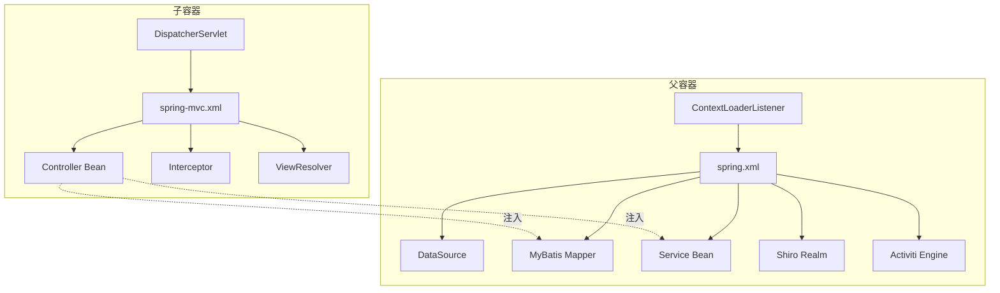
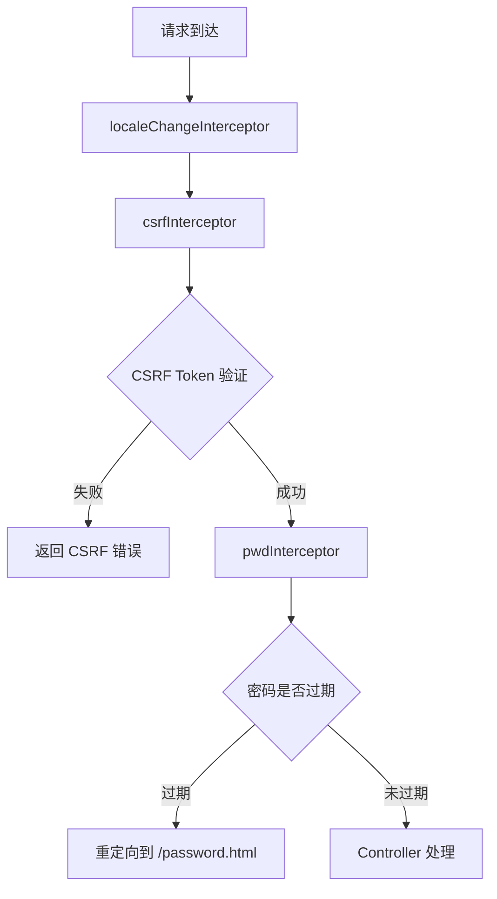

# Spring MVC 配置架构文档

> 本文档详细分析 PMS-springmvc 模块的 Spring MVC 配置体系，包括 DispatcherServlet、视图解析器、拦截器、异常处理等核心组件。
> 配置文件：`src/main/resources/spring-mvc.xml`

---

## 1. 配置文件加载链

PMS-springmvc 模块采用 Spring XML 配置的分层结构，由 `spring.xml` 作为根配置入口，通过 `<import>` 逐层导入各功能模块配置。

### 1.1 配置文件导入关系

```
spring.xml (根配置入口)
│
├── spring-pms.xml              # PMS 老系统配置
├── spring-mybatis.xml          # MyBatis 整合配置
├── spring-shiro.xml            # Shiro 安全配置
├── spring-activiti.xml         # Activiti 工作流配置
└── quartz-job.xml              # Quartz 定时任务配置

spring-mvc.xml (Spring MVC 配置，独立加载)
│
├── 组件扫描 (com.dp.plat)
├── 注解驱动 (mvc:annotation-driven)
├── 视图解析器 (ContentNegotiatingViewResolver)
├── 拦截器 (locale/csrf/pwd)
├── 文件上传 (CommonsMultipartResolver)
└── Shiro 注解支持
```

### 1.2 各配置文件职责

| 配置文件 | 职责 | 关键内容 |
|---------|------|---------|
| `spring.xml` | 根配置，数据源与导入 | PropertyPlaceholder、Druid 数据源、RoutingDataSource、import 链 |
| `spring-mvc.xml` | Spring MVC 表现层 | 组件扫描、注解驱动、视图解析、拦截器、文件上传 |
| `spring-mybatis.xml` | MyBatis 持久层 | SqlSessionFactory、MapperScanner、事务管理 |
| `spring-pms.xml` | PMS 老系统集成 | 老系统 Bean、iBATIS 兼容 |
| `spring-activiti.xml` | 工作流引擎 | ProcessEngine、流程服务、任务监听器 |
| `spring-shiro.xml` | 安全框架 | Shiro Filter Chain、Realm、Session 管理 |
| `quartz-job.xml` | 定时任务 | SchedulerFactoryBean、CronTrigger |

### 1.3 加载顺序说明

Spring 容器启动时按以下顺序加载：

1. **ContextLoaderListener** 加载 `spring.xml`（父容器）
   - PropertyPlaceholderConfigurer 加载 `jdbc.properties`、`spring-cas.properties`、`engine.properties`
   - 配置 Druid 数据源（dataSourceLocal、dataSourceEHR、dataSourceD365、dataSourceCRM）
   - 配置 RoutingDataSource 动态数据源路由
   - 导入 spring-pms.xml、spring-mybatis.xml、spring-shiro.xml、spring-activiti.xml、quartz-job.xml
2. **DispatcherServlet** 加载 `spring-mvc.xml`（子容器）
   - 子容器可访问父容器的 Bean（Service、DAO），但父容器不能访问子容器的 Bean（Controller）

> **注意**：Spring MVC 的父子容器机制要求 Controller 注入的 Service 必须在父容器中定义。`spring-mvc.xml` 中的 `<context:component-scan base-package="com.dp.plat">` 会扫描所有包，但为避免重复注册，使用 `exclude-filter` 排除了部分类。

---

## 2. DispatcherServlet 配置

PMS-springmvc 模块本身不包含 `web.xml`（继承自 `pms-mvc-core` war overlay），DispatcherServlet 在父模块中配置。

### 2.1 DispatcherServlet 行为

| 配置项 | 值 | 说明 |
|-------|-----|------|
| Servlet 名称 | `springMvc`（父模块定义） | DispatcherServlet 实例名 |
| 配置文件 | `classpath:spring-mvc.xml` | Spring MVC 配置位置 |
| URL 模式 | `/` | 拦截所有请求 |
| 启动加载 | `load-on-startup=1` | 容器启动时初始化 |

### 2.2 父子容器关系



---

## 3. 组件扫描配置

### 3.1 扫描规则

```xml
<context:component-scan base-package="com.dp.plat">
    <context:exclude-filter type="assignable" 
        expression="com.dp.plat.activiti.controller.*" />
    <context:exclude-filter type="custom" 
        expression="com.dp.plat.pms.filter.ExcludeAdminControllerTypeFilter" />
</context:component-scan>
```

### 3.2 扫描排除规则

| 排除类型 | 表达式 | 说明 |
|---------|--------|------|
| `assignable` | `com.dp.plat.activiti.controller.*` | 排除 Activiti 控制器（由 PMS-activiti 模块单独管理） |
| `custom` | `ExcludeAdminControllerTypeFilter` | 自定义过滤器，排除管理员控制器类型 |

### 3.3 自定义类型过滤器

`ExcludeAdminControllerTypeFilter` 位于 `com.dp.plat.pms.filter` 包，用于在组件扫描时排除特定的管理员控制器类型，避免与父模块的 Admin 控制器冲突。

---

## 4. 注解驱动配置

### 4.1 mvc:annotation-driven

```xml
<mvc:annotation-driven enable-matrix-variables="true" 
    conversion-service="conversionService">
    <mvc:message-converters>
        <ref bean="mappingJacksonHttpMessageConverter" />
    </mvc:message-converters>
    <mvc:path-matching suffix-pattern="true"/>
</mvc:annotation-driven>
```

### 4.2 配置项说明

| 配置项 | 值 | 说明 |
|-------|-----|------|
| `enable-matrix-variables` | `true` | 启用矩阵变量支持（如 `/path;key=value`） |
| `conversion-service` | `conversionService` | 自定义类型转换服务 |
| `suffix-pattern` | `true` | 启用后缀模式匹配（如 `/user.json` 匹配 `/user`） |

### 4.3 自定义类型转换器

```xml
<bean id="dateConvert" class="com.dp.plat.core.converter.DateConverter"/>

<bean id="conversionService" 
    class="org.springframework.context.support.ConversionServiceFactoryBean">
    <property name="converters">
        <set>
            <ref bean="dateConvert"/>
            <bean class="com.dp.plat.core.converter.DecimalConverter"/>
        </set>
    </property>
</bean>
```

| 转换器 | 类 | 功能 |
|--------|-----|------|
| `DateConverter` | `com.dp.plat.core.converter.DateConverter` | 日期格式转换（支持多种日期格式） |
| `DecimalConverter` | `com.dp.plat.core.converter.DecimalConverter` | 货币/小数格式转换 |

### 4.4 JSON 消息转换器

```xml
<bean id="mappingJacksonHttpMessageConverter"
    class="org.springframework.http.converter.json.MappingJackson2HttpMessageConverter">
    <property name="supportedMediaTypes">
        <list>
            <value>text/html;charset=UTF-8</value>
        </list>
    </property>
</bean>
```

> **作用**：避免 IE 执行 AJAX 请求时返回 JSON 出现下载文件问题，强制 JSON 响应使用 `text/html;charset=UTF-8` 内容类型。

---

## 5. 视图解析器配置

PMS-springmvc 采用 `ContentNegotiatingViewResolver` 作为主视图解析器，支持根据请求后缀或参数返回不同类型的视图（HTML、JSON、Excel）。

### 5.1 内容协商管理器

```xml
<bean id="contentNegotiationManager" 
    class="org.springframework.web.accept.ContentNegotiationManagerFactoryBean">
    <property name="defaultContentType" value="text/html" />
    <property name="ignoreAcceptHeader" value="true" />
    <property name="favorPathExtension" value="true" />
    <property name="favorParameter" value="true" />
    <property name="parameterName" value="type" />
    <property name="mediaTypes">
        <map>
            <entry key="html" value="text/html" />
            <entry key="json" value="application/json" />
            <entry key="excel" value="application/vnd.openxmlformats-officedocument.spreadsheetml.sheet"/>
        </map>
    </property>
</bean>
```

### 5.2 内容协商策略

| 策略 | 配置 | 说明 |
|------|------|------|
| 默认内容类型 | `text/html` | 无指定时返回 HTML |
| 忽略 Accept 头 | `true` | 不根据 Accept 头判断 |
| 路径扩展名 | `true` | 根据URL后缀判断（`.json`、`.html`、`.excel`） |
| 请求参数 | `true` | 根据参数判断（`?type=json`） |
| 参数名 | `type` | 指定类型参数名 |

### 5.3 视图解析器链

```xml
<bean class="org.springframework.web.servlet.view.ContentNegotiatingViewResolver">
    <property name="order" value="1" />
    <property name="contentNegotiationManager" ref="contentNegotiationManager"/>
    <property name="viewResolvers">
        <list>
            <bean class="org.springframework.web.servlet.view.BeanNameViewResolver" />
            <bean class="org.springframework.web.servlet.view.InternalResourceViewResolver">
                <property name="prefix" value="/WEB-INF/jsp/" />
                <property name="suffix" value=".jsp" />
            </bean>
        </list>
    </property>
    <property name="defaultViews">
        <list>
            <bean class="org.springframework.web.servlet.view.json.MappingJackson2JsonView" />
            <bean class="com.dp.plat.core.view.ExcelView"/>
            <bean class="com.dp.plat.core.view.ExcelView4XLSX"/>
        </list>
    </property>
</bean>
```

### 5.4 视图解析流程

```mermaid
flowchart TD
    A[HTTP 请求] --> B{请求后缀/参数}
    B -->|.json| C[MappingJackson2JsonView]
    B -->|.excel| D[ExcelView4XLSX]
    B -->|.html 或无后缀| E[InternalResourceViewResolver]
    E --> F[/WEB-INF/jsp/{viewName}.jsp]
    C --> G[返回 JSON]
    D --> H[返回 Excel 文件]
    F --> I[渲染 JSP 页面]
```

### 5.5 视图解析器说明

| 视图解析器 | 顺序 | 功能 |
|-----------|------|------|
| `ContentNegotiatingViewResolver` | 1 | 主解析器，根据内容类型委托给具体解析器 |
| `BeanNameViewResolver` | - | 根据 Bean 名称查找视图（用于自定义 Excel 视图） |
| `InternalResourceViewResolver` | - | JSP 视图解析，前缀 `/WEB-INF/jsp/`，后缀 `.jsp` |

### 5.6 默认视图

| 视图类 | 用途 |
|--------|------|
| `MappingJackson2JsonView` | JSON 响应视图 |
| `ExcelView` | Excel 2003（.xls）导出视图 |
| `ExcelView4XLSX` | Excel 2007+（.xlsx）导出视图 |

---

## 6. 拦截器配置

### 6.1 拦截器链

```xml
<mvc:interceptors>
    <!-- 国际化拦截器 -->
    <mvc:interceptor>
        <mvc:mapping path="/**"/>
        <bean id="localeChangeInterceptor"
            class="org.springframework.web.servlet.i18n.LocaleChangeInterceptor">
            <property name="paramName" value="lang" />
        </bean>
    </mvc:interceptor>
    
    <!-- CSRF 拦截器 -->
    <mvc:interceptor>
        <mvc:mapping path="/**"/>
        <mvc:exclude-mapping path="/sys/login.json"/>
        <bean id="csrfInterceptor" class="com.dp.plat.security.csrf.CsrfInterceptor"/>
    </mvc:interceptor>
    
    <!-- 密码拦截器 -->
    <mvc:interceptor>
        <mvc:mapping path="/**"/>
        <mvc:exclude-mapping path="/password.*"/>
        <mvc:exclude-mapping path="/modifyPassword.*"/>
        <bean id="pwdInterceptor" class="com.dp.plat.core.interceptor.PasswordInterceptor">
            <property name="redirect" value="/password.html?needChangePwd=true" />
        </bean>
    </mvc:interceptor>
</mvc:interceptors>
```

### 6.2 拦截器说明

| 拦截器 | 类 | 拦截路径 | 排除路径 | 功能 |
|--------|-----|---------|---------|------|
| `localeChangeInterceptor` | `LocaleChangeInterceptor` | `/**` | 无 | 通过 `?lang=xx` 参数切换语言 |
| `csrfInterceptor` | `CsrfInterceptor` | `/**` | `/sys/login.json` | CSRF Token 验证 |
| `pwdInterceptor` | `PasswordInterceptor` | `/**` | `/password.*`、`/modifyPassword.*` | 密码过期检查，强制修改密码 |

### 6.3 拦截器执行顺序



---

## 7. 异常处理

### 7.1 全局异常处理器

```xml
<bean id="exceptionHandler" 
    class="com.dp.plat.core.exception.exceptionHandler.ExceptionHandler"/>
```

### 7.2 异常处理机制

`ExceptionHandler` 实现 `HandlerExceptionResolver` 接口，统一处理 Controller 抛出的异常：

| 异常类型 | 处理方式 |
|---------|---------|
| `ActivitiObjectNotFoundException` | 返回"此任务不存在，请联系管理员！" |
| `ActivitiException` | 提取错误信息返回 |
| `BusinessException` | 返回业务错误信息 |
| `Exception` | 记录日志并返回"操作失败，请联系管理员！" |

### 7.3 异常记录

`ExceptionHandler.insertException(e)` 方法将异常信息持久化到数据库，返回错误 ID，便于问题追踪。

---

## 8. 文件上传配置

### 8.1 CommonsMultipartResolver

```xml
<bean id="multipartResolver"
    class="org.springframework.web.multipart.commons.CommonsMultipartResolver">
    <property name="defaultEncoding" value="utf-8" />
    <property name="maxUploadSize" value="10485760000" />
    <property name="maxInMemorySize" value="40960" />
</bean>
```

### 8.2 配置参数

| 参数 | 值 | 说明 |
|------|-----|------|
| `defaultEncoding` | `utf-8` | 默认编码 |
| `maxUploadSize` | `10485760000`（约 10GB） | 最大上传文件大小 |
| `maxInMemorySize` | `40960`（40KB） | 内存中最大缓冲区大小 |

---

## 9. Shiro 注解支持

### 9.1 启用 Shiro 注解

```xml
<bean class="org.springframework.aop.framework.autoproxy.DefaultAdvisorAutoProxyCreator"/>

<bean class="org.apache.shiro.spring.security.interceptor.AuthorizationAttributeSourceAdvisor">
    <property name="securityManager" ref="securityManager"/>
</bean>

<context:annotation-config />
```

### 9.2 支持的注解

| 注解 | 功能 |
|------|------|
| `@RequiresRoles("admin")` | 要求用户具有指定角色 |
| `@RequiresPermissions("project:edit")` | 要求用户具有指定权限 |
| `@RequiresAuthentication` | 要求用户已认证 |
| `@RequiresUser` | 要求用户已登录 |

---

## 10. AOP 配置

```xml
<aop:aspectj-autoproxy/>
```

启用 AspectJ 自动代理，支持 `@Aspect` 注解风格的切面。PMS-springmvc 模块定义了两个切面：

| 切面类 | 功能 |
|--------|------|
| `DispatchSettlementUpdateAspect` | 发运结算更新切面（发票同步、金额计算） |
| `ProjectManagementAspect` | 项目管理切面（权限校验、日志记录） |

---

## 11. 国际化配置

```xml
<bean id="messageSource"
    class="org.springframework.context.support.ReloadableResourceBundleMessageSource">
    <property name="basename" value="classpath:messages" />
</bean>
```

- 资源文件：`src/main/resources/messages_zh_CN.properties`
- 默认语言：中文（zh_CN）
- 通过 `?lang=en` 参数切换语言

---

## 12. 静态资源处理

```xml
<mvc:default-servlet-handler />
```

启用默认 Servlet 处理静态资源，由容器的默认 Servlet 处理 `/js/**`、`/css/**`、`/images/**` 等静态资源请求。

---

## 附录：配置文件清单

| 配置文件 | 位置 | 用途 |
|---------|------|------|
| `spring.xml` | `src/main/resources/` | 根配置 |
| `spring-mvc.xml` | `src/main/resources/` | Spring MVC 配置 |
| `spring-mybatis.xml` | `src/main/resources/` | MyBatis 配置 |
| `spring-pms.xml` | `src/main/resources/` | PMS 老系统集成 |
| `spring-activiti.xml` | `src/main/resources/` | Activiti 配置 |
| `spring-shiro-cas.xml` | `src/main/resources/` | Shiro + CAS 配置 |
| `quartz-job.xml` | `src/main/resources/` | 定时任务配置 |
| `jdbc.properties` | `src/main/resources/profiles/{env}/` | 数据源配置 |
| `system.properties` | `src/main/resources/profiles/{env}/` | 系统参数 |
| `config.properties` | `src/main/resources/profiles/{env}/` | 业务配置 |
| `logback.xml` | `src/main/resources/` | 日志配置 |
| `ehcache.xml` | `src/main/resources/` | 缓存配置 |
