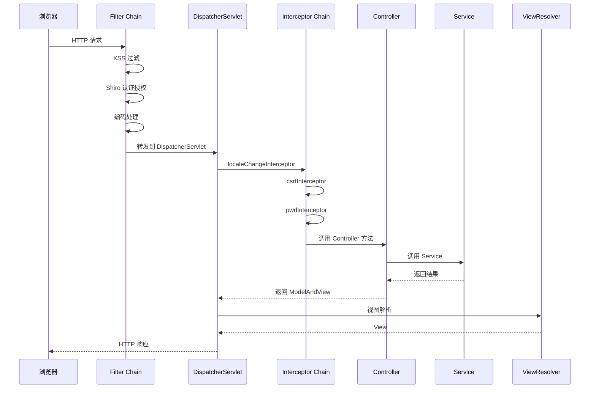
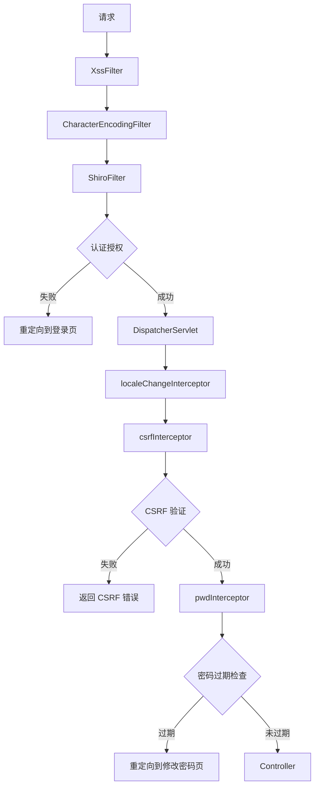

# Web 过滤器与 Servlet 文档

> 本文档详细分析 PMS-springmvc 模块的 Web 层过滤器与 Servlet 配置。
> 注意：PMS-springmvc 模块本身不包含 `web.xml`，Web 配置继承自父模块 `pms-mvc-core`（war overlay）。

---

## 1. Web 配置概述

PMS-springmvc 作为 WAR 包，其 `web.xml` 由父模块 `pms-mvc-core` 提供，通过 Maven war overlay 机制合并。本模块通过以下方式扩展 Web 配置：

- **自定义过滤器**：`com.dp.plat.pms.filter` 包下的过滤器类
- **Spring MVC 拦截器**：在 `spring-mvc.xml` 中配置
- **Servlet 监听器**：通过 `@PostConstruct` 初始化

---

## 2. Servlet 配置

### 2.1 DispatcherServlet

| 配置项 | 值 | 说明 |
|-------|-----|------|
| Servlet 名称 | `springMvc` | DispatcherServlet 实例名 |
| 配置文件 | `classpath:spring-mvc.xml` | Spring MVC 配置位置 |
| URL 模式 | `/` | 拦截所有请求 |
| 启动加载 | `load-on-startup=1` | 容器启动时初始化 |

### 2.2 请求处理流程



---

## 3. 自定义过滤器

### 3.1 过滤器清单

PMS-springmvc 模块在 `com.dp.plat.pms.filter` 包下定义了两个过滤器：

| 过滤器类 | 功能 | 使用方式 |
|---------|------|---------|
| `ExcludeAdminControllerTypeFilter` | 排除管理员控制器类型 | Spring 组件扫描过滤器（非 Servlet Filter） |
| `UserCheckFilter` | 用户检查过滤 | Servlet Filter |

### 3.2 ExcludeAdminControllerTypeFilter

> **注意**：此类实现 `org.springframework.core.type.filter.TypeFilter` 接口，用于 Spring 组件扫描时过滤类型，**不是 Servlet Filter**。

**功能**：在 Spring 组件扫描时排除特定的管理员控制器类型，避免与父模块的 Admin 控制器冲突。

**配置位置**：`spring-mvc.xml`

```xml
<context:component-scan base-package="com.dp.plat">
    <context:exclude-filter type="custom" 
        expression="com.dp.plat.pms.filter.ExcludeAdminControllerTypeFilter"/>
</context:component-scan>
```

**工作机制**：
1. Spring 扫描 `com.dp.plat` 包下的所有类
2. 对每个候选类调用 `ExcludeAdminControllerTypeFilter.match()`
3. 匹配的类被排除，不注册为 Spring Bean

### 3.3 UserCheckFilter

**功能**：Servlet 过滤器，用于请求预处理时检查用户状态。

**典型用途**：
- 检查用户登录状态
- 验证用户权限
- 记录用户访问日志

---

## 4. Shiro 过滤器链

### 4.1 ShiroFilter 配置

Shiro 安全框架通过 `ShiroFilterFactoryBean` 配置过滤器链，定义在 `spring-shiro.xml` 中：

```xml
<bean id="shiroFilter" 
    class="org.apache.shiro.spring.web.ShiroFilterFactoryBean">
    <property name="securityManager" ref="securityManager"/>
    <property name="loginUrl" value="/login"/>
    <property name="successUrl" value="/index"/>
    <property name="unauthorizedUrl" value="/unauthorized"/>
    <property name="filters">
        <map>
            <entry key="cas" value-ref="casFilter"/>
            <entry key="logout" value-ref="logoutFilter"/>
        </map>
    </property>
    <property name="filterChainDefinitions">
        <value>
            /login = cas
            /logout = logout
            /static/** = anon
            /druid/** = authc,roles[admin]
            /** = authc
        </value>
    </property>
</bean>
```

### 4.2 过滤器链规则

| URL 模式 | 过滤器 | 说明 |
|---------|--------|------|
| `/login` | `cas` | CAS 单点登录 |
| `/logout` | `logout` | 登出处理 |
| `/static/**` | `anon` | 静态资源匿名访问 |
| `/druid/**` | `authc,roles[admin]` | Druid 监控需认证且管理员角色 |
| `/**` | `authc` | 其他所有请求需认证 |

### 4.3 Shiro 过滤器类型

| 过滤器 | 功能 |
|--------|------|
| `anon` | 匿名访问（无需认证） |
| `authc` | 需要认证 |
| `roles[admin]` | 需要指定角色 |
| `perms["project:edit"]` | 需要指定权限 |
| `cas` | CAS 单点登录 |
| `logout` | 登出 |

---

## 5. XSS 防护过滤器

### 5.1 XssFilter 配置

XSS 过滤器在父模块 `pms-mvc-core` 的 `web.xml` 中配置：

```xml
<filter>
    <filter-name>xssFilter</filter-name>
    <filter-class>com.dp.plat.security.xss.XssFilter</filter-class>
</filter>
<filter-mapping>
    <filter-name>xssFilter</filter-name>
    <url-pattern>/*</url-pattern>
</filter-mapping>
```

### 5.2 XSS 过滤机制

- **过滤范围**：所有请求参数
- **过滤策略**：转义 HTML 特殊字符（`<`、`>`、`"`、`'`、`&`）
- **白名单**：富文本字段通过注解放行

---

## 6. 编码过滤器

### 6.1 CharacterEncodingFilter

```xml
<filter>
    <filter-name>encodingFilter</filter-name>
    <filter-class>org.springframework.web.filter.CharacterEncodingFilter</filter-class>
    <init-param>
        <param-name>encoding</param-name>
        <param-value>UTF-8</param-value>
    </init-param>
    <init-param>
        <param-name>forceEncoding</param-name>
        <param-value>true</param-value>
    </init-param>
</filter>
```

| 配置项 | 值 | 说明 |
|-------|-----|------|
| `encoding` | `UTF-8` | 请求和响应编码 |
| `forceEncoding` | `true` | 强制使用指定编码 |

---

## 7. Spring MVC 拦截器

### 7.1 拦截器配置

Spring MVC 拦截器在 `spring-mvc.xml` 中配置，详见 [spring-mvc-configuration.md](spring-mvc-configuration.md) 第 6 节。

### 7.2 拦截器与过滤器对比

| 特性 | Servlet Filter | Spring MVC Interceptor |
|------|---------------|----------------------|
| 执行时机 | DispatcherServlet 之前 | DispatcherServlet 之后、Controller 之前 |
| 作用范围 | 所有请求 | 仅 DispatcherServlet 处理的请求 |
| 配置位置 | `web.xml` | `spring-mvc.xml` |
| Spring 支持 | ❌ 无法注入 Bean | ✅ 可注入 Spring Bean |
| 异常处理 | 无法被 Spring 异常处理器捕获 | 可被 Spring 异常处理器捕获 |

### 7.3 PMS-springmvc 拦截器链



---

## 8. 文件上传支持

### 8.1 MultipartResolver

```xml
<bean id="multipartResolver"
    class="org.springframework.web.multipart.commons.CommonsMultipartResolver">
    <property name="defaultEncoding" value="utf-8"/>
    <property name="maxUploadSize" value="10485760000"/>
    <property name="maxInMemorySize" value="40960"/>
</bean>
```

### 8.2 上传处理流程

1. `CommonsMultipartResolver` 检测请求是否为 `multipart/form-data`
2. 解析请求，将文件封装为 `MultipartFile`
3. Controller 通过 `@RequestParam("file") MultipartFile file` 接收
4. 调用 `FileInfoService` 保存文件信息到数据库

---

## 9. Druid 监控 Servlet

### 9.1 DruidStatViewServlet

Druid 监控页面通过 Servlet 暴露（父模块配置）：

```xml
<servlet>
    <servlet-name>DruidStatView</servlet-name>
    <servlet-class>com.alibaba.druid.support.http.StatViewServlet</servlet-class>
</servlet>
<servlet-mapping>
    <servlet-name>DruidStatView</servlet-name>
    <url-pattern>/druid/*</url-pattern>
</servlet-mapping>
```

### 9.2 监控功能

| 功能 | URL | 说明 |
|------|-----|------|
| SQL 监控 | `/druid/sql.html` | SQL 执行统计 |
| 数据源 | `/druid/datasource.html` | 数据源状态 |
| 连接池 | `/druid/datasource.html` | 连接池监控 |
| 慢查询 | `/druid/sql.html` | 慢 SQL 记录 |

---

## 10. 监听器

### 10.1 ContextLoaderListener

```xml
<listener>
    <listener-class>org.springframework.web.context.ContextLoaderListener</listener-class>
</listener>
```

- 加载 `spring.xml`（父容器）
- 启动时初始化 Service、DAO、数据源等 Bean

### 10.2 RequestContextListener

```xml
<listener>
    <listener-class>org.springframework.web.context.request.RequestContextListener</listener-class>
</listener>
```

- 支持 Spring 的 request/session 作用域 Bean
- 使 `userContext`（session 作用域）可在 Singleton Bean 中注入

---

## 附录：Web 配置文件清单

| 配置 | 位置 | 说明 |
|------|------|------|
| `web.xml` | `pms-mvc-core` 模块 | Servlet、Filter、Listener 配置 |
| `spring-mvc.xml` | 本模块 | Spring MVC 拦截器、视图解析 |
| `spring-shiro.xml` | 本模块 | Shiro 过滤器链 |
| `spring-shiro-cas.xml` | 本模块 | CAS 单点登录配置 |
